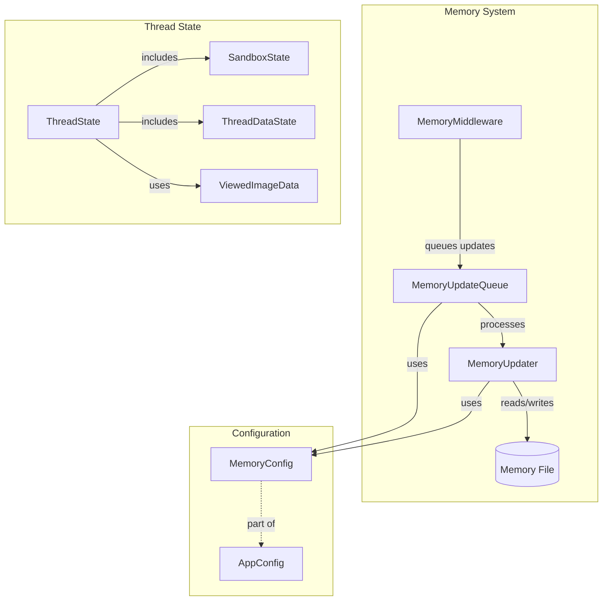

# Agent Memory and Thread Context Module

## 1. Overview

The `agent_memory_and_thread_context` module is a core component that provides memory persistence and thread state management for AI agents. This module enables agents to maintain long-term memory of conversations, user preferences, and contextual information, while also managing the execution state of individual threads.

### Purpose and Design Rationale

This module addresses two critical needs in AI agent systems:
1. **Long-term Memory**: Allows agents to remember user interactions across sessions, enabling more coherent and personalized conversations
2. **Thread State Management**: Maintains the state of ongoing conversations, including sandbox environments, uploaded files, and task artifacts

The design emphasizes:
- Asynchronous memory updates with debouncing to avoid overwhelming the system
- Structured memory organization for different types of information
- Thread-safe operations for concurrent access
- Caching mechanisms for efficient memory access
- Seamless integration with agent execution via middleware

## 2. Architecture

The module consists of several key components that work together to provide memory and thread state functionality:



### Component Relationships

1. **MemoryMiddleware**: Acts as the entry point, hooking into agent execution to queue memory updates
2. **MemoryUpdateQueue**: Manages asynchronous memory updates with debouncing to batch multiple requests
3. **MemoryUpdater**: Handles the actual memory update logic using LLM summarization
4. **ThreadState**: Defines the structure for maintaining conversation thread state
5. **MemoryConfig**: Provides configuration options for the memory system

## 3. Sub-modules

### 3.1 Memory Management Sub-module

This sub-module handles the collection, processing, and storage of agent memory. It includes:

- **MemoryMiddleware**: Integrates memory updates with agent execution flow
- **MemoryUpdateQueue**: Manages batching and debouncing of memory updates
- **MemoryUpdater**: Performs LLM-based memory summarization and updates

For detailed information, see the [memory_management](memory_management.md) documentation.

### 3.2 Thread State Sub-module

This sub-module defines the state structures for managing conversation threads:

- **ThreadState**: Main state structure for agent conversations
- **SandboxState**: Manages sandbox environment information
- **ThreadDataState**: Tracks workspace and file paths
- **ViewedImageData**: Stores image viewing data

For detailed information, see the [thread_state](thread_state.md) documentation.

## 4. Core Components

### MemoryUpdateQueue

The `MemoryUpdateQueue` class implements a thread-safe queue with debounce mechanism for memory updates. It collects conversation contexts and processes them after a configurable delay, batching multiple updates together to reduce system load.

Key features:
- Thread-safe operations using locks
- Debounce timer to batch updates
- Automatic replacement of pending updates for the same thread
- Manual flush capability for testing or shutdown

### MemoryUpdater

The `MemoryUpdater` class handles the actual memory update logic. It uses an LLM to analyze conversation history and update the memory structure accordingly.

Key features:
- LLM-based memory summarization
- Structured memory organization (user context, history, facts)
- Confidence-based fact filtering
- Atomic file operations for data integrity
- Caching with file modification time checks

### MemoryMiddleware

The `MemoryMiddleware` class integrates memory updates with the agent execution flow. It hooks into the agent's execution lifecycle to queue memory updates after each agent run.

Key features:
- Automatic memory update queuing after agent execution
- Message filtering to include only meaningful conversation parts
- Thread ID tracking for memory source attribution

### ThreadState

The `ThreadState` class extends `AgentState` to provide a comprehensive structure for maintaining conversation thread state. It includes:

- Sandbox environment information
- Workspace path configuration
- Conversation title
- Artifact tracking
- Todo list management
- Uploaded files tracking
- Viewed images management

## 5. Usage Examples

### Basic Memory Configuration

```python
from src.config.memory_config import get_memory_config

# Enable and configure memory system
config = get_memory_config()
config.enabled = True
config.debounce_seconds = 30
config.model_name = "gpt-4"
config.fact_confidence_threshold = 0.7
config.max_facts = 100
```

### Using MemoryUpdateQueue Directly

```python
from src.agents.memory.queue import get_memory_queue

# Get the global queue instance
queue = get_memory_queue()

# Add a conversation to the queue
queue.add(
    thread_id="thread_123",
    messages=conversation_messages
)

# For testing or shutdown, flush the queue
queue.flush()
```

### Working with ThreadState

```python
from src.agents.thread_state import ThreadState
from langchain_core.messages import HumanMessage, AIMessage

# Create a thread state
state = ThreadState(
    messages=[
        HumanMessage(content="Hello!"),
        AIMessage(content="Hi there!")
    ],
    thread_data={
        "workspace_path": "/workspace/thread_123",
        "uploads_path": "/workspace/thread_123/uploads"
    },
    artifacts=["output.txt"]
)

# Access state components
print(state["thread_data"]["workspace_path"])
print(state["artifacts"])
```

## 6. Configuration

### Memory Configuration

The memory system can be configured using `MemoryConfig`:

| Configuration | Type | Default | Description |
|---------------|------|---------|-------------|
| enabled | bool | False | Whether memory updates are enabled |
| debounce_seconds | int | 30 | Time to wait before processing queued updates |
| model_name | str | "gpt-4" | Model to use for memory summarization |
| storage_path | str \| None | None | Custom path for memory file |
| fact_confidence_threshold | float | 0.7 | Minimum confidence for storing facts |
| max_facts | int | 100 | Maximum number of facts to retain |

### Thread State Configuration

Thread state is primarily configured through the data structures provided, with reducers for managing complex state updates:

- `merge_artifacts`: Merges and deduplicates artifact lists
- `merge_viewed_images`: Merges viewed image dictionaries with special clear behavior

## 7. Best Practices

1. **Enable Memory Judiciously**: Memory updates consume LLM tokens, so enable only when needed
2. **Tune Debounce Time**: Adjust `debounce_seconds` based on your use case - shorter times for more frequent updates, longer times for better batching
3. **Set Appropriate Confidence Threshold**: Too low and you'll get noisy facts; too high and you might miss important information
4. **Use ThreadState Consistently**: Always use the provided ThreadState structure to ensure compatibility with middlewares
5. **Handle Missing Thread IDs**: Ensure thread IDs are available in the runtime context when using MemoryMiddleware
6. **Flush Queue on Shutdown**: Call `queue.flush()` during application shutdown to process pending updates

## 8. Limitations and Edge Cases

1. **Memory File Conflicts**: If multiple processes access the same memory file, you may encounter race conditions
2. **LLM Failure Modes**: Memory updates rely on LLM output, which can occasionally be malformed
3. **Debounce Timer Precision**: The debounce mechanism uses system timers, which may not be perfectly precise
4. **Memory Size Limits**: Very large memory structures may impact performance
5. **Thread Safety**: While the MemoryUpdateQueue is thread-safe, other components may not be
6. **Message Filtering**: The middleware filters out tool messages, which might contain important context in some cases

## 9. Integration with Other Modules

This module integrates with several other key modules:

- **agent_execution_middlewares**: MemoryMiddleware works alongside other middlewares in the agent execution pipeline
- **sandbox_core_runtime**: ThreadState includes SandboxState for managing sandbox environments
- **application_and_feature_configuration**: Uses MemoryConfig and AppConfig for configuration
- **gateway_api_contracts**: Memory structures align with API contracts for memory endpoints

For more information on these modules, see their respective documentation.
