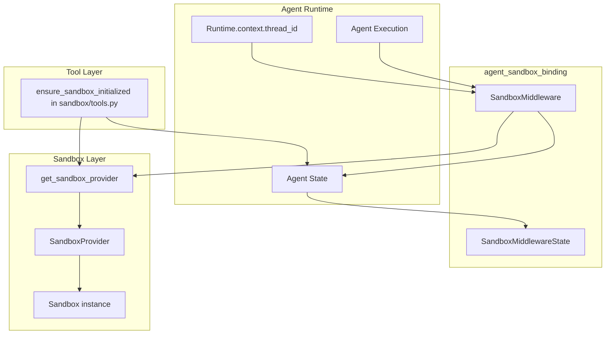
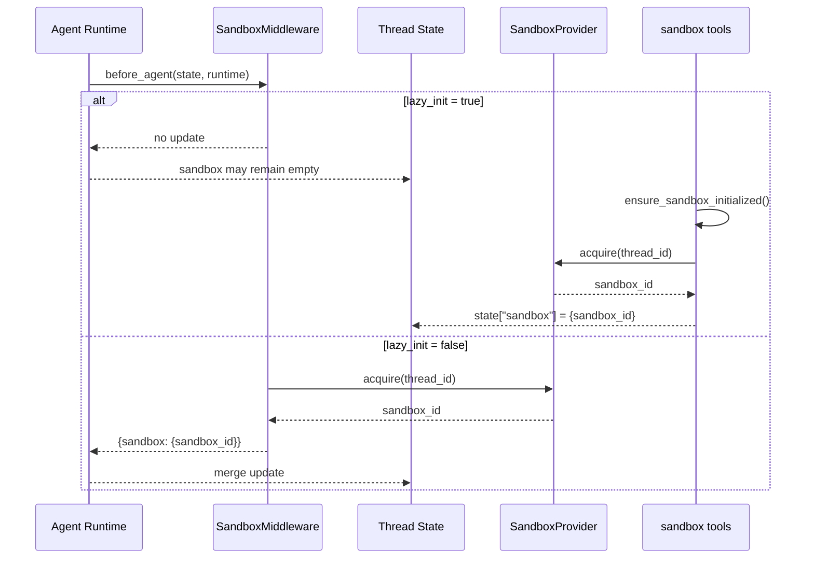
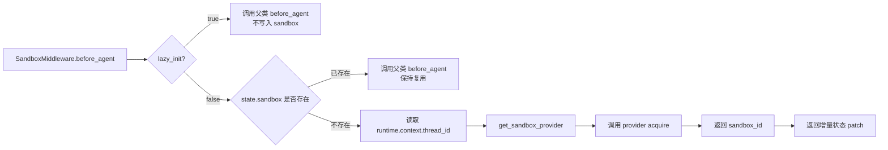

# agent_sandbox_binding 模块文档

## 1. 模块定位与设计目标

`agent_sandbox_binding` 是 `sandbox_core_runtime` 中负责“把沙箱能力绑定到 Agent 执行生命周期”的粘合层。它本身不执行命令、不读写文件，也不关心具体沙箱后端是本地实现还是容器实现；它只做一件关键事情：在合适的时机把 `sandbox_id` 写入线程状态，让后续工具调用能通过该 ID 找到真实的 `Sandbox` 实例。

从系统分层看，这个模块处在 Agent Middleware 层与 Sandbox Provider 抽象层之间。上游是 LangChain/LangGraph 的 agent runtime，下游是 `SandboxProvider`（见 [sandbox_abstractions.md](sandbox_abstractions.md)）。这种设计避免了工具层直接依赖复杂的实例分配逻辑，也避免了 provider 侵入 agent 编排代码。

该模块存在的核心理由是：**让沙箱生命周期与线程生命周期对齐**。同一个 thread 多轮对话通常应复用同一沙箱，避免每轮都重新创建运行环境导致性能浪费、上下文丢失和资源抖动。

---

## 2. 核心组件概览

当前模块只有两个核心组件，代码位于 `backend/src/sandbox/middleware.py`：

- `SandboxMiddlewareState`
- `SandboxMiddleware`

虽然代码量不大，但它定义了“何时分配沙箱、如何写回状态、何时不释放资源”的关键行为基线。

---

## 3. 架构关系与依赖协作



这张图体现了一个容易被忽略的事实：`SandboxMiddleware` 只覆盖 `before_agent` 钩子。默认 `lazy_init=True` 时，它不会在这里分配沙箱，而是由工具层 `ensure_sandbox_initialized()` 在首次工具调用时懒加载分配。也就是说，本模块定义了“策略入口”，而真正的 lazy 首次分配发生在 `sandbox/tools.py`。

---

## 4. 状态模型：`SandboxMiddlewareState`

```python
class SandboxMiddlewareState(AgentState):
    """Compatible with the `ThreadState` schema."""

    sandbox: NotRequired[SandboxState | None]
    thread_data: NotRequired[ThreadDataState | None]
```

`SandboxMiddlewareState` 的设计目标是和线程全局状态模型保持兼容，尤其是 `ThreadState`（见 [thread_state_schema.md](thread_state_schema.md)）。这里声明了两个可选字段：

- `sandbox`：保存 `sandbox_id` 的容器字段；
- `thread_data`：与线程目录上下文对齐（workspace/uploads/outputs），主要供工具层路径解析使用。

字段被声明为 `NotRequired[...]`，意味着 middleware 可以在“尚未准备好”时不写这些字段，这与 lazy 初始化模式天然兼容。

### 参数与返回语义

`SandboxMiddlewareState` 本身是类型声明，不直接暴露方法，因此没有传统函数参数。但它对运行时有两个直接影响：第一，保证状态注入时的字段结构可静态约束；第二，允许中间件链之间通过同一状态结构共享上下文而不发生 schema 冲突。

### 副作用与约束

它本身没有副作用，但定义错误（例如字段名漂移）会导致运行时状态更新失效，进而引发工具层“找不到 sandbox state”这类异常。

---

## 5. 中间件实现：`SandboxMiddleware`

### 5.1 角色与生命周期策略

`SandboxMiddleware` 继承 `AgentMiddleware[SandboxMiddlewareState]`，作用是在 agent 生命周期中注入沙箱绑定信息。模块文档字符串明确了其生命周期策略：

- `lazy_init=True`（默认）：在首个工具调用时再分配沙箱；
- `lazy_init=False`：在 `before_agent` 阶段立即分配；
- 同一 thread 多轮复用沙箱；
- 不在每次 agent 调用后释放，统一由 provider shutdown 处理。

这套策略的重点是“减少频繁创建销毁开销”。对容器后端尤其关键，因为容器冷启动代价明显。

### 5.2 构造函数

```python
def __init__(self, lazy_init: bool = True):
    super().__init__()
    self._lazy_init = lazy_init
```

- 参数 `lazy_init`：控制是懒加载还是预加载。
- 返回值：无显式返回。
- 副作用：设置内部策略开关 `_lazy_init`。

实践上建议默认保持 `True`，只有在你明确需要“首 token 前就确保沙箱可用”时才切换为 `False`。

### 5.3 内部方法 `_acquire_sandbox`

```python
def _acquire_sandbox(self, thread_id: str) -> str:
    provider = get_sandbox_provider()
    sandbox_id = provider.acquire(thread_id)
    print(f"Acquiring sandbox {sandbox_id}")
    return sandbox_id
```

该方法封装了“通过 provider 获取 sandbox_id”的动作。

- 参数 `thread_id`：线程标识，用于 provider 执行按线程复用或路由策略。
- 返回值：`sandbox_id` 字符串。
- 副作用：
  - 调用全局 provider 单例入口 `get_sandbox_provider()`；
  - 执行 `provider.acquire(thread_id)` 可能触发真实资源分配；
  - 打印日志到标准输出。

错误处理方面，该方法没有内部 `try/except`，所以 provider 抛出的异常会直接上冒给 agent runtime。

### 5.4 `before_agent` 执行逻辑

```python
@override
def before_agent(self, state, runtime) -> dict | None:
    if self._lazy_init:
        return super().before_agent(state, runtime)

    if "sandbox" not in state or state["sandbox"] is None:
        thread_id = runtime.context["thread_id"]
        sandbox_id = self._acquire_sandbox(thread_id)
        return {"sandbox": {"sandbox_id": sandbox_id}}
    return super().before_agent(state, runtime)
```

这是模块最关键的方法：

1. 当 `lazy_init=True` 时，不做分配，直接放行；
2. 当 `lazy_init=False` 时，若 state 中还没有 sandbox，则从 `runtime.context["thread_id"]` 取线程 ID 并立即分配；
3. 分配成功后返回增量状态 `{"sandbox": {"sandbox_id": ...}}`，由运行时合并进线程状态；
4. 如果已有 sandbox，则不重复分配。

返回值是 `dict | None`，遵循 middleware 协议：返回字典表示状态更新，返回 `None` 表示无变更。

---

## 6. 关键流程（含 lazy/eager 两种模式）



该流程说明了一个实现细节：**lazy 模式下，`SandboxMiddleware` 的价值是保持状态 schema 和生命周期策略一致；真正首次分配动作由工具入口触发**。如果你只看 middleware 代码，容易误以为 lazy 模式下不会分配沙箱。

---

## 7. 与其他模块的边界与分工

为了避免重复，推荐按以下边界阅读：

- 沙箱抽象契约（`Sandbox`/`SandboxProvider`、全局 provider 单例机制）：见 [sandbox_abstractions.md](sandbox_abstractions.md)
- 沙箱系统全局运行时、Local 实现和工具集成全景：见 [sandbox_core_runtime.md](sandbox_core_runtime.md)
- 线程状态字段定义（`sandbox`, `thread_data`）及 reducer 语义：见 [thread_state_schema.md](thread_state_schema.md)
- 线程目录准备中间件（`ThreadDataMiddleware`）与路径上下文注入：见 [thread_bootstrap_and_upload_context.md](thread_bootstrap_and_upload_context.md)

简单说，`agent_sandbox_binding` 只负责“绑定”；目录创建、路径替换、工具执行、provider 装配分别在其他模块完成。

---

## 8. 使用与配置指南

### 8.1 在 middleware 链中使用

```python
from src.sandbox.middleware import SandboxMiddleware

middlewares = [
    # 常见做法：ThreadDataMiddleware 在前，先准备 thread_data
    # ThreadDataMiddleware(...),
    SandboxMiddleware(lazy_init=True),
]
```

如果你希望首次 agent 调用前就拿到沙箱（例如预热容器、降低首次工具调用延迟），可以这样配置：

```python
SandboxMiddleware(lazy_init=False)
```

### 8.2 配置 provider 实现

`SandboxMiddleware` 本身不接收 provider 参数，它通过 `get_sandbox_provider()` 读取全局配置。核心配置来自 `SandboxConfig.use`，例如：

```yaml
sandbox:
  use: src.sandbox.local:LocalSandboxProvider
```

或容器后端：

```yaml
sandbox:
  use: src.community.aio_sandbox.aio_sandbox_provider:AioSandboxProvider
  image: your-sandbox-image
  idle_timeout: 600
```

`SandboxConfig` 详细字段（`image`, `mounts`, `environment` 等）见 [application_and_feature_configuration.md](application_and_feature_configuration.md)。

---

## 9. 可扩展点与二次开发建议

扩展本模块常见有两类：策略扩展与可观测性扩展。策略扩展例如增加“按模型类型决定 eager/lazy”“按 thread 标签路由不同 provider”；可观测性扩展例如把 `print` 替换为结构化日志，并附带 `thread_id`、`sandbox_id`、耗时指标。

一种稳妥方式是继承 `SandboxMiddleware` 并重写 `before_agent` 或 `_acquire_sandbox`，但要保持返回增量状态格式不变（`{"sandbox": {"sandbox_id": ...}}`），否则会破坏下游工具的状态读取假设。

---

## 10. 边界条件、错误场景与已知限制

### 10.1 `thread_id` 缺失

`before_agent` 在 eager 模式下直接读取 `runtime.context["thread_id"]`，如果上下文未注入该键会抛 `KeyError`。这不是软失败，通常会中断本次 agent 调用。集成方应确保网关/调度层始终注入 thread_id。

### 10.2 lazy 模式下的“状态暂缺”

在 `lazy_init=True` 时，`before_agent` 不写 `sandbox`。如果你有自定义中间件在工具调用前就强依赖 `state["sandbox"]["sandbox_id"]`，会遇到空值问题。正确做法是：

- 要么改为在工具入口调用 `ensure_sandbox_initialized()`；
- 要么切换 `lazy_init=False`。

### 10.3 资源释放时机并非每轮调用后

该模块明确不在每轮后 release。优点是复用性能高，缺点是资源生命周期更长，若 provider 没有 idle 回收机制，可能导致资源驻留。生产环境应配合 provider 的 `shutdown()` 或超时回收策略。

### 10.4 日志方式较原始

当前使用 `print` 输出 `Thread ID` 和 `Acquiring sandbox`，在多实例部署下不利于统一日志采集与关联追踪。建议替换为结构化日志并接入 tracing。

### 10.5 并发与线程安全依赖 provider

`SandboxMiddleware` 本身不做锁控制，并发 acquire/get 的安全性由 provider 保证。若你引入自定义 provider，需要自行保证线程安全和幂等行为。

---

## 11. 维护者速查（行为要点）

- 默认是 lazy 策略，`before_agent` 不会分配沙箱；
- eager 策略下仅在 `sandbox` 缺失时分配一次；
- 写回状态的唯一关键字段是 `sandbox.sandbox_id`；
- 不主动 release，释放属于 provider 生命周期管理；
- 模块正确运行依赖 `runtime.context.thread_id` 与全局 provider 配置。

如果你在排查“工具层提示 sandbox 未初始化”的问题，优先检查这三件事：middleware 是否启用、thread_id 是否注入、provider 是否可 acquire/get。

---

## 12. 组件交互与状态写回细节（补充）



这张图强调了一个经常被误读的实现点：`SandboxMiddleware` 在 eager 模式下负责“首次写回 sandbox_id”，在 lazy 模式下则显式不做写回，把初始化责任让渡给工具入口。也因此，`SandboxMiddleware` 的价值不只是“调用 acquire”，而是把“沙箱生命周期策略”明确编码为中间件行为，使不同模块对初始化时机有一致预期。

从状态写回语义看，`before_agent()` 返回的是**增量 patch**，而不是完整状态快照。运行时会把 `{"sandbox": {"sandbox_id": ...}}` 合并进线程状态。这意味着二次开发时不应返回与现有 schema 冲突的结构（例如把 `sandbox` 误写成字符串），否则会在后续工具读取阶段出现类型错误或空值分支。

---

## 13. 典型排障路径（运行时视角）

当出现“工具调用失败且提示没有 sandbox”时，建议按运行链路逆向排查：先确认当前 middleware 实例是 `lazy_init=True` 还是 `False`；若为 lazy，继续确认工具入口是否确实执行了初始化函数；若为 eager，检查 `runtime.context` 是否包含 `thread_id`；随后检查 provider 的 `acquire()` 是否成功返回可 `get()` 的 `sandbox_id`。这条路径能覆盖绝大多数线上问题。

如果问题表现为“每轮都新建沙箱、上下文丢失”，通常不是本模块重复分配，而是 thread_id 不稳定（例如网关层每次请求都生成新 thread_id），或 provider 未按 thread 复用策略实现。`SandboxMiddleware` 只保证“在状态缺失时触发 acquire”，无法替代 provider 的复用逻辑。

若问题是资源长期不释放，需要区分这是否符合预期。本模块设计就是不在单次 agent 调用后 release；若你需要更激进的回收策略，应在 provider 层实现 idle timeout 或在应用退出时调用统一 shutdown，而不是在 middleware 内部加“每轮释放”。后者会直接破坏多轮任务连续性与性能基线。
