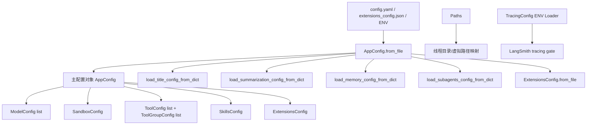
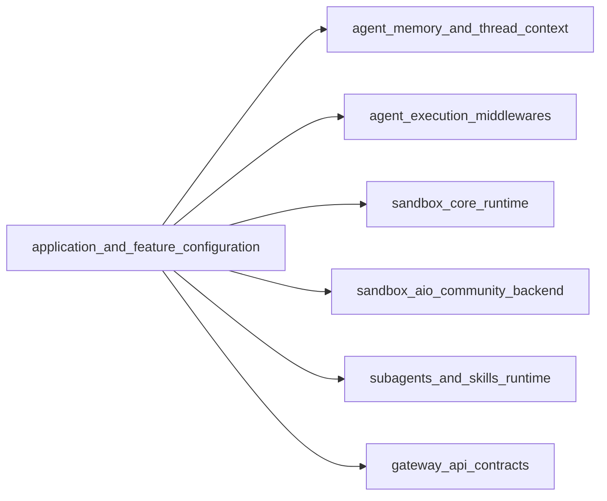
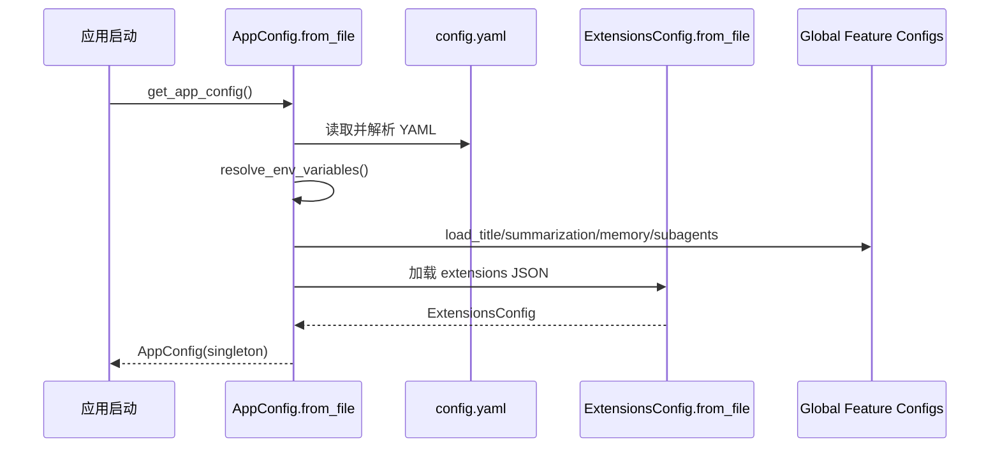
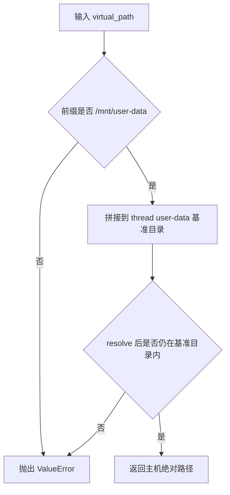

# application_and_feature_configuration 模块文档

## 1. 模块定位与设计目标

`application_and_feature_configuration` 是 DeerFlow 后端的“配置控制平面（control plane）”。它的职责不是执行业务逻辑，而是**定义、加载、校验、缓存并分发**运行期所需的配置对象，让模型调用、沙箱执行、工具与技能加载、记忆机制、总结机制、标题生成、子代理超时策略、MCP 扩展以及链路追踪都能基于同一套配置语义运行。

这个模块存在的核心原因是：系统已经包含多条能力链路（Agent 中间件、Sandbox 运行时、Gateway API、Subagent 执行器等），如果每条链路各自读取文件或环境变量，会出现配置来源不一致、参数名漂移、热更新困难、测试注入复杂等问题。该模块通过 Pydantic 模型 + 单例缓存 + 分域配置文件解析，把这些问题收敛到一个统一入口。

---

## 2. 架构总览

### 2.1 组件分层图



该分层体现了两种配置生命周期：

1. **聚合生命周期（AppConfig）**：从 `config.yaml` 一次性加载模型、沙箱、工具、技能等主配置，并在加载过程中触发若干“功能域全局配置”初始化。  
2. **独立生命周期（Paths/Tracing/Extensions）**：路径管理和 tracing 读取有各自的单例与来源策略，扩展配置也可单独重载，便于运行时演进。

### 2.2 与其他模块的连接关系



- `MemoryConfig` 与 `Paths.memory_file` 会直接影响记忆更新与注入流程，详见 [agent_memory_and_thread_context.md](agent_memory_and_thread_context.md)。
- `SummarizationConfig` / `TitleConfig` 控制对话中间件策略，详见 [agent_execution_middlewares.md](agent_execution_middlewares.md)。
- `SandboxConfig` 与 `Paths` 决定沙箱 provider 与挂载路径，详见 [sandbox_core_runtime.md](sandbox_core_runtime.md)、[sandbox_aio_community_backend.md](sandbox_aio_community_backend.md)。
- `SkillsConfig`、`SubagentsAppConfig` 影响技能加载和子代理执行超时，详见 [subagents_and_skills_runtime.md](subagents_and_skills_runtime.md)。
- `ExtensionsConfig` 的 MCP/skills 状态最终会通过网关接口被管理端消费，详见 [gateway_api_contracts.md](gateway_api_contracts.md)。

---

## 3. 子模块说明（高层）

> 本节只给高层摘要，详细字段、方法与示例请进入对应子文档。

### 3.1 AppConfig 聚合加载层

`AppConfig` 是主入口：负责定位 `config.yaml`、解析 `$ENV_VAR`、按需触发 `title/summarization/memory/subagents` 全局配置加载，并把 `ExtensionsConfig` 注入到主配置对象。它还提供模型/工具/工具组查询方法和可测试的全局缓存控制函数（get/reload/reset/set）。

详见：[app_config_orchestration.md](app_config_orchestration.md)

### 3.2 路径与文件系统安全层

`Paths` 统一管理 `base_dir`、线程目录、sandbox `user-data` 目录以及虚拟路径到主机路径的安全映射。它在 `thread_id` 校验和 `resolve_virtual_path` 中实现了目录穿越防护，是沙箱文件访问安全边界的一部分。

详见：[path_resolution_and_fs_security.md](path_resolution_and_fs_security.md)

### 3.3 模型/工具/沙箱基础结构层

`ModelConfig`、`ToolConfig`、`ToolGroupConfig`、`SandboxConfig`、`VolumeMountConfig` 定义了核心执行能力的声明式结构。通过 `extra="allow"`，系统可以承载 provider 专有参数而不破坏公共 schema。

详见：[model_tool_sandbox_basics.md](model_tool_sandbox_basics.md)

### 3.4 功能开关层（记忆/总结/标题）

`MemoryConfig`、`SummarizationConfig`、`TitleConfig` 与 `ContextSize` 共同定义会话增强策略：何时总结、保留多少上下文、是否记忆注入、标题生成限制等。这些配置由独立全局实例维护，可在 AppConfig 加载期被更新。

详见：[feature_toggles_memory_summary_title.md](feature_toggles_memory_summary_title.md)

### 3.5 技能与子代理策略层

`SkillsConfig` 控制技能目录与容器挂载路径；`SubagentsAppConfig` + `SubagentOverrideConfig` 提供默认超时和按 agent 覆写机制，是并行子代理执行的稳定性基础。

详见：[skills_and_subagents_configuration.md](skills_and_subagents_configuration.md)

### 3.6 扩展生态层（MCP + 技能状态）

`ExtensionsConfig` 负责 `extensions_config.json` / `mcp_config.json` 的兼容加载、环境变量解析、启用态过滤与技能开关判定，是“可插拔外部能力”的配置枢纽。

详见：[extensions_and_mcp_skill_state.md](extensions_and_mcp_skill_state.md)

### 3.7 可观测性层（Tracing）

`TracingConfig` 从环境变量懒加载并通过锁保证并发安全，`is_configured` 用于判定 LangSmith tracing 是否真正可用（不仅打开开关，还要有 API key）。

详见：[tracing_configuration.md](tracing_configuration.md)

---

## 4. 关键运行流程

### 4.1 启动加载流程



这里最容易被忽略的一点是：`title/summarization/memory/subagents` 并不作为 `AppConfig` 字段长期驻留，而是以“副作用方式”更新各自模块全局配置。这种设计让中间件读取简单，但也意味着测试时要显式 reset/set。

### 4.2 路径解析与沙箱映射流程



该流程防止两类风险：前缀伪造（如 `user-dataX`）和 `..` 穿越。

---

## 5. 使用与扩展指南

### 5.1 最小使用示例

```python
from src.config.app_config import get_app_config
from src.config.paths import get_paths

cfg = get_app_config()
model = cfg.get_model_config("gpt-4")

paths = get_paths()
paths.ensure_thread_dirs("thread_001")
```

### 5.2 热更新示例

```python
from src.config.app_config import reload_app_config
from src.config.extensions_config import reload_extensions_config

reload_app_config()            # 重读 config.yaml
reload_extensions_config()     # 重读 extensions_config.json
```

### 5.3 扩展建议

新增配置域时，建议遵循当前模式：
1. 先定义独立 Pydantic schema（支持默认值与边界校验）；
2. 再决定是否需要全局单例（中间件频繁读取通常适合）；
3. 最后在 `AppConfig.from_file` 中按需接入加载钩子，保持向后兼容。

---

## 6. 重要边界条件与常见陷阱

1. **环境变量未设置会直接报错**：`$VAR` 若缺失，会在加载时抛 `ValueError`，属于 fail-fast 行为。  
2. **配置文件路径解析依赖 CWD**：未显式传参时，`config.yaml` 与 `extensions_config.json` 都会先查当前目录再查父目录。部署脚本若切换工作目录，可能导致读错配置。  
3. **`MemoryConfig.storage_path` 语义变更风险**：相对路径是相对 `Paths.base_dir`，不是 backend 进程当前目录。迁移旧路径时要注意。  
4. **`thread_id` 受严格正则限制**：包含路径分隔符或 `..` 会被拒绝。  
5. **Tracing 开启不等于可用**：`LANGSMITH_TRACING=true` 但无 `LANGSMITH_API_KEY` 时 `is_tracing_enabled()` 仍为 false。  
6. **全局单例在测试中需隔离**：若多个测试共享进程，必须使用 `reset_*` 或 `set_*` 避免状态污染。

---

## 7. 配置能力矩阵（速查）

| 能力域 | 主要配置 | 典型消费者 |
|---|---|---|
| 模型路由 | `ModelConfig` | 模型调用层、中间件 |
| 沙箱运行 | `SandboxConfig` + `Paths` | sandbox runtime / provider |
| 工具编排 | `ToolConfig` / `ToolGroupConfig` | 工具注册与调度 |
| 会话记忆 | `MemoryConfig` | memory pipeline |
| 自动总结 | `SummarizationConfig` | summarization middleware |
| 标题生成 | `TitleConfig` | title middleware |
| 子代理策略 | `SubagentsAppConfig` | subagent executor |
| 扩展生态 | `ExtensionsConfig` / `McpServerConfig` | gateway + mcp runtime |
| 可观测性 | `TracingConfig` | tracing instrumentation |

---

## 8. 相关文档索引

以下 7 篇为本次按子模块拆分生成的详细文档：

- [app_config_orchestration.md](app_config_orchestration.md)
- [path_resolution_and_fs_security.md](path_resolution_and_fs_security.md)
- [model_tool_sandbox_basics.md](model_tool_sandbox_basics.md)
- [feature_toggles_memory_summary_title.md](feature_toggles_memory_summary_title.md)
- [skills_and_subagents_configuration.md](skills_and_subagents_configuration.md)
- [extensions_and_mcp_skill_state.md](extensions_and_mcp_skill_state.md)
- [tracing_configuration.md](tracing_configuration.md)

同时建议配合阅读：
- [agent_memory_and_thread_context.md](agent_memory_and_thread_context.md)
- [agent_execution_middlewares.md](agent_execution_middlewares.md)
- [sandbox_core_runtime.md](sandbox_core_runtime.md)
- [sandbox_aio_community_backend.md](sandbox_aio_community_backend.md)
- [subagents_and_skills_runtime.md](subagents_and_skills_runtime.md)
- [gateway_api_contracts.md](gateway_api_contracts.md)
