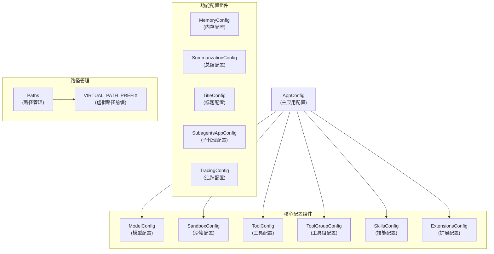

# 应用与功能配置模块 (application_and_feature_configuration)

## 概述

`application_and_feature_configuration` 模块是 DeerFlow 应用的核心配置管理系统，负责统一管理和加载应用的各种配置，包括模型配置、沙箱环境、工具、技能、内存管理、对话总结、标题生成以及扩展功能等。该模块采用分层设计，将不同功能领域的配置模块化，同时提供统一的加载和访问机制。

该模块解决了以下关键问题：

1. **统一配置管理**：将分散的配置集中管理，提供一致的配置加载和访问接口
2. **环境变量支持**：允许在配置中引用环境变量，提高配置的灵活性和安全性
3. **单例模式**：使用全局单例管理配置，确保配置的一致性和高效访问
4. **热重载支持**：支持配置的动态重新加载，无需重启应用
5. **路径管理**：提供统一的路径配置和解析机制，确保跨平台兼容性

## 架构概览



### 组件关系说明

1. **AppConfig**：作为主配置容器，聚合了所有核心配置组件
2. **功能配置组件**：MemoryConfig、SummarizationConfig、TitleConfig、SubagentsAppConfig 等作为全局单例存在，通过独立的加载函数进行配置
3. **Paths**：提供统一的路径管理，与其他配置组件解耦，独立使用
4. **ExtensionsConfig**：独立的扩展配置，负责管理 MCP 服务器和技能状态

## 核心组件详解

### AppConfig (主应用配置)

`AppConfig` 是整个配置系统的核心，负责加载和管理应用的主要配置。它从 YAML 文件中读取配置，并将其解析为结构化的配置对象。

#### 主要功能：
- 配置文件路径解析（支持命令行参数、环境变量、默认路径）
- YAML 配置文件加载和解析
- 环境变量解析（支持 `$VAR_NAME` 语法）
- 模型、工具、工具组配置的检索
- 扩展配置的集成加载

#### 关键方法：

##### `resolve_config_path(config_path: str | None = None) -&gt; Path`
解析配置文件路径，优先级如下：
1. 如果提供了 `config_path` 参数，直接使用
2. 如果设置了 `DEER_FLOW_CONFIG_PATH` 环境变量，使用该值
3. 否则，先检查当前目录下的 `config.yaml`，然后回退到父目录

##### `from_file(config_path: str | None = None) -&gt; Self`
从 YAML 文件加载配置，同时会：
- 解析环境变量
- 加载标题配置（如果存在）
- 加载总结配置（如果存在）
- 加载内存配置（如果存在）
- 加载子代理配置（如果存在）
- 单独加载扩展配置

##### `resolve_env_variables(config: Any) -&gt; Any`
递归解析配置中的环境变量，支持字符串、字典和列表类型。

##### `get_model_config(name: str) -&gt; ModelConfig | None`
根据名称获取模型配置。

##### `get_tool_config(name: str) -&gt; ToolConfig | None`
根据名称获取工具配置。

##### `get_tool_group_config(name: str) -&gt; ToolGroupConfig | None`
根据名称获取工具组配置。

#### 单例管理：
- `get_app_config()`：获取全局单例配置
- `reload_app_config(config_path: str | None = None)`：重新加载配置
- `reset_app_config()`：重置配置缓存
- `set_app_config(config: AppConfig)`：设置自定义配置实例

### Paths (路径管理)

`Paths` 类负责管理 DeerFlow 应用的所有文件系统路径，提供统一的路径配置和解析机制。

#### 目录结构：
```
{base_dir}/
├── memory.json
└── threads/
    └── {thread_id}/
        └── user-data/         # 挂载为 /mnt/user-data/ 在沙箱内
            ├── workspace/     # /mnt/user-data/workspace/
            ├── uploads/       # /mnt/user-data/uploads/
            └── outputs/       # /mnt/user-data/outputs/
```

#### 主要属性：
- `base_dir`：应用数据的根目录
- `memory_file`：内存持久化文件路径

#### 主要方法：
- `thread_dir(thread_id: str) -&gt; Path`：获取线程数据目录
- `sandbox_work_dir(thread_id: str) -&gt; Path`：获取沙箱工作目录
- `sandbox_uploads_dir(thread_id: str) -&gt; Path`：获取上传文件目录
- `sandbox_outputs_dir(thread_id: str) -&gt; Path`：获取输出文件目录
- `sandbox_user_data_dir(thread_id: str) -&gt; Path`：获取用户数据根目录
- `ensure_thread_dirs(thread_id: str) -&gt; None`：创建所有标准沙箱目录
- `resolve_virtual_path(thread_id: str, virtual_path: str) -&gt; Path`：将沙箱虚拟路径解析为实际主机路径

#### 路径安全：
- 线程 ID 验证：只允许字母、数字、下划线和连字符
- 虚拟路径解析：确保路径不会跳出预期的目录结构，防止路径遍历攻击

### ModelConfig (模型配置)

`ModelConfig` 定义了可用语言模型的配置，包括模型名称、提供者、参数等。

#### 主要字段：
- `name`：模型的唯一名称
- `display_name`：显示名称
- `description`：描述
- `use`：模型提供者的类路径（如 `langchain_openai.ChatOpenAI`）
- `model`：模型名称
- `supports_thinking`：是否支持思考模式
- `when_thinking_enabled`：启用思考模式时的额外设置
- `supports_vision`：是否支持视觉/图像输入

### SandboxConfig (沙箱配置)

`SandboxConfig` 配置沙箱环境的行为，包括容器设置、挂载、环境变量等。

#### 主要字段：
- `use`：沙箱提供者的类路径（如 `src.sandbox.local:LocalSandboxProvider`）
- `image`：Docker 镜像
- `port`：沙箱容器的基础端口
- `base_url`：现有沙箱的 URL（如果设置，不会启动新容器）
- `auto_start`：是否自动启动 Docker 容器
- `container_prefix`：容器名称前缀
- `idle_timeout`：空闲超时时间（秒）
- `mounts`：卷挂载配置列表
- `environment`：注入到沙箱容器的环境变量

#### VolumeMountConfig：
- `host_path`：主机上的路径
- `container_path`：容器内的路径
- `read_only`：是否只读挂载

### ToolConfig &amp; ToolGroupConfig (工具与工具组配置)

`ToolConfig` 定义了可用工具的配置，`ToolGroupConfig` 用于组织工具。

#### ToolConfig 字段：
- `name`：工具的唯一名称
- `group`：工具所属的组名
- `use`：工具提供者的变量名（如 `src.sandbox.tools:bash_tool`）

#### ToolGroupConfig 字段：
- `name`：工具组的唯一名称

### SkillsConfig (技能配置)

`SkillsConfig` 配置技能系统的路径和行为。

#### 主要字段：
- `path`：技能目录的路径（如果未指定，默认为相对于后端目录的 `../skills`）
- `container_path`：技能在沙箱容器中的挂载路径（默认为 `/mnt/skills`）

#### 主要方法：
- `get_skills_path() -&gt; Path`：获取解析后的技能目录路径
- `get_skill_container_path(skill_name: str, category: str = "public") -&gt; str`：获取特定技能在容器中的完整路径

### ExtensionsConfig (扩展配置)

`ExtensionsConfig` 统一管理 MCP 服务器和技能状态配置。

#### 主要字段：
- `mcp_servers`：MCP 服务器名称到配置的映射
- `skills`：技能名称到状态配置的映射

#### McpServerConfig 字段：
- `enabled`：是否启用此 MCP 服务器
- `type`：传输类型（`stdio`、`sse` 或 `http`）
- `command`：启动 MCP 服务器的命令（适用于 stdio 类型）
- `args`：传递给命令的参数（适用于 stdio 类型）
- `env`：MCP 服务器的环境变量
- `url`：MCP 服务器的 URL（适用于 sse 或 http 类型）
- `headers`：要发送的 HTTP 头（适用于 sse 或 http 类型）
- `description`：此 MCP 服务器提供功能的人类可读描述

#### SkillStateConfig 字段：
- `enabled`：是否启用此技能

#### 主要方法：
- `resolve_config_path(config_path: str | None = None) -&gt; Path | None`：解析扩展配置文件路径
- `from_file(config_path: str | None = None) -&gt; "ExtensionsConfig"`：从 JSON 文件加载扩展配置
- `resolve_env_variables(config: dict[str, Any]) -&gt; dict[str, Any]`：递归解析配置中的环境变量
- `get_enabled_mcp_servers() -&gt; dict[str, McpServerConfig]`：获取仅启用的 MCP 服务器
- `is_skill_enabled(skill_name: str, skill_category: str) -&gt; bool`：检查技能是否启用

### MemoryConfig (内存配置)

`MemoryConfig` 配置全局内存机制的行为。

#### 主要字段：
- `enabled`：是否启用内存机制
- `storage_path`：内存数据的存储路径
- `debounce_seconds`：处理排队更新前的等待时间（去抖动）
- `model_name`：用于内存更新的模型名称
- `max_facts`：存储的最大事实数量
- `fact_confidence_threshold`：存储事实的最低置信度阈值
- `injection_enabled`：是否将内存注入系统提示
- `max_injection_tokens`：内存注入的最大令牌数

### SummarizationConfig (总结配置)

`SummarizationConfig` 配置自动对话总结的行为。

#### 主要字段：
- `enabled`：是否启用自动对话总结
- `model_name`：用于总结的模型名称
- `trigger`：触发总结的一个或多个阈值
- `keep`：总结后的上下文保留策略
- `trim_tokens_to_summarize`：准备总结消息时保留的最大令牌数
- `summary_prompt`：自定义总结提示模板

#### ContextSize：
- `type`：上下文大小规范类型（`fraction`、`tokens`、`messages`）
- `value`：上下文大小规范的值

### TitleConfig (标题配置)

`TitleConfig` 配置自动线程标题生成的行为。

#### 主要字段：
- `enabled`：是否启用自动标题生成
- `max_words`：生成标题的最大单词数
- `max_chars`：生成标题的最大字符数
- `model_name`：用于标题生成的模型名称
- `prompt_template`：标题生成的提示模板

### SubagentsAppConfig (子代理配置)

`SubagentsAppConfig` 配置子代理系统的行为。

#### 主要字段：
- `timeout_seconds`：所有子代理的默认超时时间（秒）
- `timeout_seconds`：所有子代理的默认超时时间（秒）
- `agents`：按代理名称键控的每个代理配置覆盖

#### SubagentOverrideConfig：
- `timeout_seconds`：此子代理的超时时间（秒）

#### 主要方法：
- `get_timeout_for(agent_name: str) -&gt; int`：获取特定代理的有效超时时间

### TracingConfig (追踪配置)

`TracingConfig` 配置 LangSmith 追踪的行为。

#### 主要字段：
- `enabled`：是否启用追踪
- `api_key`：API 密钥
- `project`：项目名称
- `endpoint`：端点 URL

#### 主要属性：
- `is_configured`：检查追踪是否完全配置（启用且有 API 密钥）

## 使用示例

### 基本配置加载

```python
from src.config.app_config import get_app_config

# 获取配置（自动加载）
config = get_app_config()

# 访问模型配置
model_config = config.get_model_config("gpt-4")

# 访问沙箱配置
sandbox_config = config.sandbox
```

### 配置文件示例

```yaml
# 模型配置
models:
  - name: gpt-4
    display_name: GPT-4
    use: langchain_openai:ChatOpenAI
    model: gpt-4
    api_key: $OPENAI_API_KEY
    max_tokens: 4096
    temperature: 0.7
    supports_vision: true

# 沙箱配置
sandbox:
  use: src.community.aio_sandbox:AioSandboxProvider
  image: enterprise-public-cn-beijing.cr.volces.com/vefaas-public/all-in-one-sandbox:latest
  mounts:
    - host_path: /path/on/host
      container_path: /home/user/shared
      read_only: false
  environment:
    API_KEY: $MY_API_KEY

# 工具配置
tools:
  - name: bash
    group: bash
    use: src.sandbox.tools:bash_tool

# 技能配置
skills:
  path: /absolute/path/to/custom/skills
  container_path: /mnt/skills

# 内存配置
memory:
  enabled: true
  storage_path: memory.json
  debounce_seconds: 30
  model_name: null
  max_facts: 100
  fact_confidence_threshold: 0.7
  injection_enabled: true
  max_injection_tokens: 2000

# 总结配置
summarization:
  enabled: true
  model_name: null
  trigger:
    - type: tokens
      value: 15564
  keep:
    type: messages
    value: 10
  trim_tokens_to_summarize: 15564
  summary_prompt: null

# 标题配置
title:
  enabled: true
  max_words: 6
  max_chars: 60
  model_name: null

# 子代理配置
subagents:
  timeout_seconds: 900
  agents:
    general-purpose:
      timeout_seconds: 1800
    bash:
      timeout_seconds: 300
```

### 扩展配置示例

```json
{
  "mcpServers": {
    "filesystem": {
      "enabled": true,
      "type": "stdio",
      "command": "npx",
      "args": ["-y", "@modelcontextprotocol/server-filesystem", "/path/to/allowed/files"],
      "env": {},
      "description": "Provides filesystem access within allowed directories"
    },
    "github": {
      "enabled": true,
      "type": "stdio",
      "command": "npx",
      "args": ["-y", "@modelcontextprotocol/server-github"],
      "env": {
        "GITHUB_TOKEN": "$GITHUB_TOKEN"
      },
      "description": "GitHub MCP server for repository operations"
    }
  },
  "skills": {
    "pdf-processing": {
      "enabled": true
    },
    "frontend-design": {
      "enabled": true
    }
  }
}
```

### 路径管理使用

```python
from src.config.paths import get_paths

# 获取路径管理器
paths = get_paths()

# 获取基本目录
base_dir = paths.base_dir

# 确保线程目录存在
thread_id = "my-thread-123"
paths.ensure_thread_dirs(thread_id)

# 获取沙箱工作目录
work_dir = paths.sandbox_work_dir(thread_id)

# 解析虚拟路径
virtual_path = "/mnt/user-data/outputs/report.pdf"
actual_path = paths.resolve_virtual_path(thread_id, virtual_path)
```

### 热重载配置

```python
from src.config.app_config import reload_app_config, reset_app_config
from src.config.extensions_config import reload_extensions_config, reset_extensions_config

# 重新加载应用配置
new_config = reload_app_config()

# 重新加载扩展配置
new_extensions_config = reload_extensions_config()

# 重置配置缓存
reset_app_config()
reset_extensions_config()
```

## 注意事项与最佳实践

### 配置文件位置

1. **推荐做法**：将 `config.yaml` 放在项目根目录
2. **环境变量**：使用 `DEER_FLOW_CONFIG_PATH` 环境变量指定配置文件位置
3. **扩展配置**：扩展配置（`extensions_config.json`）默认与主配置文件在同一目录

### 环境变量

1. **安全性**：敏感信息（如 API 密钥）应使用环境变量，不要直接写在配置文件中
2. **语法**：使用 `$VAR_NAME` 语法引用环境变量
3. **解析**：环境变量会在配置加载时递归解析

### 路径管理

1. **线程 ID**：线程 ID 只能包含字母、数字、下划线和连字符
2. **虚拟路径**：沙箱内的路径以 `/mnt/user-data/` 开头，会被正确解析到主机路径
3. **路径安全**：系统会防止路径遍历攻击，确保路径不会跳出预期的目录结构

### 单例模式

1. **线程安全**：配置单例是线程安全的
2. **热重载**：使用 `reload_*` 函数重新加载配置，而不是直接修改全局变量
3. **测试**：在测试中使用 `set_*` 函数注入自定义配置

### 配置验证

1. **Pydantic**：所有配置类都使用 Pydantic，提供自动类型验证
2. **额外字段**：大多数配置类允许额外字段（`extra="allow"`），方便传递模型特定参数
3. **默认值**：所有配置都有合理的默认值，可以最小化配置文件的大小

## 与其他模块的关系

- **[agent_memory_and_thread_context](agent_memory_and_thread_context.md)**：使用 MemoryConfig 配置内存机制，使用 Paths 管理内存文件和线程目录
- **[agent_execution_middlewares](agent_execution_middlewares.md)**：使用 SummarizationConfig、TitleConfig 配置中间件行为
- **[sandbox_core_runtime](sandbox_core_runtime.md)**：使用 SandboxConfig 配置沙箱，使用 Paths 管理沙箱目录
- **[sandbox_aio_community_backend](sandbox_aio_community_backend.md)**：使用 SandboxConfig 配置 AIO 沙箱
- **[subagents_and_skills_runtime](subagents_and_skills_runtime.md)**：使用 SubagentsAppConfig 配置子代理，使用 SkillsConfig 配置技能
- **[gateway_api_contracts](gateway_api_contracts.md)**：通过 API 暴露部分配置（如内存配置、MCP 服务器配置）

## 总结

`application_and_feature_configuration` 模块是 DeerFlow 应用的基石，提供了统一、灵活、安全的配置管理系统。通过模块化设计和单例模式，它确保了配置的一致性和高效访问；通过环境变量支持和路径安全机制，它提高了配置的灵活性和安全性；通过热重载功能，它提高了应用的可维护性。

该模块与其他模块紧密协作，为整个应用提供配置支持，是理解和使用 DeerFlow 的关键入口点。
