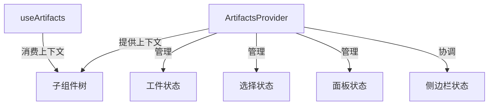
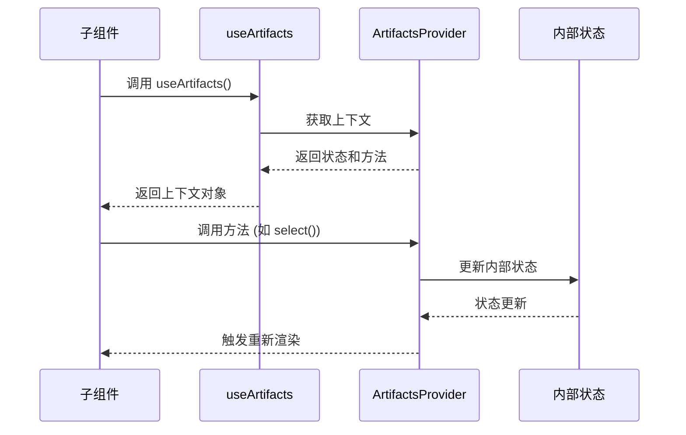

# Artifacts Context 模块文档

## 目录

1. [模块概述](#模块概述)
2. [核心组件](#核心组件)
3. [架构与数据流](#架构与数据流)
4. [使用指南](#使用指南)
5. [扩展与自定义](#扩展与自定义)
6. [注意事项与最佳实践](#注意事项与最佳实践)
7. [参考链接](#参考链接)

---

## 模块概述

Artifacts Context 模块是前端工作区组件的核心上下文管理系统，负责管理工作区中的工件（artifacts）状态和交互行为。该模块提供了一套完整的 React Context API 实现，用于在组件树中共享工件相关状态，实现了工件的选择、展示和管理功能。

### 设计目的

1. **状态集中管理**：将工件相关的状态逻辑集中在一处，避免状态分散导致的复杂性
2. **组件间通信**：为工作区中的各个组件提供统一的状态共享机制
3. **行为一致性**：确保工件选择、打开/关闭等操作在整个应用中保持一致的行为
4. **可扩展性**：提供灵活的接口，便于后续功能扩展和自定义

### 主要功能

- 工件列表的管理和更新
- 工件的选择与取消选择
- 工件面板的打开/关闭控制
- 自动选择和自动打开行为的管理
- 与侧边栏状态的协调

---

## 核心组件

### ArtifactsContextType

`ArtifactsContextType` 是定义工件上下文状态和操作的核心接口，它规定了上下文提供的所有功能和数据结构。

```typescript
export interface ArtifactsContextType {
  artifacts: string[];
  setArtifacts: (artifacts: string[]) => void;

  selectedArtifact: string | null;
  autoSelect: boolean;
  select: (artifact: string, autoSelect?: boolean) => void;
  deselect: () => void;

  open: boolean;
  autoOpen: boolean;
  setOpen: (open: boolean) => void;
}
```

#### 属性详解

1. **artifacts**: `string[]`
   - 存储当前工作区中所有工件的标识符列表
   - 每个字符串代表一个唯一的工件

2. **setArtifacts**: `(artifacts: string[]) => void`
   - 更新工件列表的函数
   - 参数 `artifacts` 是新的工件标识符数组
   - 使用此函数会触发所有使用工件列表的组件重新渲染

3. **selectedArtifact**: `string | null`
   - 当前选中的工件标识符
   - 若为 `null`，表示没有选中任何工件

4. **autoSelect**: `boolean`
   - 控制是否启用自动选择行为
   - 当为 `true` 时，系统可能会根据特定条件自动选择工件

5. **select**: `(artifact: string, autoSelect?: boolean) => void`
   - 选择指定工件的函数
   - 参数 `artifact` 是要选择的工件标识符
   - 参数 `autoSelect`（可选）指示是否将此选择视为自动选择，默认为 `false`
   - 此函数会更新 `selectedArtifact` 状态，并可能影响侧边栏状态和 `autoSelect` 标志

6. **deselect**: `() => void`
   - 取消当前选择的函数
   - 会将 `selectedArtifact` 设置为 `null` 并重置 `autoSelect` 为 `true`

7. **open**: `boolean`
   - 控制工件面板是否打开
   - 初始值由环境变量 `NEXT_PUBLIC_STATIC_WEBSITE_ONLY` 决定

8. **autoOpen**: `boolean`
   - 控制是否启用自动打开行为
   - 当为 `true` 时，工件面板可能会在特定条件下自动打开

9. **setOpen**: `(open: boolean) => void`
   - 更新工件面板打开状态的函数
   - 参数 `open` 指示是否打开面板
   - 如果关闭面板且 `autoOpen` 为 `true`，会同时禁用 `autoOpen` 和 `autoSelect`

### ArtifactsProvider

`ArtifactsProvider` 是一个 React 组件，它为其子组件提供工件上下文。它实现了 `ArtifactsContextType` 接口定义的所有功能，并管理相应的状态。

```typescript
export function ArtifactsProvider({ children }: ArtifactsProviderProps) {
  // 实现细节...
}
```

#### 状态管理

`ArtifactsProvider` 内部使用多个 React `useState` 钩子来管理状态：

1. `artifacts` - 存储工件列表
2. `selectedArtifact` - 存储当前选中的工件
3. `autoSelect` - 控制自动选择行为
4. `open` - 控制工件面板的打开/关闭状态
5. `autoOpen` - 控制自动打开行为

#### 关键方法实现

1. **select 方法**：
   ```typescript
   const select = (artifact: string, autoSelect = false) => {
     setSelectedArtifact(artifact);
     if (env.NEXT_PUBLIC_STATIC_WEBSITE_ONLY !== "true") {
       setSidebarOpen(false);
     }
     if (!autoSelect) {
       setAutoSelect(false);
     }
   };
   ```
   - 更新选中的工件
   - 在非静态网站模式下关闭侧边栏
   - 根据 `autoSelect` 参数决定是否禁用自动选择功能

2. **deselect 方法**：
   ```typescript
   const deselect = () => {
     setSelectedArtifact(null);
     setAutoSelect(true);
   };
   ```
   - 清除当前选择
   - 重置自动选择为启用状态

3. **setOpen 方法**：
   ```typescript
   setOpen: (isOpen: boolean) => {
     if (!isOpen && autoOpen) {
       setAutoOpen(false);
       setAutoSelect(false);
     }
     setOpen(isOpen);
   }
   ```
   - 更新面板打开状态
   - 如果关闭面板且自动打开已启用，则同时禁用自动打开和自动选择

### useArtifacts

`useArtifacts` 是一个自定义 React Hook，用于在组件中访问工件上下文。

```typescript
export function useArtifacts() {
  const context = useContext(ArtifactsContext);
  if (context === undefined) {
    throw new Error("useArtifacts must be used within an ArtifactsProvider");
  }
  return context;
}
```

#### 使用要点

- 必须在 `ArtifactsProvider` 组件的子组件中使用
- 如果在提供者之外使用，会抛出错误
- 返回完整的 `ArtifactsContextType` 对象，包含所有状态和方法

### ArtifactsProviderProps

`ArtifactsProviderProps` 是 `ArtifactsProvider` 组件的属性接口，定义如下：

```typescript
interface ArtifactsProviderProps {
  children: ReactNode;
}
```

只包含一个必需的 `children` 属性，用于接收要包裹的子组件。

---

## 架构与数据流

### 组件架构

Artifacts Context 模块采用典型的 React Context 模式架构，由以下部分组成：



### 状态数据流

工件相关状态的数据流遵循单向数据流原则：



### 与其他模块的关系

Artifacts Context 模块与以下模块有重要关联：

1. **frontend_core_domain_types_and_state** - 提供核心类型定义
2. **frontend_workspace_contexts** - 作为其子模块，与 messages_context 并列
3. **应用环境配置** - 使用环境变量决定初始行为

这些关联确保了工件上下文能够与整个应用的其他部分无缝协作。

---

## 使用指南

### 基本设置

要在应用中使用 Artifacts Context，首先需要在组件树的适当位置包裹 `ArtifactsProvider`：

```tsx
import { ArtifactsProvider } from "@/components/workspace/artifacts/context";

function App() {
  return (
    <ArtifactsProvider>
      {/* 应用的其余部分 */}
      <Workspace />
    </ArtifactsProvider>
  );
}
```

### 访问工件上下文

在需要使用工件功能的组件中，使用 `useArtifacts` Hook：

```tsx
import { useArtifacts } from "@/components/workspace/artifacts/context";

function ArtifactList() {
  const { artifacts, selectedArtifact, select } = useArtifacts();
  
  return (
    <div>
      <h2>工件列表</h2>
      <ul>
        {artifacts.map(artifact => (
          <li 
            key={artifact}
            className={selectedArtifact === artifact ? "selected" : ""}
            onClick={() => select(artifact)}
          >
            {artifact}
          </li>
        ))}
      </ul>
    </div>
  );
}
```

### 管理工件列表

使用 `setArtifacts` 方法更新工件列表：

```tsx
function ArtifactManager() {
  const { artifacts, setArtifacts } = useArtifacts();
  
  const addArtifact = (newArtifact: string) => {
    setArtifacts([...artifacts, newArtifact]);
  };
  
  const removeArtifact = (artifactToRemove: string) => {
    setArtifacts(artifacts.filter(a => a !== artifactToRemove));
  };
  
  // 组件其余部分...
}
```

### 控制工件面板

使用 `open` 状态和 `setOpen` 方法控制工件面板的显示：

```tsx
function ArtifactPanelToggle() {
  const { open, setOpen } = useArtifacts();
  
  return (
    <button onClick={() => setOpen(!open)}>
      {open ? "关闭工件面板" : "打开工件面板"}
    </button>
  );
}
```

---

## 扩展与自定义

### 自定义工件选择逻辑

虽然 `ArtifactsProvider` 提供了基本的选择逻辑，但您可以在消费组件中实现自定义选择行为：

```tsx
function SmartArtifactSelector() {
  const { artifacts, select, autoSelect } = useArtifacts();
  
  const selectMostRelevantArtifact = () => {
    // 自定义逻辑选择最合适的工件
    const mostRelevant = findMostRelevantArtifact(artifacts);
    if (mostRelevant) {
      select(mostRelevant, true); // 标记为自动选择
    }
  };
  
  // 组件其余部分...
}
```

### 与其他 Context 结合使用

Artifacts Context 可以与其他 Context 结合使用，创建更复杂的交互：

```tsx
import { useArtifacts } from "@/components/workspace/artifacts/context";
import { useThread } from "@/components/workspace/messages/context";

function IntegratedWorkspace() {
  const { selectedArtifact, select } = useArtifacts();
  const { currentThread } = useThread();
  
  // 基于线程状态和工件状态的组合逻辑
  useEffect(() => {
    if (currentThread && !selectedArtifact) {
      // 当有活动线程但没有选中工件时，自动选择相关工件
      const relatedArtifact = findRelatedArtifact(currentThread);
      if (relatedArtifact) {
        select(relatedArtifact, true);
      }
    }
  }, [currentThread, selectedArtifact, select]);
  
  // 组件其余部分...
}
```

---

## 注意事项与最佳实践

### 环境变量依赖

`ArtifactsProvider` 的初始状态依赖于 `NEXT_PUBLIC_STATIC_WEBSITE_ONLY` 环境变量：

- 当该变量为 `"true"` 时，工件面板默认为打开状态，且不会与侧边栏交互
- 否则，面板默认为关闭状态，并会在选择工件时关闭侧边栏

确保在不同环境中正确设置此变量，以获得预期的行为。

### 性能考虑

1. **避免不必要的重渲染**：由于 `ArtifactsContext` 包含多个状态，任何一个状态的变化都会导致所有使用该上下文的组件重新渲染。对于性能敏感的组件，可以考虑：
   - 使用多个更具体的上下文
   - 使用 React.memo 和 useMemo 优化组件
   - 使用选择器模式只订阅需要的状态部分

2. **批量更新**：当需要同时更新多个状态时，确保在同一事件处理函数或 useEffect 中完成，以最小化重渲染次数。

### 错误处理

`useArtifacts` Hook 会在未被 `ArtifactsProvider` 包裹时抛出错误。确保：

1. 所有使用 `useArtifacts` 的组件都在 `ArtifactsProvider` 子树中
2. 在可能的情况下，为错误边界添加适当的处理

### 自动行为管理

`autoSelect` 和 `autoOpen` 标志控制系统的自动行为：

- 当用户手动选择工件或关闭面板时，这些自动行为会被禁用
- 只有通过 `deselect` 方法或其他显式重置操作才能重新启用

设计交互时要考虑这些自动行为的状态变化，确保用户体验连贯一致。

---

## 参考链接

- [React Context API 文档](https://react.dev/reference/react/createContext)
- [frontend_workspace_contexts 模块](./frontend_workspace_contexts.md) - 了解工件上下文如何适应更大的工作区上下文系统
- [frontend_core_domain_types_and_state 模块](./frontend_core_domain_types_and_state.md) - 查看应用中使用的核心类型定义
