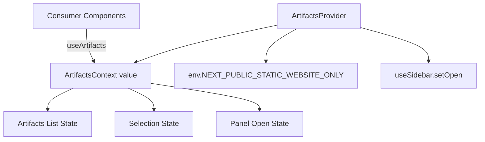
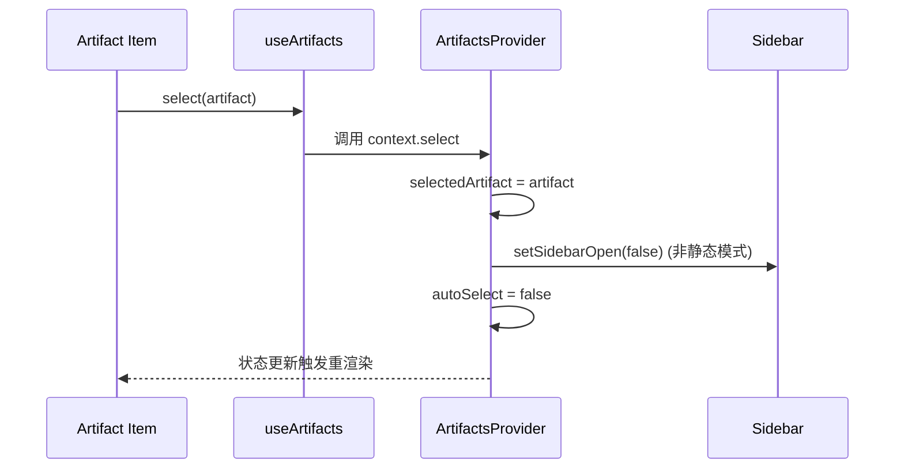
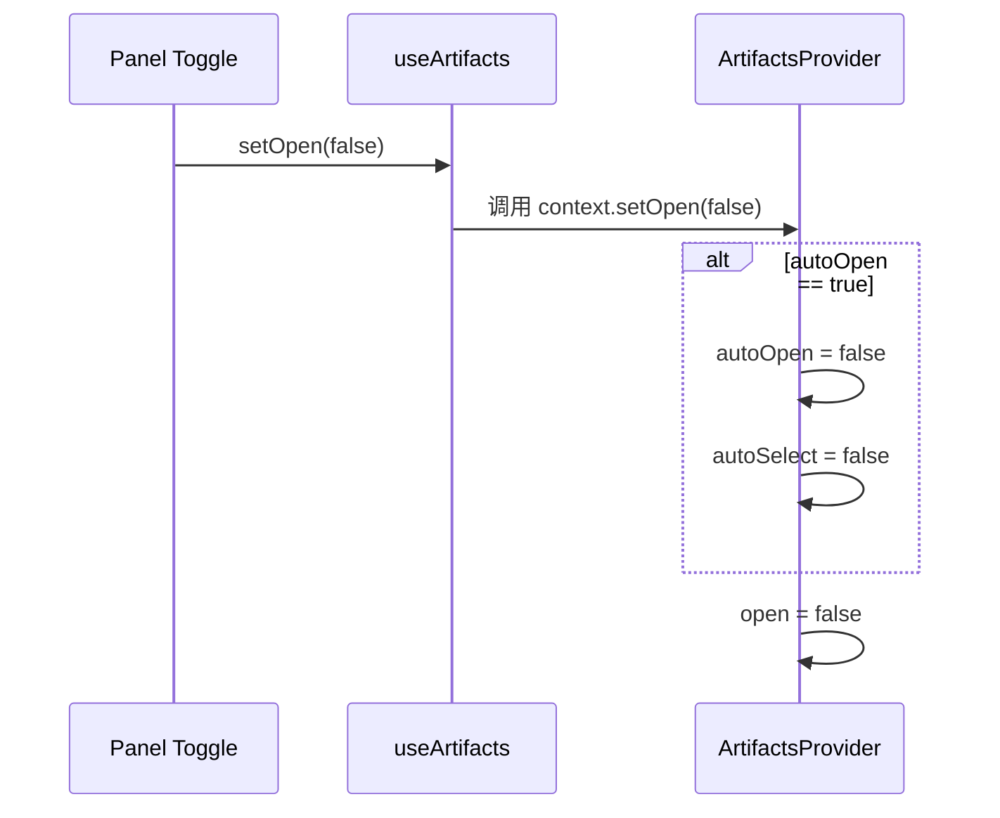

# artifacts_workspace_context 模块文档

## 模块简介

`artifacts_workspace_context` 是 `frontend_workspace_contexts` 下专门负责“工作区工件（artifacts）视图状态”的上下文模块。它通过 React Context 将工件列表、当前选中工件、工件面板开关，以及“自动选择/自动打开”这两类行为开关统一收敛在一个 Provider 中，供工作区内任意子组件共享。

这个模块存在的根本原因，是把“工件 UI 行为策略”从具体页面组件中抽离出来。否则，工件列表组件、预览组件、侧边栏组件、消息区域组件都可能各自维护一份局部状态，导致状态冲突（例如：A 组件认为面板应打开，B 组件却刚关闭；或用户手动选择后仍被自动逻辑覆盖）。该模块通过单一上下文源，保证这些行为在整个 workspace 中一致。

从系统分层看，它位于前端展示层与交互状态层之间：向上服务于具体 UI 组件，向下依赖 React 状态机制和环境配置（`env`），并且与侧边栏控制钩子 `useSidebar` 协同工作。若你已经阅读过 [frontend_workspace_contexts.md](./frontend_workspace_contexts.md)，可以把本模块理解为其中“工件交互子系统”的落地实现；若要了解线程流上下文，可参考 [messages_context.md](./messages_context.md)。

---

## 核心设计与职责边界

`artifacts_workspace_context` 只处理**工件相关的前端会话内 UI 状态**，不承担工件数据拉取、持久化、权限校验等职责。它的职责可以概括为三件事：

1. 提供工件集合与选择状态：有哪些工件、当前选中了哪个工件。
2. 提供工件面板可见性状态：工件区域是否打开。
3. 管理自动行为退让策略：当用户发生手动交互时，自动行为应被抑制，避免“和用户抢控制权”。

这种设计让模块具备明确边界：它是“状态编排器”，不是“数据源”。上游组件可以把任意字符串工件标识写入 `artifacts`，该模块不解释业务语义，只负责共享与协同。

---

## 组件详解

### 1) `ArtifactsContextType`

`ArtifactsContextType` 是该模块的公共契约，定义 Provider 对外暴露的状态与操作函数。

```ts
export interface ArtifactsContextType {
  artifacts: string[];
  setArtifacts: (artifacts: string[]) => void;

  selectedArtifact: string | null;
  autoSelect: boolean;
  select: (artifact: string, autoSelect?: boolean) => void;
  deselect: () => void;

  open: boolean;
  autoOpen: boolean;
  setOpen: (open: boolean) => void;
}
```

其字段可以分为三组：

- 工件集合组：`artifacts`、`setArtifacts`
- 选择组：`selectedArtifact`、`autoSelect`、`select`、`deselect`
- 面板组：`open`、`autoOpen`、`setOpen`

这里的关键不是“有多少字段”，而是 `autoSelect` 与 `autoOpen` 两个标志位体现出的交互哲学：**系统允许自动行为，但一旦用户显式干预，就应该让位给用户意图**。

#### 参数、返回值与副作用说明

- `setArtifacts(artifacts: string[]) => void`
  - 参数：完整工件数组（覆盖写入，不是增量 patch）。
  - 返回：无。
  - 副作用：触发使用该上下文组件的重渲染。

- `select(artifact: string, autoSelect?: boolean) => void`
  - 参数：
    - `artifact`：要选中的工件标识。
    - `autoSelect`：本次选择是否归类为“自动选择”（默认 `false`，即默认视为手动选择）。
  - 返回：无。
  - 副作用：
    - 更新 `selectedArtifact`。
    - 非静态站点模式下调用 `setSidebarOpen(false)` 关闭侧边栏。
    - 当本次为手动选择时，将 `autoSelect` 状态置为 `false`。

- `deselect() => void`
  - 参数：无。
  - 返回：无。
  - 副作用：
    - `selectedArtifact` 置空。
    - `autoSelect` 重置为 `true`。

- `setOpen(open: boolean) => void`
  - 参数：目标开关状态。
  - 返回：无。
  - 副作用：
    - 当“关闭面板”且当前 `autoOpen === true` 时，会同时把 `autoOpen` 与 `autoSelect` 置为 `false`，表示用户明确拒绝自动打开/自动选择策略。
    - 更新面板实际开关状态 `open`。

---

### 2) `ArtifactsProviderProps`

```ts
interface ArtifactsProviderProps {
  children: ReactNode;
}
```

该类型非常简单，只约束 Provider 需要接收子树。虽然结构简单，但语义很重要：它明确该模块是“上下文容器”，而非渲染具体 UI 的组件。

---

### 3) `ArtifactsProvider`

`ArtifactsProvider` 是模块行为核心。它使用多组 `useState` 维护状态，并在 `value` 中暴露受控 API。

#### 初始化逻辑

Provider 内部状态初始化如下：

- `artifacts = []`
- `selectedArtifact = null`
- `autoSelect = true`
- `open = (env.NEXT_PUBLIC_STATIC_WEBSITE_ONLY === "true")`
- `autoOpen = true`

其中最值得注意的是 `open` 的初值取决于环境变量。也就是说，模块行为在“静态站点模式”和“常规应用模式”下会有差异（后文详述）。

#### `select` 的行为链

`select` 的执行顺序非常关键：

1. 先写入 `selectedArtifact`。
2. 如果不是静态站点模式，则关闭主侧边栏。
3. 如果本次是手动选择（`autoSelect` 参数未传或传 `false`），则禁用自动选择标记。

这使得“点击工件进入阅读”在交互上更聚焦：主导航收起，用户视线集中于工件内容。

#### `setOpen` 的策略转折点

`setOpen` 并非单纯设置布尔值；它包含“用户意图优先”策略：

- 当用户主动关闭面板，并且系统当前仍处于自动打开模式时，模块会把自动打开和自动选择都关掉。
- 这是一种状态机式退让：系统不再尝试自动介入，直到上层逻辑显式重置。

---

### 4) `useArtifacts`

`useArtifacts` 是安全访问入口：

```ts
export function useArtifacts() {
  const context = useContext(ArtifactsContext);
  if (context === undefined) {
    throw new Error("useArtifacts must be used within an ArtifactsProvider");
  }
  return context;
}
```

这段实现提供了明确的开发时保护：如果调用方忘记挂 `ArtifactsProvider`，会立刻抛出可读错误，而不是静默失败。

---

## 架构与依赖关系

### 架构图



该架构体现了一个典型 Context 模式：Provider 聚合状态，消费组件通过 Hook 读取和触发操作。额外依赖的 `env` 和 `useSidebar` 让该模块具备“运行模式感知”和“跨 UI 区域协同控制”能力。

### 与其他模块的关系

在模块树中，它属于 `frontend_workspace_contexts` 的子模块，并与线程上下文并列。关系上建议按下述方式理解：

- 工件上下文（本模块）关注“看什么工件、工件面板是否打开”。
- 线程上下文（`messages_context`）关注“当前是哪条线程、线程流状态如何”。

实际页面通常会组合两者使用：线程消息驱动工件产生，工件上下文驱动展示与聚焦。

---

## 关键数据流与交互流程

### 流程 1：手动选择工件



这个流程说明：用户显式点击后，系统将其视为“手动意图”，因此关闭自动选择。

### 流程 2：用户手动关闭工件面板



这反映出一个重要行为：一旦用户表达“不要自动打开”，系统就连带停止自动选择，避免再次打断用户。

---

## 使用与集成指南

### 1) Provider 挂载

```tsx
import { ArtifactsProvider } from "@/components/workspace/artifacts/context";

export function WorkspaceRoot() {
  return (
    <ArtifactsProvider>
      <WorkspaceLayout />
    </ArtifactsProvider>
  );
}
```

建议把 Provider 放在“工作区级别”而不是“单个面板级别”，以保证工件状态在 workspace 内共享一致。

### 2) 在子组件中读写状态

```tsx
import { useArtifacts } from "@/components/workspace/artifacts/context";

export function ArtifactList() {
  const { artifacts, selectedArtifact, select, setArtifacts } = useArtifacts();

  return (
    <div>
      <button onClick={() => setArtifacts(["a.md", "b.md"])}>Load</button>
      {artifacts.map((a) => (
        <button
          key={a}
          data-active={selectedArtifact === a}
          onClick={() => select(a)}
        >
          {a}
        </button>
      ))}
    </div>
  );
}
```

### 3) 自动选择场景

当你希望“系统自动选择第一个工件”但不想破坏自动选择机制，可显式传入 `true`：

```tsx
const { artifacts, selectedArtifact, select, autoSelect } = useArtifacts();

useEffect(() => {
  if (!selectedArtifact && autoSelect && artifacts.length > 0) {
    select(artifacts[0], true);
  }
}, [artifacts, selectedArtifact, autoSelect, select]);
```

这表示一次“系统驱动选择”，不会把 `autoSelect` 关掉。

---

## 配置行为与运行模式

模块唯一直接配置输入是：

- `env.NEXT_PUBLIC_STATIC_WEBSITE_ONLY`

其影响有两点：

1. `open` 初始值
   - `"true"`：初始打开。
   - 其他：初始关闭。

2. `select` 时是否关闭主侧边栏
   - 静态模式：不触发 `setSidebarOpen(false)`。
   - 非静态模式：会关闭侧边栏。

这意味着，同一段代码在文档站/静态展示环境与完整应用环境可能出现不同初始交互，这是预期行为，不是 bug。

---

## 边界条件、错误与限制

### 1) Provider 缺失错误

`useArtifacts` 在 Provider 外调用会抛错：

- 错误信息：`useArtifacts must be used within an ArtifactsProvider`

这是硬性约束。若你在 Storybook、单测或局部渲染中使用消费组件，必须显式包裹 Provider。

### 2) `setArtifacts` 不自动修正 `selectedArtifact`

当前实现不会在工件列表变化时自动验证 `selectedArtifact` 是否仍存在。例如：

- 之前选中 `"a.md"`
- 调用 `setArtifacts(["b.md"])`
- `selectedArtifact` 仍可能是 `"a.md"`

这属于模块当前行为特征。调用方如果需要一致性，应在更新列表后自行执行 `deselect` 或重新 `select`。

### 3) 自动标记的不可见重置路径

`autoOpen` 仅在内部从 `true -> false`，对外无直接 setter。`autoSelect` 则可通过 `deselect()` 重置为 `true`。这会导致：

- 一旦用户关闭面板触发 `autoOpen=false`，上层不能直接恢复自动打开，只能通过重新挂载 Provider（或改造模块）。

如果业务需要“恢复自动打开”按钮，建议扩展 Context 接口（见下节）。

### 4) 渲染性能注意点

Context value 包含多个状态与函数，任一状态变化都会使所有消费者重渲染。对于大型页面，建议：

- 将高频更新逻辑放入更细粒度上下文，或
- 在消费组件中使用 `React.memo`，减少无关子树渲染。

---

## 扩展建议

若要扩展该模块，推荐保持“用户意图优先”的核心原则不变。

一个常见扩展是增加显式重置 API：

```ts
interface ArtifactsContextType {
  // ...existing fields
  resetAutomation: () => void;
}
```

并在 Provider 中实现：

```ts
const resetAutomation = () => {
  setAutoOpen(true);
  setAutoSelect(true);
};
```

这样可支持“恢复默认自动行为”的显式交互，避免依赖 Provider 重挂载。

另一个扩展方向是让 `artifacts` 使用结构化对象（如 `{ id, title, type }`）而不是字符串，以便列表、筛选、排序拥有更丰富语义。若采用此方案，建议新建类型并在引用模块中同步升级，详见 [frontend_core_domain_types_and_state.md](./frontend_core_domain_types_and_state.md) 的类型组织思路。

---

## 测试建议（维护者视角）

建议至少覆盖以下行为测试：

1. `useArtifacts` 在 Provider 外抛错。
2. `select(x)` 能设置 `selectedArtifact=x`，并在非静态模式触发 sidebar 关闭。
3. `select(x, true)` 不会关闭 `autoSelect`。
4. `setOpen(false)` 在 `autoOpen=true` 时联动关闭 `autoOpen` 与 `autoSelect`。
5. `deselect()` 重置 `selectedArtifact` 与 `autoSelect`。

这些测试基本覆盖模块策略核心，能有效防止后续改动破坏交互契约。

---

## 参考文档

- [frontend_workspace_contexts.md](./frontend_workspace_contexts.md)：工作区上下文总览。
- [messages_context.md](./messages_context.md)：线程流上下文，与本模块常组合使用。
- [frontend_core_domain_types_and_state.md](./frontend_core_domain_types_and_state.md)：前端核心类型与状态模型。
