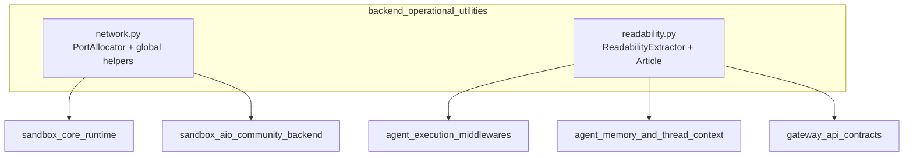
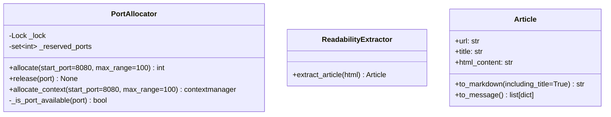
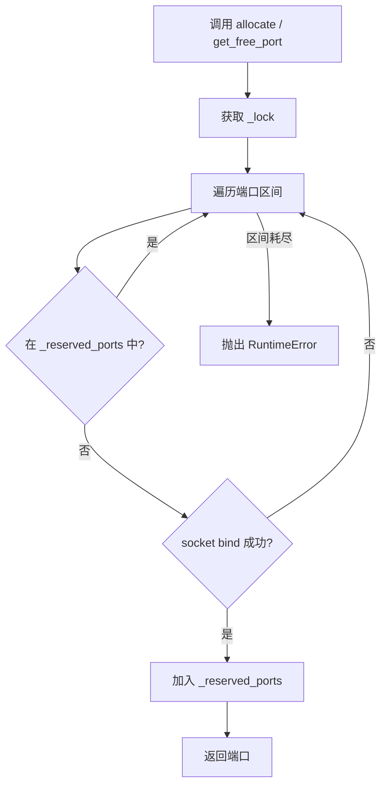
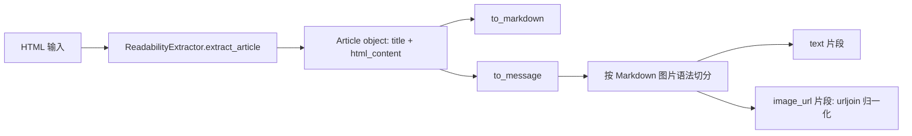

# backend_operational_utilities 模块文档

## 1. 模块定位与设计动机

`backend_operational_utilities` 是后端中的“运行时基础工具层”，提供两个看似小但非常关键的能力：

1. **并发安全的端口分配**（`network_utilities.md`）
2. **网页主体内容提取与消息化转换**（`readability_utilities.md`）

这个模块存在的原因并不是“业务功能复杂”，而是“基础能力必须稳定”。在多线程/多任务环境里，端口冲突会导致沙箱、临时服务或测试进程启动失败；在需要读取网页内容并喂给 LLM 的流程中，原始 HTML 又往往噪声极高、不可直接使用。该模块以低耦合方式统一解决这两类问题，避免这些横切问题散落在各个业务模块中重复实现。

从系统结构上看，它为以下模块提供底层支撑：
- 与沙箱生命周期相关：[`sandbox_core_runtime.md`](sandbox_core_runtime.md)、[`sandbox_aio_community_backend.md`](sandbox_aio_community_backend.md)
- 与代理执行和上下文增强相关：[`agent_execution_middlewares.md`](agent_execution_middlewares.md)、[`agent_memory_and_thread_context.md`](agent_memory_and_thread_context.md)
- 与网关契约及上传/外链处理相关：[`gateway_api_contracts.md`](gateway_api_contracts.md)

---

## 2. 架构总览



上图体现了本模块的核心特征：**能力小而通用**。`network.py` 面向“资源占用冲突控制”，`readability.py` 面向“内容语义提纯与结构化输出”。两者都不直接绑定具体业务流程，而是以工具能力注入到多个上层模块中。

### 2.1 组件关系（类/函数视角）



`PortAllocator` 是并发控制型工具，`ReadabilityExtractor` + `Article` 是内容处理型工具。前者关注互斥与状态，后者关注容错与格式转换。

---

## 3. 子模块功能总览（含文档索引）

### 3.1 network_utilities

详见：[`network_utilities.md`](network_utilities.md)

该子模块以 `PortAllocator` 为核心，实现了“在同一进程内并发调用时不会重复分配同一个端口”的保证。其内部通过 `threading.Lock` 包裹分配与释放过程，配合 `_reserved_ports` 维护进程内保留集，并通过 socket `bind` 实测端口是否被系统占用。模块还提供全局实例与便捷函数 `get_free_port/release_port`，用于跨组件共享端口分配状态。

这个设计尤其适合沙箱启动、动态服务启动、并行测试等场景。它不追求跨主机协调，而是专注于**单机进程内的正确性与易用性**。

### 3.2 readability_utilities

详见：[`readability_utilities.md`](readability_utilities.md)

该子模块负责把“复杂网页 HTML”转换为“可读且可投喂模型”的结果。`ReadabilityExtractor` 基于 `readabilipy.simple_json_from_html_string` 提取主体内容；`Article` 负责二次转换：
- `to_markdown()`：输出可阅读/可存储文本
- `to_message()`：输出多模态友好的结构化片段（`text` + `image_url`）

其设计重点是**优雅降级**：即便提取失败或内容为空，也返回可解释的默认文本，而不是将异常传播给上层流程，降低 agent 管道中断概率。

---

## 4. 关键运行流程

### 4.1 端口分配流程



流程重点在于：检查“进程内保留状态”与“系统可绑定状态”两层条件，避免仅靠其中一层带来的误判。

### 4.2 网页提取到消息格式流程



`to_message()` 通过正则拆分 Markdown 图片语法，并将图片路径用 `urljoin` 转为绝对地址，便于上游消息协议直接消费。

---

## 5. 典型使用方式

### 5.1 并发安全端口申请（推荐 context manager）

```python
from backend.src.utils.network import PortAllocator

allocator = PortAllocator()

with allocator.allocate_context(start_port=12000, max_range=200) as port:
    # 启动临时服务/沙箱
    run_service(port=port)
# 离开 with 自动释放
```

### 5.2 使用全局分配器（跨组件共享）

```python
from backend.src.utils.network import get_free_port, release_port

port = get_free_port(start_port=15000, max_range=500)
try:
    run_service(port)
finally:
    release_port(port)
```

### 5.3 将网页内容转换为 LLM 可消费消息

```python
from backend.src.utils.readability import ReadabilityExtractor

extractor = ReadabilityExtractor()
article = extractor.extract_article(html)
article.url = "https://example.com/path/page"  # 为相对图片链接提供基准

message_content = article.to_message()
# message_content -> [{"type":"text",...}, {"type":"image_url",...}, ...]
```

---

## 6. 错误条件、边界情况与限制

### 6.1 PortAllocator 相关

- 当扫描区间无可用端口时，`allocate()` 会抛出 `RuntimeError`。
- 端口“已分配”并不等于“外部进程永远无法抢占”。若分配后长时间未实际监听，仍可能被其他进程使用。
- 该实现是**进程内协调**，不是分布式锁方案；多进程/多主机场景需额外协调机制。
- `release()` 使用 `discard`，重复释放不会报错（幂等友好）。

### 6.2 ReadabilityExtractor / Article 相关

- 可能提取不到有效正文，模块会返回默认文本（而非抛错）。
- `Article.url` 不是构造参数，若未设置，`to_message()` 处理相对图片链接时可能得到不完整 URL。
- `to_message()` 依赖 Markdown 图片语法匹配，特殊/非标准图片写法可能无法被识别为 `image_url`。
- 对强依赖 JS 渲染的页面，若输入是未渲染 HTML，提取质量会下降。

---

## 7. 扩展建议

1. **面向网络工具**：可增加“端口租约 TTL”或“健康检查回收”，减少忘记释放时的保留污染。  
2. **面向可读性工具**：可扩展为多策略提取（readability + 自定义规则），并增加语言/站点特化后处理。  
3. **面向可观测性**：可在 [`tracing_configuration.md`](tracing_configuration.md) 对接链路追踪，记录端口申请耗时、提取成功率、降级比例等指标。

---

## 8. 与其他模块文档的关系

为避免重复，本文件只描述 `backend_operational_utilities` 的总体设计与跨模块价值。实现细节请继续阅读：

- [`network_utilities.md`](network_utilities.md)：端口分配器内部机制、API 细节、并发行为
- [`readability_utilities.md`](readability_utilities.md)：内容提取逻辑、Markdown/消息转换、图像 URL 处理

同时，若你在排查集成问题，建议结合以下文档：
- [`sandbox_core_runtime.md`](sandbox_core_runtime.md)、[`sandbox_aio_community_backend.md`](sandbox_aio_community_backend.md)
- [`agent_execution_middlewares.md`](agent_execution_middlewares.md)、[`agent_memory_and_thread_context.md`](agent_memory_and_thread_context.md)
- [`gateway_api_contracts.md`](gateway_api_contracts.md)

