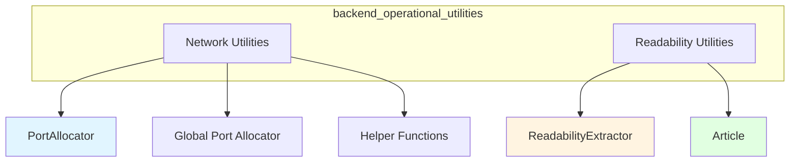

# Backend Operational Utilities Module

## Overview

The backend_operational_utilities module provides essential utility components that support the core functionality of the backend system. This module focuses on two key areas: network resource management and web content extraction. These utilities are designed to be reusable, thread-safe, and efficient, addressing common operational challenges that arise in backend development.

The network utilities component solves the critical problem of port allocation in concurrent environments, where multiple processes or threads might attempt to use the same network port simultaneously. The web content extraction component addresses the challenge of parsing and converting HTML content from web pages into structured, usable formats for further processing or display.

## Architecture

The backend_operational_utilities module is organized into two distinct sub-modules, each with a clear responsibility:



### Network Utilities Sub-module

This sub-module provides thread-safe port allocation capabilities to prevent port conflicts in concurrent environments. At its core is the `PortAllocator` class, which manages a set of reserved ports and uses thread synchronization to ensure atomic port allocation operations. Detailed documentation can be found in [Network Utilities](network_utilities.md).

### Readability Utilities Sub-module

This sub-module focuses on extracting and processing web content. The `ReadabilityExtractor` class uses the readability algorithm to extract main content from HTML pages, while the `Article` class provides methods to convert this extracted content into markdown and structured message formats suitable for AI model consumption. Detailed documentation can be found in [Readability Utilities](readability_utilities.md).

## Core Components

### PortAllocator

The `PortAllocator` class is a thread-safe utility that manages network port allocation to prevent conflicts in concurrent environments. It maintains a set of reserved ports and uses a lock to ensure that port allocation operations are atomic.

Key features include:
- Manual port allocation and release
- Context manager support for automatic port release
- Configurable port range search
- Socket-based port availability checking

For more detailed information about the PortAllocator, please refer to the [Network Utilities](network_utilities.md) documentation.

### ReadabilityExtractor

The `ReadabilityExtractor` class is responsible for extracting main article content from HTML pages. It uses the readabilipy library to parse HTML and identify the main content, removing navigation elements, ads, and other distractions.

### Article

The `Article` class represents extracted web content and provides methods to convert this content into different formats. It supports conversion to markdown for readability and to a structured message format with text and image components suitable for AI model input.

For more detailed information about both ReadabilityExtractor and Article, please refer to the [Readability Utilities](readability_utilities.md) documentation.

## Sub-module Documentation

For detailed information about each sub-module, please refer to the dedicated documentation files:

- [Network Utilities](network_utilities.md) - Comprehensive guide to port allocation and network utilities
- [Readability Utilities](readability_utilities.md) - Detailed documentation for web content extraction and processing

## Usage Examples

### Network Utilities

```python
from backend.src.utils.network import PortAllocator, get_free_port, release_port

# Using PortAllocator directly
allocator = PortAllocator()
port = allocator.allocate(start_port=8080)
try:
    # Use the port for your service
    print(f"Using port: {port}")
finally:
    allocator.release(port)

# Using context manager (recommended)
with allocator.allocate_context(start_port=9000) as port:
    print(f"Using port in context: {port}")

# Using global functions
port = get_free_port(start_port=10000)
try:
    print(f"Using global port: {port}")
finally:
    release_port(port)
```

### Readability Utilities

```python
from backend.src.utils.readability import ReadabilityExtractor

# Extract content from HTML
extractor = ReadabilityExtractor()
article = extractor.extract_article(html_content)

# Convert to markdown
markdown_content = article.to_markdown()
print(markdown_content)

# Convert to message format for AI models
message_content = article.to_message()
for part in message_content:
    print(part)
```

## Integration with Other Modules

The backend_operational_utilities module provides foundational services that are used by several other modules in the system:

- **sandbox_core_runtime** and **sandbox_aio_community_backend** modules use the network utilities to allocate ports for sandbox instances
- **agent_memory_and_thread_context** and **agent_execution_middlewares** may use the readability utilities to process web content referenced in conversations
- **gateway_api_contracts** might use these utilities for various operational tasks

## Best Practices

1. **Always release ports**: Whether using manual allocation or the context manager, ensure ports are released to prevent resource leaks
2. **Use appropriate port ranges**: Avoid well-known ports (0-1023) and use ranges appropriate for your application
3. **Handle extraction failures**: The readability extractor provides fallback content, but you should still handle edge cases where content extraction might not be optimal
4. **Thread safety**: Both sub-modules are designed for thread safety, but be mindful of how you use them in concurrent environments

## Limitations and Considerations

- The port allocator checks availability on localhost only; it doesn't account for ports that might be available locally but blocked by external firewalls
- Readability extraction works best on article-style pages; complex web applications or highly dynamic content may not extract well
- The port allocator can only guarantee availability at the time of allocation; another process could potentially take the port if not used immediately
- Image URLs in extracted content are resolved relative to the article's URL, which must be set separately
