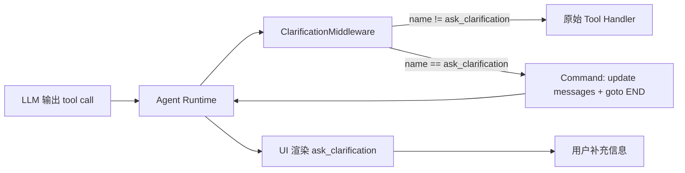
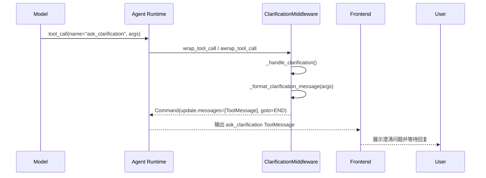

# clarification_interception 模块文档

## 模块定位与设计动机

`clarification_interception` 是 `agent_execution_middlewares` 下的一个流程控制型子模块，核心目标是把“澄清请求（clarification）”从普通工具调用提升为**会话中断协议**。它由 `ClarificationMiddleware` 与 `ClarificationMiddlewareState` 两个组件构成，代码体量很小，但在交互体验和执行安全性上作用非常关键。

在代理（Agent）实际运行中，模型经常会遇到信息不完整或需求冲突的情况。此时如果继续执行工具链，往往会造成错误操作、低质量输出，或者在前端表现为“看似继续推理，但实际上在等待用户补充输入”的状态错位。该模块的存在，就是为了在模型发出 `ask_clarification` 工具调用时立即拦截、标准化消息、结束当前执行轮次，并把控制权明确交还给用户。

换句话说，这个模块不负责“生成澄清问题”（那是模型与提示词的职责），也不负责“恢复执行”（那是下一轮对话调度的职责），它只负责把澄清事件变成一个可预测、可渲染、可中断的系统行为。

---

## 核心组件详解

## 1) ClarificationMiddlewareState

`ClarificationMiddlewareState` 继承自 `AgentState`，当前实现为空类：

```python
class ClarificationMiddlewareState(AgentState):
    """Compatible with the `ThreadState` schema."""
    pass
```

这个组件的意义主要在类型与契约层。它声明了中间件可挂载于 Agent 统一状态模型，并与线程态（`ThreadState`）保持兼容，而不是承载自己的业务字段。当前为空实现意味着该模块是“无状态拦截器”。

如果后续需要扩展（例如记录澄清轮次、澄清来源、重试计数），应先确认与其他 middleware 的状态字段合并规则，避免在全局 state schema 上发生命名冲突。

## 2) ClarificationMiddleware

`ClarificationMiddleware` 继承 `AgentMiddleware[ClarificationMiddlewareState]`，并覆写同步与异步两条工具调用路径：`wrap_tool_call` 和 `awrap_tool_call`。其行为可以概括为：

1. 判断当前工具调用是否为 `ask_clarification`。
2. 如果不是，完全透传给原 handler，不改变执行行为。
3. 如果是，构造格式化 `ToolMessage` 并返回 `Command(goto=END)`，立刻结束当前执行图。

这类实现是“单点拦截 + 硬终止”的典型模式，优点是行为非常稳定且易于调试。

---

## 内部实现与方法级说明

### `_is_chinese(text: str) -> bool`

该函数通过 Unicode 范围 `\u4e00-\u9fff` 判断文本中是否包含中文字符，返回 `bool`。

- 参数：`text: str`
- 返回：`True/False`
- 副作用：无

当前版本中此方法未在主流程调用，属于预留能力。不要把它视作“已启用多语言模板”的证据。

### `_format_clarification_message(args: dict) -> str`

这是内容组装函数，用于把 `ask_clarification` 的参数转成前端可直接展示的文本。

- 参数：`args: dict`
- 读取字段：
  - `question`（默认空字符串）
  - `clarification_type`（默认 `missing_info`）
  - `context`（可空）
  - `options`（默认空列表）
- 返回：格式化后的字符串
- 副作用：无

实现策略如下：

首先根据 `clarification_type` 选择图标（如 `⚠️`、`🤔`）。然后如果存在 `context`，先展示上下文，再换行展示问题；如果不存在 `context`，直接展示问题。最后如果 `options` 非空，则追加编号列表。

该函数采用“容错优先”的 `dict.get` 读取方式，尽量避免因字段缺失而抛错，但也意味着输入质量较差时会出现“弱语义内容”（例如空问题）。

### `_handle_clarification(request: ToolCallRequest) -> Command`

这是命中拦截后的主处理函数。

- 参数：`request: ToolCallRequest`
- 返回：`Command`
- 关键副作用：
  - `print` 两条调试日志
  - 通过 `Command(update={"messages": [...]})` 追加一条 `ToolMessage`
  - 通过 `goto=END` 中断当前执行

处理步骤：

1. 读取 `request.tool_call["args"]`。
2. 提取问题文本用于日志输出。
3. 调用 `_format_clarification_message` 生成最终展示内容。
4. 使用工具调用 ID 构造 `ToolMessage(name="ask_clarification")`。
5. 返回 `Command(update=..., goto=END)`。

这里有一个关键设计点：它**不会**额外插入 `AIMessage`。注释已经明确该职责交给前端识别 `ask_clarification` 的 `ToolMessage` 来渲染。

### `wrap_tool_call(...)` 与 `awrap_tool_call(...)`

同步和异步版本逻辑保持一致：

- 工具名不是 `ask_clarification`：调用原 handler（同步 `return handler(...)` / 异步 `return await handler(...)`）。
- 工具名是 `ask_clarification`：调用 `_handle_clarification(...)` 并返回中断命令。

这种“双路径等价”设计避免了不同执行模式下行为漂移。

---

## 架构关系

### 组件职责图



该图强调了本模块并不参与工具执行本身，而是处于“是否允许继续执行”的网关位置。

### 数据流与中断时序



这个流程体现出本模块最核心的系统语义：澄清是“中断事件”，不是“普通工具执行结果”。

---

## 输入输出契约

### 预期输入（工具调用）

典型的 `request.tool_call` 形态如下：

```python
{
  "id": "call_123",
  "name": "ask_clarification",
  "args": {
    "question": "你希望输出 Markdown 还是 HTML？",
    "clarification_type": "approach_choice",
    "context": "你要求生成文档，但未指定输出格式。",
    "options": ["Markdown", "HTML", "两者都要"]
  }
}
```

### 输出（中断命令）

```python
Command(
    update={"messages": [ToolMessage(...)]},
    goto=END,
)
```

其中 `ToolMessage` 关键字段：

- `name="ask_clarification"`
- `tool_call_id=<原 tool call id，缺失则空字符串>`
- `content=<格式化文本>`

---

## 使用方式

通常在 Agent 组装阶段把该 middleware 放入链路：

```python
from backend.src.agents.middlewares.clarification_middleware import ClarificationMiddleware

middlewares = [
    # ... other middlewares
    ClarificationMiddleware(),
]

agent = build_agent(middlewares=middlewares)
```

建议把它放在“工具执行相关 middleware”区域，并与消息整理/线程状态中间件保持协同。完整中间件上下文可参考 [`agent_execution_middlewares.md`](agent_execution_middlewares.md)。

---

## 扩展与定制建议

最常见的扩展点是 `_format_clarification_message`。你可以继承 `ClarificationMiddleware` 并改写文本模板，以满足企业语气、审计标记、国际化规范等要求。

```python
class CustomClarificationMiddleware(ClarificationMiddleware):
    def _format_clarification_message(self, args: dict) -> str:
        question = args.get("question", "")
        context = args.get("context", "")
        return f"[Clarification Required]\nContext: {context}\nQuestion: {question}"
```

如果你希望拦截多个澄清类工具（例如 `ask_security_confirmation`），可在 `wrap_tool_call` / `awrap_tool_call` 中引入白名单判断。但应保持统一语义：被拦截的请求都通过 `Command(goto=END)` 结束当前轮，避免前后端协议变得不一致。

---

## 与其他模块的关系（避免重复阅读）

为了避免在本文件重复解释跨模块机制，建议结合以下文档阅读：

- 中间件总览与链路位置：[`agent_execution_middlewares.md`](agent_execution_middlewares.md)
- 线程上下文与状态模型：[`agent_memory_and_thread_context.md`](agent_memory_and_thread_context.md)
- 线程状态细节：[`thread_state_schema.md`](thread_state_schema.md)
- 前端消息分组（含澄清展示语义）：[`frontend_core_domain_types_and_state.md`](frontend_core_domain_types_and_state.md)
- 工具调用异常兜底策略：[`tool_call_resilience.md`](tool_call_resilience.md)

---

## 边界条件、错误风险与限制

该模块代码简洁，但有一些运行时“软风险”值得重点关注。

第一，工具名匹配是严格字符串比较，只接受 `ask_clarification`。如果模型输出了别名或大小写变化，请求将被透传而不会中断。

第二，参数读取偏容错但不强校验。`question` 缺失时仍会生成消息，导致内容可读性下降；`options` 若为非列表可迭代对象，可能产生异常排版。

第三，`tool_call_id` 缺失时会回落为空字符串，这可能影响前端或日志系统进行调用关联。

第四，日志使用 `print` 而非结构化 logger。在高并发服务中，检索、采样和链路追踪能力有限。

第五，`goto=END` 为硬编码终止，不适用于“同轮澄清后继续执行”的产品形态。若业务需要同轮恢复，必须设计新的状态机和交互协议，而不是在当前实现上做局部补丁。

---

## 测试建议

建议至少覆盖以下测试场景：

- 命中 `ask_clarification` 时返回 `Command` 且 `goto == END`。
- `Command.update.messages` 中存在 `ToolMessage(name="ask_clarification")`。
- 非目标工具名时应透明透传，结果与 handler 一致。
- 含 `context + question + options` 的输入能够生成稳定格式。
- 缺失 `question` 或 `id` 时不抛异常，且行为可预测。

---

## 维护者小结

`clarification_interception` 的本质是“把澄清需求从推理内容提升为控制流信号”。它通过非常小的实现，提供了非常明确的产品行为：当模型需要用户确认时，当前执行立即结束、问题被结构化写入消息历史、前端可靠展示并等待用户回复。这种清晰的中断语义，是复杂 Agent 系统可维护性的关键基础之一。
