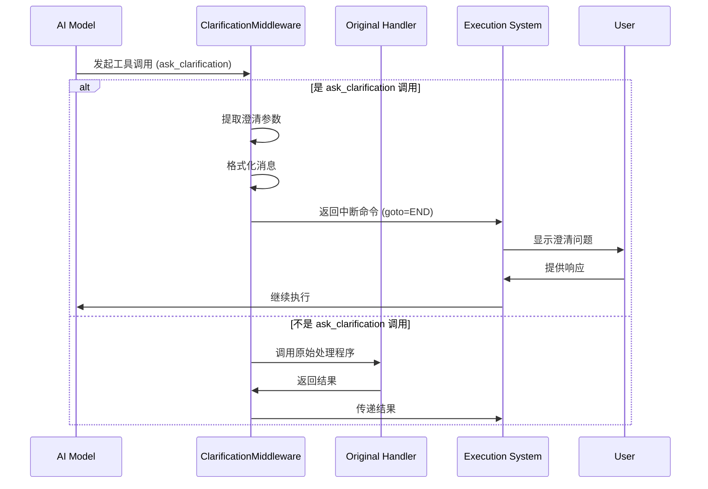

# Clarification Middleware 模块文档

## 1. 模块概述

`clarification_middleware` 模块是一个专门用于拦截和处理模型澄清请求的中间件组件。它的核心功能是当 AI 模型调用 `ask_clarification` 工具时，中断当前的执行流程，将格式化后的澄清问题呈现给用户，并等待用户的响应后再继续执行。

### 设计目的
该模块的设计旨在替代传统的基于工具的澄清方式，通过中断执行流程并直接呈现澄清问题，提供了更直观和用户友好的交互体验。它能够将模型的澄清请求从后台处理转变为前台的交互式对话，让用户能够更清晰地理解和响应模型的需求。

## 2. 核心组件详解

### 2.1 ClarificationMiddlewareState

```python
class ClarificationMiddlewareState(AgentState):
    """Compatible with the `ThreadState` schema."""

    pass
```

**功能说明**：
`ClarificationMiddlewareState` 是一个状态类，继承自 `AgentState`。它的主要作用是定义中间件的状态结构，并确保与 `ThreadState` 模式兼容。该类目前是一个空实现，主要用于类型注解和状态管理的兼容性。

### 2.2 ClarificationMiddleware

`ClarificationMiddleware` 是本模块的核心类，负责实际的澄清请求拦截和处理工作。

#### 核心特性
- 继承自 `AgentMiddleware[ClarificationMiddlewareState]`，是一个类型化的代理中间件
- 实现了同步和异步两种工具调用包装方法
- 提供了中文检测、消息格式化等辅助功能

#### 主要方法详解

##### 2.2.1 _is_chinese

```python
def _is_chinese(self, text: str) -> bool:
    """Check if text contains Chinese characters.

    Args:
        text: Text to check

    Returns:
        True if text contains Chinese characters
    """
    return any("\u4e00" <= char <= "\u9fff" for char in text)
```

**功能说明**：
该方法用于检测文本中是否包含中文字符。它通过检查文本中的每个字符是否位于 Unicode 中文编码范围内（`\u4e00` 到 `\u9fff`）来实现。

**参数**：
- `text` (str)：需要检查的文本

**返回值**：
- `bool`：如果文本包含中文字符则返回 `True`，否则返回 `False`

##### 2.2.2 _format_clarification_message

```python
def _format_clarification_message(self, args: dict) -> str:
    """Format the clarification arguments into a user-friendly message.

    Args:
        args: The tool call arguments containing clarification details

    Returns:
        Formatted message string
    """
    question = args.get("question", "")
    clarification_type = args.get("clarification_type", "missing_info")
    context = args.get("context")
    options = args.get("options", [])

    # Type-specific icons
    type_icons = {
        "missing_info": "❓",
        "ambiguous_requirement": "🤔",
        "approach_choice": "🔀",
        "risk_confirmation": "⚠️",
        "suggestion": "💡",
    }

    icon = type_icons.get(clarification_type, "❓")

    # Build the message naturally
    message_parts = []

    # Add icon and question together for a more natural flow
    if context:
        # If there's context, present it first as background
        message_parts.append(f"{icon} {context}")
        message_parts.append(f"\n{question}")
    else:
        # Just the question with icon
        message_parts.append(f"{icon} {question}")

    # Add options in a cleaner format
    if options and len(options) > 0:
        message_parts.append("")  # blank line for spacing
        for i, option in enumerate(options, 1):
            message_parts.append(f"  {i}. {option}")

    return "\n".join(message_parts)
```

**功能说明**：
该方法负责将澄清工具调用的参数格式化为用户友好的消息。它会根据澄清类型选择合适的图标，并将上下文、问题和选项组织成自然的消息格式。

**参数**：
- `args` (dict)：包含澄清详细信息的工具调用参数，可能包含以下键：
  - `question`：澄清问题
  - `clarification_type`：澄清类型，用于选择合适的图标
  - `context`：澄清的背景上下文
  - `options`：可选的选项列表

**返回值**：
- `str`：格式化后的消息字符串

##### 2.2.3 _handle_clarification

```python
def _handle_clarification(self, request: ToolCallRequest) -> Command:
    """Handle clarification request and return command to interrupt execution.

    Args:
        request: Tool call request

    Returns:
        Command that interrupts execution with the formatted clarification message
    """
    # Extract clarification arguments
    args = request.tool_call.get("args", {})
    question = args.get("question", "")

    print("[ClarificationMiddleware] Intercepted clarification request")
    print(f"[ClarificationMiddleware] Question: {question}")

    # Format the clarification message
    formatted_message = self._format_clarification_message(args)

    # Get the tool call ID
    tool_call_id = request.tool_call.get("id", "")

    # Create a ToolMessage with the formatted question
    # This will be added to the message history
    tool_message = ToolMessage(
        content=formatted_message,
        tool_call_id=tool_call_id,
        name="ask_clarification",
    )

    # Return a Command that:
    # 1. Adds the formatted tool message
    # 2. Interrupts execution by going to __end__
    # Note: We don't add an extra AIMessage here - the frontend will detect
    # and display ask_clarification tool messages directly
    return Command(
        update={"messages": [tool_message]},
        goto=END,
    )
```

**功能说明**：
该方法是澄清请求的核心处理逻辑。它接收工具调用请求，提取澄清参数，格式化消息，创建工具消息，并返回一个中断执行的命令。

**参数**：
- `request` (ToolCallRequest)：工具调用请求对象

**返回值**：
- `Command`：包含更新后的消息和中断执行指令的命令对象

**工作流程**：
1. 从工具调用请求中提取澄清参数和问题
2. 使用 `_format_clarification_message` 方法格式化消息
3. 获取工具调用 ID
4. 创建包含格式化消息的 `ToolMessage`
5. 返回一个 `Command` 对象，该对象会更新消息历史并将执行流程跳转到 `END`

##### 2.2.4 wrap_tool_call

```python
@override
def wrap_tool_call(
    self,
    request: ToolCallRequest,
    handler: Callable[[ToolCallRequest], ToolMessage | Command],
) -> ToolMessage | Command:
    """Intercept ask_clarification tool calls and interrupt execution (sync version).

    Args:
        request: Tool call request
        handler: Original tool execution handler

    Returns:
        Command that interrupts execution with the formatted clarification message
    """
    # Check if this is an ask_clarification tool call
    if request.tool_call.get("name") != "ask_clarification":
        # Not a clarification call, execute normally
        return handler(request)

    return self._handle_clarification(request)
```

**功能说明**：
这是同步版本的工具调用包装方法。它会检查工具调用是否为 `ask_clarification`，如果是，则拦截并处理；否则，将调用原始的处理程序。

**参数**：
- `request` (ToolCallRequest)：工具调用请求对象
- `handler` (Callable[[ToolCallRequest], ToolMessage | Command])：原始的工具执行处理程序

**返回值**：
- `ToolMessage | Command`：如果是澄清请求，返回中断执行的命令；否则返回原始处理程序的结果

##### 2.2.5 awrap_tool_call

```python
@override
async def awrap_tool_call(
    self,
    request: ToolCallRequest,
    handler: Callable[[ToolCallRequest], ToolMessage | Command],
) -> ToolMessage | Command:
    """Intercept ask_clarification tool calls and interrupt execution (async version).

    Args:
        request: Tool call request
        handler: Original tool execution handler (async)

    Returns:
        Command that interrupts execution with the formatted clarification message
    """
    # Check if this is an ask_clarification tool call
    if request.tool_call.get("name") != "ask_clarification":
        # Not a clarification call, execute normally
        return await handler(request)

    return self._handle_clarification(request)
```

**功能说明**：
这是异步版本的工具调用包装方法，功能与 `wrap_tool_call` 相同，但支持异步操作。

**参数**：
- `request` (ToolCallRequest)：工具调用请求对象
- `handler` (Callable[[ToolCallRequest], ToolMessage | Command])：原始的工具执行处理程序（异步）

**返回值**：
- `ToolMessage | Command`：如果是澄清请求，返回中断执行的命令；否则返回原始处理程序的结果

## 3. 工作原理与架构

### 3.1 工作流程



### 3.2 架构说明

`ClarificationMiddleware` 作为 LangChain 代理系统中的一个中间件组件，位于代理执行流程的中间层。它的主要职责是拦截特定的工具调用，并在需要时中断执行流程。

该中间件与系统的其他部分协作如下：
- 与 `agent_memory_and_thread_context` 模块中的状态管理组件协作，确保状态兼容性
- 作为 `agent_execution_middlewares` 模块的一部分，与其他中间件一起构成代理执行的中间件链
- 与前端系统协作，确保澄清问题能够正确显示给用户

## 4. 使用指南

### 4.1 基本使用

要使用 `ClarificationMiddleware`，您需要将其添加到代理的中间件列表中：

```python
from langchain.agents import create_react_agent, AgentExecutor
from your_agent_module import tools, prompt
from backend.src.agents.middlewares.clarification_middleware import ClarificationMiddleware

# 创建代理
agent = create_react_agent(llm, tools, prompt)

# 创建代理执行器并添加中间件
agent_executor = AgentExecutor(agent=agent, tools=tools)
agent_executor.middlewares.append(ClarificationMiddleware())

# 使用代理执行器
result = agent_executor.invoke({"input": "您的问题"})
```

### 4.2 配置选项

目前，`ClarificationMiddleware` 不需要额外的配置选项。它会自动检测并处理 `ask_clarification` 工具调用。

### 4.3 扩展开发

如果您需要扩展 `ClarificationMiddleware` 的功能，可以考虑以下方向：

1. **自定义消息格式化**：重写 `_format_clarification_message` 方法以支持不同的消息格式
2. **添加新的澄清类型**：扩展 `type_icons` 字典以支持更多的澄清类型
3. **集成额外的处理逻辑**：在 `_handle_clarification` 方法中添加更多的处理步骤，例如日志记录、分析等

示例扩展：

```python
class CustomClarificationMiddleware(ClarificationMiddleware):
    def _format_clarification_message(self, args: dict) -> str:
        # 自定义格式化逻辑
        question = args.get("question", "")
        return f"🤖 模型需要澄清：{question}"
    
    def _handle_clarification(self, request: ToolCallRequest) -> Command:
        # 添加自定义日志
        print(f"[CustomClarificationMiddleware] 处理澄清请求: {request}")
        # 调用父类方法
        return super()._handle_clarification(request)
```

## 5. 注意事项与限制

### 5.1 注意事项

1. **工具名称依赖**：该中间件严格依赖于工具名称 `ask_clarification`。如果模型调用的工具名称不同，中间件将不会拦截。

2. **前端集成**：前端需要能够正确识别和显示 `ask_clarification` 类型的工具消息，否则用户将无法看到澄清问题。

3. **状态兼容性**：确保 `ClarificationMiddlewareState` 与您的代理状态架构兼容，特别是在使用自定义状态时。

### 5.2 限制

1. **单工具处理**：目前该中间件只处理 `ask_clarification` 工具，不支持其他类型的澄清工具。

2. **固定中断行为**：该中间件总是通过跳转到 `END` 来中断执行，不提供其他中断策略。

3. **有限的格式化选项**：消息格式化逻辑是硬编码的，虽然支持不同的澄清类型，但自定义格式化的能力有限。

## 6. 相关模块参考

- [agent_memory_and_thread_context](agent_memory_and_thread_context.md)：提供状态管理和线程上下文功能
- [agent_execution_middlewares](agent_execution_middlewares.md)：包含其他代理执行中间件
- [frontend_core_domain_types_and_state](frontend_core_domain_types_and_state.md)：前端相关的类型和状态定义，与澄清消息的显示相关
