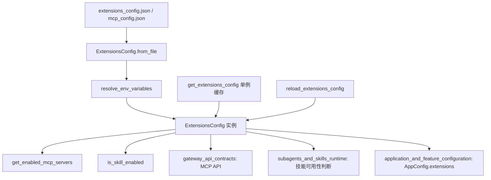
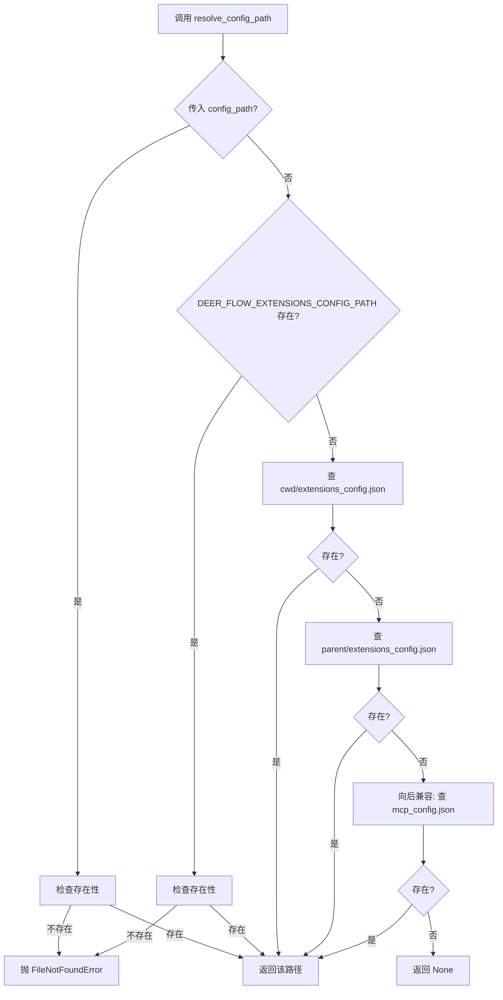
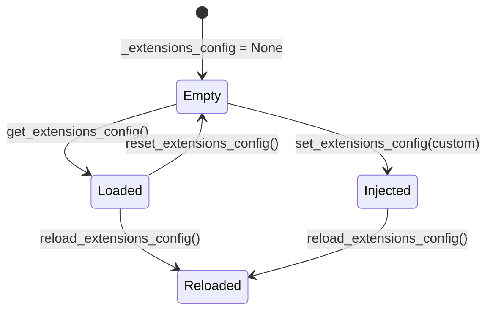
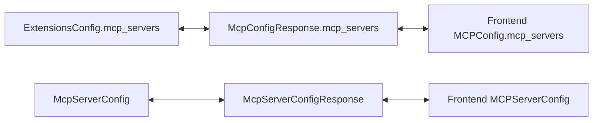
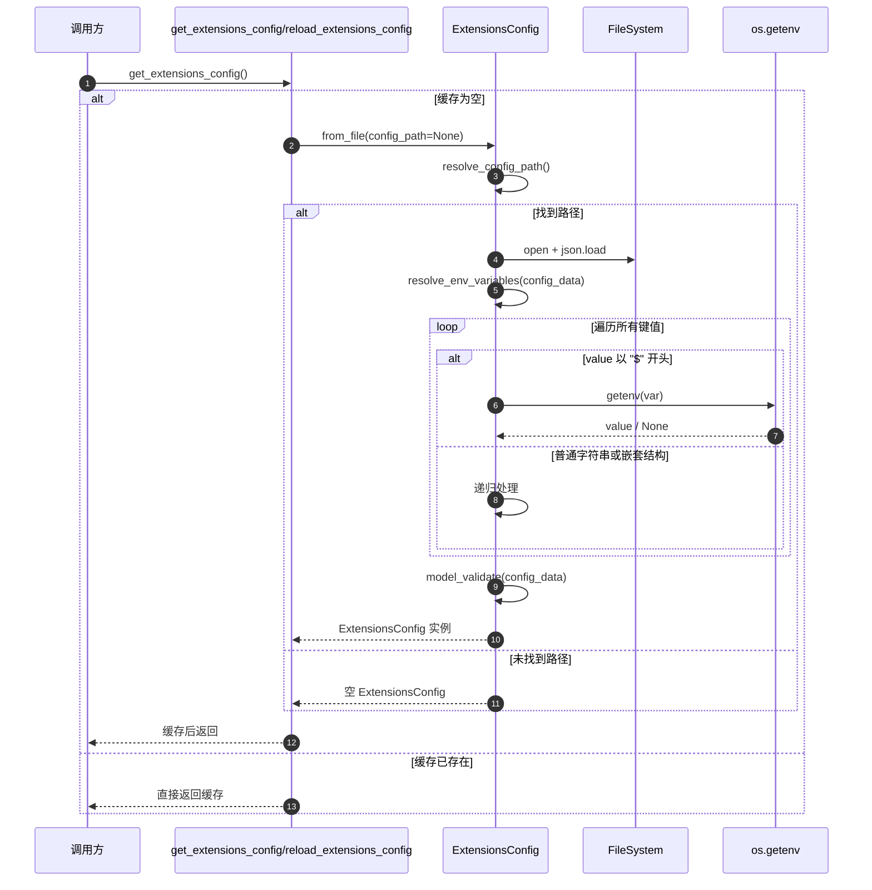
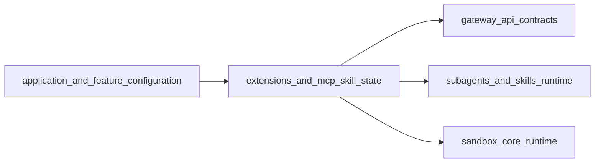

# extensions_and_mcp_skill_state 模块文档

## 模块简介

`extensions_and_mcp_skill_state` 是应用配置域中专门负责“扩展能力开关”的模块，它将两类常见但生命周期不同的配置统一收口到同一个模型中：一类是 MCP（Model Context Protocol）服务器连接配置，另一类是技能（skills）启用状态配置。这个模块存在的意义，是把“扩展接入细节”和“技能可用性策略”从主配置 `config.yaml` 中拆分出来，放入可独立热更新、可单独持久化的 JSON 配置文件，从而降低运行时配置耦合度。

从系统视角看，该模块是一个桥接层：上游承接文件系统与环境变量，下游输出结构化、可校验的 Pydantic 配置对象，供 API 层、运行时调度层和技能系统使用。相比把这类信息散落在不同配置文件中，这种统一设计能减少“配置漂移”和“更新覆盖冲突”，尤其适合 MCP 服务器经常增删、技能开关需要频繁调整的场景。

---

## 在整体系统中的位置与职责边界



该模块不直接负责 MCP 连接建立，也不直接执行技能代码；它的核心职责是“配置表达与读取”。连接创建、工具注入、技能执行分别由其他运行时模块负责。换句话说，这个模块决定“允许什么”，而不是“如何执行”。

如需了解其上下游细节，建议结合阅读：
- [application_and_feature_configuration.md](application_and_feature_configuration.md)
- [mcp_router.md](mcp_router.md)
- [skills_and_subagents_configuration.md](skills_and_subagents_configuration.md)
- [subagents_and_skills_runtime.md](subagents_and_skills_runtime.md)

---

## 核心数据模型

## `McpServerConfig`

`McpServerConfig` 描述单个 MCP server 的连接与行为参数。模型使用 `ConfigDict(extra="allow")`，这意味着在保留核心字段校验的同时，允许携带额外字段，方便适配不同 MCP 实现的扩展参数。

### 字段说明

- `enabled: bool = True`：是否启用该 MCP server。
- `type: str = "stdio"`：传输类型，语义上支持 `stdio` / `sse` / `http`。
- `command: str | None`：`stdio` 模式下启动 server 的命令。
- `args: list[str]`：启动命令参数。
- `env: dict[str, str]`：注入 MCP 进程的环境变量。
- `url: str | None`：`sse` 或 `http` 模式下的服务地址。
- `headers: dict[str, str]`：HTTP/SSE 请求头。
- `description: str`：给人看的用途描述。
- `extra fields`：任意额外键值（因为 `extra="allow"`）。

### 行为与约束说明

这个模型本身不做“跨字段一致性校验”。例如它不会强制 `type=stdio` 时 `command` 必填，也不会强制 `type=http` 时 `url` 必填。这种设计把协议一致性检查留给消费端（例如连接器或 API 校验层）。优点是兼容性强，缺点是错误可能延后到运行期暴露。

---

## `SkillStateConfig`

`SkillStateConfig` 是极简模型，目前只定义：

- `enabled: bool = True`

它表达的是“某技能是否可用”的状态位。这个设计刻意保持最小化，使技能开关逻辑稳定、可预测；后续如需增加灰度策略、权限标签、配额限制，可在该模型上扩展。

---

## `ExtensionsConfig`

`ExtensionsConfig` 是本模块的聚合根模型，统一管理 MCP servers 与 skills 两类配置。

### 字段

- `mcp_servers: dict[str, McpServerConfig]`
  - 使用 `alias="mcpServers"`，可兼容驼峰 JSON 键。
- `skills: dict[str, SkillStateConfig]`

模型配置为 `ConfigDict(extra="allow", populate_by_name=True)`：
- `extra="allow"` 允许顶层未知字段透传，保证向前兼容。
- `populate_by_name=True` 允许 `mcp_servers` 与 `mcpServers` 两种键名都可被反序列化。

### 关键方法详解

### `resolve_config_path(config_path: str | None = None) -> Path | None`

该方法负责解析扩展配置文件路径，并实现“可选配置”策略。



路径优先级：
1. 显式参数 `config_path`
2. 环境变量 `DEER_FLOW_EXTENSIONS_CONFIG_PATH`
3. `cwd/parent` 下 `extensions_config.json`
4. 兼容旧文件名 `mcp_config.json`
5. 都没有则返回 `None`

返回 `None` 的语义很关键：表示“扩展配置是可选能力”，系统可在无扩展文件时正常启动。

### `from_file(config_path: str | None = None) -> ExtensionsConfig`

流程为：路径解析 -> JSON 读取 -> 环境变量替换 -> Pydantic 校验。

当路径为 `None`（文件不存在）时，返回空配置：

```python
ExtensionsConfig(mcp_servers={}, skills={})
```

这保证了调用方始终拿到对象，不必到处判空。

### `resolve_env_variables(config: dict[str, Any]) -> dict[str, Any]`

该方法递归解析字典中的字符串值：
- 若字符串以 `$` 开头，视为环境变量引用，例如 `$OPENAI_API_KEY`
- 若变量不存在，抛出 `ValueError`
- 支持嵌套字典与列表中的字典项

注意它是**原地修改**传入字典（in-place mutation）。调用方若复用原始字典对象，需要知道它会被替换成实际值。

### `get_enabled_mcp_servers() -> dict[str, McpServerConfig]`

返回所有 `enabled=True` 的 MCP servers，常用于运行时初始化时做过滤，避免下游再遍历判断。

### `is_skill_enabled(skill_name: str, skill_category: str) -> bool`

技能开关策略如下：
- 如果 `skills` 中有该技能名，返回显式配置值。
- 如果没有配置，默认规则是：`public` 和 `custom` 分类默认启用，其他分类默认禁用。

这是一种“白名单分类默认放行”的策略，既保持可用性，也限制未知分类自动放开。

---

## 模块级单例与生命周期管理

除了类模型，本模块还提供全局缓存实例 `_extensions_config` 及四个操作函数。



### `get_extensions_config()`

惰性加载单例。首次调用时读取文件，后续直接复用缓存，减少 I/O 和反序列化开销。

### `reload_extensions_config(config_path=None)`

强制重新读取文件并替换缓存。适用于配置文件被 API 更新后即时生效。

### `reset_extensions_config()`

清空缓存，下一次 `get_extensions_config()` 会重新加载。测试场景尤其有用。

### `set_extensions_config(config)`

手动注入配置对象，常用于单元测试/集成测试中的 mock。

---

## 配置格式与使用示例

### 典型 `extensions_config.json`

```json
{
  "mcpServers": {
    "github": {
      "enabled": true,
      "type": "stdio",
      "command": "npx",
      "args": ["-y", "@modelcontextprotocol/server-github"],
      "env": {
        "GITHUB_PERSONAL_ACCESS_TOKEN": "$GITHUB_TOKEN"
      },
      "description": "GitHub integration"
    },
    "knowledge_base": {
      "enabled": true,
      "type": "http",
      "url": "https://example.com/mcp",
      "headers": {
        "Authorization": "Bearer $MCP_API_TOKEN"
      },
      "description": "Internal KB MCP"
    }
  },
  "skills": {
    "web_search": { "enabled": true },
    "internal_audit": { "enabled": false }
  }
}
```

### Python 使用示例

```python
from backend.src.config.extensions_config import (
    get_extensions_config,
    reload_extensions_config,
)

# 读取（带缓存）
ext_cfg = get_extensions_config()

# 仅获取启用的 MCP servers
enabled_servers = ext_cfg.get_enabled_mcp_servers()

# 判断技能是否启用
if ext_cfg.is_skill_enabled("web_search", "public"):
    print("skill enabled")

# 当外部改动了配置文件后，主动重载
ext_cfg = reload_extensions_config()
```

### 与 `AppConfig` 的组合

`AppConfig.from_file()` 会单独调用 `ExtensionsConfig.from_file()` 并把结果写入 `config_data["extensions"]`，这意味着扩展配置独立于 `config.yaml` 管理，但在应用对象中仍可统一访问。

---

## 与 API 契约和前端类型的对应关系

在网关层，MCP 相关 API 模型 `McpConfigResponse / McpConfigUpdateRequest / McpServerConfigResponse` 与本模块字段基本同构，便于直接互转。前端 `MCPConfig` 与 `MCPServerConfig` 也与后端保持结构兼容。



这种“同构模型”策略减少了 DTO 映射复杂度，但也要求前后端在字段语义上保持同步演进。

---

## 边界条件、错误场景与运行注意事项

### 路径与文件相关

- 显式路径或环境变量路径一旦指定且文件不存在，会直接抛 `FileNotFoundError`，而不是回退。
- 未指定路径时文件缺失不会报错，而是返回空配置（可选特性设计）。
- 路径解析依赖 `os.getcwd()`，不同启动目录下可能命中不同配置文件。

### 环境变量相关

- 仅处理以 `$` 开头的字符串；形如 `prefix_$TOKEN` 不会被插值。
- 变量缺失会抛 `ValueError` 并中断加载。
- `resolve_env_variables` 会修改原字典，若调用方还要保留模板值，应先深拷贝。

### 模型校验与语义风险

- `type` 目前是普通字符串字段，没有枚举约束，非法值会通过模型校验，但在运行时可能失败。
- `command/url` 没有按 `type` 做条件必填校验，需消费端补充。
- `extra="allow"` 提高扩展性，但也可能掩盖拼写错误字段（例如 `commnad`）。

### 全局缓存与并发

- 模块级缓存是进程内全局变量，不包含锁语义；在高并发热更新下理论上有短暂读写竞态窗口。
- 多进程部署下每个进程缓存独立，更新文件后需确保各进程都执行 reload（或重启）。

---

## 扩展建议

如果需要增强可维护性，建议优先做以下演进：

1. 为 `McpServerConfig.type` 引入 `Literal["stdio", "sse", "http"]`，把错误提前到配置加载阶段。
2. 增加跨字段校验（例如 `type=stdio` 要求 `command`，`type in {http,sse}` 要求 `url`）。
3. 为 `skills` 引入分层开关策略（全局默认、分类默认、单技能覆盖）。
4. 若热更新频繁，可增加文件监听与原子替换策略，并为单例访问增加线程安全保护。

---

## 内部调用关系与执行过程（代码级视角）

下面的流程图把 `from_file()`、环境变量解析和单例缓存串起来，便于理解“谁在什么时候做了什么”。



这条链路有一个非常实际的工程意义：配置文件解析和环境变量替换只在“加载时”发生，而不是每次读取配置都发生，因此运行时读取开销极低。代价是如果外部环境变量在进程生命周期内变化，模块不会自动感知，必须触发 `reload_extensions_config()` 才会重新绑定。

## 关键函数行为矩阵

为了减少维护时的认知负担，可以把模块内函数按“输入、输出、失败方式、副作用”来理解。

| 函数 | 主要输入 | 主要输出 | 失败方式 | 副作用 |
|---|---|---|---|---|
| `resolve_config_path` | 可选 `config_path` | `Path` 或 `None` | `FileNotFoundError` | 无 |
| `from_file` | 可选 `config_path` | `ExtensionsConfig` | `FileNotFoundError` / `JSONDecodeError` / `ValueError` / `ValidationError` | 读取文件 |
| `resolve_env_variables` | `dict[str, Any]` | 同一对象（已替换） | `ValueError`（变量缺失） | **原地修改入参** |
| `get_enabled_mcp_servers` | 当前实例 | 过滤后的 `dict` | 无 | 无 |
| `is_skill_enabled` | `skill_name`, `skill_category` | `bool` | 无 | 无 |
| `get_extensions_config` | 无 | 缓存或新加载实例 | 同 `from_file` 可能抛出的异常 | 读写模块级缓存 |
| `reload_extensions_config` | 可选 `config_path` | 新实例 | 同 `from_file` | 覆盖模块级缓存 |
| `reset_extensions_config` | 无 | `None` | 无 | 清空缓存 |
| `set_extensions_config` | `ExtensionsConfig` | `None` | 无 | 覆盖缓存 |

这里最值得注意的是 `resolve_env_variables` 的“原地修改语义”以及单例缓存函数的“全局状态语义”。前者影响数据复用安全，后者影响测试隔离和并发一致性。

## 与相邻模块的契约边界

`extensions_and_mcp_skill_state` 只负责“配置真值”，不会承担 API DTO 适配、连接管理或技能执行。实践中建议把它当作配置源模块来使用，并让下游模块明确承担各自校验。



和 `gateway_api_contracts.md` 的关系是：网关层通常会把当前 MCP 配置暴露给前端或接收更新请求，但“文件落盘与重载策略”不在该模块内。和 `subagents_and_skills_runtime.md` 的关系是：该模块提供技能开关真值，而具体某个技能在调度阶段如何被屏蔽、如何反馈给用户，属于运行时策略。

## 典型运维与测试实践

在生产环境中，推荐把 `DEER_FLOW_EXTENSIONS_CONFIG_PATH` 固定到部署目录中的绝对路径，避免 `cwd` 漂移导致命中错误文件。配置文件更新后，应通过管理接口或管理脚本触发 `reload_extensions_config()`，不要仅替换文件却不通知进程重载。

在测试环境中，推荐每个测试用例开始前调用 `reset_extensions_config()`，结束时再清理一次，以避免跨用例污染。若希望完全隔离文件系统依赖，可以直接构造 `ExtensionsConfig(...)` 并通过 `set_extensions_config()` 注入。

```python
from backend.src.config.extensions_config import (
    ExtensionsConfig,
    McpServerConfig,
    SkillStateConfig,
    set_extensions_config,
    reset_extensions_config,
)

def setup_test_config():
    cfg = ExtensionsConfig(
        mcp_servers={
            "demo": McpServerConfig(enabled=True, type="http", url="http://localhost:8080")
        },
        skills={
            "web_search": SkillStateConfig(enabled=False)
        },
    )
    set_extensions_config(cfg)


def teardown_test_config():
    reset_extensions_config()
```

## 已知限制与可演进方向

当前实现在“灵活性优先”上做得很好，但也意味着一些约束被下放到调用方。具体来说，`McpServerConfig.type` 没有强枚举、`command/url` 没有条件必填校验、`extra=allow` 允许拼写错误悄悄通过，这些都可能让错误从“配置加载时”延后到“运行时连接阶段”。如果系统进入稳定期并追求更强健性，建议逐步收紧校验，并在网关更新接口引入预检流程，实现“写入前失败”。

---

## 小结

`extensions_and_mcp_skill_state` 模块的核心价值不是“功能复杂”，而是“配置治理到位”：它把 MCP 连接参数和技能启停策略统一为强类型配置对象，提供明确的路径解析规则、环境变量注入机制和缓存生命周期控制，同时保留足够扩展弹性，支撑扩展生态在不改动主配置结构的前提下持续演进。
