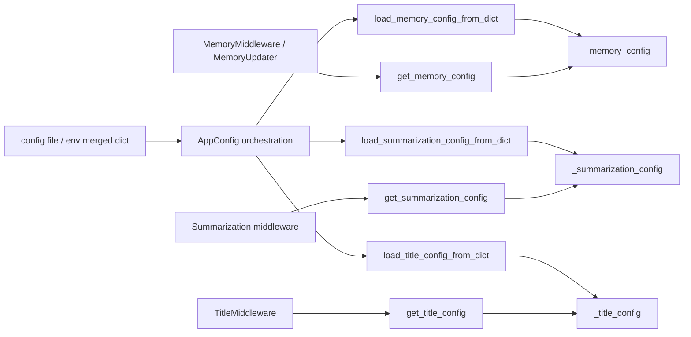
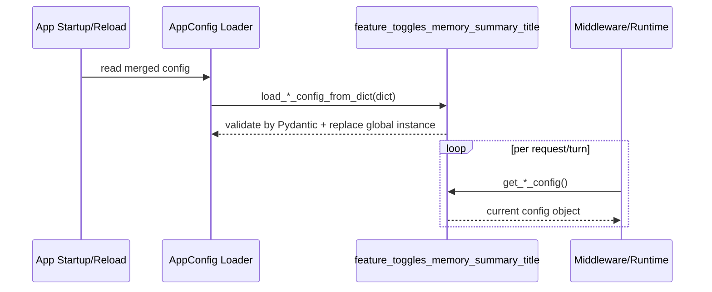
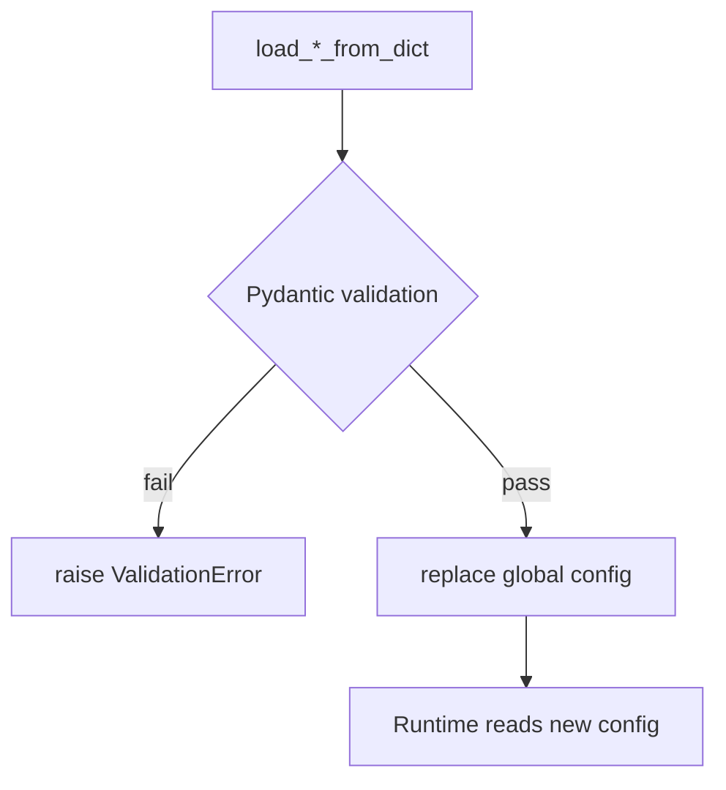

# feature_toggles_memory_summary_title 模块文档

## 模块简介与设计目标

`feature_toggles_memory_summary_title` 是应用配置层（`application_and_feature_configuration`）中专门负责三类“会话增强能力”开关与参数治理的子模块：`memory`（记忆）、`summarization`（自动总结）和 `title`（自动标题）。

这个模块的价值不在于直接处理对话消息，而在于定义**可校验、可统一加载、可运行时读取**的配置契约。换句话说，它是系统的控制面（Control Plane）组件，负责回答“功能是否启用、用哪个模型、阈值是多少”；真正执行这些功能的逻辑位于中间件与运行时管线，例如 [memory_pipeline.md](memory_pipeline.md)、[title_lifecycle.md](title_lifecycle.md)、[agent_execution_middlewares.md](agent_execution_middlewares.md)。

从工程角度看，这种设计解决了三个常见问题：其一，避免配置分散在多个逻辑文件里导致默认值漂移；其二，利用 Pydantic 在加载阶段尽早拦截非法配置；其三，为灰度发布和降级策略提供稳定的 feature toggle 接口。

---

## 模块边界与系统定位



上图说明了本模块典型生命周期：配置在应用启动（或重载）时写入全局配置实例，业务组件在执行过程中读取当前配置。它本身不持有请求上下文、不处理消息内容、不访问数据库；它只维护配置对象及其加载/替换接口。

如果你需要理解“配置来源如何拼装并分发”，请参考 [app_config_orchestration.md](app_config_orchestration.md)。如果你需要理解“配置如何影响执行行为”，请参考 [memory_pipeline.md](memory_pipeline.md) 与 [title_lifecycle.md](title_lifecycle.md)。

---

## 核心组件详解

## `MemoryConfig`

`MemoryConfig` 定义全局记忆机制的策略边界，覆盖启停、存储、更新节流、事实筛选、提示词注入预算等关键参数。它继承 `pydantic.BaseModel`，实例化或从 dict 加载时会进行类型与范围校验。

### 字段语义

- `enabled: bool = True`：记忆能力总开关。关闭后，依赖该配置的记忆相关中间件/更新逻辑通常会短路。
- `storage_path: str = ""`：记忆存储路径。空值时使用 `Paths.memory_file`；相对路径按 `Paths.base_dir` 解析，而非进程当前工作目录。
- `debounce_seconds: int = 30`，范围 `1..300`：记忆更新去抖窗口，避免高频写入。
- `model_name: str | None = None`：记忆提取/更新模型；`None` 表示使用系统默认模型策略。
- `max_facts: int = 100`，范围 `10..500`：事实存储上限。
- `fact_confidence_threshold: float = 0.7`，范围 `0.0..1.0`：事实入库最低置信度。
- `injection_enabled: bool = True`：是否将记忆内容注入 system prompt。
- `max_injection_tokens: int = 2000`，范围 `100..8000`：记忆注入 token 上限。

### 设计细节与副作用

`storage_path` 的说明里有一个非常重要的迁移提示：历史上若曾配置 `.deer-flow/memory.json`，现在该相对路径会被解释为 `{base_dir}/.deer-flow/memory.json`。如果你发现“记忆似乎丢了”，通常是路径解析位置变化，而不是数据删除。应迁移旧文件或改用绝对路径。

该配置对象本身是纯数据，不执行 I/O；副作用发生在使用它的运行时模块中。

---

## `ContextSize`

`ContextSize` 是总结阈值与保留策略的统一表达结构，由 `type` 和 `value` 组成：

- `type`：`"fraction" | "tokens" | "messages"`
- `value`：`int | float`

它提供 `to_tuple()` 方法，将对象转换为 `(type, value)`，用于兼容某些总结中间件内部采用的 tuple 接口。

### 方法说明

```python
def to_tuple(self) -> tuple[ContextSizeType, int | float]:
    return (self.type, self.value)
```

这是一个纯函数式转换，无副作用，不修改实例状态。

---

## `SummarizationConfig`

`SummarizationConfig` 用于定义自动总结策略，其核心设计点是 `trigger` 支持**单阈值**与**多阈值列表**，从而允许“任一阈值命中就触发”的策略组合。

### 字段语义

- `enabled: bool = False`：自动总结总开关（默认关闭）。
- `model_name: str | None = None`：总结模型；为 `None` 时通常走默认轻量模型策略。
- `trigger: ContextSize | list[ContextSize] | None`：触发条件，支持单值、多值或不设置。
- `keep: ContextSize`：总结后保留上下文策略，默认 `messages=20`。
- `trim_tokens_to_summarize: int | None = 4000`：送入总结前裁剪 token 上限；`None` 表示不裁剪。
- `summary_prompt: str | None = None`：自定义总结 prompt，空值时使用框架默认 prompt。

### 运行语义补充

`trigger` 的多阈值设计可以提高跨模型稳定性。例如同时配置 `messages=60` 和 `fraction=0.8`，在不同上下文窗口模型下都能维持可预期触发点。需要注意的是，该模块只校验结构与基础类型，不对 `fraction` 的业务合理性（如是否在 0~1）做强约束，这类约束可能在执行层才体现。

---

## `TitleConfig`

`TitleConfig` 控制自动标题生成策略，目标是让线程标题既简洁又可控。

### 字段语义

- `enabled: bool = True`：标题自动生成开关。
- `max_words: int = 6`，范围 `1..20`：标题最多单词数。
- `max_chars: int = 60`，范围 `10..200`：标题最多字符数。
- `model_name: str | None = None`：标题生成模型。
- `prompt_template: str`：标题生成模板，默认模板要求“只返回标题，不附解释”。

### 模板注意事项

模板会在运行时通过 `format()` 注入变量（如 `max_words`, `user_msg`, `assistant_msg`）。如果模板含有未提供占位符，会在运行时抛格式化异常，进而触发标题生成失败或降级逻辑。标题生成流程细节见 [title_lifecycle.md](title_lifecycle.md)。

---

## 全局配置访问 API（函数级别）

三个文件遵循相同模式：

1. 定义 `BaseModel` 配置类
2. 创建模块级全局实例 `_xxx_config`
3. 暴露 `get_* / set_* / load_*_from_dict` 三类函数



### 函数行为说明（以 memory 为例，另外两个同构）

- `get_memory_config() -> MemoryConfig`：返回当前全局配置对象引用；无输入、无直接副作用。
- `set_memory_config(config: MemoryConfig) -> None`：将全局配置替换为传入实例；副作用是影响后续所有读取者。
- `load_memory_config_from_dict(config_dict: dict) -> None`：先执行 `MemoryConfig(**config_dict)` 校验，再替换全局实例；非法配置会抛 `ValidationError`。

`summarization` 与 `title` 的三类函数行为完全一致，仅配置类型不同。

---

## 典型配置与使用示例

### 配置文件示例

```yaml
memory:
  enabled: true
  storage_path: ""
  debounce_seconds: 20
  model_name: "gpt-4o-mini"
  max_facts: 150
  fact_confidence_threshold: 0.75
  injection_enabled: true
  max_injection_tokens: 1800

summarization:
  enabled: true
  model_name: "gpt-4o-mini"
  trigger:
    - type: messages
      value: 60
    - type: fraction
      value: 0.8
  keep:
    type: messages
    value: 24
  trim_tokens_to_summarize: 5000
  summary_prompt: null

title:
  enabled: true
  max_words: 8
  max_chars: 72
  model_name: "gpt-4o-mini"
  prompt_template: "Generate a concise title (max {max_words} words) for this conversation.\nUser: {user_msg}\nAssistant: {assistant_msg}\n\nReturn ONLY the title."
```

### 运行时热切换示例

```python
from backend.src.config.memory_config import get_memory_config, set_memory_config

cfg = get_memory_config().model_copy()
cfg.enabled = False
set_memory_config(cfg)
```

这类代码适合测试、实验或应急降级。生产环境建议通过统一配置重载入口进行治理，避免多处无序写入全局状态（参见 [app_config_orchestration.md](app_config_orchestration.md)）。

---

## 约束、异常与运维注意事项



本模块最主要的错误入口是配置加载阶段的 Pydantic 校验。例如：

- `debounce_seconds=0` 会因 `< 1` 失败
- `max_words=100` 会因超上限失败
- `fact_confidence_threshold=1.2` 会因超范围失败

除此之外，还有几类高频“坑点”：

- 全局实例是可替换共享状态，模块本身不提供锁；如果系统中存在高频并发写配置，需要上层治理同步策略。
- `ContextSize.value` 与 `type` 的组合合理性并未在本模块全面约束，策略错误可能延后到执行层暴露。
- `storage_path` 的相对路径基于 `Paths.base_dir`，不是当前工作目录。排查路径问题时应优先核对 [path_resolution_and_fs_security.md](path_resolution_and_fs_security.md)。
- `TitleConfig.prompt_template` 自定义错误会在格式化阶段触发异常，建议发布前做模板静态检查。

---

## 扩展与演进建议

如果后续要新增类似能力（例如新的会话增强开关），建议保持与本模块一致的模式：`BaseModel + 全局实例 + get/set/load + AppConfig 接入`。这样可以获得一致的可维护性，并减少对运行时模块的侵入改造。

扩展时优先保证三点：默认值稳定、字段语义清晰、失败方式可预期（尽量在加载阶段失败）。这比“运行时兜底猜测”更容易定位问题，也更适合多环境发布。
