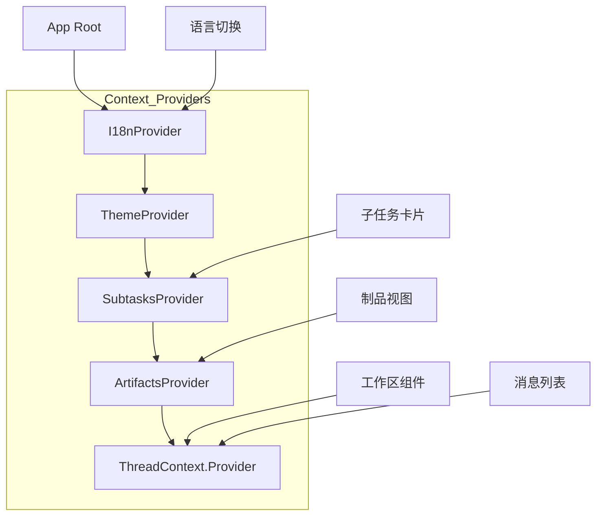
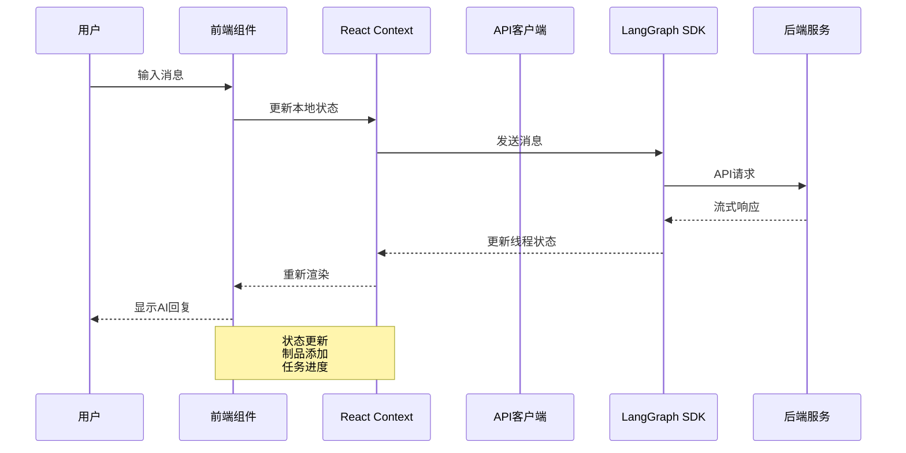

# 前端模块文档

## 概述

DeerFlow 前端是一个基于现代 React 技术栈构建的 AI 协作界面，提供了简洁、直观的用户体验，用于与 AI 代理进行对话、管理任务、处理文件和协作文档。

### 核心特性

- **现代化架构**：使用 Next.js 16 与 App Router，支持服务器端渲染和静态生成
- **AI 集成**：深度集成 LangGraph SDK 和 Vercel AI Elements，提供流畅的 AI 交互体验
- **可扩展设计**：模块化的组件架构，支持技能、MCP 服务器、记忆系统等插件
- **多语言支持**：内置国际化系统，支持多语言切换
- **响应式 UI**：基于 Tailwind CSS 4 的响应式设计，适配各种设备

### 技术栈

- **框架**：Next.js 16（App Router）
- **UI 库**：React 19、Tailwind CSS 4、Shadcn UI、MagicUI
- **AI 集成**：LangGraph SDK、Vercel AI Elements
- **状态管理**：React Context API
- **构建工具**：Turbopack、pnpm

## 目录结构

```
frontend/
├── src/
│   ├── app/                    # Next.js App Router 页面
│   │   ├── api/                # API 路由
│   │   ├── workspace/          # 工作区主页面
│   │   └── mock/               # 演示页面
│   ├── components/             # React 组件
│   │   ├── ui/                 # 可复用 UI 组件
│   │   ├── workspace/          # 工作区特定组件
│   │   ├── landing/            # 登录页面组件
│   │   └── ai-elements/        # AI 相关 UI 元素
│   ├── core/                   # 核心业务逻辑
│   │   ├── api/                # API 客户端和数据获取
│   │   ├── artifacts/          # 制品管理
│   │   ├── config/             # 应用配置
│   │   ├── i18n/               # 国际化
│   │   ├── mcp/                # MCP 集成
│   │   ├── messages/           # 消息处理
│   │   ├── models/             # 数据模型和类型
│   │   ├── settings/           # 用户设置
│   │   ├── skills/             # 技能系统
│   │   ├── threads/            # 线程管理
│   │   ├── todos/              # 待办系统
│   │   └── utils/              # 工具函数
│   ├── hooks/                  # 自定义 React 钩子
│   ├── lib/                    # 共享库和工具
│   ├── server/                 # 服务端代码
│   └── styles/                 # 全局样式
```

## 核心模块详解

### 1. 线程（Threads）系统

线程系统是对话的核心组织单元，管理着整个 AI 交互会话的状态和消息流。

#### 类型定义

```typescript
import { type BaseMessage } from "@langchain/core/messages";
import type { Thread } from "@langchain/langgraph-sdk";
import type { Todo } from "../todos";

export interface AgentThreadState extends Record<string, unknown> {
  title: string;
  messages: BaseMessage[];
  artifacts: string[];
  todos?: Todo[];
}

export interface AgentThread extends Thread<AgentThreadState> {}

export interface AgentThreadContext extends Record<string, unknown> {
  thread_id: string;
  model_name: string | undefined;
  thinking_enabled: boolean;
  is_plan_mode: boolean;
  subagent_enabled: boolean;
}
```

#### 线程上下文

线程系统通过 `ThreadContext` 提供当前线程的访问和管理：

```typescript
// src/components/workspace/messages/context.ts
export interface ThreadContextType {
  threadId: string;
  thread: UseStream<AgentThreadState>;
}

export function useThread() {
  const context = useContext(ThreadContext);
  if (context === undefined) {
    throw new Error("useThread must be used within a ThreadContext");
  }
  return context;
}
```

#### 工作原理

线程系统基于 LangGraph SDK 构建，使用 `UseStream` hook 来处理实时消息流。每个线程维护一个状态对象，包含标题、消息列表、制品引用和待办事项。

线程状态通过 LangGraph 的状态管理机制进行同步，确保前端和后端状态的一致性。当 AI 生成新消息或更新状态时，这些变更会通过流式传输实时反映在 UI 上。

### 2. 任务（Tasks）系统

任务系统用于管理子代理执行的子任务，提供任务进度跟踪和状态管理。

#### 类型定义

```typescript
import type { AIMessage } from "@langchain/langgraph-sdk";

export interface Subtask {
  id: string;
  status: "in_progress" | "completed" | "failed";
  subagent_type: string;
  description: string;
  latestMessage?: AIMessage;
  prompt: string;
  result?: string;
  error?: string;
}
```

#### 任务上下文

任务系统通过 React Context 管理全局任务状态：

```typescript
export interface SubtaskContextValue {
  tasks: Record<string, Subtask>;
  setTasks: (tasks: Record<string, Subtask>) => void;
}

export function useSubtask(id: string) {
  const { tasks } = useSubtaskContext();
  return tasks[id];
}

export function useUpdateSubtask() {
  const { tasks, setTasks } = useSubtaskContext();
  const updateSubtask = useCallback(
    (task: Partial<Subtask> & { id: string }) => {
      tasks[task.id] = { ...tasks[task.id], ...task } as Subtask;
      if (task.latestMessage) {
        setTasks({ ...tasks });
      }
    },
    [tasks, setTasks],
  );
  return updateSubtask;
}
```

#### 工作原理

任务系统使用键值对存储所有子任务，通过 `useUpdateSubtask` hook 提供部分更新能力。当子代理开始执行任务时，系统会创建一个新的 Subtask 对象并设置状态为 "in_progress"。随着任务的进展，可以更新 latestMessage 字段来显示最新的 AI 消息。任务完成或失败时，相应地更新 status 字段并设置 result 或 error。

### 3. 制品（Artifacts）系统

制品系统用于管理 AI 生成的文件、文档和其他输出，提供文件浏览、选择和预览功能。

#### 制品上下文

```typescript
export interface ArtifactsContextType {
  artifacts: string[];
  setArtifacts: (artifacts: string[]) => void;

  selectedArtifact: string | null;
  autoSelect: boolean;
  select: (artifact: string, autoSelect?: boolean) => void;
  deselect: () => void;

  open: boolean;
  autoOpen: boolean;
  setOpen: (open: boolean) => void;
}
```

#### 功能特性

- **自动选择**：当新制品生成时自动选中显示
- **手动选择**：用户可以手动选择要查看的制品
- **侧边栏集成**：与侧边栏状态联动，提供更好的布局体验
- **静态网站模式**：支持在纯静态环境下的特殊行为

#### 工作原理

制品系统维护一个字符串数组，每个字符串代表一个制品的标识符。当 AI 生成新文件时，这些标识符会被添加到数组中。用户可以选择特定的制品进行查看，系统会自动处理侧边栏的显示状态以优化用户体验。

### 4. 技能（Skills）系统

技能系统允许用户安装、启用和禁用各种 AI 功能扩展，为 AI 代理提供额外的能力。

#### 类型定义

```typescript
export interface Skill {
  name: string;
  description: string;
  category: string;
  license: string;
  enabled: boolean;
}
```

#### API 功能

技能系统提供完整的 CRUD 操作：

```typescript
// 加载可用技能列表
export async function loadSkills() {
  const skills = await fetch(`${getBackendBaseURL()}/api/skills`);
  const json = await skills.json();
  return json.skills as Skill[];
}

// 启用或禁用技能
export async function enableSkill(skillName: string, enabled: boolean) {
  const response = await fetch(
    `${getBackendBaseURL()}/api/skills/${skillName}`,
    {
      method: "PUT",
      headers: { "Content-Type": "application/json" },
      body: JSON.stringify({ enabled }),
    },
  );
  return response.json();
}

// 安装新技能
export async function installSkill(
  request: InstallSkillRequest,
): Promise<InstallSkillResponse> {
  // ... 实现代码
}
```

#### 工作原理

技能系统通过后端 API 管理技能的生命周期。用户可以浏览可用的技能，查看其描述和许可证信息，然后选择启用或安装。启用的技能会在当前对话中对 AI 代理可用，使其能够执行特定的任务，如网络搜索、文件操作或数据分析。

### 5. 文件上传（Uploads）系统

上传系统允许用户上传文件到对话中，AI 可以访问和处理这些文件。

#### 类型定义

```typescript
export interface UploadedFileInfo {
  filename: string;
  size: number;
  path: string;
  virtual_path: string;
  artifact_url: string;
  extension?: string;
  modified?: number;
  markdown_file?: string;
  markdown_path?: string;
  markdown_virtual_path?: string;
  markdown_artifact_url?: string;
}
```

#### API 功能

```typescript
// 上传文件到线程
export async function uploadFiles(
  threadId: string,
  files: File[],
): Promise<UploadResponse> {
  const formData = new FormData();
  files.forEach((file) => formData.append("files", file));

  const response = await fetch(
    `${getBackendBaseURL()}/api/threads/${threadId}/uploads`,
    { method: "POST", body: formData },
  );
  // ... 错误处理
  return response.json();
}

// 列出已上传的文件
export async function listUploadedFiles(
  threadId: string,
): Promise<ListFilesResponse> {
  // ... 实现代码
}

// 删除上传的文件
export async function deleteUploadedFile(
  threadId: string,
  filename: string,
): Promise<{ success: boolean; message: string }> {
  // ... 实现代码
}
```

#### 工作原理

上传系统使用 FormData 处理文件上传，支持同时上传多个文件。每个文件上传后会获得唯一的路径和虚拟路径，以及用于访问的 artifact URL。系统还会为某些类型的文件（如 Markdown）生成额外的处理版本，方便 AI 更好地理解内容。

### 6. 国际化（i18n）系统

国际化系统提供多语言支持，允许用户在不同语言之间切换。

#### 上下文实现

```typescript
export interface I18nContextType {
  locale: Locale;
  setLocale: (locale: Locale) => void;
}

export function I18nProvider({
  children,
  initialLocale,
}: {
  children: ReactNode;
  initialLocale: Locale;
}) {
  const [locale, setLocale] = useState<Locale>(initialLocale);

  const handleSetLocale = (newLocale: Locale) => {
    setLocale(newLocale);
    document.cookie = `locale=${newLocale}; path=/; max-age=31536000`;
  };

  return (
    <I18nContext.Provider value={{ locale, setLocale: handleSetLocale }}>
      {children}
    </I18nContext.Provider>
  );
}
```

#### 工作原理

国际化系统使用 React Context 管理当前语言设置，通过 cookie 持久化用户的语言偏好。当用户切换语言时，系统会更新状态并设置 cookie，确保下次访问时保持用户的选择。

### 7. 通知（Notification）系统

通知系统利用浏览器的 Notification API 提供桌面通知功能，在重要事件发生时提醒用户。

#### Hook 实现

```typescript
export function useNotification(): UseNotificationReturn {
  const [permission, setPermission] = useState<NotificationPermission>("default");
  const [isSupported, setIsSupported] = useState(false);
  const lastNotificationTime = useRef<Date>(new Date());

  // 检查浏览器支持
  useEffect(() => {
    if ("Notification" in window) {
      setIsSupported(true);
      setPermission(Notification.permission);
    }
  }, []);

  // 请求权限
  const requestPermission = useCallback(async (): Promise<NotificationPermission> => {
    // ... 实现代码
  }, [isSupported]);

  // 显示通知
  const showNotification = useCallback(
    (title: string, options?: NotificationOptions) => {
      // 检查支持、设置、频率限制等
      // ... 实现代码
    },
    [isSupported, settings.notification.enabled, permission],
  );

  return { permission, isSupported, requestPermission, showNotification };
}
```

#### 工作原理

通知系统首先检测浏览器是否支持 Notification API，然后管理用户的权限状态。系统会尊重用户的通知设置偏好，并实现频率限制以避免打扰用户。当显示通知时，还会添加点击事件处理，使用户可以快速返回到应用。

### 8. 设置（Settings）系统

设置系统管理用户的本地偏好设置，包括通知、上下文和布局等方面。

#### 类型定义

```typescript
export interface LocalSettings {
  notification: {
    enabled: boolean;
  };
  context: Omit<
    AgentThreadContext,
    "thread_id" | "is_plan_mode" | "thinking_enabled" | "subagent_enabled"
  > & {
    mode: "flash" | "thinking" | "pro" | "ultra" | undefined;
  };
  layout: {
    sidebar_collapsed: boolean;
  };
}
```

#### 存储管理

```typescript
const LOCAL_SETTINGS_KEY = "deerflow.local-settings";

export function getLocalSettings(): LocalSettings {
  if (typeof window === "undefined") {
    return DEFAULT_LOCAL_SETTINGS;
  }
  const json = localStorage.getItem(LOCAL_SETTINGS_KEY);
  try {
    if (json) {
      const settings = JSON.parse(json);
      // 合并默认设置，确保结构完整
      return { ...DEFAULT_LOCAL_SETTINGS, ...settings };
    }
  } catch {}
  return DEFAULT_LOCAL_SETTINGS;
}

export function saveLocalSettings(settings: LocalSettings) {
  localStorage.setItem(LOCAL_SETTINGS_KEY, JSON.stringify(settings));
}
```

#### 工作原理

设置系统使用 localStorage 持久化用户偏好，提供默认设置作为后备。当加载设置时，系统会将存储的设置与默认设置合并，确保即使添加新设置项也能正常工作。设置的变更会立即保存到 localStorage 中。

### 9. 记忆（Memory）系统

记忆系统存储关于用户的长期信息，帮助 AI 代理提供更个性化的体验。

#### 类型定义

```typescript
export interface UserMemory {
  version: string;
  lastUpdated: string;
  user: {
    workContext: {
      summary: string;
      updatedAt: string;
    };
    personalContext: {
      summary: string;
      updatedAt: string;
    };
    topOfMind: {
      summary: string;
      updatedAt: string;
    };
  };
  history: {
    recentMonths: {
      summary: string;
      updatedAt: string;
    };
    earlierContext: {
      summary: string;
      updatedAt: string;
    };
    longTermBackground: {
      summary: string;
      updatedAt: string;
    };
  };
  facts: {
    id: string;
    content: string;
    category: string;
    confidence: number;
    createdAt: string;
    source: string;
  }[];
}
```

#### 工作原理

记忆系统结构化地存储用户信息，分为用户上下文、历史记录和事实三个主要部分。用户上下文包括工作环境、个人背景和当前关注点。历史记录按时间范围分段，帮助 AI 理解用户的长期交互模式。事实列表存储具体的信息点，每个事实都有可信度评分和来源信息。

### 10. MCP 系统

MCP (Model Context Protocol) 系统管理与 MCP 服务器的集成，扩展 AI 的能力范围。

#### 类型定义

```typescript
export interface MCPServerConfig extends Record<string, unknown> {
  enabled: boolean;
  description: string;
}

export interface MCPConfig {
  mcp_servers: Record<string, MCPServerConfig>;
}
```

#### 工作原理

MCP 系统通过配置管理多个 MCP 服务器，每个服务器都有启用状态和描述信息。这些服务器可以提供各种工具和资源，AI 代理可以通过 MCP 协议访问这些功能。系统允许用户根据需要启用或禁用特定的 MCP 服务器。

## 架构设计

### 上下文架构图



### 数据流图



## UI 组件系统

DeerFlow 前端包含丰富的 UI 组件，分为基础组件和专用组件两大类。

### 基础 UI 组件

这些组件基于 Shadcn UI 和 MagicUI 构建，提供通用的界面元素：

- **flickering-grid.tsx** - 动态网格背景效果
- **number-ticker.tsx** - 数字动画展示
- **shine-border.tsx** - 闪光边框效果
- **terminal.tsx** - 终端风格的文本展示
- **spotlight-card.tsx** - 聚光灯卡片效果
- **confetti-button.tsx** - 带彩花效果的按钮
- **aurora-text.tsx** - 极光文字效果
- **word-rotate.tsx** - 文字轮播动画
- **magic-bento.tsx** - 魔方便式布局

### 工作区专用组件

这些组件专为 AI 协作工作区设计：

- **prompt-input.tsx** - 智能提示输入框
- **message-list.tsx** - 消息列表展示
- **input-box.tsx** - 对话输入区域
- **artifacts/** - 制品管理相关组件
- **settings/** - 设置对话框和页面

## API 客户端

前端使用统一的 API 客户端与后端和 LangGraph 服务通信。

### LangGraph 客户端

```typescript
import { Client as LangGraphClient } from "@langchain/langgraph-sdk/client";
import { getLangGraphBaseURL } from "../config";

let _singleton: LangGraphClient | null = null;
export function getAPIClient(): LangGraphClient {
  _singleton ??= new LangGraphClient({
    apiUrl: getLangGraphBaseURL(),
  });
  return _singleton;
}
```

### 配置管理

API 客户端使用环境变量配置后端服务地址：

```bash
NEXT_PUBLIC_BACKEND_BASE_URL="http://localhost:8001"
NEXT_PUBLIC_LANGGRAPH_BASE_URL="http://localhost:2024"
```

## 使用指南

### 快速开始

1. **安装依赖**
```bash
cd frontend
pnpm install
```

2. **配置环境变量**
```bash
cp .env.example .env
# 编辑 .env 文件，设置 API 地址等配置
```

3. **启动开发服务器**
```bash
pnpm dev
```

4. **访问应用**
打开浏览器访问 http://localhost:3000

### 主要脚本

| 命令 | 描述 |
|------|------|
| `pnpm dev` | 启动开发服务器（使用 Turbopack） |
| `pnpm build` | 构建生产版本 |
| `pnpm start` | 启动生产服务器 |
| `pnpm lint` | 运行 ESLint 检查 |
| `pnpm lint:fix` | 自动修复 ESLint 问题 |
| `pnpm typecheck` | 运行 TypeScript 类型检查 |
| `pnpm check` | 同时运行 lint 和类型检查 |

### 扩展开发

#### 添加新的上下文提供者

1. 在 `src/core/` 或 `src/components/` 下创建新的上下文文件
2. 定义上下文类型和提供者组件
3. 在应用根组件中包裹提供者

#### 添加新的 UI 组件

1. 在 `src/components/ui/` 下创建新组件文件
2. 使用 Tailwind CSS 进行样式设计
3. 导出组件供其他模块使用

#### 集成新的 API

1. 在 `src/core/api/` 或相关模块下创建 API 函数
2. 使用 `getBackendBaseURL()` 获取 API 基础地址
3. 添加错误处理和类型定义

## 注意事项和最佳实践

### 环境变量

- 所有 `NEXT_PUBLIC_` 前缀的环境变量会在构建时被内联到客户端代码中
- 生产环境中确保设置正确的 API 地址
- 可以使用 `SKIP_ENV_VALIDATION=1` 跳过环境验证（Docker 中有用）

### 性能优化

- 利用 Turbopack 进行快速开发构建
- 使用 React.memo 优化频繁重渲染的组件
- 合理使用上下文，避免不必要的全局状态更新

### 错误处理

- API 调用应包含适当的错误处理
- 使用 try-catch 块捕获异步操作错误
- 向用户显示友好的错误信息

### 浏览器兼容性

- 通知功能依赖浏览器 Notification API
- 确保在不支持的浏览器上提供降级体验
- 测试主流浏览器的兼容性

### 状态管理

- 优先使用 React Context 进行状态管理
- 对于复杂状态，考虑使用 useReducer
- 本地设置使用 localStorage 持久化

## 与其他模块的集成

前端模块与系统的其他部分紧密协作：

- **agents 模块**：通过 LangGraph SDK 与 AI 代理交互
- **gateway 模块**：调用 REST API 进行技能、上传、记忆等操作
- **config 模块**：后端配置影响前端可用的功能和选项

详细信息请参考相应模块的文档：
- [agents 模块文档](agents.md)
- [gateway 模块文档](gateway.md)
- [config 模块文档](config.md)

## 总结

DeerFlow 前端模块提供了一个现代化、功能丰富的 AI 协作界面。通过模块化的设计、上下文驱动的状态管理和精心设计的组件系统，它为用户提供了直观、强大的 AI 助手交互体验。该模块既可以独立使用，也可以与后端模块紧密集成，形成完整的 AI 协作平台。
