# Frontend Core Domain Types and State

## Overview

The `frontend_core_domain_types_and_state` module is the foundational layer of the frontend application, providing TypeScript type definitions, React contexts, utility functions, and state management primitives that power the user interface. This module establishes the core data structures and patterns used throughout the frontend codebase, ensuring consistency and enabling seamless interaction between different components.

### Purpose and Design Rationale

This module exists to:
1. **Define consistent data structures** for all core domain entities in the application
2. **Provide reusable state management utilities** using React Context API
3. **Standardize message handling and processing** for the conversational interface
4. **Centralize API interactions** for common operations like file uploads and skill management
5. **Enable internationalization (i18n)** support throughout the application

The design follows a modular approach, separating concerns into distinct sub-modules for internationalization, MCP (Model Context Protocol) configuration, memory management, message handling, model information, notifications, settings, skills, tasks, threads, todos, and uploads. This structure allows developers to work on specific parts of the system without affecting others.

## Architecture

The module is organized into several cohesive sub-modules, each responsible for a specific domain area:

```mermaid
graph TB
    A[frontend_core_domain_types_and_state] --> B[i18n]
    A --> C[mcp]
    A --> D[memory]
    A --> E[messages]
    A --> F[models]
    A --> G[notification]
    A --> H[settings]
    A --> I[skills]
    A --> J[tasks]
    A --> K[threads]
    A --> L[todos]
    A --> M[uploads]
    
    B --> B1[I18nContextType]
    B --> B2[Translations]
    
    C --> C1[MCPServerConfig]
    C --> C2[MCPConfig]
    
    D --> D1[UserMemory]
    
    E --> E1[MessageGroup Types]
    E --> E2[groupMessages Function]
    
    F --> F1[Model]
    
    G --> G1[useNotification Hook]
    
    H --> H1[LocalSettings]
    
    I --> I1[Skill Type]
    I --> I2[Skill API Functions]
    
    J --> J1[Subtask Type]
    J --> J2[SubtaskContext]
    
    K --> K1[AgentThread]
    K --> K2[AgentThreadState]
    
    L --> L1[Todo]
    
    M --> M1[Upload API Functions]
```



Each sub-module contains type definitions, utility functions, and React contexts that work together to provide the foundation for the application. Let's examine each sub-module in detail.

## Sub-modules

### Internationalization (i18n)

The i18n sub-module provides internationalization support for the application, defining the structure for translations and the context for managing the current locale.

- **I18nContextType**: Interface defining the context for internationalization, including the current locale and a function to update it.
- **Translations**: Interface defining the shape of translation objects, with sections for different parts of the application.

For more details, see the [i18n sub-module documentation](i18n.md).

### Model Context Protocol (MCP)

The MCP sub-module defines types for configuring Model Context Protocol servers, which allow the application to connect to external services and tools.

- **MCPServerConfig**: Interface representing the configuration for an MCP server, including whether it's enabled and a description.
- **MCPConfig**: Interface representing the overall MCP configuration, containing a collection of MCP server configurations.

For more details, see the [mcp sub-module documentation](mcp.md).

### Memory

The memory sub-module defines types for user memory, which stores persistent information about the user's interactions and preferences.

- **UserMemory**: Interface representing the user's memory, including work context, personal context, history, and facts.

For more details, see the [memory sub-module documentation](memory.md).

### Messages

The messages sub-module provides utilities for organizing and processing conversation messages, including grouping messages by type and extracting content.

- **MessageGroup Types**: Interfaces for different types of message groups (human, assistant, processing, etc.).
- **groupMessages**: Function to organize an array of messages into logical groups.
- **Utility Functions**: Functions for extracting text, content, reasoning, and more from messages.

For more details, see the [messages sub-module documentation](messages.md).

### Models

The models sub-module defines types for language models that can be used in the application.

- **Model**: Interface representing a language model, with properties for ID, name, display name, description, and whether it supports thinking.

For more details, see the [models sub-module documentation](models.md).

### Notification

The notification sub-module provides a hook for managing browser notifications.

- **useNotification**: Hook that provides functions for requesting notification permission and showing notifications.
- **NotificationOptions**: Interface for options that can be passed when showing a notification.

For more details, see the [notification sub-module documentation](notification.md).

### Settings

The settings sub-module defines types for local user settings and provides functions to load and save them.

- **LocalSettings**: Interface representing the user's local settings, including notification preferences, context settings, and layout preferences.
- **getLocalSettings**: Function to load local settings from localStorage.
- **saveLocalSettings**: Function to save local settings to localStorage.

For more details, see the [settings sub-module documentation](settings.md).

### Skills

The skills sub-module defines types for skills (custom tools) and provides API functions for managing them.

- **Skill**: Interface representing a skill, with properties for name, description, category, license, and whether it's enabled.
- **API Functions**: Functions for loading, enabling, and installing skills.

For more details, see the [skills sub-module documentation](skills.md).

### Tasks

The tasks sub-module provides types and context for managing subtasks (subagent executions) in the application.

- **Subtask**: Interface representing a subtask, with properties for ID, status, type, description, and more.
- **SubtaskContext**: Context for managing the state of subtasks.

For more details, see the [tasks sub-module documentation](tasks.md).

### Threads

The threads sub-module defines types for conversation threads, which represent ongoing conversations with the agent.

- **AgentThreadState**: Interface representing the state of an agent thread, including title, messages, artifacts, and todos.
- **AgentThread**: Interface representing an agent thread, extending the Thread type from langgraph-sdk.
- **AgentThreadContext**: Interface representing the context of an agent thread, including thread ID, model name, and feature flags.

For more details, see the [threads sub-module documentation](threads.md).

### Todos

The todos sub-module defines types for todo items that can be created by the agent.

- **Todo**: Interface representing a todo item, with properties for content and status.

For more details, see the [todos sub-module documentation](todos.md).

### Uploads

The uploads sub-module provides types and API functions for managing file uploads in the application.

- **UploadedFileInfo**: Interface representing information about an uploaded file.
- **API Functions**: Functions for uploading files, listing uploaded files, and deleting uploaded files.

For more details, see the [uploads sub-module documentation](uploads.md).

## Usage Examples

### Using the I18n Context

```tsx
import { useI18nContext } from '@/core/i18n/context';

function MyComponent() {
  const { locale, setLocale } = useI18nContext();
  
  return (
    <div>
      Current locale: {locale}
      <button onClick={() => setLocale('en')}>English</button>
      <button onClick={() => setLocale('zh')}>中文</button>
    </div>
  );
}
```

### Grouping Messages

```typescript
import { groupMessages } from '@/core/messages/utils';

const groupedMessages = groupMessages(messages, (group) => (
  <div key={group.id} className={`message-group ${group.type}`}>
    {/* Render message group */}
  </div>
));
```

### Using the Notification Hook

```tsx
import { useNotification } from '@/core/notification/hooks';

function NotificationButton() {
  const { isSupported, requestPermission, showNotification } = useNotification();
  
  const handleClick = async () => {
    if (!isSupported) return;
    
    const permission = await requestPermission();
    if (permission === 'granted') {
      showNotification('Hello!', {
        body: 'This is a notification from the app.',
      });
    }
  };
  
  return <button onClick={handleClick}>Show Notification</button>;
}
```

### Managing Local Settings

```typescript
import { getLocalSettings, saveLocalSettings, DEFAULT_LOCAL_SETTINGS } from '@/core/settings/local';

// Load settings
const settings = getLocalSettings();

// Update a setting
settings.notification.enabled = false;

// Save settings
saveLocalSettings(settings);
```

### Working with Skills

```typescript
import { loadSkills, enableSkill, installSkill } from '@/core/skills/api';

// Load skills
const skills = await loadSkills();

// Enable a skill
await enableSkill('my-skill', true);

// Install a skill
const result = await installSkill({
  thread_id: 'thread-123',
  path: '/path/to/skill',
});
```

## Key Considerations

### Type Safety

This module heavily leverages TypeScript to provide type safety throughout the application. All core data structures are defined as interfaces, ensuring consistency and reducing the likelihood of runtime errors.

### State Management

The module uses React Context API for state management in several sub-modules (i18n, tasks). This provides a simple and efficient way to share state across components without the need for additional libraries.

### Error Handling

API functions in this module include error handling to provide meaningful error messages. When using these functions, always handle potential errors appropriately.

### LocalStorage

The settings sub-module uses localStorage to persist user settings. Be aware that localStorage is not available in server-side rendering environments, and the module includes checks for this.

## Integration with Other Modules

This module is a dependency for most other frontend modules, as it provides the core types and utilities they need. For example:

- The `frontend_workspace_contexts` module uses types from `threads` and `tasks` sub-modules.
- The message group types are used in workspace components to render conversation messages.
- The i18n context is used throughout the UI to provide translated text.

For more information on how this module integrates with others, refer to the documentation for the specific module you're working with.
