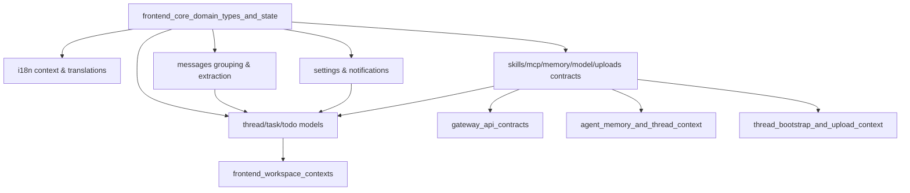
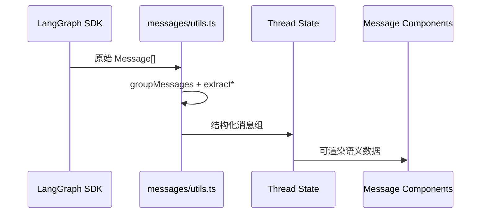
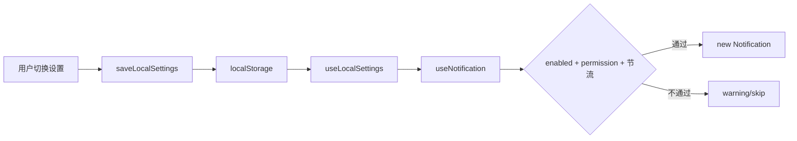
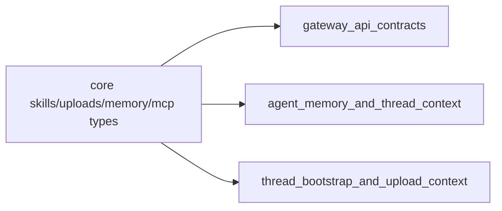

# frontend_core_domain_types_and_state 模块文档

## 1. 模块定位与设计动机

`frontend_core_domain_types_and_state` 是前端应用的“核心领域契约层”。它主要解决一个基础但关键的问题：**在复杂 Agent UI 中，如何让状态、类型、消息语义、以及前后端接口边界保持一致且可维护**。

这个模块本身不承担重 UI，也不实现完整业务流程编排；它更像“地基层”，负责定义和封装：

- 领域类型（线程、任务、模型、记忆、技能、上传文件等）；
- 运行时上下文（i18n、子任务 context、本地设置）；
- 通用消息语义处理（消息分组、内容提取、工具调用结果关联）；
- 轻量 API 边界（skills/uploads）；
- 与浏览器能力的适配（Notification API、localStorage、cookie）。

设计上，它把“高变化的业务逻辑”与“低变化的基础契约”分离。结果是：页面层可以快速迭代，而核心数据结构仍保持稳定，减少跨功能改动的连锁影响。

---

## 2. 架构总览

上图体现了该模块的两个关键特征：

第一，它是前端内部多个功能域的共享核心，尤其是消息渲染、线程状态管理、设置与上传等。

第二，它与后端契约模块有直接语义耦合（如 memory、skills、uploads、MCP），因此它不仅是“前端类型仓库”，也是“前后端协议落地点”。

---

## 3. 子模块划分与文档导航

本模块可清晰拆分为 5 个高内聚子模块。以下仅给出高层职责说明，详细实现请查看对应文档。

### 3.1 i18n context 与翻译契约

该子模块定义 `I18nContextType` 与 `Translations`，把“当前语言状态”与“翻译键结构契约”统一到核心层。它通过 Context + cookie 实现语言切换与持久化，并用强类型接口约束语言包结构一致性，避免运行时缺键。

详见：[i18n_context_and_translation_contracts.md](i18n_context_and_translation_contracts.md)

### 3.2 消息分组与内容提取

该子模块是聊天 UI 的语义中间层。`groupMessages` 会将线性 `Message[]` 归并为可渲染的语义组（human、assistant:processing、assistant:clarification、assistant:subagent 等），并提供文本/图片/reasoning/tool result/上传标签解析函数。

详见：[message_grouping_and_content_extraction.md](message_grouping_and_content_extraction.md)

### 3.3 线程、子任务与 Todo 状态模型

该子模块定义 `AgentThreadState`、`AgentThreadContext`、`Subtask`、`Todo`，并通过 `SubtaskContext` 提供任务运行态共享机制。它是线程页、任务进度区、计划模式 UI 的统一状态语言。

详见：[thread_task_and_todo_state_models.md](thread_task_and_todo_state_models.md)

### 3.4 本地设置与通知运行时

该子模块封装 `LocalSettings`、`useNotification` 以及浏览器侧持久化策略。它将用户偏好（模型、布局、通知开关）与运行时行为（是否可通知、请求权限、节流）连接起来。

详见：[settings_and_notification_runtime.md](settings_and_notification_runtime.md)

### 3.5 Skills / MCP / Memory / Model / Upload 契约与 API

该子模块聚合多类核心契约：`MCPConfig`、`UserMemory`、`Model`、`Skill`、上传返回结构，并提供 `installSkill`、`uploadFiles` 等轻量网络封装。它是前端调用后端网关能力的主要 typed entry。

详见：[skills_mcp_memory_model_and_upload_contracts.md](skills_mcp_memory_model_and_upload_contracts.md)

---

## 4. 关键交互与数据流

### 4.1 消息到 UI 的语义化流程

该流程说明消息子模块的价值：它把“协议层消息”转换为“产品层展示语义”，降低页面组件的判断复杂度。

### 4.2 设置与通知协同流程

通知并非独立系统，而是严格受本地设置和浏览器权限双重约束。

### 4.3 前后端契约对齐

当后端接口字段演进时，优先在本模块类型中完成同步，再推动 UI 层适配，能显著降低回归风险。

---

## 5. 使用与扩展建议

### 5.1 新增领域对象时

优先在本模块定义 interface/type，再在页面或 hooks 中消费。不要直接在组件里声明临时结构体，否则会造成跨模块语义漂移。

### 5.2 新增消息语义时

如果后端新增工具调用类型（例如新的 tool name），应先扩展消息分组规则与类型，再更新渲染组件。避免在 UI 层硬编码 `message.tool_calls` 判定。

### 5.3 新增本地偏好项时

在 `LocalSettings` 和 `DEFAULT_LOCAL_SETTINGS` 同步新增，并保持 `getLocalSettings` 的分域 merge 策略，确保老版本本地数据向后兼容。

### 5.4 新增上传/技能 API 时

沿用现有函数风格：

- 明确请求路径与返回类型；
- 对 `!response.ok` 提供统一错误行为；
- 让调用方拿到可直接显示的错误消息或抛出明确异常。

---

## 6. 常见风险与注意事项

1. `groupMessages` 对消息时序敏感，tool 消息若缺少合法前置组会抛错；测试中应覆盖异常序列。
2. `useNotification` 有 1 秒节流；短时间重复触发会被跳过，这在自动化测试中容易被误判为失败。
3. `getLocalSettings` 在 SSR 环境会回退默认值；如果你在服务端预渲染中依赖设置值，需要显式处理 hydration 差异。
4. `SubtaskContext` 的更新策略偏增量，若直接原地改对象不触发 `setTasks`，可能导致 UI 不刷新。
5. `MCPServerConfig extends Record<string, unknown>` 允许扩展字段，但读取扩展字段时必须做运行时校验。

---

## 7. 与其他模块的关系（避免重复阅读）

- 网关接口返回结构：参见 [gateway_api_contracts.md](gateway_api_contracts.md)
- 前端工作区上下文（线程/工件）：参见 [frontend_workspace_contexts.md](frontend_workspace_contexts.md)
- 后端记忆与线程状态：参见 [agent_memory_and_thread_context.md](agent_memory_and_thread_context.md)
- 线程引导与上传后端中间件：参见 [thread_bootstrap_and_upload_context.md](thread_bootstrap_and_upload_context.md)

如果你是第一次接手该模块，推荐阅读顺序：

1) 本文（总体架构） → 2) `message_grouping_and_content_extraction.md` → 3) `thread_task_and_todo_state_models.md` → 4) `skills_mcp_memory_model_and_upload_contracts.md` → 5) 其余模块文档。
