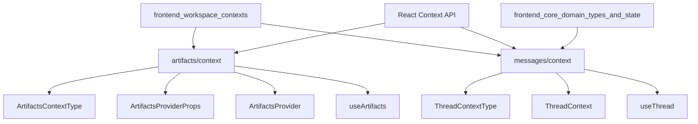

# frontend_workspace_contexts 模块文档

## 1. 概述

`frontend_workspace_contexts` 模块是前端应用中负责管理工作区上下文的核心模块，提供了 React Context 机制来共享和管理工作区相关的状态。该模块主要包含两个关键的上下文管理组件：`ArtifactsContext` 和 `ThreadContext`，它们分别用于管理工件（artifacts）状态和线程（thread）状态。

### 1.1 设计目的

该模块的设计目的是解决在复杂的工作区应用中状态共享和管理的问题。通过 React Context API，它允许组件树中的不同组件访问和修改共享状态，而无需通过 props 层层传递。这种设计模式特别适合管理工作区这种需要在多个组件间同步状态的场景。

### 1.2 核心功能

- **工件管理**：提供工件列表的维护、选择和展示控制
- **线程状态共享**：提供线程 ID 和线程流状态的上下文访问
- **状态同步**：确保相关组件间的状态一致性
- **错误处理**：提供上下文使用的安全检查机制

## 2. 架构

`frontend_workspace_contexts` 模块采用了 React Context 模式的标准架构，每个上下文都包含类型定义、Context 创建、Provider 组件和自定义 Hook 四个主要部分。



### 2.1 架构说明

该模块由两个相对独立的子模块组成：

1. **artifacts/context**：负责管理工作区中的工件相关状态，包括工件列表、选中状态和侧边栏显示状态。
2. **messages/context**：负责提供线程上下文，使组件能够访问当前线程的 ID 和状态流。

两个子模块都遵循 React Context 的最佳实践，提供了类型安全的上下文定义、Provider 组件和自定义 Hook，确保了使用的便利性和安全性。

## 3. 子模块

### 3.1 artifacts/context 子模块

该子模块在工作区中负责“工件视图状态编排”，不仅保存工件列表与当前选中项，还编码了自动行为退让策略（`autoSelect` / `autoOpen`）。它的核心价值在于把“系统自动选择/自动打开”和“用户手动干预”统一到一个状态机中，避免不同 UI 组件各自维护状态导致的冲突。比如用户手动关闭工件面板后，模块会自动关闭自动策略，防止系统再次强行打断当前阅读行为。

该子模块还与 `useSidebar` 和环境变量 `NEXT_PUBLIC_STATIC_WEBSITE_ONLY` 形成协同：在非静态模式下选择工件会收起侧边栏，提升内容聚焦；在静态模式下则保持更稳定的展示布局。这些细节都集中在 Provider 内部，消费组件只需通过 Hook 调用标准 API。

详细实现、交互流程图、边界条件与扩展建议，请参阅：
- [artifacts_workspace_context.md](artifacts_workspace_context.md)

### 3.2 messages/context 子模块

该子模块提供线程运行时上下文的最小但关键契约：`threadId` 与 `thread`（`UseStream<AgentThreadState>`）。它不负责创建线程流，而是负责在线程页面内部进行安全分发，确保消息列表、输入框、状态栏、工具面板等后代组件都能读取同一线程源，避免 props drilling 和线程引用不一致问题。

该设计采用“默认 `undefined` + Hook 内显式抛错”的防御式模式：如果调用方未在 `ThreadContext.Provider` 下使用 `useThread`，会立即得到明确错误，便于在开发期快速定位装配问题。模块与 `frontend_core_domain_types_and_state` 中的线程类型契约协同工作，形成前端线程状态消费层。

详细实现、架构图、异常路径与性能注意事项，请参阅：
- [thread_stream_context.md](thread_stream_context.md)

## 4. 主要组件

### 4.1 ArtifactsProvider

`ArtifactsProvider` 是工件上下文的核心组件，负责初始化和管理所有工件相关的状态。

**功能特点**：
- 初始化工件列表为空数组
- 管理选中工件状态
- 控制侧边栏的打开/关闭状态
- 处理自动选择和自动打开的逻辑
- 与侧边栏组件集成

**使用场景**：
需要在应用的顶层包裹该组件，以便所有子组件都能访问工件上下文。

### 4.2 useArtifacts

`useArtifacts` 是访问工件上下文的自定义 Hook，封装了上下文访问的安全检查。

**返回值**：
返回 `ArtifactsContextType` 类型的对象，包含所有工件相关的状态和方法。

**错误处理**：
如果在 `ArtifactsProvider` 外部使用，会抛出错误："useArtifacts must be used within an ArtifactsProvider"。

### 4.3 ThreadContext

`ThreadContext` 是线程状态的上下文对象，用于在线程相关组件间共享状态。

**特点**：
- 类型安全的上下文定义
- 初始值为 `undefined`，确保使用前必须被 Provider 包裹

### 4.4 useThread

`useThread` 是访问线程上下文的自定义 Hook，提供了安全的上下文访问方式。

**返回值**：
返回 `ThreadContextType` 类型的对象，包含 `threadId` 和 `thread` 状态。

**错误处理**：
如果在 `ThreadContext.Provider` 外部使用，会抛出错误："useThread must be used within a ThreadContext"。

## 5. 技术栈与依赖

| 技术/依赖                | 用途                             | 来源模块                  |
|--------------------------|----------------------------------|---------------------------|
| React                    | UI 框架和 Context API            | react                     |
| TypeScript               | 类型安全                         | typescript                |
| UseStream                | 线程流状态类型                   | @langchain/langgraph-sdk  |
| AgentThreadState         | 线程状态类型                     | frontend_core_domain_types_and_state |
| useSidebar               | 侧边栏状态管理 Hook              | 内部 UI 组件库            |
| env                      | 环境变量访问                     | 内部环境配置              |

## 6. 关键模块与典型用例

### 6.1 使用 ArtifactsContext

**功能说明**：ArtifactsContext 用于管理工作区中的工件列表和选择状态。

**配置与依赖**：
- 必须在组件树中使用 `ArtifactsProvider` 包裹
- 可选依赖：环境变量 `NEXT_PUBLIC_STATIC_WEBSITE_ONLY`

**示例代码**：

```tsx
// 在应用顶层
import { ArtifactsProvider } from "@/components/workspace/artifacts/context";

function App() {
  return (
    <ArtifactsProvider>
      <YourAppComponents />
    </ArtifactsProvider>
  );
}

// 在子组件中使用
import { useArtifacts } from "@/components/workspace/artifacts/context";

function ArtifactList() {
  const { artifacts, selectedArtifact, select, setArtifacts } = useArtifacts();
  
  // 设置工件列表
  const loadArtifacts = () => {
    setArtifacts(['file1.txt', 'file2.txt', 'file3.txt']);
  };
  
  return (
    <div>
      <button onClick={loadArtifacts}>加载工件</button>
      {artifacts.map(artifact => (
        <div 
          key={artifact}
          onClick={() => select(artifact)}
          className={selectedArtifact === artifact ? 'selected' : ''}
        >
          {artifact}
        </div>
      ))}
    </div>
  );
}
```

### 6.2 使用 ThreadContext

**功能说明**：ThreadContext 用于共享当前线程的 ID 和状态流。

**配置与依赖**：
- 必须在组件树中使用 `ThreadContext.Provider` 包裹
- 依赖：`@langchain/langgraph-sdk/react` 的 `UseStream` 类型
- 依赖：`frontend_core_domain_types_and_state` 的 `AgentThreadState` 类型

**示例代码**：

```tsx
// 在线程组件顶层
import { ThreadContext } from "@/components/workspace/messages/context";
import { useStream } from "@langchain/langgraph-sdk/react";
import type { AgentThreadState } from "@/core/threads";

function ThreadView({ threadId }: { threadId: string }) {
  const thread = useStream<AgentThreadState>({ threadId });
  
  return (
    <ThreadContext.Provider value={{ threadId, thread }}>
      <ThreadMessages />
      <ThreadInput />
    </ThreadContext.Provider>
  );
}

// 在子组件中使用
import { useThread } from "@/components/workspace/messages/context";

function ThreadMessages() {
  const { thread } = useThread();
  
  return (
    <div>
      {thread.messages.map((message, index) => (
        <div key={index}>{message.content}</div>
      ))}
    </div>
  );
}
```

## 7. 配置、部署与开发

### 7.1 环境变量

该模块使用以下环境变量：

- `NEXT_PUBLIC_STATIC_WEBSITE_ONLY`：控制是否为静态网站模式，影响侧边栏的默认打开状态和工件选择行为。

### 7.2 开发注意事项

1. **Provider 包裹**：确保在使用对应的 Hook 之前，组件已被相应的 Provider 包裹。
2. **类型安全**：利用 TypeScript 类型定义确保上下文使用的正确性。
3. **状态更新**：当更新上下文状态时，注意避免不必要的重渲染，可以考虑使用 useMemo 或其他优化技术。

## 8. 监控与维护

### 8.1 常见问题与解决方案

**问题 1**："useArtifacts must be used within an ArtifactsProvider" 错误
- **原因**：在 ArtifactsProvider 外部使用了 useArtifacts Hook
- **解决方案**：确保组件树被 ArtifactsProvider 包裹

**问题 2**："useThread must be used within a ThreadContext" 错误
- **原因**：在 ThreadContext.Provider 外部使用了 useThread Hook
- **解决方案**：确保组件树被 ThreadContext.Provider 包裹

**问题 3**：工件选择后侧边栏没有关闭
- **原因**：可能是环境变量 NEXT_PUBLIC_STATIC_WEBSITE_ONLY 设置为 "true"
- **解决方案**：检查环境变量设置，或修改 select 函数的逻辑

## 9. 总结

`frontend_workspace_contexts` 模块是前端工作区功能的核心支撑模块，通过 React Context 机制提供了状态共享的基础设施。它的两个主要子模块分别处理工件管理和线程状态，为构建功能丰富的工作区应用提供了必要的状态管理能力。

该模块遵循 React 最佳实践，提供了类型安全的接口和安全的访问机制，同时与环境变量和其他 UI 组件集成，为开发者提供了灵活且强大的工具来构建工作区相关功能。
