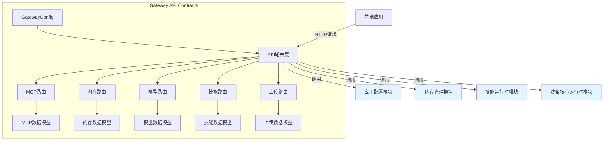

# Gateway API Contracts 模块文档

## 1. 模块概述

Gateway API Contracts模块是系统的API网关契约层，负责定义和实现所有与前端交互的REST API接口。该模块提供了一套标准化的数据模型、请求响应格式和API路由，确保前后端通信的一致性和可靠性。它作为系统的入口点，处理来自前端的各种请求，包括模型管理、技能配置、内存管理、MCP服务器配置和文件上传等核心功能。

该模块的设计遵循契约优先原则，所有API接口都有明确的输入输出模型，使用Pydantic进行数据验证和序列化，确保数据类型的安全性。同时，模块采用FastAPI作为Web框架，提供自动生成的API文档和类型提示，大大提升了开发效率和API的可维护性。

## 2. 架构设计

Gateway API Contracts模块采用分层架构设计，主要由配置层、路由层和数据模型层组成。配置层负责网关服务的基础配置，路由层定义各个功能模块的API端点，数据模型层则提供请求和响应的数据结构定义。

### 2.1 核心组件层次

1. **配置层**：由`GatewayConfig`负责，管理网关服务的主机、端口和CORS配置等基础设置。
2. **路由层**：包含各个功能模块的API路由定义，处理HTTP请求并返回响应。
3. **数据模型层**：定义所有API请求和响应的数据结构，使用Pydantic进行数据验证。

### 2.2 组件交互流程

当客户端发起API请求时，请求首先到达对应的路由处理器，路由处理器使用Pydantic模型验证请求数据，然后调用相应的业务逻辑模块处理请求，最后将处理结果序列化为响应模型返回给客户端。整个过程中，数据模型层确保了数据的一致性和类型安全。

### 2.3 模块依赖关系

Gateway API Contracts模块与系统中的其他模块存在紧密的依赖关系，主要依赖于以下核心模块：

- **应用和功能配置模块** ([application_and_feature_configuration.md](application_and_feature_configuration.md))：提供应用级配置，包括模型配置、内存配置、技能配置等，是API路由获取系统配置信息的主要来源。
- **代理内存和线程上下文模块** ([agent_memory_and_thread_context.md](agent_memory_and_thread_context.md))：提供内存数据管理功能，内存路由通过该模块获取和更新全局记忆数据。
- **子代理和技能运行时模块** ([subagents_and_skills_runtime.md](subagents_and_skills_runtime.md))：提供技能的加载和管理功能，技能路由通过该模块实现技能的安装、启用和禁用操作。
- **沙箱核心运行时模块** ([sandbox_core_runtime.md](sandbox_core_runtime.md))：提供沙箱环境管理功能，上传路由通过该模块实现文件的安全存储和访问。

这些依赖关系确保了Gateway API Contracts模块能够有效地协调各个功能模块，为前端提供统一的API接口。

## 3. 子模块功能概览

### 3.1 网关配置子模块

网关配置子模块提供了API网关服务的基础配置功能，包括服务绑定地址、端口和CORS源设置等。该子模块通过`GatewayConfig`类和`get_gateway_config()`函数实现配置的加载和管理，支持从环境变量读取配置值，使部署更加灵活。详细信息请参考[网关配置子模块文档](gateway_config.md)。

### 3.2 MCP配置路由子模块

MCP配置路由子模块负责管理Model Context Protocol (MCP)服务器的配置，提供了获取和更新MCP服务器配置的API接口。该子模块允许动态配置MCP服务器，包括启用/禁用服务器、设置传输类型、命令参数和环境变量等。详细信息请参考[MCP配置路由子模块文档](mcp_router.md)。

### 3.3 内存管理路由子模块

内存管理路由子模块提供了全局内存数据的检索和管理功能，包括用户上下文、历史记录和事实数据等。该子模块允许前端获取当前内存状态、重新加载内存数据以及查看内存配置，为AI助手提供持久化的上下文记忆能力。详细信息请参考[内存管理路由子模块文档](memory_router.md)。

### 3.4 模型管理路由子模块

模型管理路由子模块负责AI模型的信息展示，提供了获取所有可用模型列表和单个模型详细信息的API接口。该子模块从应用配置中读取模型信息，并过滤掉敏感字段，确保只返回前端需要的元数据。详细信息请参考[模型管理路由子模块文档](models_router.md)。

### 3.5 技能管理路由子模块

技能管理路由子模块提供了技能的安装、配置和管理功能，包括获取技能列表、查看技能详情、启用/禁用技能以及从.skill文件安装新技能等API接口。该子模块确保技能的安全加载和验证，支持自定义技能的扩展。详细信息请参考[技能管理路由子模块文档](skills_router.md)。

### 3.6 文件上传路由子模块

文件上传路由子模块处理线程相关的文件上传、列表和删除操作，支持将PDF、PPT、Excel和Word等文件自动转换为Markdown格式。该子模块确保文件安全存储在沙箱环境中，并提供虚拟路径映射供AI助手访问。详细信息请参考[文件上传路由子模块文档](uploads_router.md)。

## 4. 核心数据模型

Gateway API Contracts模块定义了丰富的数据模型，用于API请求和响应的数据结构。这些模型都基于Pydantic BaseModel，提供自动数据验证和序列化功能。

### 4.1 配置模型

- `GatewayConfig`：网关服务配置模型，包含主机、端口和CORS源设置。

### 4.2 MCP配置模型

- `McpServerConfigResponse`：MCP服务器配置响应模型，包含服务器的启用状态、传输类型、命令参数等。
- `McpConfigResponse`：MCP配置响应模型，包含多个MCP服务器配置的映射。
- `McpConfigUpdateRequest`：MCP配置更新请求模型，用于更新MCP服务器配置。

### 4.3 内存模型

- `ContextSection`：上下文部分模型，包含摘要和更新时间戳。
- `UserContext`：用户上下文模型，包含工作上下文、个人上下文和顶部思维。
- `HistoryContext`：历史上下文模型，包含最近月份、早期上下文和长期背景。
- `Fact`：事实模型，包含唯一标识符、内容、类别、置信度等。
- `MemoryResponse`：内存响应模型，包含版本、最后更新时间、用户上下文、历史上下文和事实列表。
- `MemoryConfigResponse`：内存配置响应模型，包含内存系统的各种配置参数。
- `MemoryStatusResponse`：内存状态响应模型，同时包含配置和数据。

### 4.4 模型管理模型

- `ModelResponse`：模型响应模型，包含模型名称、显示名称、描述和是否支持思维模式。
- `ModelsListResponse`：模型列表响应模型，包含多个模型响应的列表。

### 4.5 技能管理模型

- `SkillResponse`：技能响应模型，包含技能名称、描述、许可证、类别和启用状态。
- `SkillsListResponse`：技能列表响应模型，包含多个技能响应的列表。
- `SkillUpdateRequest`：技能更新请求模型，用于更新技能的启用状态。
- `SkillInstallRequest`：技能安装请求模型，包含线程ID和.skill文件的虚拟路径。
- `SkillInstallResponse`：技能安装响应模型，包含安装成功状态、技能名称和消息。

### 4.6 文件上传模型

- `UploadResponse`：上传响应模型，包含成功状态、文件信息列表和消息。

## 5. 使用指南

### 5.1 基本使用

Gateway API Contracts模块作为FastAPI应用的一部分，通过路由注册的方式集成到主应用中。所有API端点都以`/api`为前缀，按照功能模块进行分组。

### 5.2 配置方式

网关配置可以通过环境变量进行设置：
- `GATEWAY_HOST`：设置服务绑定地址，默认为`0.0.0.0`
- `GATEWAY_PORT`：设置服务端口，默认为`8001`
- `CORS_ORIGINS`：设置允许的CORS源，多个源用逗号分隔，默认为`http://localhost:3000`

### 5.3 API访问

启动服务后，可以通过以下方式访问API：
- 基础URL：`http://<host>:<port>`
- API文档：`http://<host>:<port>/docs` (Swagger UI)
- 备用文档：`http://<host>:<port>/redoc` (ReDoc)

## 6. 扩展与开发

### 6.1 添加新的API端点

要添加新的API端点，需要：
1. 在相应的路由文件中定义请求和响应模型
2. 创建路由处理函数
3. 使用适当的HTTP方法装饰器注册路由

### 6.2 数据模型扩展

所有数据模型都继承自Pydantic BaseModel，可以通过继承和字段添加进行扩展。添加新字段时，建议使用`Field`提供描述和默认值，以确保API文档的完整性。

## 7. 注意事项

### 7.1 安全性考虑

在使用Gateway API Contracts模块时，需要注意以下安全事项：

- 所有文件操作都进行了路径安全检查，防止路径遍历攻击
- 敏感配置信息（如API密钥）不会通过API暴露
- CORS配置应根据部署环境进行适当调整

### 7.2 错误处理

模块使用FastAPI的HTTPException进行错误处理，提供适当的HTTP状态码和错误消息。客户端应根据状态码和错误消息进行相应的处理。

### 7.3 性能考虑

- 大文件上传时应考虑流式处理和分块上传
- 频繁访问的配置数据进行了缓存处理
- 文件格式转换操作可能耗时较长，应考虑异步处理

### 7.4 兼容性

- 所有API响应都保持向后兼容性
- 添加新字段时应提供默认值
- 删除字段前应进行 deprecation 标记
