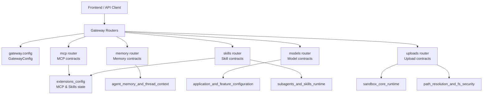
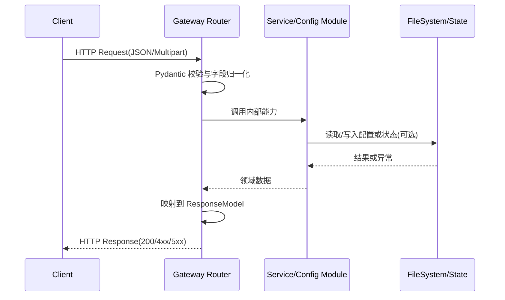
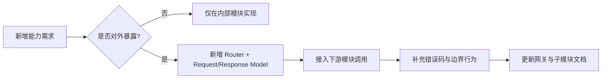

# gateway_api_contracts 模块文档

## 1. 模块定位与设计目标

`gateway_api_contracts` 是后端对外 API 的“契约层（Contract Layer）”。它的核心职责不是实现复杂业务算法，而是把系统内部能力（模型配置、记忆系统、技能系统、MCP 扩展、沙箱文件体系）以稳定、可验证、可演进的 HTTP 接口暴露给前端与外部调用方。

这个模块存在的根本原因，是隔离“内部实现变化”和“外部调用稳定性”之间的冲突。系统内部模块（例如 `application_and_feature_configuration`、`agent_memory_and_thread_context`、`sandbox_core_runtime`、`subagents_and_skills_runtime`）可以持续迭代；而网关层通过 Pydantic 模型把输入输出结构固定下来，让前端与集成方依赖的 API 语义保持稳定。

从工程实践看，该模块同时解决了三个问题：

1. **统一入口**：把分散在不同子系统中的功能，收敛为 `/api` 下的一致访问面。
2. **类型化契约**：请求/响应都通过 `BaseModel` 显式建模，避免“隐式 JSON 约定”导致的联调脆弱性。
3. **安全边界**：网关负责做第一层校验与路径约束，尤其在技能安装、文件上传、配置写回这类高风险操作上形成防线。

---

## 2. 架构总览

### 2.1 组件视图

该图体现了 gateway 的“薄控制层”定位：路由负责参数解析、契约校验、错误映射与状态拼装；核心业务能力由下游模块提供。

### 2.2 请求处理流

此流程的关键价值在于：即使内部模块返回结构发生细微变化，网关也可通过响应模型与显式映射维持对外稳定格式。

---

## 3. 子模块总览与导航

> 详细设计已拆分到独立文档，下面只给出高层职责与阅读入口，避免重复。

### 3.1 网关运行时配置

网关进程的监听地址、端口、CORS 来源由 `GatewayConfig` 与 `get_gateway_config()` 负责。该部分采用“环境变量优先 + 进程内缓存”策略，兼顾部署灵活性与读取开销。

详见：[`gateway_runtime_config.md`](gateway_runtime_config.md)

### 3.2 MCP 配置契约

`/api/mcp/config` 提供 MCP 服务器配置的读取与更新。更新接口会将配置落盘到 `extensions_config.json`，并在保持 `skills` 配置不丢失的前提下完成覆盖写入。

详见：[`mcp_configuration_contracts.md`](mcp_configuration_contracts.md)

### 3.3 记忆系统 API 契约

`/api/memory*` 系列接口暴露记忆数据、配置与状态聚合。该子模块把内部记忆结构规范化为 `MemoryResponse`、`MemoryConfigResponse` 等前端友好模型。

详见：[`memory_api_contracts.md`](memory_api_contracts.md)

### 3.4 模型目录 API 契约

`/api/models` 与 `/api/models/{model_name}` 对外提供模型元数据，不暴露 API key 等敏感字段。该路由是前端模型选择器与运行时能力提示（如 `supports_thinking`）的主要数据源。

详见：[`models_api_contracts.md`](models_api_contracts.md)

### 3.5 技能管理 API 契约

技能路由提供列举、查询、启停、安装。尤其安装流程包含对 `.skill` ZIP 包结构、`SKILL.md` frontmatter、命名规范的完整校验链路，是扩展生态安全性的核心入口。

详见：[`skills_api_contracts.md`](skills_api_contracts.md)

### 3.6 上传与工件路径契约

上传路由负责线程维度文件写入、列表、删除，并为特定扩展名触发 markdown 转换。返回值同时包含物理路径、虚拟路径、artifact URL，打通 Agent 沙箱访问与前端下载访问。

详见：[`uploads_api_contracts.md`](uploads_api_contracts.md)

---

## 4. 与其他模块的关系

`gateway_api_contracts` 不是孤立模块，它是系统能力编排层：

- 配置来源主要依赖 [`application_and_feature_configuration.md`](application_and_feature_configuration.md)；
- 记忆读写状态来自 [`agent_memory_and_thread_context.md`](agent_memory_and_thread_context.md)；
- 技能元信息与加载流程关联 [`subagents_and_skills_runtime.md`](subagents_and_skills_runtime.md)；
- 上传文件进入沙箱后续由 [`sandbox_core_runtime.md`](sandbox_core_runtime.md) 接管执行环境。

如果你在排查“接口返回异常但内部逻辑正常”的问题，应优先检查本模块模型映射与错误转换；如果是“数据源本身异常”，则应跳转到上述依赖模块文档继续定位。

---

## 5. 核心契约设计原则

### 5.1 显式响应模型

所有关键接口都使用 `response_model=` 固化输出结构。这样做有两个收益：一是 FastAPI 自动文档更可靠；二是避免代码中无意返回多余字段（尤其敏感字段）造成泄露。

### 5.2 配置写回的“保留策略”

`mcp` 与 `skills` 都会写 `extensions_config.json`。实现中采用“读取当前配置 -> 修改目标子树 -> 保留非目标子树”的方式，降低并发更新时互相覆盖的风险（虽然仍非严格事务）。

### 5.3 文件路径安全

上传与安装流程对路径处理采用了多重保护：文件名归一化、虚拟路径解析、目录边界校验（`relative_to`）等，避免路径穿越攻击。

---

## 6. 扩展与维护建议

扩展本模块时，建议遵循以下顺序：先定义契约模型，再写路由，再做下游调用；不要让下游结构“反向决定”对外 API。这样可以把兼容性主动权掌握在网关层。

---

## 7. 常见风险与排障提示

1. **配置未生效**：注意 `GatewayConfig` 和部分配置读取存在缓存；开发时若热更新配置，可能需要触发 reload 逻辑或重启进程。
2. **技能安装失败（400/409）**：优先检查 `.skill` 包是否含合法 `SKILL.md` frontmatter、名称是否符合 hyphen-case、目标目录是否已存在同名技能。
3. **上传后 Agent 不可见文件**：确认返回的 `virtual_path` 是否被正确写入沙箱，并核对线程 ID 与 sandbox 映射是否一致。
4. **模型查询 404**：通常是 `app_config` 中不存在该模型名，不是网关路由本身错误。
5. **MCP 更新后行为未变化**：配置文件已写入不等于运行态立即重建，需结合 MCP 工具缓存/重载策略排查。

---

## 8. 快速阅读路径

- 想理解部署与启动参数：先看 [`gateway_runtime_config.md`](gateway_runtime_config.md)
- 想联调前端设置页：重点看 [`mcp_configuration_contracts.md`](mcp_configuration_contracts.md)、[`models_api_contracts.md`](models_api_contracts.md)、[`skills_api_contracts.md`](skills_api_contracts.md)
- 想定位会话上下文问题：看 [`memory_api_contracts.md`](memory_api_contracts.md) 并联读 [`agent_memory_and_thread_context.md`](agent_memory_and_thread_context.md)
- 想处理文件链路问题：看 [`uploads_api_contracts.md`](uploads_api_contracts.md) 与 [`sandbox_core_runtime.md`](sandbox_core_runtime.md)
