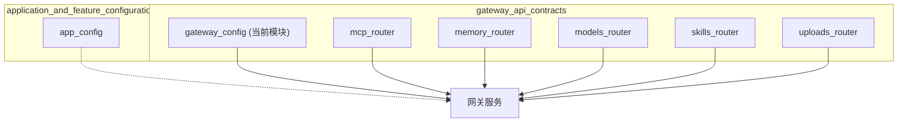
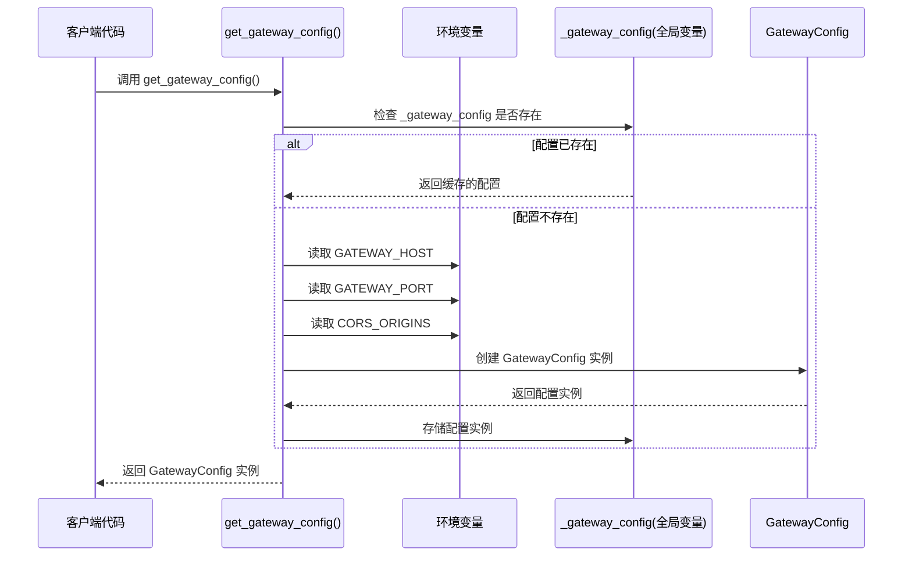

# Gateway Config 模块文档

## 概述

`gateway_config` 模块是 `gateway_api_contracts` 模块的一个子模块，负责管理 API 网关的核心配置。该模块提供了网关服务运行所需的网络绑定设置、CORS（跨源资源共享）策略配置以及统一的配置加载机制。

该模块的设计目的是将网关的运行时配置与系统的其他配置（如应用配置、模型配置等）分离，使网关服务可以独立启动和配置，同时保持与整体系统架构的集成。通过环境变量支持和单例模式，该模块确保了配置的灵活性和一致性。

## 核心组件

### GatewayConfig 类

`GatewayConfig` 是一个基于 Pydantic 的数据模型类，用于定义和验证 API 网关的配置参数。

```python
class GatewayConfig(BaseModel):
    """Configuration for the API Gateway."""

    host: str = Field(default="0.0.0.0", description="Host to bind the gateway server")
    port: int = Field(default=8001, description="Port to bind the gateway server")
    cors_origins: list[str] = Field(default_factory=lambda: ["http://localhost:3000"], description="Allowed CORS origins")
```

#### 字段说明

- **host**: 网关服务器绑定的主机地址，默认值为 `"0.0.0.0"`，表示监听所有网络接口。
- **port**: 网关服务器绑定的端口号，默认值为 `8001`。
- **cors_origins**: 允许进行跨源请求的来源列表，默认值为 `["http://localhost:3000"]`，仅允许本地前端开发服务器访问。

### get_gateway_config 函数

```python
def get_gateway_config() -> GatewayConfig:
    """Get gateway config, loading from environment if available."""
    # 函数实现...
```

这个函数是获取网关配置的主要入口点，它采用了延迟加载的单例模式，确保配置在第一次访问时初始化，并在后续调用中复用同一实例。

#### 工作原理

1. **单例检查**: 首先检查全局变量 `_gateway_config` 是否已存在。
2. **环境变量加载**: 如果配置尚未初始化，从环境变量中读取配置值：
   - `GATEWAY_HOST`: 覆盖默认的主机地址
   - `GATEWAY_PORT`: 覆盖默认的端口号
   - `CORS_ORIGINS`: 覆盖默认的 CORS 来源列表，多个来源用逗号分隔
3. **创建配置实例**: 使用读取到的环境变量值（或默认值）创建 `GatewayConfig` 实例。
4. **缓存配置**: 将创建的配置实例存储在全局变量中，供后续调用使用。
5. **返回配置**: 返回配置实例。

## 架构与组件关系

`gateway_config` 模块在整个系统架构中的位置如下图所示：



`gateway_config` 模块与系统其他部分的关系：

1. **与网关服务的关系**：网关服务在启动时使用 `get_gateway_config()` 获取配置，设置服务器绑定地址和 CORS 策略。
2. **与 application_and_feature_configuration 模块的关系**：虽然 `gateway_config` 是独立的，但它与 `app_config` 一起构成了系统配置的两大部分 - `gateway_config` 专注于网关网络层面的配置，而 `app_config` 管理应用功能层面的配置。
3. **与 gateway_api_contracts 其他子模块的关系**：这些模块共同构成了网关 API 的契约层，`gateway_config` 提供基础设施配置，而其他子模块定义了 API 的请求和响应模型。

## 使用指南

### 基本使用

在代码中获取网关配置的标准方式是调用 `get_gateway_config()` 函数：

```python
from backend.src.gateway.config import get_gateway_config

# 获取网关配置
config = get_gateway_config()

# 使用配置
print(f"Gateway will run on {config.host}:{config.port}")
print(f"Allowed CORS origins: {config.cors_origins}")
```

### 环境变量配置

可以通过设置以下环境变量来自定义网关配置：

```bash
# 设置网关主机地址
export GATEWAY_HOST="127.0.0.1"

# 设置网关端口
export GATEWAY_PORT="8080"

# 设置允许的 CORS 来源（多个来源用逗号分隔）
export CORS_ORIGINS="http://localhost:3000,https://app.example.com"
```

### FastAPI 集成示例

以下是如何在 FastAPI 应用中使用 `gateway_config` 的示例：

```python
from fastapi import FastAPI
from fastapi.middleware.cors import CORSMiddleware
from backend.src.gateway.config import get_gateway_config

# 获取配置
config = get_gateway_config()

# 创建 FastAPI 应用
app = FastAPI()

# 添加 CORS 中间件
app.add_middleware(
    CORSMiddleware,
    allow_origins=config.cors_origins,
    allow_credentials=True,
    allow_methods=["*"],
    allow_headers=["*"],
)

# 运行应用
if __name__ == "__main__":
    import uvicorn
    uvicorn.run(app, host=config.host, port=config.port)
```

## 配置加载流程

配置加载的详细流程如下：



## 注意事项与限制

1. **线程安全性**：当前实现中，`get_gateway_config()` 函数没有加锁机制。在多线程环境中，如果多个线程同时首次调用该函数，可能会创建多个配置实例。虽然这不太可能导致严重问题，但在高并发环境中应该注意。

2. **环境变量解析**：
   - `CORS_ORIGINS` 环境变量使用逗号分隔多个来源，不支持包含逗号的 URL。
   - `GATEWAY_PORT` 必须是有效的整数，否则会引发 `ValueError`。

3. **单例模式限制**：配置在第一次加载后会被缓存，后续的环境变量更改不会反映在配置中。如果需要在运行时更新配置，需要重启应用或实现配置热重载机制。

4. **默认 CORS 来源**：默认仅允许 `http://localhost:3000` 访问，生产环境部署时务必更新此配置，避免安全风险。

5. **与 AppConfig 的关系**：`GatewayConfig` 与 `AppConfig` 是独立的配置系统，分别管理不同层面的配置，使用时注意不要混淆两者的职责。

## 扩展与相关模块

- 了解应用级配置，请参考 [application_and_feature_configuration](application_and_feature_configuration.md) 模块文档。
- 了解网关 API 的其他契约定义，请参考 [gateway_api_contracts](gateway_api_contracts.md) 模块文档及其子模块文档。
