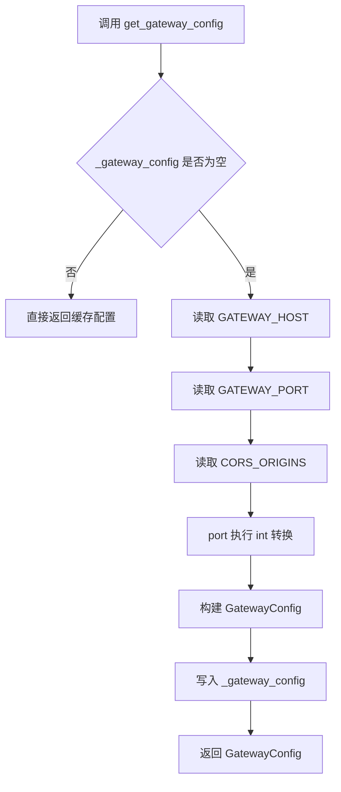
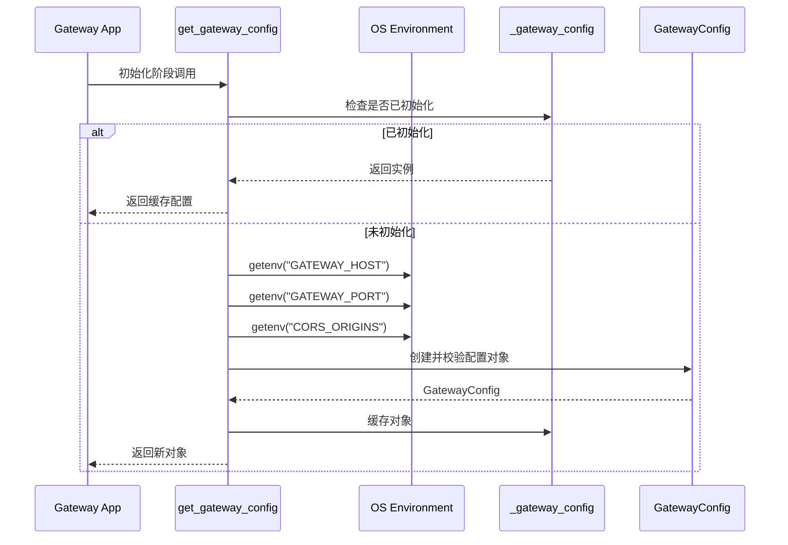
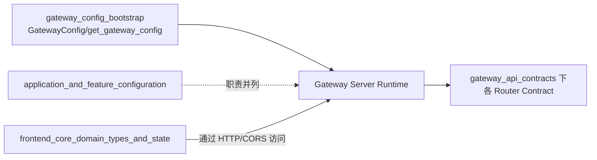

# gateway_config_bootstrap 模块文档

## 模块概述

`gateway_config_bootstrap` 对应的实现位于 `backend/src/gateway/config.py`，核心职责是为 API Gateway 提供“启动期配置装配（bootstrap）”。这个模块并不处理业务请求，也不定义 API 的入参出参协议，而是专注于网关进程启动时最基础、最关键的运行参数：监听地址、监听端口、以及 CORS 允许来源。

从系统分层看，它处于 `gateway_api_contracts` 族中的基础设施位置：上层路由（如 `mcp`、`memory`、`models`、`skills`、`uploads`）都依赖网关服务先正确启动，而网关服务能否启动、是否允许前端访问，又直接取决于这里的配置。该模块存在的意义是把“网关进程参数”从其它应用级配置中解耦出来，用最小但稳定的接口（`get_gateway_config()`）向外提供配置对象，避免调用方散落地读取环境变量，降低配置分叉与不一致风险。

## 设计目标与设计取舍

这个模块采用了一个非常“轻量但实用”的设计：使用 `Pydantic BaseModel` 定义配置结构，配合模块级缓存实现懒加载单例。设计重点不在复杂能力，而在可预测性和部署友好性。

首先，`GatewayConfig` 通过类型标注和默认值确保本地开发开箱即用；其次，`get_gateway_config()` 通过环境变量覆盖默认值，满足容器化与多环境部署；最后，通过 `_gateway_config` 缓存实例，确保应用内读取配置时返回一致对象，避免不同代码路径读到不同配置快照。

这种实现的代价是：它不是热更新配置模型，也不是线程严格同步模型。也就是说，它适合“进程启动后配置基本不变”的运行模式，而不适合需要在线动态刷新配置的复杂控制平面。

## 核心组件详解

### `GatewayConfig`

`GatewayConfig` 是模块中唯一的核心数据模型，定义如下：

```python
class GatewayConfig(BaseModel):
    """Configuration for the API Gateway."""

    host: str = Field(default="0.0.0.0", description="Host to bind the gateway server")
    port: int = Field(default=8001, description="Port to bind the gateway server")
    cors_origins: list[str] = Field(
        default_factory=lambda: ["http://localhost:3000"],
        description="Allowed CORS origins"
    )
```

它的三个字段分别承担以下职责：

- `host`：控制网关绑定在哪个网卡地址。默认 `0.0.0.0` 表示监听全部网络接口，适合容器和服务器部署。
- `port`：控制监听端口，默认 `8001`。
- `cors_origins`：跨域白名单列表，默认仅允许本地前端开发地址 `http://localhost:3000`。

这里使用 `default_factory` 而不是直接写 `[]`，避免可变默认值共享导致的隐性状态污染，这也是 Python 配置模型中非常关键的安全实践。

### 模块级缓存：`_gateway_config`

模块中存在一个私有全局变量：

```python
_gateway_config: GatewayConfig | None = None
```

它是懒加载单例缓存。第一次调用配置读取函数时会创建实例并写入该变量，之后重复调用直接返回缓存对象。这一机制可以减少重复解析环境变量的开销，并保证同一进程内配置一致性。

### `get_gateway_config()`

`get_gateway_config()` 是对外唯一推荐入口。函数签名无参数，返回 `GatewayConfig`。

```python
def get_gateway_config() -> GatewayConfig:
    """Get gateway config, loading from environment if available."""
    global _gateway_config
    if _gateway_config is None:
        cors_origins_str = os.getenv("CORS_ORIGINS", "http://localhost:3000")
        _gateway_config = GatewayConfig(
            host=os.getenv("GATEWAY_HOST", "0.0.0.0"),
            port=int(os.getenv("GATEWAY_PORT", "8001")),
            cors_origins=cors_origins_str.split(","),
        )
    return _gateway_config
```

这个函数内部行为可以拆解为四步：读取环境变量、类型转换、构造模型、写入缓存。虽然逻辑简单，但有两个关键副作用需要注意：第一，它会在首次调用时写模块全局状态；第二，它依赖外部进程环境，调用时机会影响读取到的配置值。

## 启动流程与数据流

### 配置装配流程图



该流程体现了典型“lazy singleton”的初始化路径：慢路径只发生一次，之后全部走快路径。这对高频读取配置的代码路径比较友好。

### 调用时序图



这个时序图强调了“读取环境变量只发生在第一次”的行为语义，因此若在首次调用后再修改环境变量，不会自动生效。

## 与系统其他模块的关系



`gateway_config_bootstrap` 的定位是“网关进程入口配置层”，它与业务契约层互补而不是重叠。简单说：本模块决定“服务怎么启动、谁可以跨域访问”，而 API contracts 模块决定“接口返回什么结构”。

为避免文档重复，以下主题建议直接参考对应模块文档：

- 网关 API 数据契约全景：[`gateway_api_contracts.md`](gateway_api_contracts.md)
- 应用级综合配置编排：[`application_and_feature_configuration.md`](application_and_feature_configuration.md)
- 路径与文件系统安全策略：[`path_resolution_and_fs_security.md`](path_resolution_and_fs_security.md)

## 配置方式与使用示例

### 环境变量

网关启动时可读取以下变量：

- `GATEWAY_HOST`：例如 `0.0.0.0`、`127.0.0.1`
- `GATEWAY_PORT`：字符串形式数字，例如 `8001`
- `CORS_ORIGINS`：逗号分隔字符串，例如 `http://localhost:3000,https://app.example.com`

示例：

```bash
export GATEWAY_HOST="0.0.0.0"
export GATEWAY_PORT="8001"
export CORS_ORIGINS="http://localhost:3000,https://console.example.com"
```

### 在启动代码中使用

```python
from backend.src.gateway.config import get_gateway_config

cfg = get_gateway_config()
print(cfg.host, cfg.port, cfg.cors_origins)
```

### FastAPI 集成示例

```python
from fastapi import FastAPI
from fastapi.middleware.cors import CORSMiddleware
import uvicorn

from backend.src.gateway.config import get_gateway_config

cfg = get_gateway_config()
app = FastAPI()

app.add_middleware(
    CORSMiddleware,
    allow_origins=cfg.cors_origins,
    allow_credentials=True,
    allow_methods=["*"],
    allow_headers=["*"],
)

if __name__ == "__main__":
    uvicorn.run(app, host=cfg.host, port=cfg.port)
```

## 边界条件、错误场景与已知限制

这个模块最大的风险点来自“环境变量解析”和“单例缓存行为”。`GATEWAY_PORT` 通过 `int()` 强制转换，如果值不是数字字符串会直接抛出 `ValueError` 并导致启动失败；这属于显式失败，优点是错误暴露早，缺点是缺少更友好的错误上下文。

`CORS_ORIGINS` 通过 `split(",")` 解析，意味着它不会自动去除空格，也不会自动过滤空项。例如 `"http://a.com, http://b.com"` 会产生第二项前导空格，若下游中间件不做 trim，可能导致匹配异常。生产中建议提供无空格、规范化的逗号分隔值。

由于 `_gateway_config` 是模块级缓存，首次调用后配置即冻结在进程内存中。后续即使环境变量变化，返回值也不会变化。这在“配置必须稳定”的场景是优势，但在“需要在线调参”的场景是限制。

另外，当前实现未加线程锁。在极端并发启动路径下，理论上可能出现多个线程同时进入初始化分支并创建重复对象，不过最终会收敛为一个缓存引用。通常不会造成功能错误，但若你对初始化幂等性有严格要求，可以考虑在扩展版本中加入锁。

## 扩展建议（如何安全演进）

若你要扩展该模块，推荐优先保持 `get_gateway_config()` 作为稳定入口不变，把新能力做成向后兼容增强。例如新增 `log_level`、`trusted_hosts` 等字段时，应给出合理默认值，并保持旧环境变量仍可运行。

如果需要支持动态刷新，建议新增显式接口而不是改变现有语义，例如提供 `reload_gateway_config()`（清空缓存并重新读取）或引入配置管理器对象，并在文档中明确线程安全与调用时机。这样可以避免破坏现有依赖“首次加载即固定”行为的代码。

若要提升健壮性，可以在解析层增加标准化处理，例如对 `CORS_ORIGINS` 做 `strip()` 与空项过滤，并对端口范围（1-65535）增加显式校验错误信息。这些增强都可以在不改变外部调用方式的前提下落地。

## 测试与运维建议

在测试层，建议至少覆盖三类场景：默认值路径（无环境变量）、环境覆盖路径（设置完整变量）、异常路径（非法 `GATEWAY_PORT`）。同时应在测试前后清理 `_gateway_config` 或隔离进程，避免缓存污染造成用例相互影响。

在运维层，建议把网关环境变量与应用其它配置分开管理，并在启动脚本中显式打印最终生效值（注意避免输出敏感信息）。对于 CORS，务必区分开发与生产环境，避免在生产误配过宽来源导致跨域风险扩大。

## 小结

`gateway_config_bootstrap` 是一个小而关键的基础模块。它通过 `GatewayConfig` + `get_gateway_config()` 建立了网关启动配置的最小闭环：有默认值、可被环境覆盖、并在进程内保持一致。对于大多数静态配置部署场景，这种设计简单、直接、可维护；对于需要热更新或强并发初始化控制的场景，则需要在此基础上做有意识的增强。
