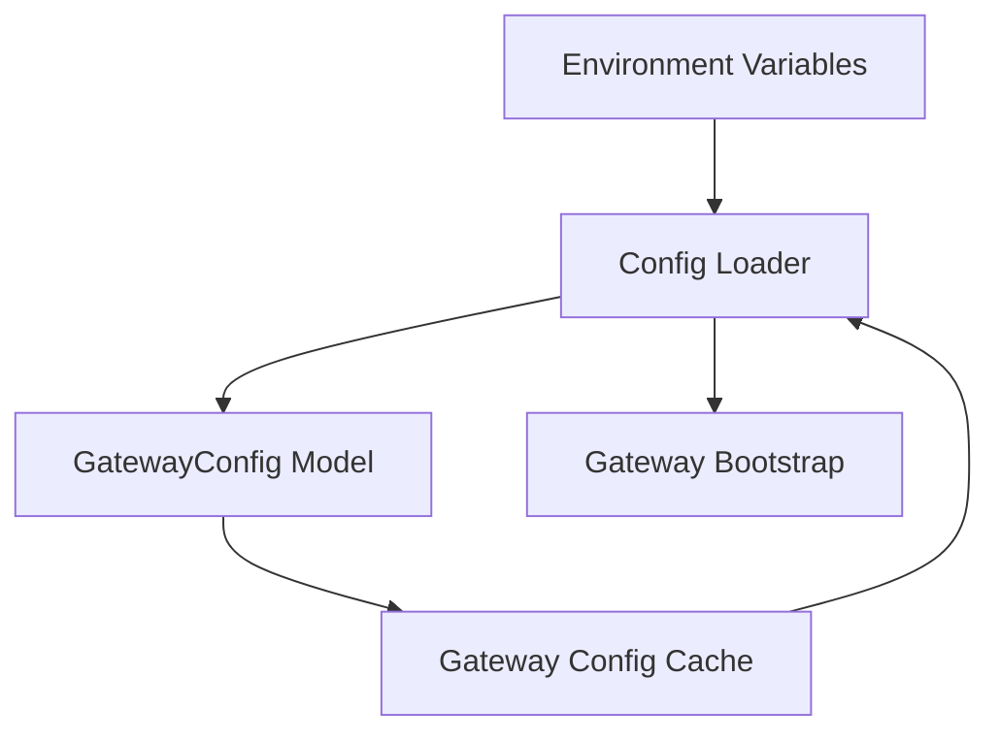
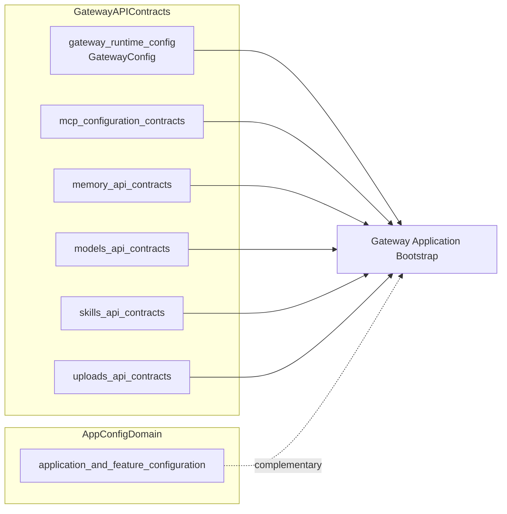
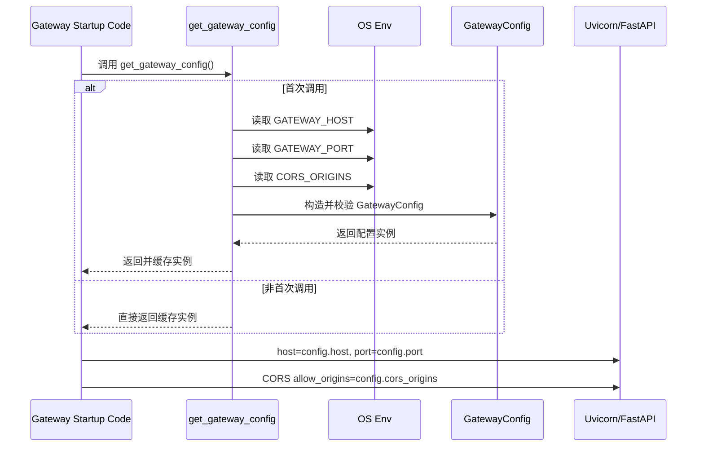

# gateway_runtime_config 模块文档

## 模块定位与设计目标

`gateway_runtime_config` 模块是 `gateway_api_contracts` 下最基础、最靠近运行时基础设施的一层配置模块，其核心组件是 `backend.src.gateway.config.GatewayConfig`（以及同文件中的配置加载函数 `get_gateway_config`）。这个模块的职责非常聚焦：为 API Gateway 进程提供“如何监听网络”和“允许哪些前端跨域访问”的最小配置集。

从架构角度看，这个模块的价值不在于复杂功能，而在于“启动路径稳定性”。网关服务是系统对外入口之一，任何配置读取错误都会直接影响服务可用性。通过将配置模型做成一个轻量 `Pydantic BaseModel`，并用环境变量驱动加载，该模块实现了三个目标：第一，保持默认可启动（零配置可跑本地开发）；第二，支持容器化/云环境注入（通过环境变量覆盖）；第三，避免启动期多处重复读取环境变量（通过进程内缓存）。

它与 `application_and_feature_configuration` 中的 `AppConfig` 形成分工互补：`AppConfig` 更偏“应用功能行为配置”，而 `GatewayConfig` 专注“网关网络入口运行时配置”。这类分层有助于减少配置耦合，也让部署脚本和运维侧更容易定位问题。

---

## 核心组件详解

## `GatewayConfig`（`backend.src.gateway.config.GatewayConfig`）

`GatewayConfig` 是一个 `Pydantic` 数据模型，用于定义并约束网关运行配置。它包含三个字段：

- `host: str`：网关监听地址，默认 `"0.0.0.0"`。
- `port: int`：网关监听端口，默认 `8001`。
- `cors_origins: list[str]`：允许的 CORS 源，默认 `["http://localhost:3000"]`。

虽然字段数量少，但每个字段都直接影响 API 可达性和安全边界：

`host` 决定服务绑定网卡范围。默认 `0.0.0.0` 便于容器和局域网调试，但在安全收敛场景中可能需要改为回环地址或特定网卡地址。`port` 关系到反向代理映射和服务发现，属于部署契约的一部分。`cors_origins` 直接参与浏览器同源策略豁免，若配置错误会导致前端访问失败或暴露过宽跨域权限。

`Pydantic` 的引入为这个模型提供了基本类型校验和更清晰的语义声明（`Field(description=...)`），便于后续自动文档化或调试输出。

### 代码片段

```python
class GatewayConfig(BaseModel):
    """Configuration for the API Gateway."""

    host: str = Field(default="0.0.0.0", description="Host to bind the gateway server")
    port: int = Field(default=8001, description="Port to bind the gateway server")
    cors_origins: list[str] = Field(
        default_factory=lambda: ["http://localhost:3000"],
        description="Allowed CORS origins",
    )
```

---

## `get_gateway_config()`：运行时加载与缓存入口

尽管当前模块树只将 `GatewayConfig` 标注为核心组件，但真正驱动运行时行为的是同文件函数 `get_gateway_config()`。它负责读取环境变量、构建配置对象并进行进程内缓存。

函数行为可以概括为“惰性初始化 + 全局缓存”：第一次调用时读取环境变量并创建 `GatewayConfig`，后续调用直接返回同一实例。这种模式减少了重复解析和多处分叉逻辑，让业务层只需要统一调用一个函数。

### 参数与返回值

该函数无入参，返回值类型为 `GatewayConfig`。

### 环境变量映射

- `GATEWAY_HOST` → `GatewayConfig.host`
- `GATEWAY_PORT` → `GatewayConfig.port`（通过 `int(...)` 显式转换）
- `CORS_ORIGINS` → `GatewayConfig.cors_origins`（按英文逗号 `,` 分割）

### 代码片段

```python
_gateway_config: GatewayConfig | None = None


def get_gateway_config() -> GatewayConfig:
    """Get gateway config, loading from environment if available."""
    global _gateway_config
    if _gateway_config is None:
        cors_origins_str = os.getenv("CORS_ORIGINS", "http://localhost:3000")
        _gateway_config = GatewayConfig(
            host=os.getenv("GATEWAY_HOST", "0.0.0.0"),
            port=int(os.getenv("GATEWAY_PORT", "8001")),
            cors_origins=cors_origins_str.split(","),
        )
    return _gateway_config
```

### 副作用与状态语义

该函数会修改模块级全局变量 `_gateway_config`。这意味着：

1. 进程生命周期内配置近似不可变（除非手动重置全局变量）。
2. 环境变量在首次调用后再变更，不会自动反映到返回值。
3. 测试中若多用例共享进程，可能出现配置“串用”现象，需要主动清理缓存。

---

## 模块内部结构与关系



上图体现了最关键的依赖路径：环境变量并不直接散落在业务代码中读取，而是集中通过 `get_gateway_config()` 注入到 `GatewayConfig`，再由网关启动代码消费。这种收敛降低了系统中“隐式配置入口”的数量。

---

## 在系统中的位置与上下游协作

`gateway_runtime_config` 位于 `gateway_api_contracts` 体系中，承担网关运行参数定义。它不处理具体 API 请求/响应契约（这些在 memory/models/skills/uploads 等 router 合约中），也不承担应用层复杂特性开关（那是 `AppConfig` 及其子配置的职责）。



这张图强调“横向组合”关系：网关启动时同时需要运行时绑定配置与各类 API 合约对象，但这些模块各自独立，便于演进和替换。

相关模块请参考：

- [gateway_api_contracts.md](gateway_api_contracts.md)
- [application_and_feature_configuration.md](application_and_feature_configuration.md)
- [app_config_orchestration.md](app_config_orchestration.md)

---

## 运行流程（从启动到生效）



这条流程说明了模块的关键原则：配置是“启动期读入，运行期复用”。如果你预期环境变量热更新后自动生效，那么当前实现并不满足该需求。

---

## 使用方式与配置示例

最推荐的调用方式是让启动入口统一获取配置，再分发给框架层组件。

```python
from backend.src.gateway.config import get_gateway_config

config = get_gateway_config()
print(config.host, config.port, config.cors_origins)
```

在 FastAPI 中通常会这样用：

```python
from fastapi import FastAPI
from fastapi.middleware.cors import CORSMiddleware
from backend.src.gateway.config import get_gateway_config

config = get_gateway_config()
app = FastAPI()

app.add_middleware(
    CORSMiddleware,
    allow_origins=config.cors_origins,
    allow_credentials=True,
    allow_methods=["*"],
    allow_headers=["*"],
)
```

典型环境变量配置（Docker/K8s/本地 shell）：

```bash
export GATEWAY_HOST="0.0.0.0"
export GATEWAY_PORT="8001"
export CORS_ORIGINS="http://localhost:3000,https://your-prod-frontend.example.com"
```

---

## 边界行为、错误条件与运维注意事项

当前实现简单可靠，但有一些容易踩坑的地方。

`GATEWAY_PORT` 在加载时通过 `int(...)` 解析，如果环境变量为非数字字符串，函数会直接抛 `ValueError`。这会在启动阶段失败，通常是好事（fail-fast），但你需要在部署流水线中提前校验环境变量合法性。

`CORS_ORIGINS` 由 `split(",")` 解析，未做 `strip()` 去空白，也未过滤空值。例如配置成 `"http://a.com, http://b.com,"` 会得到包含前导空格和空字符串的列表，可能导致 CORS 匹配异常。生产建议确保字符串格式规范，或在未来扩展时加入清洗逻辑。

由于有全局缓存 `_gateway_config`，模块对“运行时动态改配置”不友好。除非重启进程或者显式重置该全局变量，否则不会重新读取环境变量。这在大多数后端服务中是可接受的，但在需要热更新配置的场景里属于已知限制。

线程安全方面，首次初始化没有显式锁。极端并发下多个线程可能同时判空并重复构造实例，最终通常仍会稳定在某个实例上，风险较低但不是严格单例。如果你在多线程高并发启动流程中有强一致单例要求，可以考虑加锁或使用 `functools.lru_cache` 风格包装。

---

## 可扩展性建议

如果未来要增强该模块，建议优先保持“简单且可预期”的原则。

第一，可以加入更严格的字段校验与规范化。例如对 `cors_origins` 做空白修剪和空值过滤，或者在 `GatewayConfig` 中增加验证器，避免不合法配置带到框架层才暴露问题。

第二，可以提供测试辅助接口（例如 `reset_gateway_config_for_test()`），避免测试环境直接操作模块私有全局变量，提高可测试性。

第三，如果系统需要配置热加载，可以引入显式刷新函数（如 `reload_gateway_config()`）并限制使用边界，避免在业务请求处理中频繁重载导致行为不一致。

第四，若未来网关还要承载 TLS、代理头、速率限制等入口级参数，可以继续扩展 `GatewayConfig` 字段，但建议维持“网关运行时配置”边界，不与业务功能配置混合。

---

## 总结

`gateway_runtime_config` 是一个小而关键的基础模块。它通过 `GatewayConfig` 提供结构化配置模型，通过 `get_gateway_config()` 提供统一加载入口与缓存策略，确保网关具备稳定可启动、易部署、低耦合的运行时配置能力。对开发者而言，理解它的关键点不是 API 数量，而是其“初始化时机、缓存语义、环境变量解析规则”这三件事：只要这三点掌握清楚，就能在开发、测试、部署和排障中避免绝大多数配置相关问题。
