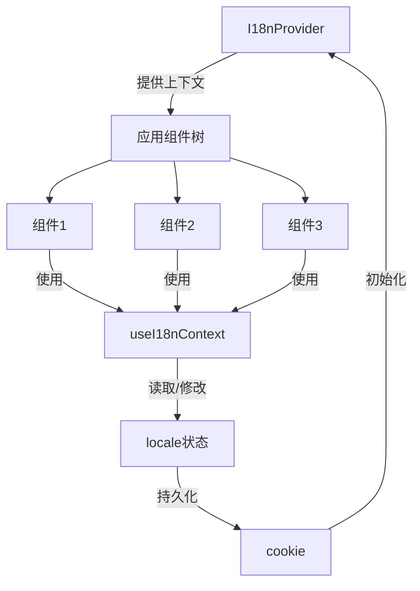

# i18n 国际化模块

## 概述

i18n 模块是前端应用的国际化核心组件，提供了多语言支持的基础设施。该模块负责管理应用程序的语言状态、语言切换功能以及翻译文本的类型定义，确保应用可以为不同语言的用户提供本地化体验。

### 设计理念

i18n 模块采用 React Context API 实现语言状态的全局管理，通过集中式的翻译类型定义确保代码的类型安全。模块设计遵循以下原则：

1. **类型安全**：使用 TypeScript 接口明确定义翻译结构，避免翻译键的拼写错误
2. **状态持久化**：语言设置会自动保存到 cookie 中，确保用户刷新页面后语言偏好保持一致
3. **易于扩展**：模块化设计使得添加新语言或新翻译项变得简单直接
4. **全局可访问**：通过 React Context 使得任何组件都能轻松访问和修改当前语言设置

## 核心组件

### I18nContextType

`I18nContextType` 是 i18n 模块的核心类型定义，描述了国际化上下文的结构。

```typescript
export interface I18nContextType {
  locale: Locale;
  setLocale: (locale: Locale) => void;
}
```

#### 功能说明

- **locale**：当前应用使用的语言标识符
- **setLocale**：用于切换应用语言的函数，接收新的语言标识符作为参数

### I18nProvider

`I18nProvider` 是一个 React 组件，为应用提供国际化上下文。它负责初始化语言状态、管理语言切换逻辑，并将语言状态持久化到 cookie 中。

#### 组件属性

| 属性名 | 类型 | 必填 | 描述 |
|--------|------|------|------|
| children | ReactNode | 是 | 需要访问国际化上下文的子组件树 |
| initialLocale | Locale | 是 | 应用初始化时使用的语言 |

#### 内部实现

```typescript
export function I18nProvider({
  children,
  initialLocale,
}: {
  children: ReactNode;
  initialLocale: Locale;
}) {
  const [locale, setLocale] = useState<Locale>(initialLocale);

  const handleSetLocale = (newLocale: Locale) => {
    setLocale(newLocale);
    document.cookie = `locale=${newLocale}; path=/; max-age=31536000`;
  };

  return (
    <I18nContext.Provider value={{ locale, setLocale: handleSetLocale }}>
      {children}
    </I18nContext.Provider>
  );
}
```

#### 工作原理

1. **状态管理**：使用 React 的 `useState` 钩子管理当前语言状态
2. **语言切换处理**：`handleSetLocale` 函数不仅更新状态，还将新语言设置保存到 cookie 中
3. **上下文提供**：通过 `I18nContext.Provider` 将语言状态和设置函数提供给子组件

#### 状态持久化

语言设置通过 cookie 持久化，有效期为一年（31536000 秒），确保用户下次访问时仍能使用上次选择的语言。

### useI18nContext

`useI18nContext` 是一个自定义 React 钩子，用于在组件中访问国际化上下文。

#### 使用示例

```typescript
function LanguageSwitcher() {
  const { locale, setLocale } = useI18nContext();
  
  return (
    <div>
      <span>当前语言: {locale}</span>
      <button onClick={() => setLocale('en')}>English</button>
      <button onClick={() => setLocale('zh')}>中文</button>
    </div>
  );
}
```

#### 错误处理

如果在 `I18nProvider` 之外使用此钩子，会抛出错误："useI18n must be used within I18nProvider"，确保钩子只在有效的上下文中使用。

### Translations 接口

`Translations` 接口定义了应用程序中所有翻译文本的结构，确保类型安全和一致性。

#### 结构概览

该接口组织成多个功能区域，包括：

- **locale**：语言元数据，如本地名称
- **common**：通用术语，如"主页"、"设置"、"删除"等
- **welcome**：欢迎页面相关文本
- **clipboard**：剪贴板操作相关文本
- **inputBox**：输入框组件相关文本
- **sidebar**：侧边栏组件相关文本
- **breadcrumb**：面包屑导航相关文本
- **workspace**：工作区相关文本
- **conversation**：对话界面相关文本
- **chats**：聊天列表相关文本
- **pages**：页面标题相关文本
- **toolCalls**：工具调用相关文本
- **subtasks**：子任务相关文本
- **settings**：设置页面相关文本

#### 关键特性

1. **结构化组织**：翻译按键的功能分类组织，便于查找和维护
2. **动态翻译**：部分翻译项是函数，支持参数化翻译，如 `toolCalls.useTool: (toolName: string) => string`
3. **类型安全**：完整的 TypeScript 类型定义，确保翻译键的正确性
4. **图标支持**：部分翻译项包含 LucideIcon 类型，用于界面展示

## 架构与组件关系

i18n 模块的架构基于 React Context API，采用 Provider-Consumer 模式：



### 数据流程

1. **初始化**：应用启动时，`I18nProvider` 接收 `initialLocale` 参数（通常从 cookie 读取）并设置初始状态
2. **状态消费**：组件通过 `useI18nContext` 钩子访问当前语言和设置函数
3. **语言切换**：用户选择新语言时，调用 `setLocale` 函数
4. **状态更新**：`setLocale` 更新 React 状态并将新语言保存到 cookie
5. **重新渲染**：语言状态变化触发使用该上下文的组件重新渲染

## 模块集成

### 在应用中集成

要在应用中使用 i18n 模块，需要在应用的根组件级别包裹 `I18nProvider`：

```typescript
// app.tsx 或类似根组件
import { I18nProvider } from '@/core/i18n/context';
import { getCookie } from '@/utils/cookies'; // 假设有一个获取 cookie 的工具函数

function App() {
  // 从 cookie 读取语言设置，或使用默认语言
  const initialLocale = getCookie('locale') || 'en';
  
  return (
    <I18nProvider initialLocale={initialLocale}>
      {/* 应用的其余组件 */}
      <MainApp />
    </I18nProvider>
  );
}
```

### 与其他模块的关系

i18n 模块是一个基础服务模块，为整个前端应用提供国际化支持。它被以下模块依赖：

- **frontend_core_domain_types_and_state**：作为核心领域类型的一部分
- 几乎所有前端 UI 组件：需要显示翻译文本的组件都会直接或间接依赖此模块

## 使用指南

### 基本使用

1. **访问当前语言**：
```typescript
function CurrentLanguageDisplay() {
  const { locale } = useI18nContext();
  return <div>当前语言: {locale}</div>;
}
```

2. **切换语言**：
```typescript
function LanguageSelector() {
  const { setLocale } = useI18nContext();
  
  return (
    <div>
      <button onClick={() => setLocale('en')}>English</button>
      <button onClick={() => setLocale('zh')}>中文</button>
      <button onClick={() => setLocale('ja')}>日本語</button>
    </div>
  );
}
```

### 翻译文本使用

虽然 i18n 模块定义了翻译结构，但实际的翻译函数通常会结合此模块使用。典型的使用模式可能是：

```typescript
import { useI18nContext } from '@/core/i18n/context';
import { getTranslation } from '@/core/i18n/utils'; // 假设有一个获取翻译的工具函数

function WelcomeComponent() {
  const { locale } = useI18nContext();
  const t = getTranslation(locale); // 获取当前语言的翻译对象
  
  return (
    <div>
      <h1>{t.welcome.greeting}</h1>
      <p>{t.welcome.description}</p>
    </div>
  );
}
```

### 参数化翻译

对于包含动态内容的翻译，可以使用函数形式的翻译项：

```typescript
function ToolCallComponent({ toolName }: { toolName: string }) {
  const { locale } = useI18nContext();
  const t = getTranslation(locale);
  
  return <div>{t.toolCalls.useTool(toolName)}</div>;
}
```

## 扩展与维护

### 添加新的翻译项

1. 在 `Translations` 接口中添加新的翻译键：
```typescript
export interface Translations {
  // ... 现有翻译
  newFeature: {
    title: string;
    description: string;
    action: string;
  };
}
```

2. 在各个语言的翻译文件中实现这个新结构。

### 添加新语言支持

1. 确保 `Locale` 类型包含新语言的标识符
2. 创建新语言的翻译文件，实现完整的 `Translations` 接口
3. 在语言选择组件中添加新语言选项

## 注意事项与限制

### 注意事项

1. **Context 提供者位置**：确保 `I18nProvider` 包裹所有需要国际化功能的组件，最好放在应用的根级别
2. **服务端渲染**：在 SSR 环境中使用时，需要特别注意 cookie 的读取和设置，避免 hydration 不匹配
3. **语言切换重渲染**：语言切换会导致所有使用 `useI18nContext` 的组件重新渲染，对于性能敏感的应用可能需要优化
4. **类型安全性**：始终使用 TypeScript 类型检查，避免直接使用字符串键访问翻译

### 已知限制

1. 该模块仅提供状态管理和类型定义，不包含实际的翻译加载和切换逻辑
2. 语言设置仅保存在 cookie 中，没有用户账户级别的持久化
3. 不支持动态加载语言包，所有语言可能需要在构建时包含在应用中

### 错误处理

- 在 `I18nProvider` 之外使用 `useI18nContext` 会抛出错误，确保组件树结构正确
- 如果 cookie 中保存的语言标识符无效，应该有降级处理逻辑，回退到默认语言

## 相关模块

- [frontend_core_domain_types_and_state](frontend_core_domain_types_and_state.md)：i18n 模块是该模块的子模块，提供核心的国际化类型和功能
