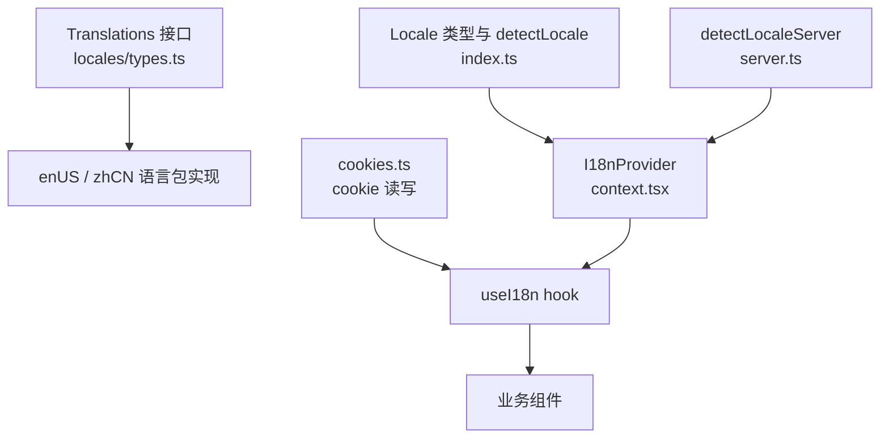
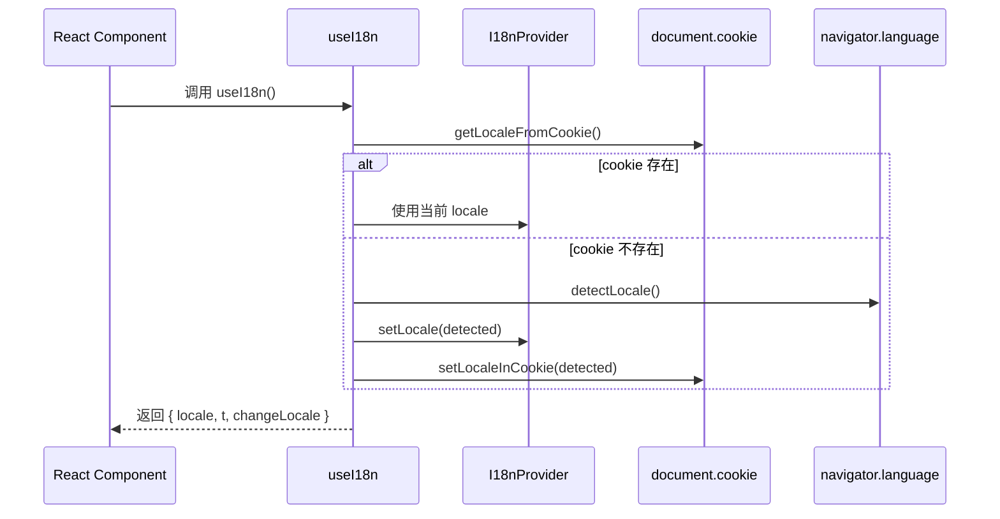
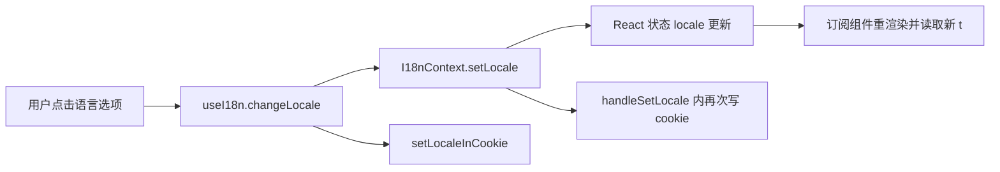

# i18n_context_and_translation_contracts 模块文档

## 模块概述

`i18n_context_and_translation_contracts` 是前端国际化体系中的“运行时状态 + 静态翻译契约”组合模块。它的核心目标并不是直接渲染任何 UI，而是定义一套稳定且可类型检查的国际化基础能力：一方面通过 React Context 在客户端维护当前语言（`locale`）并提供切换能力，另一方面通过 `Translations` 接口约束所有语言包的结构一致性。

这个模块存在的根本原因是：在一个包含聊天、工具调用、技能安装、设置页等复杂 UI 的应用里，国际化如果只靠“自由字符串字典”很快会变得不可维护。该模块通过 TypeScript 接口把翻译键、动态文案函数、甚至部分 UI 元信息（如 `LucideIcon`）统一纳入合同（contract），使“新增文案、重构页面、添加新语言”这几类高频变更都能在编译期被发现问题，而不是在运行时才暴露缺失翻译。

从系统分层上看，它属于 `frontend_core_domain_types_and_state` 下的子模块，负责向上层页面/组件提供语言状态与翻译对象。它与线程、任务、消息分组等状态模型并列，是前端基础领域层的一部分。若需要该层的整体上下文，可参考 [frontend_core_domain_types_and_state.md](frontend_core_domain_types_and_state.md)。

---

## 核心组件一览

本模块在模块树中声明的核心组件有两个：

- `frontend.src.core.i18n.context.I18nContextType`
- `frontend.src.core.i18n.locales.types.Translations`

实际运行时还依赖同目录下的辅助实现（`hooks.ts`、`cookies.ts`、`index.ts`、`server.ts`、`locales/*.ts`），这些文件共同完成了“契约定义 → 语言包实现 → 上下文注入 → 读写持久化”的闭环。



上图体现了该模块的关键设计：`Translations` 保证“翻译结构正确”，`I18nProvider` 保证“语言状态可传播”，`cookies.ts/server.ts` 保证“语言偏好可跨刷新与 SSR 传递”，`useI18n` 则把这些能力封装成业务可直接消费的入口。

---

## 组件详解

## 1) I18nContextType（`context.tsx`）

`I18nContextType` 是国际化上下文的最小合同：

- `locale: Locale`：当前语言
- `setLocale: (locale: Locale) => void`：切换语言

它的价值在于把“语言状态的读写接口”限制在非常稳定、非常小的 API 面上。业务组件无需知道 cookie、浏览器语言探测、语言包映射等细节，只需通过这个合同完成语言切换。

### I18nProvider 的内部行为

`I18nProvider` 接收 `initialLocale` 并通过 `useState` 建立当前语言状态；当调用 `handleSetLocale` 时，它会做两件事：

1. 调用 `setLocale(newLocale)` 触发 React 状态更新和重渲染。
2. 写入 `document.cookie = locale=...`，保存 1 年有效期。

这意味着语言切换既是“内存状态变更”，也是“持久化变更”。两者绑定在一个入口里，避免了业务层遗漏持久化。

### useI18nContext 的约束

`useI18nContext()` 在 `I18nContext` 为空时会抛错：`useI18n must be used within I18nProvider`。这是一个有意的 fail-fast 机制，确保任何使用国际化的组件都必须处于 Provider 树内，避免静默降级造成文案混乱。

---

## 2) Translations（`locales/types.ts`）

`Translations` 是整个模块中最关键的“翻译结构契约”。它不是松散对象，而是一个层级很深、覆盖多个功能域的强类型接口，包括 `common`、`welcome`、`inputBox`、`toolCalls`、`settings` 等大量分组。

该接口有两个值得重点理解的设计点。

第一，它支持**动态文案函数**，例如 `toolCalls.moreSteps(count)`、`toolCalls.useTool(toolName)`。这让复数、插值等场景不必退回字符串拼接，避免语序错误和重复逻辑。

第二，它将部分**UI 元信息**纳入翻译结构，比如 `inputBox.suggestions[].icon: LucideIcon`。这使“提示词 + 图标”成为同一语言包内的配置单元，便于按语言定制建议内容，但也提高了接口耦合度（翻译文件不仅是文案，还承载展示数据）。

由于 `en-US.ts` 与 `zh-CN.ts` 都声明为 `const xxx: Translations`，任何缺失键、错误类型、函数签名不匹配都会在编译期报错。这是该模块能长期稳定演进的核心保障。

---

## 运行机制与流程

## 启动阶段（客户端）

`useI18n()` 在挂载时执行 `useEffect`：若 cookie 中没有保存语言，则调用 `detectLocale()`（基于 `navigator.language`，中文前缀归并为 `zh-CN`，否则 `en-US`）并写入状态与 cookie。



这个流程确保首次访问也能快速选择合理语言，并在后续访问保持一致。

## 切换阶段（用户交互）

当用户在设置页或语言切换器触发 `changeLocale(newLocale)` 时，`useI18n` 会调用 Context 的 `setLocale`，随后写 cookie。Context 内部的 `handleSetLocale` 也会写 cookie，因此当前实现中存在“双写 cookie”行为（详见下文注意事项）。



---

## 与系统其他模块的关系

这个模块是前端基础能力模块，不直接依赖业务 API 契约，但会被几乎所有显示文本的 UI 消费，尤其是设置、消息区、工具调用展示、技能安装引导等界面。你可以把它理解为“跨模块横切能力”。

为避免重复说明，相关模块建议交叉阅读：

- 前端核心领域总览：[frontend_core_domain_types_and_state.md](frontend_core_domain_types_and_state.md)
- 设置页相关契约与状态：[settings.md](settings.md)
- 消息分组与渲染语义：[messages.md](messages.md)

---

## 使用方式

### 在应用根部注入 Provider

```tsx
import { I18nProvider } from "@/core/i18n/context";
import { detectLocaleServer } from "@/core/i18n/server";

export default async function RootLayout({ children }: { children: React.ReactNode }) {
  const initialLocale = await detectLocaleServer();

  return (
    <html>
      <body>
        <I18nProvider initialLocale={initialLocale}>
          {children}
        </I18nProvider>
      </body>
    </html>
  );
}
```

### 在组件中消费翻译与切换语言

```tsx
"use client";

import { useI18n } from "@/core/i18n/hooks";

export function LanguageSwitcher() {
  const { locale, t, changeLocale } = useI18n();

  return (
    <div>
      <p>{t.settings.appearance.languageTitle}: {locale}</p>
      <button onClick={() => changeLocale("en-US")}>English</button>
      <button onClick={() => changeLocale("zh-CN")}>中文</button>
    </div>
  );
}
```

### 新增语言的扩展步骤

新增语言时建议按“类型先行”方式实施。先保持 `Translations` 不变，创建新的语言包文件并完整实现，再扩展 `Locale` 联合类型与 `translations` 映射，最后在语言选择 UI 暴露入口。这样可以借助编译器一次性定位所有遗漏点。

```ts
// index.ts
export type Locale = "en-US" | "zh-CN" | "ja-JP";

// hooks.ts
const translations: Record<Locale, Translations> = {
  "en-US": enUS,
  "zh-CN": zhCN,
  "ja-JP": jaJP,
};
```

---

## 边界条件、错误条件与已知限制

当前实现整体清晰，但存在几个需要维护者明确认知的行为约束。

第一，`useI18nContext` 脱离 Provider 会直接抛错。这是正确的保护，但在单测、Storybook、孤立组件开发中容易踩坑，务必提供测试级 Provider 包装器。

第二，cookie 写入存在重复路径：`I18nProvider.handleSetLocale` 与 `useI18n.changeLocale` 都会写 cookie。功能上通常无害，但会带来语义重复，未来若 cookie 属性（如 `SameSite`、`Secure`）需要调整，容易出现不一致修改。

第三，`detectLocaleServer()` 直接把 cookie 值 `as Locale` 返回，缺少白名单校验。若 cookie 被篡改为未知值，类型系统不会在运行时保护你，最终可能导致 `translations[locale]` 取值异常。建议加显式校验与回退。

第四，`detectLocale()` 只区分“zh 前缀”与“其他”，因此并不支持更细的区域语言映射（如 `zh-TW`、`en-GB`）。如果未来需要多区域精细化文案，这一策略需要升级。

第五，`Translations` 接口很大，任何新增字段都会要求所有语言包同步更新。虽然这是类型安全优势，但在快速迭代中会增加合并冲突概率。建议在团队流程中为 i18n 变更配置专门检查清单。

---

## 维护与演进建议

从可维护性角度，建议把“状态管理”和“持久化策略”进一步解耦。例如保留 Context 只负责状态，统一由 `cookies.ts` 负责写 cookie，避免双写。对于服务端语言探测，建议与客户端使用同一套 `Locale` 校验函数，保证 SSR/CSR 一致。

从契约治理角度，建议继续保持 `Translations` 的强类型约束，但可以评估是否将 `icon` 等展示元数据从文案合同中拆分到独立 UI 配置层，以降低翻译文件的职责复杂度。

---

## 小结

`i18n_context_and_translation_contracts` 模块用非常少的运行时代码，建立了前端国际化的关键基础设施：用 `I18nContextType` 管理可观察语言状态，用 `Translations` 约束可编译验证的翻译合同，再辅以 cookie 与 locale 探测完成跨刷新一致性。它的价值不在“功能多”，而在“把混乱的国际化需求收敛为稳定接口”，从而支撑整个前端系统在多语言场景下的可维护演进。
