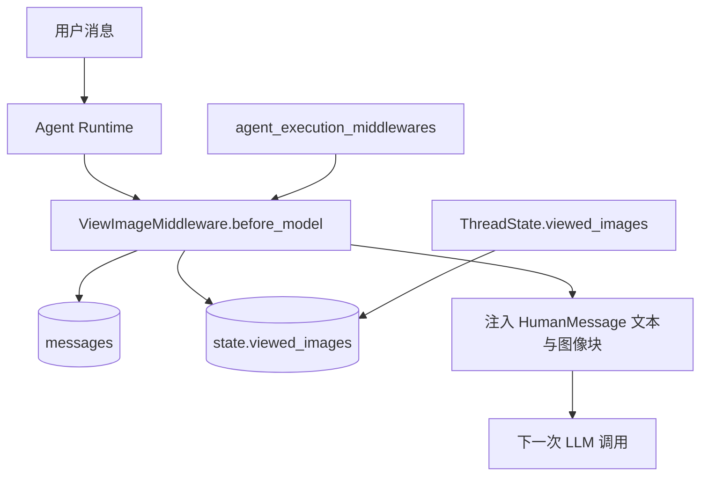
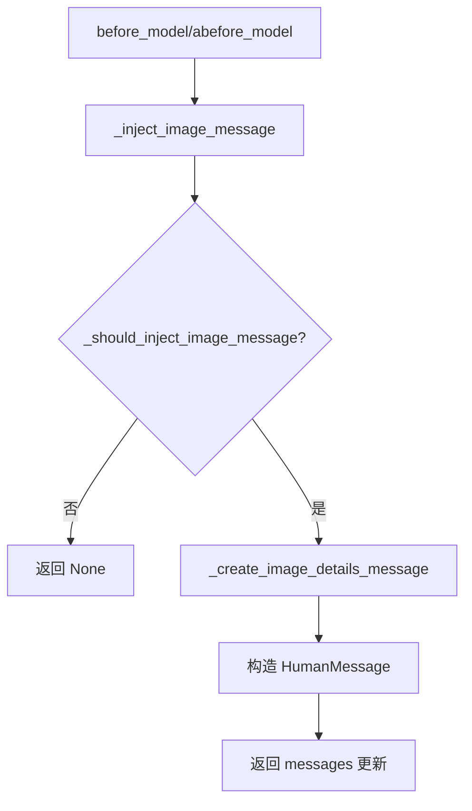
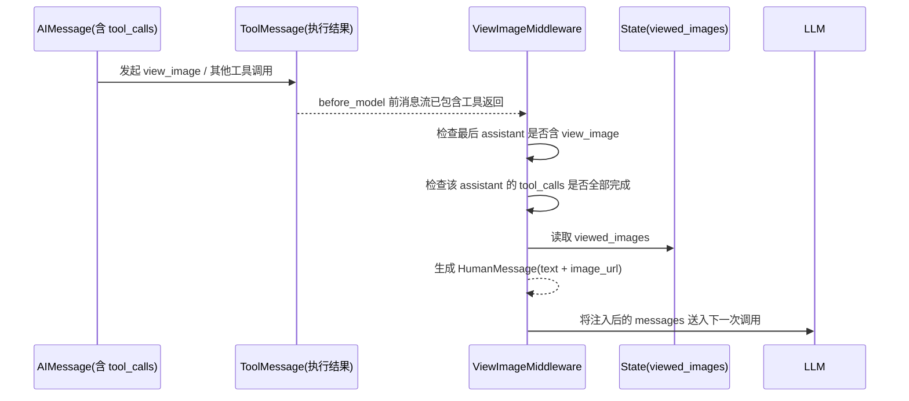

# image_context_injection 模块文档

## 1. 模块概述与设计动机

`image_context_injection` 模块对应的核心实现是 `ViewImageMiddleware`，位于 `backend/src/agents/middlewares/view_image_middleware.py`。这个模块的目标非常明确：当代理（agent）通过 `view_image` 工具读取了图像后，在下一次调用 LLM 之前，自动把图像内容（包括可供多模态模型读取的 base64 data URL）注入到会话消息中，使模型“看见”图像并继续推理。

这个设计解决了一个常见断层：工具层已经拿到了图像，但模型上下文层并不知道图像数据本体，只知道“工具被调用过”。如果没有中间件桥接，模型通常只能依据工具返回的文字摘要进行推理，难以进行细粒度视觉分析。`ViewImageMiddleware` 的存在，本质上是把“工具结果”转换成“模型可直接消费的消息内容”，并且自动完成，不需要用户再次明确要求“请分析刚才那张图”。

从系统分层上看，它属于 [agent_execution_middlewares.md](agent_execution_middlewares.md) 中“模型调用前拦截（before_model）”的一环，并依赖线程状态中的 `viewed_images` 字段契约（见 [thread_state_schema.md](thread_state_schema.md)）。因此，它既是执行链路中的增强器，也是线程状态语义的直接消费者。

---

## 2. 核心组件

本模块只有两个核心组件，但职责划分清晰：

- `ViewImageMiddlewareState`
- `ViewImageMiddleware`

### 2.1 `ViewImageMiddlewareState`

`ViewImageMiddlewareState` 继承 `AgentState`，并声明了一个与线程状态兼容的可选字段：

```python
class ViewImageMiddlewareState(AgentState):
    viewed_images: NotRequired[dict[str, ViewedImageData] | None]
```

这里的关键点在于“兼容而非重复定义”：它不重新发明图像结构，而是复用 `ViewedImageData`（`base64` + `mime_type`），从而与 `ThreadState.viewed_images` 保持一致的数据语言。这意味着该中间件可直接插入已有 thread-state 驱动的运行时，不需要额外适配层。

### 2.2 `ViewImageMiddleware`

`ViewImageMiddleware` 继承 `AgentMiddleware[ViewImageMiddlewareState]`，在 `before_model` / `abefore_model` 阶段执行同一套注入逻辑。它不是简单地“只要有图片就注入”，而是通过一组内部判定函数确保时机正确、注入一次且尽量不重复。

其核心能力可概括为：识别最近一条 assistant 工具调用消息、确认其中 `view_image` 调用已经全部完成、构造混合内容（text + image_url）的 `HumanMessage`，并以增量状态更新方式回写到消息流。

---

## 3. 架构关系与模块定位



该图展示了 `ViewImageMiddleware` 的中心位置：它读取 `messages` 与 `viewed_images`，在满足条件时追加一条人类消息，再交给 LLM。它不负责产生 `viewed_images`（通常来自 `view_image` 工具执行及状态合并），也不负责模型输出消费，而是负责“注入桥接”这一步。

进一步看依赖边界：状态结构由 [thread_state_schema.md](thread_state_schema.md) 定义，执行生命周期由中间件框架与 [agent_execution_middlewares.md](agent_execution_middlewares.md) 描述。本模块只处理图像上下文注入策略本身。

---

## 4. 内部执行流程（逐步拆解）



这个流程看似简单，但 `_should_inject_image_message` 内部包含多重保护条件，是模块正确性的核心。

### 4.1 定位最近 assistant 消息：`_get_last_assistant_message`

该函数倒序遍历消息列表，取最后一个 `AIMessage`。这样可避免被后续 `ToolMessage` 或 `HumanMessage` 干扰，确保判定目标是“最近一次模型回应”。如果找不到 assistant 消息，直接不注入。

### 4.2 检查是否包含 `view_image` 调用：`_has_view_image_tool`

该函数首先确认消息存在 `tool_calls`，再判断是否有任一调用的 `name == "view_image"`。这一步避免把普通工具轮次或纯文本轮次误识别为图像注入场景。

### 4.3 确认工具调用已全部完成：`_all_tools_completed`

这个函数是时序保障点。它会：

1. 收集 assistant 消息中所有 tool call id；
2. 找到该 assistant 消息在 `messages` 中的位置；
3. 只扫描其后的 `ToolMessage`，收集已完成的 tool_call_id；
4. 用子集关系判断“assistant 发起的调用是否都已返回”。

只有全部完成才允许注入，这避免了在“工具尚未全部返回”时注入不完整上下文。

### 4.4 去重注入保护：`_should_inject_image_message`

在通过前三个条件后，中间件还会检查 assistant 消息之后是否已经存在包含以下标记文案的 `HumanMessage`：

- `Here are the images you've viewed`
- `Here are the details of the images you've viewed`

若命中则认为已注入过，避免重复插入。该策略是基于内容特征的轻量去重，不引入额外状态位。

### 4.5 构造多模态内容块：`_create_image_details_message`

当允许注入时，会从 `state["viewed_images"]` 读取每张图的 `mime_type` 与 `base64`，构建 `content_blocks`：

- 先加一段文本标题：`Here are the images you've viewed:`
- 对每张图追加文本描述（路径 + MIME）
- 若有 base64，追加 `{"type": "image_url", "image_url": {"url": "data:...;base64,..."}}`

因此生成的是“文本 + 图像”的混合消息内容，兼容多模态输入模式。

---

## 5. 关键方法详解

### 5.1 `_inject_image_message(state)`

这是内部总入口：先做 should-check，再构造消息，最后返回增量更新 `{"messages": [human_msg]}`。若不满足条件则返回 `None`。

返回值语义非常重要：

- 返回 `None` 表示中间件无状态更新；
- 返回字典表示要向当前 state 追加消息（由运行时合并）。

函数内部还有一条 `print` 日志：

```python
print("[ViewImageMiddleware] Injecting image details message with images before LLM call")
```

这有助于排查“为什么模型突然拿到了图像上下文”，但在高并发生产环境中应考虑统一日志体系替代 `print`。

### 5.2 `before_model(...)` 与 `abefore_model(...)`

同步与异步版本都直接调用 `_inject_image_message`，保证行为一致。`runtime` 参数当前未使用，但保留是为了满足中间件接口契约，也为后续扩展（例如基于 runtime 元数据做注入策略）留下接口空间。

---

## 6. 组件交互时序



这里有一个容易忽略但很关键的行为：`_all_tools_completed` 是针对“同一条 assistant 消息中的全部 tool calls”做完整性判断，而不只是 `view_image` 一项。换句话说，只要该 assistant 消息还有别的工具调用未返回，图像注入也会延后。这是保守而稳定的设计，代价是注入时机会更严格。

---

## 7. 使用方式与实践示例

### 7.1 在 agent 中启用中间件

```python
from src.agents.middlewares.view_image_middleware import ViewImageMiddleware

middlewares = [
    # ...其他 middlewares
    ViewImageMiddleware(),
]
```

通常它应放在“消息修复类中间件”之后、“最终模型调用”之前，以保证其看到的是完整消息序列。

### 7.2 期望状态形态

```python
state = {
    "messages": [...],
    "viewed_images": {
        "/workspace/images/chart.png": {
            "base64": "iVBORw0KGgoAAA...",
            "mime_type": "image/png"
        }
    }
}
```

`viewed_images` 的 key 通常是图片路径，value 符合 `ViewedImageData`。如果 `base64` 为空，该图片只会注入文本条目，不会注入 `image_url` 块。

### 7.3 注入后消息示意

```python
HumanMessage(
    content=[
        {"type": "text", "text": "Here are the images you've viewed:"},
        {"type": "text", "text": "\n- **/workspace/images/chart.png** (image/png)"},
        {
            "type": "image_url",
            "image_url": {"url": "data:image/png;base64,iVBORw0KGgoAAA..."}
        }
    ]
)
```

这条消息会在下一次 LLM 调用中作为用户输入的一部分参与推理。

---

## 8. 配置、扩展与定制建议

本模块本身没有显式配置类（不像 `TitleMiddleware` 依赖 `TitleConfig`），主要是策略硬编码在方法内部。如果你要扩展，通常从以下方向入手。

第一，注入触发策略可定制。当前是“最后 assistant 含 `view_image` 且全部工具完成且未注入过”。你可以加白名单/黑名单工具策略，或放宽 `_all_tools_completed` 为“只要求 view_image 完成”。这会改变时序行为，应配套回归测试。

第二，注入内容模板可定制。当前标题文案和每项描述是英文固定文本。如果系统需要 i18n 或更结构化提示（例如加入图像尺寸、来源、OCR 摘要），可以改造 `_create_image_details_message` 的 content block 生成逻辑。

第三，幂等判定机制可升级。当前通过字符串包含判断“是否已注入”，简单有效但不绝对稳健。更可靠的做法是写入明确标记（例如 `additional_kwargs` 标识、或 state 中单独记录 last_injected_turn_id）。

---

## 9. 边界条件、错误条件与已知限制

### 9.1 重要边界条件

- 当 `messages` 为空、或没有任何 `AIMessage` 时，不会注入。
- 当最后一个 assistant 消息没有 `tool_calls`，不会注入。
- 当 assistant 消息含 `view_image`，但同消息中的任意工具调用未完成，也不会注入。
- 当 assistant 后已存在匹配标记文案的人类消息，不会重复注入。

### 9.2 潜在误判与脆弱点

去重逻辑依赖文本匹配，存在两种风险：其一，若其他逻辑恰好生成同文案，会导致误判为“已注入”；其二，若未来改了模板文案但忘记同步匹配条件，可能导致重复注入。

另外，`messages.index(assistant_msg)` 假设对象可在列表中准确定位。若消息对象被复制或重建，且等价性定义特殊，理论上可能触发 `ValueError` 分支（当前实现会直接返回 `False`，即不注入）。

### 9.3 资源与性能限制

注入的是 base64 原图数据，token 与上下文体积压力可能很大，尤其在多图或大图场景。即使模型支持多模态，也可能遇到：

- 输入成本上升；
- 上下文窗口占用过多；
- 推理延迟增加。

因此在生产环境建议配合上游控制（图像尺寸、数量、压缩比、轮次清理策略），并结合 `thread_state_schema` 中 `viewed_images` 清理语义进行生命周期管理。

---

## 10. 与其他模块的关系（建议阅读路径）

为了避免本文重复解释共享机制，建议按以下顺序交叉阅读：

1. [agent_execution_middlewares.md](agent_execution_middlewares.md)：了解中间件在整体执行链的位置与顺序。
2. [thread_state_schema.md](thread_state_schema.md)：理解 `viewed_images` 字段及合并/清理语义。
3. [agent_memory_and_thread_context.md](agent_memory_and_thread_context.md)：从线程状态与记忆管理的更高层视角理解状态流。
4. [thread_bootstrap_and_upload_context.md](thread_bootstrap_and_upload_context.md)：对比其他“上下文注入型中间件”的设计模式。

---

## 11. 维护建议

维护 `image_context_injection` 时，建议优先保障三件事：触发时序正确、注入幂等可靠、消息体积可控。这个模块虽小，却直接影响模型输入质量。任何看似微小的条件修改（例如工具完成判定、去重规则、文案模板）都可能导致“模型看不到图”或“反复注入图”，应配套覆盖以下回归场景：单图、多图、混合工具调用、异步路径、重复调用轮次、空/损坏 base64 数据。
