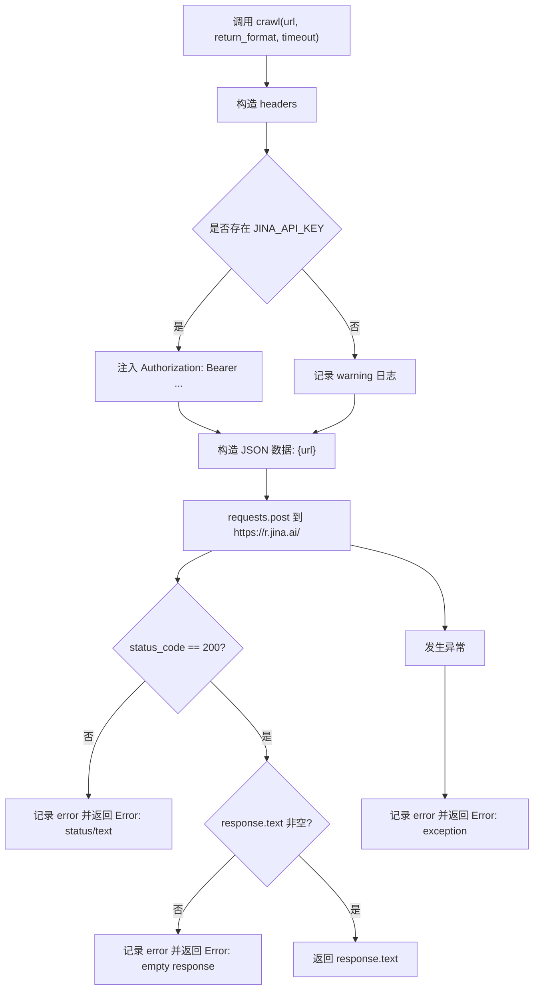
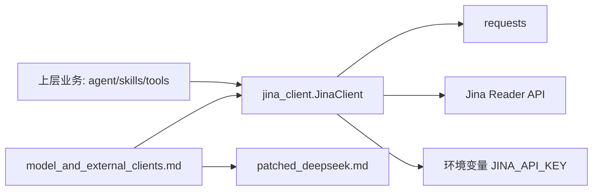
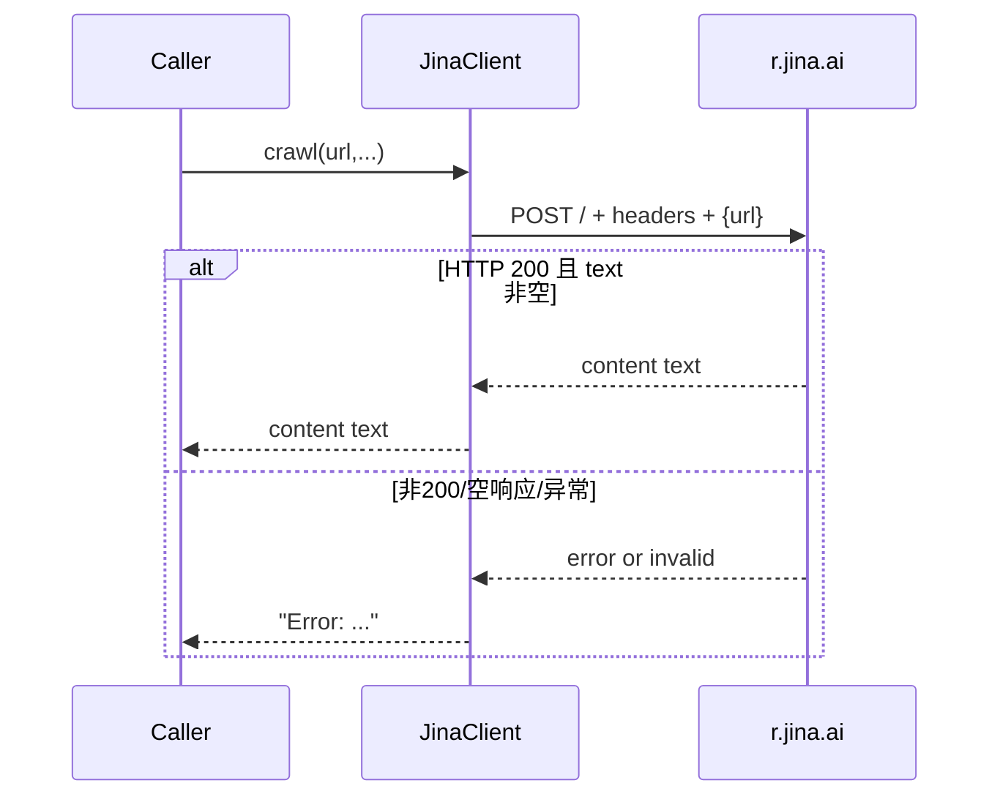

# jina_client 模块文档

## 模块定位与设计目标

`jina_client` 是 `model_and_external_clients` 体系中的一个轻量级外部服务适配模块，核心职责是把“抓取网页内容”这一能力封装成稳定、统一、可调用的 Python 接口。它当前只包含一个核心类 `JinaClient`，并通过单一方法 `crawl()` 对接 Jina Reader API（`https://r.jina.ai/`）。

这个模块存在的价值，不在于复杂业务编排，而在于**隔离外部 API 的调用细节**。上层功能（例如 agent 工具链、技能执行或内容提取流程）不需要关心请求头如何构造、认证头如何注入、HTTP 错误码如何判断、空响应如何处理等问题；它们只需调用 `crawl(url, ...)` 并处理字符串结果。通过这种边界划分，系统可以在不影响上游调用方的情况下替换抓取服务、调整认证策略或增强容错逻辑。

从当前实现看，`JinaClient` 采用“最少依赖、同步调用、字符串返回”的策略：依赖 `requests` 发起 HTTP 请求，读取环境变量 `JINA_API_KEY` 可选鉴权，返回原始文本或以 `Error:` 前缀编码的错误信息。该策略降低了接入门槛，但也引入了调用侧需要主动辨别结果状态的约束。

---

## 核心组件详解

### `backend.src.community.jina_ai.jina_client.JinaClient`

`JinaClient` 是模块唯一公开核心对象。它本质上是一个无状态客户端（不持久化连接、不缓存结果、不维护会话上下文）。这使得它可以被安全地复用在多处业务代码中；但同时也意味着所有调用都是真实网络请求，响应性能和可用性完全受外部服务与网络条件影响。

#### 方法签名

```python
class JinaClient:
    def crawl(self, url: str, return_format: str = "html", timeout: int = 10) -> str:
        ...
```

#### 参数说明

- `url: str`：目标网页地址，最终会被放入 JSON 体 `{"url": url}` 发送到 Jina Reader API。
- `return_format: str = "html"`：通过请求头 `X-Return-Format` 传给后端服务，控制返回格式。
- `timeout: int = 10`：通过请求头 `X-Timeout` 传递的超时值（字符串形式），由 Jina API 解释其语义。

#### 返回值语义

该方法返回类型统一为 `str`，但语义有两种：

1. 正常路径：返回 `response.text`（抓取内容本体）。
2. 异常路径：返回 `"Error: ..."` 格式的错误字符串。

这是一种“弱类型错误信号”设计：调用方不能只根据类型判断成功与否，必须检查文本内容。

#### 内部执行过程



上图体现了该类的关键控制流：先构建请求上下文，再执行远程调用，随后做两层响应有效性校验（状态码、内容是否为空），最终输出成功内容或统一错误字符串。

#### 关键副作用

`crawl()` 虽然接口简单，但包含明显副作用：

- 向外部网络发起 HTTP POST 请求。
- 读取进程环境变量 `JINA_API_KEY`。
- 通过 `logging` 输出 warning/error 日志。

这些副作用意味着它不适合在纯函数语义场景直接使用，测试时通常需要 mock `requests.post` 与 `os.getenv`。

---

## 与系统其他模块的关系

`jina_client` 位于 `model_and_external_clients` 模块下，与 `patched_deepseek` 同层，职责类似：都把第三方能力封装为系统内部可调用对象。不同的是，`patched_deepseek` 偏向模型调用路径，而 `jina_client` 偏向网页内容获取路径。



在架构上，`JinaClient` 通常作为“外部 I/O 边界点”被注入到工具或执行器中。若后续需要支持多抓取后端（例如内部爬虫服务），推荐在这一层再抽象一个接口（如 `WebCrawlerClient`），并让 `JinaClient` 成为其中一个实现。

---

## 使用方式与实践建议

### 基础调用

```python
from backend.src.community.jina_ai.jina_client import JinaClient

client = JinaClient()
result = client.crawl("https://example.com")

if result.startswith("Error:"):
    print("crawl failed:", result)
else:
    print("crawl ok, length=", len(result))
```

### 指定格式与超时

```python
content = client.crawl(
    url="https://example.com/docs",
    return_format="html",   # 具体可选值以 Jina Reader API 为准
    timeout=20,
)
```

### 认证配置（推荐生产环境）

```bash
export JINA_API_KEY="your_api_key_here"
```

不配置 `JINA_API_KEY` 并不会阻止调用，但会触发 warning，且可能更容易受限流影响。

---

## 错误处理模型与调用方约定

当前实现选择“捕获异常并返回错误字符串”而不是“抛出异常”。这使调用链不容易因未处理异常而中断，但也要求调用方遵守约定：

1. 必须检查是否 `startswith("Error:")`。
2. 不要把返回值直接当作可信内容写入下游（如摘要、向量化、知识库存储）而不做状态判定。



这种契约简单直接，但在大型系统中建议进一步封装为结构化结果（如 `success/data/error_code/error_message`），以避免字符串匹配带来的脆弱性。

---

## 边界条件、限制与潜在风险

`JinaClient` 的实现非常精简，开发和维护成本低，但也有一些必须明确的工程边界：

- **无重试机制**：任何瞬时网络抖动都会直接失败并返回错误字符串。
- **无请求级 timeout 参数传递给 requests**：当前 `timeout` 仅写入 header `X-Timeout`，并未作为 `requests.post(..., timeout=...)` 的客户端 socket 超时。若网络层卡住，可能出现比预期更长的阻塞。
- **异常捕获范围过宽**：`except Exception` 会吞掉所有异常类型，便于兜底但不利于精细观测。
- **错误语义非结构化**：调用方只能通过字符串约定识别错误类型，难以做稳定分流。
- **返回格式校验缺失**：模块不校验 `return_format` 合法性，非法值由远端决定如何处理。

在高可靠场景中，建议上层加一层适配器实现：

- 幂等重试（指数退避）；
- 熔断与降级；
- 结构化错误对象；
- 统一指标埋点（成功率、耗时、错误分类）。

---

## 可扩展方向（面向维护者）

如果你要增强该模块，可以优先考虑以下演进路线：

1. **引入类型化返回**：例如 `CrawlResult`（`ok: bool`, `content: str | None`, `error: str | None`）。
2. **增加客户端网络超时**：在 `requests.post` 里显式设置 `timeout=(connect_timeout, read_timeout)`。
3. **增加可配置 endpoint**：允许通过配置切换默认 `https://r.jina.ai/`。
4. **增加重试策略**：对 429/5xx/网络异常做有限重试。
5. **增加可观测性**：记录请求耗时、状态码分布、错误类型统计。

示例（伪代码，展示演进思路）：

```python
@dataclass
class CrawlResult:
    ok: bool
    content: str | None = None
    error: str | None = None

class JinaClient:
    def crawl_safe(self, url: str, return_format: str = "html", timeout: int = 10) -> CrawlResult:
        raw = self.crawl(url, return_format, timeout)
        if raw.startswith("Error:"):
            return CrawlResult(ok=False, error=raw)
        return CrawlResult(ok=True, content=raw)
```

---

## 测试建议

为了确保该模块在 CI 中稳定，建议把外部依赖全部 mock 掉，重点覆盖以下路径：

- 存在/不存在 `JINA_API_KEY` 时 header 是否符合预期。
- `status_code != 200` 时是否返回 `Error:` 并记录日志。
- `status_code == 200` 但空文本时是否返回空响应错误。
- `requests.post` 抛异常时是否被捕获并转为错误字符串。

---

## 相关文档

- [model_and_external_clients.md](model_and_external_clients.md)：外部模型与客户端总览，说明本模块在整体中的位置。
- [patched_deepseek.md](patched_deepseek.md)：同层外部客户端模块，对比不同第三方接入形态。
- [backend_operational_utilities.md](backend_operational_utilities.md)：通用后端工具能力，可用于补充网络与文本处理链路。

如果你正在梳理端到端 agent 执行链路，可进一步参考 [agent_execution_middlewares.md](agent_execution_middlewares.md) 与 [application_and_feature_configuration.md](application_and_feature_configuration.md) 了解此类客户端通常如何被上层配置与调用。
