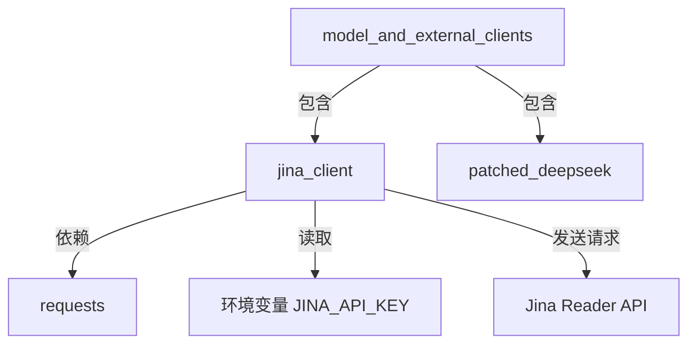

# Jina Client 模块文档

## 概述

`jina_client` 模块提供了与 Jina AI API 交互的客户端功能，主要用于网页内容爬取。该模块是系统中外部服务集成的重要组成部分，通过封装 Jina Reader API 实现网页内容的获取和转换功能。

该模块的核心组件是 `JinaClient` 类，它提供了简单易用的接口来调用 Jina AI 的网页内容爬取服务，支持多种返回格式和超时设置。

## 核心组件

### JinaClient 类

`JinaClient` 是该模块的唯一核心类，负责处理与 Jina AI API 的所有交互。

#### 主要功能

- 网页内容爬取：通过 Jina Reader API 获取指定 URL 的网页内容
- 格式转换：支持将网页内容转换为多种格式（如 HTML、文本等）
- 请求配置：支持自定义超时时间和 API 密钥认证
- 错误处理：完善的异常捕获和错误日志记录

#### 类定义和方法

```python
class JinaClient:
    def crawl(self, url: str, return_format: str = "html", timeout: int = 10) -> str:
        # 实现内容...
```

##### crawl 方法

**功能说明**：
该方法是 `JinaClient` 类的核心方法，用于发送请求到 Jina Reader API 并获取网页内容。

**参数**：
- `url` (str): 要爬取的网页 URL，必需参数
- `return_format` (str): 返回内容的格式，默认为 "html"。支持的格式取决于 Jina AI API
- `timeout` (int): 请求超时时间（秒），默认为 10 秒

**返回值**：
- `str`: 成功时返回 Jina API 返回的网页内容；失败时返回以 "Error: " 开头的错误信息

**工作流程**：
1. 构建请求头，包括内容类型、返回格式和超时设置
2. 检查环境变量中是否设置了 `JINA_API_KEY`，如果有则添加到请求头中
3. 如果没有设置 API 密钥，记录警告日志
4. 构建请求数据，包含要爬取的 URL
5. 发送 POST 请求到 Jina Reader API 端点
6. 检查响应状态码，如果不是 200 则记录错误并返回错误信息
7. 检查响应内容是否为空，如果为空则记录错误并返回错误信息
8. 成功时返回响应内容
9. 捕获所有异常，记录错误并返回错误信息

## 配置和使用

### 环境变量配置

使用该模块时，建议配置以下环境变量：

- `JINA_API_KEY`: Jina AI API 密钥，用于提高请求速率限制。获取地址：https://jina.ai/reader

### 基本使用示例

```python
from backend.src.community.jina_ai.jina_client import JinaClient

# 创建客户端实例
client = JinaClient()

# 基本用法 - 使用默认配置爬取网页
content = client.crawl("https://example.com")

# 自定义返回格式和超时时间
content = client.crawl("https://example.com", return_format="text", timeout=30)

# 处理返回结果
if content.startswith("Error:"):
    print(f"爬取失败: {content}")
else:
    print(f"爬取成功，内容长度: {len(content)}")
```

## 架构和依赖关系

`jina_client` 模块是 `model_and_external_clients` 模块的子模块，与 `patched_deepseek` 模块并列，共同构成系统的外部服务客户端层。

该模块的依赖关系如下：



### 与其他模块的关系

- 该模块作为外部服务客户端，可能被系统中的其他模块（如代理执行模块、技能模块等）调用
- 它与同属 `model_and_external_clients` 的 `patched_deepseek` 模块类似，都是系统与外部服务交互的桥梁

## 错误处理和边界情况

### 错误处理机制

`JinaClient` 类实现了完善的错误处理机制：

1. **API 密钥警告**：当未设置 `JINA_API_KEY` 环境变量时，会记录警告日志提示用户
2. **HTTP 状态码检查**：检查响应状态码，非 200 状态码会被视为错误
3. **空响应检查**：即使状态码为 200，空响应内容也会被视为错误
4. **通用异常捕获**：使用 try-except 块捕获所有可能的异常

### 常见错误情况

1. **网络连接失败**：当无法连接到 Jina API 时
2. **超时**：请求超过设定的超时时间
3. **无效 URL**：提供的 URL 格式不正确或无法访问
4. **API 限制**：超过 API 速率限制或配额
5. **认证失败**：API 密钥无效（如果设置了）

### 返回值约定

- 成功时：直接返回 API 响应内容
- 失败时：返回以 "Error: " 开头的字符串，包含具体错误信息

## 注意事项和限制

1. **API 密钥**：虽然不设置 API 密钥也可以使用，但有速率限制。生产环境建议配置 API 密钥
2. **超时设置**：合理设置超时时间，避免长时间阻塞。对于复杂网页，可能需要较长的超时时间
3. **返回格式**：支持的返回格式取决于 Jina AI API，使用前请参考官方文档
4. **错误处理**：调用方应始终检查返回值是否以 "Error: " 开头，以处理可能的失败情况
5. **日志记录**：所有错误和警告都会通过标准 logging 模块记录，建议在应用中配置合适的日志级别

## 扩展和定制

当前 `JinaClient` 类设计简洁，如果需要扩展功能，可以考虑：

1. 添加更多 Jina AI API 支持的参数
2. 实现缓存机制，避免重复请求相同 URL
3. 添加重试逻辑，处理临时网络问题
4. 支持异步请求，提高并发性能
5. 添加更多返回格式的解析和处理

## 相关模块

- [model_and_external_clients](model_and_external_clients.md)：包含本模块的父模块，提供系统的外部服务客户端功能
- [patched_deepseek](patched_deepseek.md)：同属 model_and_external_clients 的另一个子模块，提供 DeepSeek 模型的客户端功能
