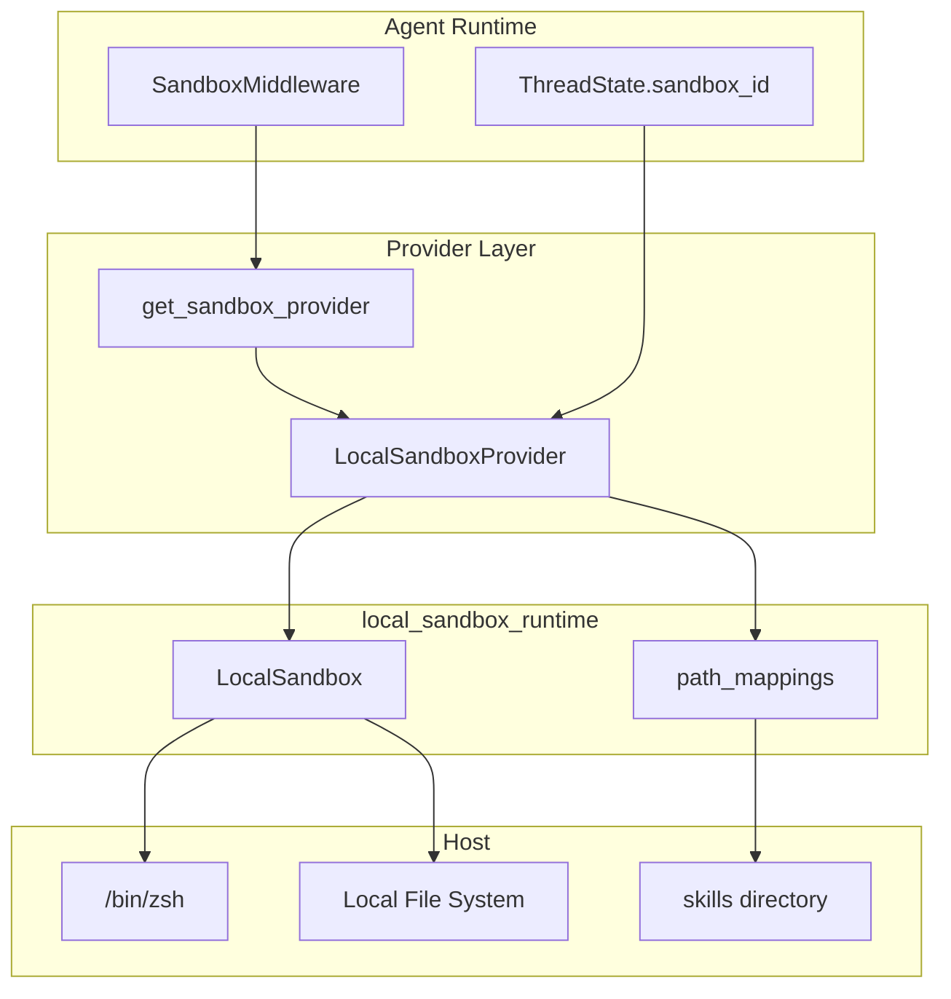
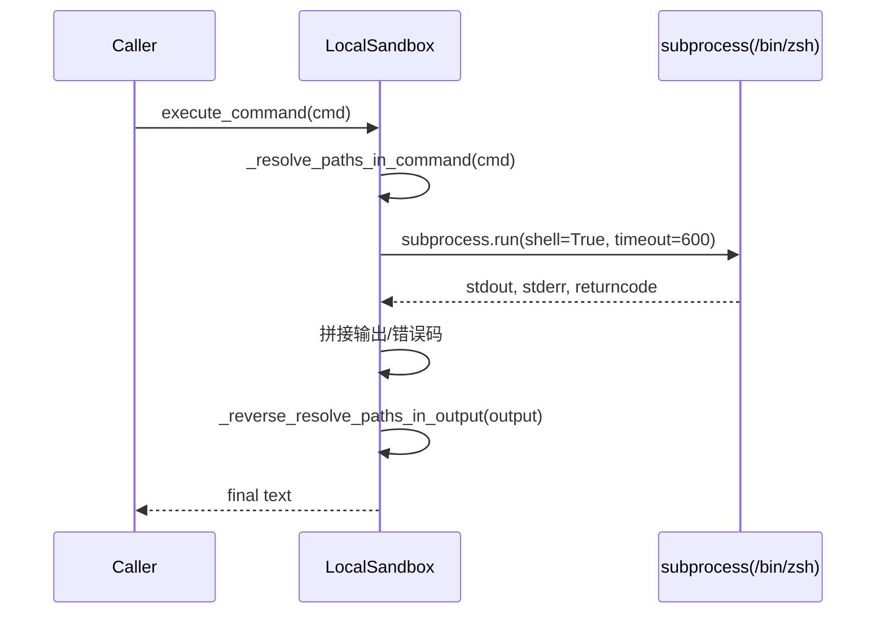
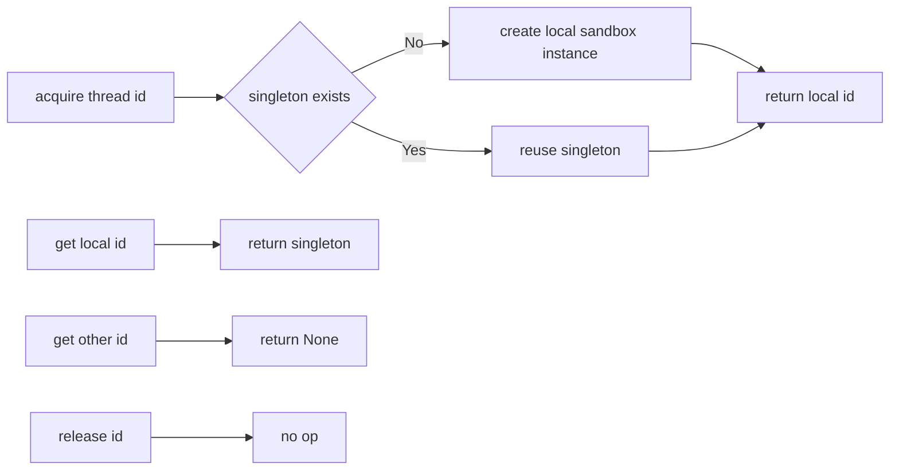
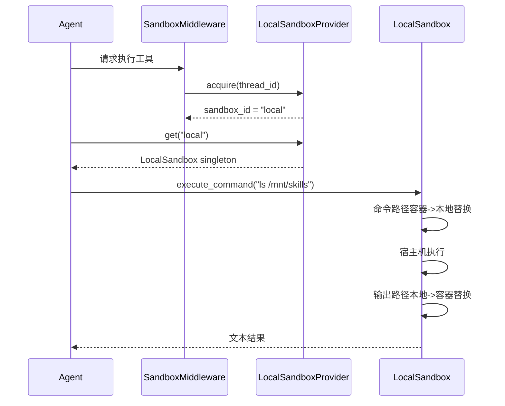

# local_sandbox_runtime 模块文档

## 1. 模块定位与设计动机

`local_sandbox_runtime` 是 `sandbox_core_runtime` 体系中的“本地实现分支”。它提供了一个满足 `Sandbox` / `SandboxProvider` 抽象契约的轻量后端，使 Agent 与工具链在不依赖容器编排的情况下，仍能执行命令、读写文件、列目录并维持统一的沙箱接口语义。

这个模块存在的核心价值是开发效率与兼容性平衡。对于本地开发、调试、CI 快速验证、功能回归等场景，容器型后端（如 `sandbox_aio_community_backend`）往往引入额外启动和运维成本；而 `LocalSandbox` 直接使用宿主机能力，显著缩短反馈回路。同时它通过“容器路径 ↔ 本地路径”的双向映射机制，尽量保持与容器后端一致的路径体验，避免上层逻辑因后端切换而产生大量条件分支。

需要明确的是：该模块强调的是**运行时兼容**，不是**安全隔离**。它不会构建真正的沙箱边界，命令执行权限基本等价于当前进程用户权限，因此适合可信输入与开发环境，不适合不可信代码执行。

---

## 2. 核心组件总览

本模块只有两个核心组件：

- `backend.src.sandbox.local.local_sandbox.LocalSandbox`
- `backend.src.sandbox.local.local_sandbox_provider.LocalSandboxProvider`

`LocalSandbox` 负责实例能力：路径映射、命令执行、文件系统操作。`LocalSandboxProvider` 负责生命周期入口：初始化映射并提供单例实例。它们共同实现了 `sandbox_abstractions` 中定义的契约（见 [sandbox_abstractions.md](sandbox_abstractions.md)），并被 Agent 侧中间件通过 `SandboxProvider` 接口统一使用（见 [agent_sandbox_binding.md](agent_sandbox_binding.md)）。

---

## 3. 架构关系与系统位置



这张图反映了该模块在整体系统中的职责边界：中间件和线程状态只关心 `sandbox_id`，不关心本地实现细节；Provider 将该 ID 绑定到具体实例；LocalSandbox 执行最终操作。这样上层可在 `local_sandbox_runtime` 与容器后端之间切换，而调用路径保持一致。

---

## 4. `LocalSandbox`：本地执行能力实现

### 4.1 初始化与内部状态

`LocalSandbox` 继承 `Sandbox` 抽象类，构造参数如下：

- `id: str`：沙箱实例标识。
- `path_mappings: dict[str, str] | None`：容器路径到宿主机路径的映射表。

初始化时仅保存映射，不进行路径可用性校验。这意味着配置错误通常会在后续命令执行或文件访问时才暴露。

### 4.2 路径正向解析 `_resolve_path(path)`

该方法把“容器视角路径”转换为“宿主机真实路径”。实现采用**最长前缀优先**策略，避免宽泛映射覆盖更具体映射。例如同时存在 `/mnt/skills` 与 `/mnt/skills/public` 时，会优先命中后者。

如果路径不匹配任何映射，方法返回原始输入。这一行为保证了“映射是增强而非强制”，但也意味着未映射路径将直接在本机环境解释。

### 4.3 路径反向解析 `_reverse_resolve_path(path)`

该方法用于把本地路径还原为容器路径，核心目的是对上游输出保持容器语义一致。实现会先 `Path(...).resolve()` 归一化，再按本地路径长度逆序匹配。返回值可能是映射后的容器路径，也可能是原路径。

这一设计减少了宿主机绝对路径泄露到模型上下文的概率，使多后端切换时提示与工具路径语义更稳定。

### 4.4 输出路径批量反向替换 `_reverse_resolve_paths_in_output(output)`

命令输出通常是自由文本，可能混入多个路径片段。该方法按映射表逐条构造正则，搜索输出中的本地路径并回写为容器路径。它在 `execute_command` 与 `list_dir` 的返回阶段被调用。

这一步是本模块可用性的关键。若省略该步骤，工具调用方会看到宿主机路径，从而在后续命令中继续使用“非容器语义”路径，逐步偏离系统约定。

### 4.5 命令路径批量替换 `_resolve_paths_in_command(command)`

在执行 shell 前，`LocalSandbox` 会扫描命令字符串中的容器路径并替换成本地路径。其正则匹配规则关注常见 shell 分隔符（空格、引号、管道、重定向等）边界，尽量避免把整段命令误吞。

由于是文本替换而非 shell AST 解析，这里天然存在边界场景：极复杂命令、转义链、here-doc 等语法下仍可能出现替换遗漏或意外匹配。若你扩展该模块到高复杂脚本场景，建议补充针对真实命令样本的回归测试。

### 4.6 命令执行 `execute_command(command) -> str`



执行细节如下：

- 使用 `subprocess.run`，并固定 `executable="/bin/zsh"`、`shell=True`、`capture_output=True`、`text=True`、`timeout=600`。
- 返回结果合并 `stdout` 与 `stderr`，若失败则追加 `Exit Code`。
- 无输出时返回 `"(no output)"`。
- 最终输出会做路径反向映射。

这个方法的副作用非常直接：它在宿主机执行真实命令，并可能读写本机任意可访问路径。`shell=True` 同时带来命令注入风险，因此调用来源必须可控。

### 4.7 目录与文件操作

`LocalSandbox` 提供四个文件系统接口，均先做路径解析：

- `list_dir(path, max_depth=2) -> list[str]`：委托 `src.sandbox.local.list_dir.list_dir`，并把结果路径反向映射回容器语义。
- `read_file(path) -> str`：直接文本读取。
- `write_file(path, content, append=False) -> None`：必要时自动创建父目录，支持覆盖或追加。
- `update_file(path, content: bytes) -> None`：二进制写入，必要时自动建目录。

这些方法不吞异常。权限不足、路径不存在、编码异常等会直接向上抛出，由调用链上层处理。

### 4.8 `list_dir` 依赖行为说明

`list_dir` 的底层函数具有以下行为：

- 根路径不是目录时返回空列表。
- 遍历深度受 `max_depth` 控制（默认 2）。
- 遇到 `PermissionError` 会跳过对应分支。
- 返回绝对路径并排序，目录项追加 `/` 后缀。

因此，`LocalSandbox.list_dir` 最终输出是“容器语义化后的排序路径列表”，但其深度与忽略策略取决于底层工具函数实现。

---

## 5. `LocalSandboxProvider`：单例生命周期管理

### 5.1 设计模型

`LocalSandboxProvider` 实现了一个模块级单例：`_singleton: LocalSandbox | None`。`acquire` 首次调用创建 `LocalSandbox("local")`，后续统一复用。返回的 `sandbox_id` 固定为 `"local"`。

这与容器后端常见的“每线程/每会话实例”模式不同。它更像进程级共享执行环境，换来更低开销，但牺牲了隔离性。

### 5.2 路径映射初始化 `_setup_path_mappings()`

Provider 在构造时尝试加载配置并构造映射，重点是 skills 目录：

1. 通过 `get_app_config()` 获取应用配置。
2. 读取 `config.skills.get_skills_path()` 作为本地目录。
3. 读取 `config.skills.container_path` 作为容器目录。
4. 若本地目录存在则加入映射表。

若配置加载或路径解析失败，代码只打印 warning，不中断 Provider 创建。这使系统在“无 skills 映射”情况下仍可运行，但依赖 `/mnt/skills` 的命令会更容易失败。

### 5.3 acquire/get/release 语义



`thread_id` 在本实现中只用于接口兼容，不参与实例划分。`release` 为空实现，注释也明确指出本地后端设计目标是跨轮复用，不在每轮清理。

---

## 6. 关键流程：从 Agent 命令到本地执行结果



从这个流程可以看出，本模块的“兼容性魔法”发生在 `LocalSandbox` 内部双向路径替换。上层调用不需要知道后端是本地还是容器，只需要遵守统一容器路径约定。

---

## 7. 配置与使用

### 7.1 最小配置示例

```yaml
sandbox:
  use: src.sandbox.local.local_sandbox_provider:LocalSandboxProvider

skills:
  path: ../skills
  container_path: /mnt/skills
```

该配置让全局 provider 解析到本地实现，并在 skills 目录存在时自动建立映射。

### 7.2 代码调用示例

```python
from src.sandbox.local.local_sandbox_provider import LocalSandboxProvider

provider = LocalSandboxProvider()
sandbox_id = provider.acquire(thread_id="t-001")  # "local"
sandbox = provider.get(sandbox_id)

print(sandbox.execute_command("ls /mnt/skills"))
sandbox.write_file("/tmp/demo.txt", "hello\n")
print(sandbox.read_file("/tmp/demo.txt"))
```

### 7.3 自定义映射示例

```python
from src.sandbox.local.local_sandbox import LocalSandbox

sandbox = LocalSandbox(
    id="local",
    path_mappings={
        "/mnt/skills": "/abs/dev/skills",
        "/workspace": "/abs/dev/workspace",
    },
)
```

当映射前缀存在重叠时，代码会自动采用最长前缀优先策略。

---

## 8. 扩展点与实现建议

如果你计划基于本模块二次开发，推荐优先考虑以下方向：

- 将 `print` 警告替换为统一日志系统，便于可观测性与审计。
- 在 `execute_command` 增加异常捕获与标准化错误结构（如 `TimeoutExpired`）。
- 为命令执行增加安全策略（白名单、黑名单、`shell=False` 改造等）。
- 若需要会话隔离，可把单例模式改为“按 thread_id 管理实例/工作目录”。

如果目标是生产级隔离执行，建议优先采用容器后端而不是在本地实现上硬扩展，参考 [sandbox_aio_community_backend.md](sandbox_aio_community_backend.md)。

---

## 9. 边界条件、错误场景与限制

- 安全边界：无真实沙箱隔离，执行权限等同宿主机进程权限。
- 平台依赖：固定使用 `/bin/zsh`，在无 zsh 或非类 Unix 环境可能不可用。
- 超时行为：命令超时（600 秒）会抛异常，当前实现未内部兜底。
- 输出替换偏差：正则路径替换在极端文本下可能误替换或漏替换。
- 并发共享：全局单例导致多线程/多会话共享同一执行上下文。
- 释放语义：`release()` 是 no-op，调用后不会清理状态或文件。

这些限制并非 bug，而是该模块“开发优先、轻量实现”定位的直接结果。

---

## 10. 与其他文档的关系

为避免重复阅读，建议按以下顺序扩展：

1. 抽象契约： [sandbox_abstractions.md](sandbox_abstractions.md)
2. Agent 绑定流程： [agent_sandbox_binding.md](agent_sandbox_binding.md)
3. 沙箱运行时全景： [sandbox_core_runtime.md](sandbox_core_runtime.md)
4. 生产容器后端： [sandbox_aio_community_backend.md](sandbox_aio_community_backend.md)
5. 配置结构总览： [application_and_feature_configuration.md](application_and_feature_configuration.md)

通过这条链路，可以从“接口定义 → 生命周期绑定 → 本地实现 → 生产实现”建立完整认知。