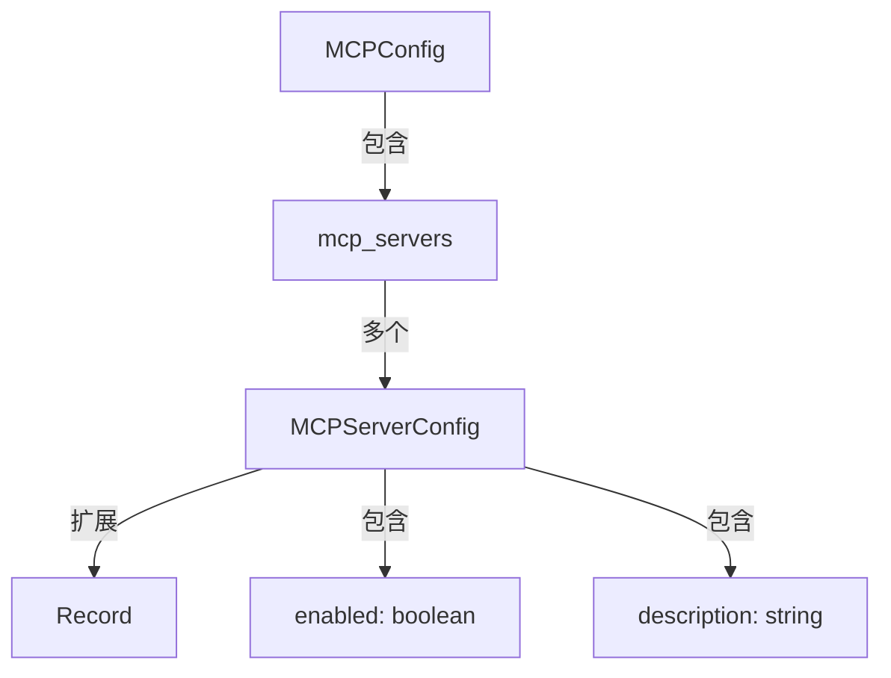
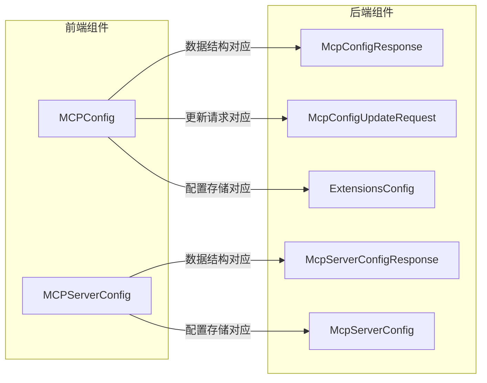

# MCP 模块文档

## 1. 概述

MCP（Model Context Protocol）模块是系统中用于管理和配置 MCP 服务器的核心组件。该模块为前端应用提供了类型定义，用于描述和管理 MCP 服务器配置，使得系统可以通过标准化的方式与各种外部服务和工具进行集成。

### 主要功能

- 定义 MCP 服务器配置的类型结构
- 支持多个 MCP 服务器的管理
- 提供服务器启用/禁用状态控制
- 维护服务器的描述信息

### 设计意图

MCP 模块的设计旨在提供一个轻量级但功能强大的配置管理系统，使前端应用能够：
- 灵活地配置和管理 MCP 服务器
- 与后端 API 保持类型一致性
- 支持动态启用和禁用服务器
- 提供用户友好的配置界面

## 2. 核心组件详解

### 2.1 MCPServerConfig 接口

`MCPServerConfig` 接口定义了单个 MCP 服务器的配置结构。它扩展了 `Record<string, unknown>` 类型，允许存储额外的自定义属性，同时强制要求包含两个核心属性：

```typescript
export interface MCPServerConfig extends Record<string, unknown> {
  enabled: boolean;
  description: string;
}
```

#### 属性说明

- **enabled** (`boolean`): 控制该 MCP 服务器是否启用。当设置为 `false` 时，系统将不会尝试连接或使用该服务器。
- **description** (`string`): 提供该 MCP 服务器功能的人类可读描述，帮助用户理解服务器的用途和能力。
- **扩展属性** (`Record<string, unknown>`): 允许存储任何其他与服务器相关的配置信息，提供了灵活性以适应不同类型的 MCP 服务器。

#### 设计特点

该接口采用了开放-封闭原则，通过扩展 `Record<string, unknown>` 类型，既保证了核心配置的一致性，又允许根据需要添加额外的配置项，为未来的功能扩展提供了灵活性。

### 2.2 MCPConfig 接口

`MCPConfig` 接口是整个 MCP 配置系统的顶层容器，用于组织和管理多个 MCP 服务器的配置。

```typescript
export interface MCPConfig {
  mcp_servers: Record<string, MCPServerConfig>;
}
```

#### 属性说明

- **mcp_servers** (`Record<string, MCPServerConfig>`): 一个键值对集合，其中键是服务器的唯一标识符，值是对应的 `MCPServerConfig` 对象。这种结构允许系统轻松地添加、删除或修改服务器配置，同时保持良好的可访问性。

#### 设计优势

使用 `Record<string, MCPServerConfig>` 结构具有以下优势：
1. 快速查找：通过服务器名称可以直接访问对应的配置
2. 动态管理：可以在运行时添加或删除服务器配置
3. 类型安全：确保所有配置项都符合 `MCPServerConfig` 接口定义

## 3. 架构与关系

### 3.1 模块架构图



### 3.2 与后端组件的关系

前端 MCP 模块与后端相应组件保持紧密的类型对应关系，确保数据在前后端之间的一致性传输：



### 3.3 数据流

MCP 配置数据的主要流动路径如下：

1. 后端从配置文件加载 MCP 配置（`ExtensionsConfig`）
2. 通过 API 端点将配置发送到前端（`McpConfigResponse`）
3. 前端使用 `MCPConfig` 类型存储和处理配置
4. 用户修改配置后，前端通过 `McpConfigUpdateRequest` 将更改发送回后端
5. 后端更新配置并持久化存储

这种双向数据流确保了前后端配置的同步，同时提供了用户友好的配置管理体验。

## 4. 使用指南

### 4.1 基本使用示例

#### 创建和使用 MCP 配置

```typescript
import { MCPConfig, MCPServerConfig } from 'frontend/src/core/mcp/types';

// 创建单个服务器配置
const githubServer: MCPServerConfig = {
  enabled: true,
  description: '提供 GitHub 仓库访问和操作功能',
  // 可以添加额外的自定义属性
  command: 'npx',
  args: ['-y', '@modelcontextprotocol/server-github']
};

// 创建完整的 MCP 配置
const mcpConfig: MCPConfig = {
  mcp_servers: {
    'github': githubServer,
    'filesystem': {
      enabled: false,
      description: '提供本地文件系统访问功能',
      command: 'npx',
      args: ['-y', '@modelcontextprotocol/server-filesystem', '/workspace']
    }
  }
};

// 访问服务器配置
console.log(mcpConfig.mcp_servers.github.enabled); // 输出: true
console.log(mcpConfig.mcp_servers.github.description); // 输出: "提供 GitHub 仓库访问和操作功能"
```

#### 更新服务器状态

```typescript
// 启用之前禁用的服务器
mcpConfig.mcp_servers.filesystem.enabled = true;

// 批量禁用所有服务器
Object.keys(mcpConfig.mcp_servers).forEach(serverName => {
  mcpConfig.mcp_servers[serverName].enabled = false;
});
```

### 4.2 与 API 交互示例

#### 从后端获取配置

```typescript
async function fetchMCPConfig(): Promise<MCPConfig> {
  const response = await fetch('/api/mcp/config');
  const data = await response.json();
  // 后端返回的 McpConfigResponse 结构与前端 MCPConfig 兼容
  return data as MCPConfig;
}
```

#### 更新后端配置

```typescript
async function updateMCPConfig(config: MCPConfig): Promise<void> {
  await fetch('/api/mcp/config', {
    method: 'PUT',
    headers: {
      'Content-Type': 'application/json'
    },
    body: JSON.stringify(config)
  });
}
```

## 5. 配置与部署

### 5.1 配置文件结构

虽然前端 MCP 模块主要负责类型定义，但了解后端配置文件结构对于完整理解系统很重要。后端使用 `extensions_config.json` 文件存储 MCP 服务器配置，其结构与前端 `MCPConfig` 类型对应：

```json
{
  "mcpServers": {
    "github": {
      "enabled": true,
      "type": "stdio",
      "command": "npx",
      "args": ["-y", "@modelcontextprotocol/server-github"],
      "env": {
        "GITHUB_PERSONAL_ACCESS_TOKEN": "$GITHUB_TOKEN"
      },
      "description": "提供 GitHub 仓库访问和操作功能"
    },
    "filesystem": {
      "enabled": false,
      "type": "stdio",
      "command": "npx",
      "args": ["-y", "@modelcontextprotocol/server-filesystem", "/workspace"],
      "description": "提供本地文件系统访问功能"
    }
  },
  "skills": {}
}
```

### 5.2 环境变量解析

后端配置系统支持环境变量解析，允许在配置文件中使用 `$VARIABLE_NAME` 语法引用环境变量：

```json
{
  "mcpServers": {
    "github": {
      "enabled": true,
      "env": {
        "GITHUB_PERSONAL_ACCESS_TOKEN": "$GITHUB_TOKEN"
      }
    }
  }
}
```

这种方式可以安全地处理敏感信息，避免将其直接提交到代码仓库。

## 6. 注意事项与限制

### 6.1 类型兼容性

虽然前端 `MCPServerConfig` 接口扩展了 `Record<string, unknown>` 允许额外属性，但在与后端交互时，应确保只使用后端 `McpServerConfigResponse` 和 `McpServerConfig` 中定义的属性，以避免数据不一致或丢失。

### 6.2 服务器启用状态

- 禁用的服务器不会被系统加载或使用，但仍保留在配置中
- 修改服务器启用状态后，可能需要重启相关服务或刷新应用才能生效
- 确保至少有一个 MCP 服务器处于启用状态，以提供基本功能

### 6.3 配置持久化

- 前端对配置的修改需要通过 API 调用发送到后端才能持久化
- 配置文件路径的解析有特定的优先级顺序（详见 [application_and_feature_configuration](application_and_feature_configuration.md) 文档）
- 修改配置文件后，可能需要重启后端服务才能加载新配置

### 6.4 安全性考虑

- 避免在前端代码中硬编码敏感信息
- 使用环境变量存储 API 密钥和其他机密信息
- 确保 MCP 配置 API 端点受到适当的身份验证和授权保护

## 7. 扩展与开发

### 7.1 扩展 MCPServerConfig

由于 `MCPServerConfig` 扩展了 `Record<string, unknown>`，可以轻松添加自定义属性：

```typescript
interface ExtendedMCPServerConfig extends MCPServerConfig {
  type: 'stdio' | 'sse' | 'http';
  command?: string;
  args?: string[];
  env?: Record<string, string>;
  url?: string;
  headers?: Record<string, string>;
}

// 使用扩展接口
const customConfig: ExtendedMCPServerConfig = {
  enabled: true,
  description: '自定义服务器',
  type: 'stdio',
  command: 'node',
  args: ['server.js']
};
```

### 7.2 创建配置管理 Hook

在 React 应用中，可以创建自定义 Hook 来管理 MCP 配置状态：

```typescript
import { useState, useEffect } from 'react';
import { MCPConfig, MCPServerConfig } from 'frontend/src/core/mcp/types';

export function useMCPConfig() {
  const [config, setConfig] = useState<MCPConfig | null>(null);
  const [loading, setLoading] = useState(true);
  const [error, setError] = useState<string | null>(null);

  useEffect(() => {
    fetchMCPConfig();
  }, []);

  const fetchMCPConfig = async () => {
    try {
      setLoading(true);
      const response = await fetch('/api/mcp/config');
      const data = await response.json();
      setConfig(data);
      setError(null);
    } catch (err) {
      setError('Failed to fetch MCP config');
    } finally {
      setLoading(false);
    }
  };

  const updateServerConfig = async (
    serverName: string,
    updates: Partial<MCPServerConfig>
  ) => {
    if (!config) return;

    const updatedConfig: MCPConfig = {
      ...config,
      mcp_servers: {
        ...config.mcp_servers,
        [serverName]: {
          ...config.mcp_servers[serverName],
          ...updates
        }
      }
    };

    try {
      await fetch('/api/mcp/config', {
        method: 'PUT',
        headers: { 'Content-Type': 'application/json' },
        body: JSON.stringify(updatedConfig)
      });
      setConfig(updatedConfig);
    } catch (err) {
      setError('Failed to update MCP config');
    }
  };

  return {
    config,
    loading,
    error,
    fetchMCPConfig,
    updateServerConfig
  };
}
```

## 8. 相关模块

- [application_and_feature_configuration](application_and_feature_configuration.md): 包含后端 MCP 配置的完整实现和管理逻辑
- [gateway_api_contracts](gateway_api_contracts.md): 定义了 MCP 配置 API 的请求和响应模型
- [frontend_core_domain_types_and_state](frontend_core_domain_types_and_state.md): 包含其他前端核心类型定义

通过这些相关模块的文档，可以更全面地了解 MCP 模块在整个系统中的作用和集成方式。
