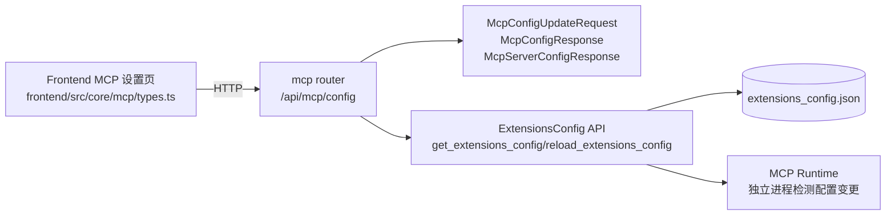
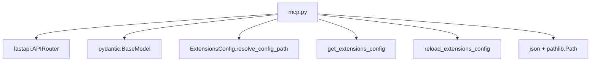
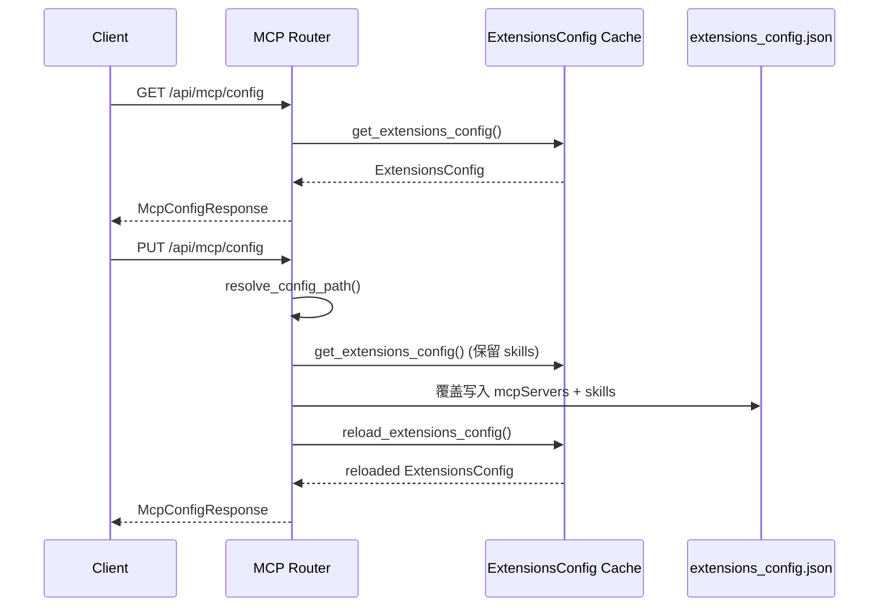

# mcp_configuration_contracts 模块文档

## 模块概述与存在价值

`mcp_configuration_contracts` 是网关 API 合同层中专门负责 **MCP（Model Context Protocol）配置读写协议** 的子模块。它位于 `backend/src/gateway/routers/mcp.py`，核心职责不是“执行 MCP 工具”，而是定义并实现“客户端如何读取/更新 MCP server 配置”的稳定 HTTP 契约。

这个模块存在的根本原因，是把系统中的三类关注点解耦：第一类是 API 协议层（请求/响应格式、状态码语义）；第二类是配置域模型层（`ExtensionsConfig` 与 `McpServerConfig` 的加载、缓存、别名映射）；第三类是运行时执行层（MCP 工具初始化、连接与调用）。通过这种分层，前端和外部调用方只需遵循 `/api/mcp/config` 契约，不需要直接理解配置文件路径解析、环境变量注入、缓存刷新策略等后端实现细节。

从系统关系上看，该模块属于 `gateway_api_contracts` 的 `mcp_configuration_contracts` 子模块，并与配置域模块 `extensions_and_mcp_skill_state` 紧密协作（详见 [extensions_and_mcp_skill_state.md](extensions_and_mcp_skill_state.md)）。

---

## 核心组件清单

本模块包含三个核心合同模型：

- `McpServerConfigResponse`
- `McpConfigResponse`
- `McpConfigUpdateRequest`

并通过两个路由函数提供完整行为：

- `get_mcp_configuration()` → `GET /api/mcp/config`
- `update_mcp_configuration(request)` → `PUT /api/mcp/config`

虽然“核心组件”是三个 Pydantic 模型，但它们的真实语义依附于这两个路由的读写流程，因此下文会同时从“数据结构 + 行为流程”角度说明。

---

## 架构与依赖关系

### 模块在整体系统中的位置



这个关系图体现了本模块是“契约边界层”：对外暴露 snake_case 的 API 格式，对内衔接配置域对象和 JSON 文件结构。它不直接控制 MCP runtime 的生命周期，而是通过“落盘 + 重载缓存”让下游运行时感知配置变化。

### 核心依赖关系（代码级）



`mcp.py` 的外部依赖非常克制：接口层依赖 FastAPI/Pydantic，配置读写依赖 `extensions_config` 模块。这种轻依赖结构让该模块易于维护，也便于未来替换底层配置存储实现。

---

## 数据契约详解

### 1) `McpServerConfigResponse`

`McpServerConfigResponse` 描述单个 MCP server 的配置结构，同时用于读取响应与更新请求体中的子项。字段如下：

- `enabled: bool = True`：是否启用该 server。
- `type: str = "stdio"`：传输类型，约定 `stdio`/`sse`/`http`。
- `command: str | None = None`：`stdio` 模式常用启动命令。
- `args: list[str] = []`：启动参数。
- `env: dict[str, str] = {}`：进程环境变量（或连接相关变量）。
- `url: str | None = None`：`sse` 或 `http` 模式地址。
- `headers: dict[str, str] = {}`：HTTP 请求头。
- `description: str = ""`：人类可读用途描述。

设计特征是“宽松兼容”：`type` 目前是普通字符串而非枚举，且不存在跨字段强约束（例如 `stdio` 必填 `command`）。这有利于兼容未来 transport 类型，但会把部分错误延迟到运行时暴露。

### 2) `McpConfigResponse`

`McpConfigResponse` 是 GET 接口返回的顶层模型：

```json
{
  "mcp_servers": {
    "github": {
      "enabled": true,
      "type": "stdio",
      "command": "npx",
      "args": ["-y", "@modelcontextprotocol/server-github"],
      "env": {"GITHUB_TOKEN": "ghp_xxx"},
      "url": null,
      "headers": {},
      "description": "GitHub MCP server"
    }
  }
}
```

其关键意义在于提供“名称到配置对象”的映射，方便前端配置页做可视化编辑，也方便自动化脚本按 server 名做幂等更新。

### 3) `McpConfigUpdateRequest`

`McpConfigUpdateRequest` 的结构与 `McpConfigResponse` 对齐，但 `mcp_servers` 是必填。这意味着 `PUT` 采用 **replace-style** 语义：提交的是“期望最终完整状态”，而不是局部 patch。调用方如果仅提交一个 server，会覆盖掉未提交的其他 server（skills 会被保留，MCP servers 不会自动合并）。

---

## 路由实现与内部流程

### `get_mcp_configuration()`

该函数无参数，返回 `McpConfigResponse`。执行逻辑如下：

1. 调用 `get_extensions_config()` 获取缓存中的 `ExtensionsConfig`。
2. 遍历 `config.mcp_servers`，逐项 `model_dump()` 并转换为 `McpServerConfigResponse`。
3. 组装并返回 `McpConfigResponse`。

副作用方面，GET 是只读操作，不写文件、不刷新缓存。

### `update_mcp_configuration(request: McpConfigUpdateRequest)`

该函数接收更新请求并返回更新后状态，行为分为五步：

1. **确定配置文件路径**：调用 `ExtensionsConfig.resolve_config_path()`；若没有历史文件，则回退为 `Path.cwd().parent / "extensions_config.json"`。
2. **读取当前配置用于保留 skills**：通过 `get_extensions_config()` 获取现有 skills 状态。
3. **请求模型转文件结构**：API 输入 `mcp_servers` 会写为 JSON 中的 `mcpServers`（camelCase），并合并保留的 `skills`。
4. **写盘**：覆盖写入配置文件。
5. **刷新缓存并返回**：调用 `reload_extensions_config()`，再转换为 `McpConfigResponse` 返回。

该函数的返回值是“重载后的实际状态”，不是简单回显请求体。这对调用方有价值：可用于确认持久化后的真实配置。

异常处理上，函数会捕获所有异常并包装为 `HTTPException(500)`，错误信息以字符串拼入 `detail`。

### 读写流程时序图



---

## 命名与格式映射规则

该模块有一条非常关键的“跨层命名转换规则”：

- API 合同字段：`mcp_servers`（snake_case）
- 配置文件字段：`mcpServers`（camelCase）


这个转换使 API 风格与 Python 常规命名保持一致，同时兼容配置文件既有命名规范。若你直接写脚本操作 `extensions_config.json`，必须使用 `mcpServers`，否则加载阶段会出现字段不匹配或数据缺失。

---

## 与前端/其他模块的契约对齐

前端类型位于 `frontend/src/core/mcp/types.ts`：

- `MCPConfig.mcp_servers: Record<string, MCPServerConfig>`
- `MCPServerConfig` 当前显式字段仅 `enabled` 与 `description`（其余通过 `Record<string, unknown>` 扩展容纳）

这意味着前端在类型层面对字段采取“最小必需 + 透传扩展”的策略，后端则提供完整配置模型。实践中，建议前端在编辑器中保留未知字段，避免误删后端新增字段。

与本模块边界相邻、但不在本模块职责范围内的内容：

- 配置文件搜索优先级、环境变量解析、skills 默认启用策略：见 [extensions_and_mcp_skill_state.md](extensions_and_mcp_skill_state.md)
- 网关 API 总体结构：见 [gateway_api_contracts.md](gateway_api_contracts.md)
- 前端全局领域类型：见 [frontend_core_domain_types_and_state.md](frontend_core_domain_types_and_state.md)

---

## 实际使用示例

### 读取当前 MCP 配置

```bash
curl -s http://localhost:8000/api/mcp/config | jq
```

### 更新为 stdio 类型 server

```bash
curl -X PUT "http://localhost:8000/api/mcp/config" \
  -H "Content-Type: application/json" \
  -d '{
    "mcp_servers": {
      "filesystem": {
        "enabled": true,
        "type": "stdio",
        "command": "npx",
        "args": ["-y", "@modelcontextprotocol/server-filesystem", "/workspace"],
        "env": {},
        "url": null,
        "headers": {},
        "description": "Workspace filesystem access"
      }
    }
  }'
```

### 更新为远端 http 类型 server

```json
{
  "mcp_servers": {
    "remote_tools": {
      "enabled": true,
      "type": "http",
      "command": null,
      "args": [],
      "env": {},
      "url": "https://example.org/mcp",
      "headers": {
        "Authorization": "Bearer <token>"
      },
      "description": "Remote MCP endpoint"
    }
  }
}
```

---

## 边界条件、错误模式与运维注意事项

这个模块本身很薄，但在生产环境有若干高频“坑点”：

- `PUT` 为替换语义，不是 merge；调用方若漏传已有 server，会导致被删除。
- 目前没有 `type` 枚举与跨字段约束，`type=stdio` 却不给 `command` 等错误不会在合同层拦截。
- 当不存在配置文件时，会在 `Path.cwd().parent` 创建新文件；容器或多服务部署中可能造成“写到意外目录”。
- 异常统一映射为 `500`，调用方无法仅靠状态码区分“参数问题”还是“磁盘权限问题”。
- 无并发控制（无文件锁/版本号）；并发 PUT 可能发生后写覆盖先写。
- `env` 与 `headers` 可能含敏感信息，虽然本模块未主动打印明文，但调用链日志策略仍需审计和脱敏。

---

## 扩展与演进建议

如果你要增强该模块，建议优先沿着“强约束 + 安全更新 + 可观测性”三个方向演进：

1. 将 `type` 改为 `Literal["stdio", "sse", "http"]`，在契约层提前失败。
2. 增加模型级校验器（model validator），约束 `stdio` 必须有 `command`、`http/sse` 必须有 `url`。
3. 增设 `PATCH /api/mcp/config` 支持局部更新，降低误覆盖风险。
4. 引入版本字段或 ETag，实现乐观并发控制。
5. 细化错误码：参数校验 `400`、路径不存在 `404`、并发冲突 `409`、内部错误 `500`。

这些变更不会改变模块定位，但会明显提升 API 的可预测性和运维稳定性。

---

## 总结

`mcp_configuration_contracts` 的价值在于：它用极小的代码面承担了 MCP 配置管理的“系统边界职责”，把前端/外部调用方与内部配置机制隔离开来。开发者理解本模块时，应重点关注三件事：**合同结构（3 个 Pydantic 模型）、写入语义（PUT 全量替换）、跨层映射（`mcp_servers` ↔ `mcpServers`）**。掌握这三点，基本就能安全地接入、排障并扩展该模块。
