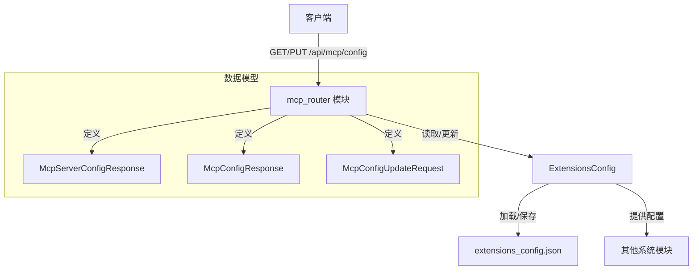
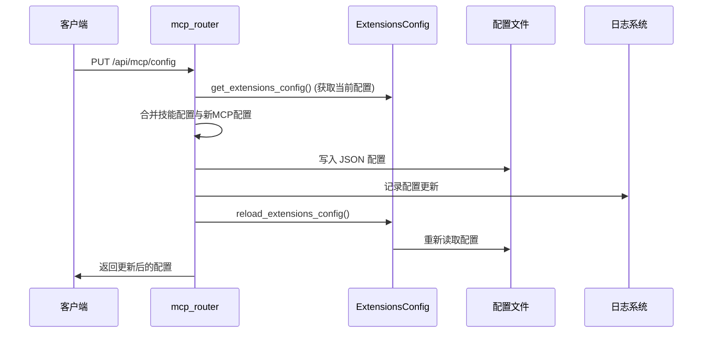

# MCP Router 模块文档

## 1. 模块概述

`mcp_router` 模块是系统网关 API 的一个关键组件，专门负责管理 Model Context Protocol (MCP) 服务器的配置。该模块提供了 REST API 端点，允许客户端获取和更新 MCP 服务器配置，从而实现对外部工具和服务集成的动态管理。

### 主要功能
- 提供当前 MCP 服务器配置的读取接口
- 支持 MCP 服务器配置的更新和持久化
- 集成配置文件管理和缓存机制
- 支持多种传输类型的 MCP 服务器（stdio、sse、http）

### 设计理念
该模块采用简洁的 REST API 设计，遵循 FastAPI 框架的最佳实践。它通过与 `ExtensionsConfig` 系统紧密集成，实现了配置的统一管理和自动重载，确保配置变更能够及时反映到系统运行中。

## 2. 核心组件详解

### 2.1 数据模型

#### McpServerConfigResponse
`McpServerConfigResponse` 是单个 MCP 服务器配置的响应模型，它提供了 MCP 服务器的完整配置信息。

**主要字段：**
- `enabled`: 布尔值，指示该 MCP 服务器是否启用
- `type`: 字符串，指定传输类型，支持 "stdio"、"sse" 或 "http"
- `command`: 可选字符串，用于启动 MCP 服务器的命令（适用于 stdio 类型）
- `args`: 字符串列表，传递给命令的参数（适用于 stdio 类型）
- `env`: 字典，MCP 服务器的环境变量
- `url`: 可选字符串，MCP 服务器的 URL（适用于 sse 或 http 类型）
- `headers`: 字典，HTTP 请求头（适用于 sse 或 http 类型）
- `description`: 字符串，MCP 服务器功能的人类可读描述

这个模型与 `ExtensionsConfig` 中的 `McpServerConfig` 模型保持结构一致，确保了配置数据在不同层之间的无缝传递。

#### McpConfigResponse
`McpConfigResponse` 是完整 MCP 配置的响应模型，它包含了所有已配置的 MCP 服务器。

**主要字段：**
- `mcp_servers`: 字典，键为 MCP 服务器名称，值为 `McpServerConfigResponse` 对象

这个模型提供了一种结构化的方式来返回多个 MCP 服务器的配置，便于客户端进行批量处理和展示。

#### McpConfigUpdateRequest
`McpConfigUpdateRequest` 是用于更新 MCP 配置的请求模型。

**主要字段：**
- `mcp_servers`: 字典，键为 MCP 服务器名称，值为 `McpServerConfigResponse` 对象

虽然结构与 `McpConfigResponse` 相似，但这个模型专门用于接收客户端的更新请求，确保请求数据的完整性和有效性。

### 2.2 API 端点

#### GET /api/mcp/config
该端点用于获取当前系统中的 MCP 配置。

**功能说明：**
- 从 `ExtensionsConfig` 中读取当前配置
- 将配置转换为 API 响应格式
- 返回所有已配置的 MCP 服务器及其详细信息

**实现细节：**
```python
async def get_mcp_configuration() -> McpConfigResponse:
    config = get_extensions_config()
    return McpConfigResponse(
        mcp_servers={name: McpServerConfigResponse(**server.model_dump()) 
                     for name, server in config.mcp_servers.items()}
    )
```

**使用示例：**
```bash
curl -X GET "http://localhost/api/mcp/config"
```

**响应示例：**
```json
{
  "mcp_servers": {
    "github": {
      "enabled": true,
      "type": "stdio",
      "command": "npx",
      "args": ["-y", "@modelcontextprotocol/server-github"],
      "env": {"GITHUB_TOKEN": "ghp_xxx"},
      "description": "GitHub MCP server for repository operations"
    }
  }
}
```

#### PUT /api/mcp/config
该端点用于更新 MCP 配置并将其持久化到配置文件。

**功能说明：**
- 接收新的 MCP 配置
- 保存配置到 `extensions_config.json` 文件
- 保留现有的技能配置
- 重新加载配置缓存
- 返回更新后的配置

**实现细节：**
这个端点执行多个关键步骤：
1. 解析配置文件路径
2. 加载当前配置以保留技能设置
3. 将请求数据转换为 JSON 格式
4. 写入配置文件
5. 重新加载配置
6. 返回更新后的配置

**使用示例：**
```bash
curl -X PUT "http://localhost/api/mcp/config" \
  -H "Content-Type: application/json" \
  -d '{
    "mcp_servers": {
      "github": {
        "enabled": true,
        "type": "stdio",
        "command": "npx",
        "args": ["-y", "@modelcontextprotocol/server-github"],
        "env": {"GITHUB_TOKEN": "$GITHUB_TOKEN"},
        "description": "GitHub MCP server for repository operations"
      }
    }
  }'
```

**错误处理：**
- 如果配置文件无法写入，将返回 500 内部服务器错误
- 详细错误信息会记录在日志中，便于调试

## 3. 架构与集成

### 3.1 模块关系图



### 3.2 与 ExtensionsConfig 的集成

`mcp_router` 模块与 `ExtensionsConfig` 系统紧密集成，这种集成提供了以下优势：

1. **统一配置管理**：MCP 配置与技能配置共享同一配置文件和管理系统
2. **环境变量解析**：自动解析配置中的环境变量引用（如 `$GITHUB_TOKEN`）
3. **配置缓存**：通过 `get_extensions_config()` 和 `reload_extensions_config()` 管理配置缓存
4. **文件变更检测**：系统的其他部分可以检测配置文件变更并自动重新初始化

### 3.3 配置文件处理流程

当更新 MCP 配置时，系统执行以下流程：



## 4. 使用指南

### 4.1 配置 MCP 服务器

#### 基本配置步骤
1. 使用 GET 端点获取当前配置
2. 修改或添加 MCP 服务器配置
3. 使用 PUT 端点提交更新

#### 不同传输类型的配置示例

**stdio 类型配置：**
```json
{
  "mcp_servers": {
    "filesystem": {
      "enabled": true,
      "type": "stdio",
      "command": "npx",
      "args": ["-y", "@modelcontextprotocol/server-filesystem", "/path/to/workspace"],
      "env": {},
      "description": "File system access for workspace directory"
    }
  }
}
```

**http 类型配置：**
```json
{
  "mcp_servers": {
    "custom-service": {
      "enabled": true,
      "type": "http",
      "url": "http://localhost:8080/mcp",
      "headers": {"Authorization": "Bearer token123"},
      "description": "Custom MCP service"
    }
  }
}
```

### 4.2 环境变量使用

配置中可以使用环境变量引用，系统会自动解析它们：

```json
{
  "mcp_servers": {
    "github": {
      "enabled": true,
      "type": "stdio",
      "command": "npx",
      "args": ["-y", "@modelcontextprotocol/server-github"],
      "env": {"GITHUB_TOKEN": "$GITHUB_TOKEN"},
      "description": "GitHub integration"
    }
  }
}
```

在这个例子中，`$GITHUB_TOKEN` 将被替换为系统环境变量中 `GITHUB_TOKEN` 的值。

## 5. 注意事项与限制

### 5.1 配置文件位置

系统会按以下优先级查找配置文件：
1. 明确指定的配置路径
2. `DEER_FLOW_EXTENSIONS_CONFIG_PATH` 环境变量指定的路径
3. 当前工作目录中的 `extensions_config.json`
4. 父目录中的 `extensions_config.json`
5. 为了向后兼容，也会检查 `mcp_config.json`

### 5.2 技能配置保护

更新 MCP 配置时，系统会保留现有的技能配置。这意味着您不必担心在更新 MCP 配置时丢失技能设置。

### 5.3 错误处理

- 环境变量解析失败会导致配置加载错误
- 配置文件写入失败会返回 500 错误
- 建议在生产环境中监控配置文件的访问权限

### 5.4 缓存与同步

- 配置更新后会自动重新加载缓存
- LangGraph Server（如果在单独进程中运行）通过文件修改时间检测配置变化
- 注意不同进程间的配置同步可能存在轻微延迟

## 6. 相关模块参考

- [application_and_feature_configuration](application_and_feature_configuration.md)：了解 `ExtensionsConfig` 和其他配置系统的详细信息
- [gateway_api_contracts](gateway_api_contracts.md)：查看其他网关 API 模块的文档

通过 `mcp_router` 模块，系统提供了一个灵活、强大的接口来管理 MCP 服务器配置，使集成外部工具和服务变得简单而高效。
