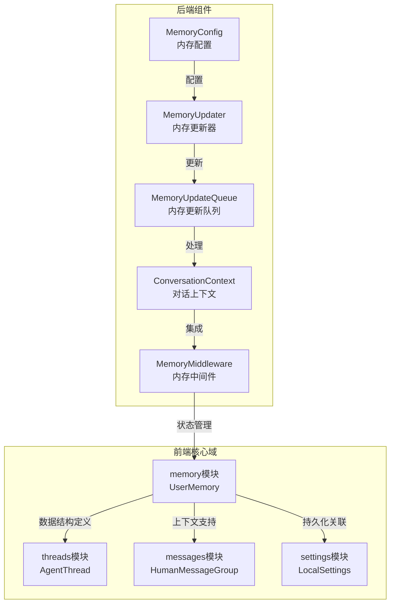

# 内存模块文档

## 1. 模块概述

内存模块是系统的核心组件之一，负责管理和维护用户的上下文信息、对话历史和重要事实。该模块设计为支持长期记忆和短期记忆的分离存储，通过结构化的数据模型确保智能体能够在对话过程中保持上下文连贯性，并且能够回忆起过去的重要信息。

内存模块的主要设计目标是：
- 提供结构化的用户信息存储
- 支持多层次的历史上下文管理
- 确保信息的可追溯性和时效性
- 与对话系统无缝集成

## 2. 核心组件详解

### 2.1 UserMemory 接口

`UserMemory` 是内存模块的核心数据结构，定义了用户记忆的完整格式。

```typescript
export interface UserMemory {
  version: string;
  lastUpdated: string;
  user: {
    workContext: {
      summary: string;
      updatedAt: string;
    };
    personalContext: {
      summary: string;
      updatedAt: string;
    };
    topOfMind: {
      summary: string;
      updatedAt: string;
    };
  };
  history: {
    recentMonths: {
      summary: string;
      updatedAt: string;
    };
    earlierContext: {
      summary: string;
      updatedAt: string;
    };
    longTermBackground: {
      summary: string;
      updatedAt: string;
    };
  };
  facts: {
    id: string;
    content: string;
    category: string;
    confidence: number;
    createdAt: string;
    source: string;
  }[];
}
```

#### 字段说明

- **version**: 记忆结构的版本号，用于数据迁移和兼容性处理
- **lastUpdated**: 记忆最后更新的时间戳
- **user**: 用户相关的上下文信息
  - **workContext**: 用户的工作环境上下文，包含工作相关的摘要信息
  - **personalContext**: 用户的个人背景信息，包含个人相关的摘要
  - **topOfMind**: 用户当前关注的重点内容，用于优先考虑的信息
- **history**: 历史对话上下文
  - **recentMonths**: 最近几个月的对话摘要
  - **earlierContext**: 更早时期的对话上下文
  - **longTermBackground**: 长期背景信息，用于深度理解用户
- **facts**: 结构化的事实列表
  - **id**: 事实的唯一标识符
  - **content**: 事实的具体内容
  - **category**: 事实的分类标签
  - **confidence**: 系统对该事实的置信度（0-1）
  - **createdAt**: 事实创建的时间戳
  - **source**: 事实的来源信息

## 3. 架构设计

内存模块在整个系统中处于核心位置，与多个其他模块紧密协作。下面是内存模块与其他模块的关系图：



### 3.1 模块关系说明

内存模块通过以下方式与其他模块交互：

1. **与线程模块**：`UserMemory` 结构为 `AgentThread` 提供用户上下文支持，使对话线程能够访问用户的历史信息和偏好。

2. **与消息模块**：内存模块为消息处理提供必要的上下文信息，帮助消息分组和理解用户意图。

3. **与设置模块**：内存数据可以与本地设置关联，实现用户偏好的持久化存储。

4. **与后端内存管理组件**：前端的 `UserMemory` 结构与后端的 `MemoryUpdater`、`MemoryUpdateQueue` 等组件配合，实现内存的更新和管理。

## 4. 使用指南

### 4.1 基本使用

在前端应用中使用 `UserMemory` 类型：

```typescript
import { UserMemory } from 'frontend/src/core/memory/types';

// 创建一个新的用户记忆对象
const userMemory: UserMemory = {
  version: '1.0',
  lastUpdated: new Date().toISOString(),
  user: {
    workContext: {
      summary: '用户主要从事软件开发工作',
      updatedAt: new Date().toISOString()
    },
    personalContext: {
      summary: '用户喜欢技术和阅读',
      updatedAt: new Date().toISOString()
    },
    topOfMind: {
      summary: '当前关注项目进度',
      updatedAt: new Date().toISOString()
    }
  },
  history: {
    recentMonths: {
      summary: '最近讨论了多个技术话题',
      updatedAt: new Date().toISOString()
    },
    earlierContext: {
      summary: '之前的对话记录',
      updatedAt: new Date().toISOString()
    },
    longTermBackground: {
      summary: '长期背景信息',
      updatedAt: new Date().toISOString()
    }
  },
  facts: [
    {
      id: 'fact-1',
      content: '用户偏好使用TypeScript',
      category: 'preference',
      confidence: 0.9,
      createdAt: new Date().toISOString(),
      source: 'conversation'
    }
  ]
};
```

### 4.2 添加新事实

```typescript
function addFact(memory: UserMemory, fact: Omit<UserMemory['facts'][0], 'id' | 'createdAt'>): UserMemory {
  const newFact = {
    ...fact,
    id: `fact-${Date.now()}`,
    createdAt: new Date().toISOString()
  };
  
  return {
    ...memory,
    lastUpdated: new Date().toISOString(),
    facts: [...memory.facts, newFact]
  };
}
```

### 4.3 更新用户上下文

```typescript
function updateWorkContext(memory: UserMemory, summary: string): UserMemory {
  return {
    ...memory,
    lastUpdated: new Date().toISOString(),
    user: {
      ...memory.user,
      workContext: {
        summary,
        updatedAt: new Date().toISOString()
      }
    }
  };
}
```

## 5. 配置与扩展

### 5.1 内存配置

内存模块的行为可以通过 `MemoryConfig` 进行配置（详见[应用与功能配置](application_and_feature_configuration.md)文档）。配置项可能包括：

- 历史记录保留期限
- 事实置信度阈值
- 自动摘要频率
- 存储限制

### 5.2 扩展内存结构

如需扩展 `UserMemory` 结构，建议遵循以下步骤：

1. 在适当的版本控制下修改类型定义
2. 更新版本号
3. 提供数据迁移逻辑
4. 更新相关的验证和处理代码

## 6. 注意事项与限制

### 6.1 数据一致性

- 确保所有时间戳使用统一的格式（建议使用 ISO 8601）
- 更新任何子字段时，同时更新 `lastUpdated` 字段
- 保持 `version` 字段与数据结构的兼容性

### 6.2 性能考虑

- `facts` 数组可能会增长很大，建议实现分页或懒加载机制
- 定期清理过时的历史记录，避免内存占用过大
- 考虑实现事实的优先级机制，优先访问重要信息

### 6.3 错误处理

- 处理缺失字段的情况，提供合理的默认值
- 验证置信度值在 0-1 范围内
- 确保日期字符串可以正确解析

### 6.4 安全性

- 敏感信息应适当加密或避免存储
- 实现适当的访问控制机制
- 考虑用户数据的导出和删除功能

## 7. 相关模块参考

- [应用与功能配置](application_and_feature_configuration.md) - 包含 `MemoryConfig` 的详细说明
- [网关 API 契约](gateway_api_contracts.md) - 包含内存相关的 API 定义
- [前端核心域类型与状态](frontend_core_domain_types_and_state.md) - 包含其他相关的前端类型定义
- [代理内存与线程上下文](agent_memory_and_thread_context.md) - 包含后端内存管理组件的详细信息
