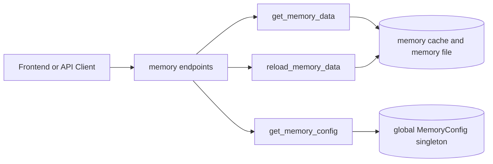
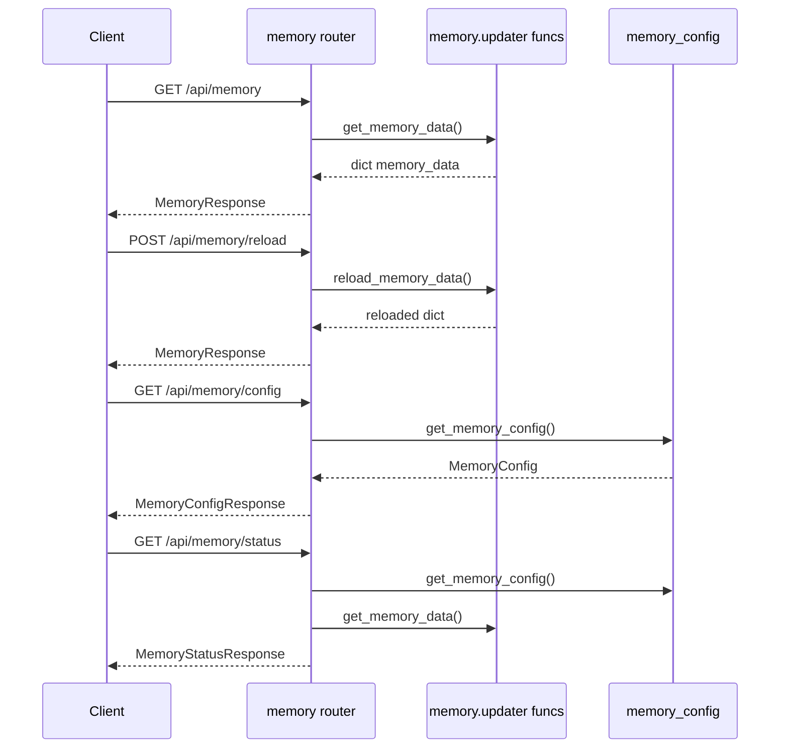
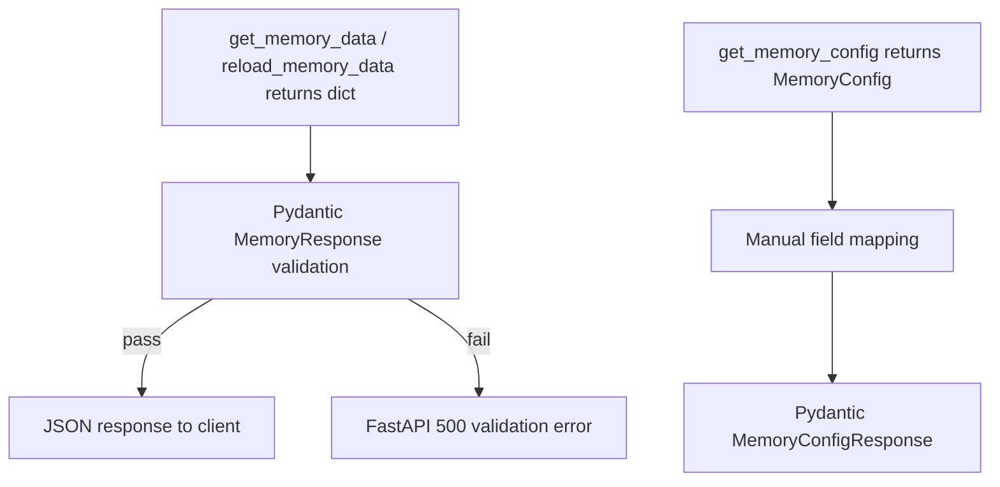
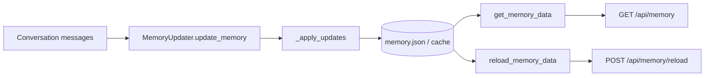

# memory_api_contracts 模块文档

## 模块介绍

`memory_api_contracts` 是 Gateway 层中“记忆能力”的对外 HTTP 契约定义，位于 `backend/src/gateway/routers/memory.py`。这个模块本身不负责生成或更新记忆内容，而是把记忆系统当前状态以稳定、可验证、可被前端直接消费的方式暴露出来。换句话说，它处在系统的“接口边界”位置：上游是前端或外部客户端，下游是内存更新与配置模块。

该模块存在的核心价值是把运行时内部结构（缓存、文件持久化、LLM 更新器）屏蔽在网关之后，向客户端提供一组清晰的契约模型：记忆数据结构是什么、配置有哪些、如何触发重载、如何一次拿到配置+数据。对于维护者来说，这种契约化可以降低前后端耦合，避免“前端猜后端结构”的隐性协议风险。

如果你想了解网关整体分层，请参考 [gateway_api_contracts.md](gateway_api_contracts.md)；如果你想了解记忆数据如何生成、过滤和持久化，请参考 [memory_pipeline.md](memory_pipeline.md) 与 [agent_memory_and_thread_context.md](agent_memory_and_thread_context.md)；配置项语义与约束见 [feature_toggles_memory_summary_title.md](feature_toggles_memory_summary_title.md)。

---

## 在系统中的位置与设计边界



这个架构体现了一个清晰边界：`memory_api_contracts` 只做“读取、重载触发、响应建模”，并不执行 LLM 推理或写入策略决策。更新逻辑由 `MemoryUpdater` 及相关队列/中间件完成。这样设计的好处是 API 层足够薄，便于稳定演进；代价是 API 返回内容会严格受下游数据质量约束（例如下游结构异常会在 Pydantic 校验阶段暴露）。

---

## 核心数据契约（Pydantic Models）

本模块的核心组件都是 `BaseModel`，它们共同定义了 `/api/memory*` 系列接口的返回结构。字段命名采用前端友好的 camelCase（如 `updatedAt`、`lastUpdated`），这是显式 API 契约的一部分。

### 1) ContextSection

`ContextSection` 是最小上下文单元，表示某个上下文分片的“摘要 + 更新时间”。

- `summary: str = ""`
- `updatedAt: str = ""`

它被复用于 `UserContext` 和 `HistoryContext`，保证不同上下文段使用统一形态。默认空字符串的策略意味着即使下游尚未产生内容，接口仍能返回结构完整的对象，减少前端空值分支。

### 2) UserContext

`UserContext` 表示用户维度上下文，由三个 `ContextSection` 构成：

- `workContext`
- `personalContext`
- `topOfMind`

每个字段都通过 `default_factory=ContextSection` 初始化，这意味着在数据缺失时依然能构造安全默认对象，避免 `null` 传播到前端渲染层。

### 3) HistoryContext

`HistoryContext` 表示时间维度历史上下文，由三个阶段组成：

- `recentMonths`
- `earlierContext`
- `longTermBackground`

这个分层契约让前端可以按时间粒度展示摘要信息，也与记忆更新器中的分段更新策略保持一致。

### 4) Fact

`Fact` 是结构化事实条目：

- `id: str`（必填）
- `content: str`（必填）
- `category: str = "context"`
- `confidence: float = 0.5`
- `createdAt: str = ""`
- `source: str = "unknown"`

`id` 与 `content` 被声明为必填字段，这对契约稳定性很关键：即使下游生成逻辑有缺陷，网关层也能通过模型校验阻止“半结构化垃圾数据”悄悄流向客户端。

### 5) MemoryResponse

`MemoryResponse` 是 `/api/memory` 和 `/api/memory/reload` 的顶层响应：

- `version: str = "1.0"`
- `lastUpdated: str = ""`
- `user: UserContext`
- `history: HistoryContext`
- `facts: list[Fact]`

它代表“当前全局记忆快照”。注意这里是全局记忆，不是单线程局部上下文。

### 6) MemoryConfigResponse

`MemoryConfigResponse` 暴露内存功能的关键运行参数：

- `enabled`
- `storage_path`
- `debounce_seconds`
- `max_facts`
- `fact_confidence_threshold`
- `injection_enabled`
- `max_injection_tokens`

这里有个设计细节：底层 `MemoryConfig` 还有 `model_name` 字段，但该 API 契约未暴露它。这通常是有意的“最小暴露面”策略，避免把不必要的执行细节耦合给前端。

### 7) MemoryStatusResponse

`MemoryStatusResponse` 把配置和数据组合成一次请求返回：

- `config: MemoryConfigResponse`
- `data: MemoryResponse`

适合控制台或诊断页快速拉取全景状态，减少客户端多请求拼装。

---

## API 端点与内部行为



### GET `/api/memory`

该接口调用 `get_memory_data()`，返回当前缓存语义下的全局记忆。`get_memory_data()` 内部会检查 memory 文件的 `mtime`，若检测到外部文件变化会自动失效缓存并重载，所以这个“读接口”本身已经带有轻量一致性保障。

返回值通过 `MemoryResponse(**memory_data)` 构建；这一步即是契约验证点。

### POST `/api/memory/reload`

该接口强制调用 `reload_memory_data()`，显式绕过缓存，适用于你已知文件被外部工具修改且希望立即刷新内存态的场景。返回同样是 `MemoryResponse`。

需要注意：这是“重新加载”，不是“重建记忆”或“触发 LLM 更新”。

### GET `/api/memory/config`

该接口调用 `get_memory_config()` 并映射到 `MemoryConfigResponse`。它主要服务于前端设置页和运行状态可观测性，不涉及任何内存数据读取。

### GET `/api/memory/status`

该接口组合配置与数据，返回 `MemoryStatusResponse`。它牺牲一点响应体大小，换来客户端交互简化和诊断效率提升。

---

## 数据流与契约校验要点



这里有两个重要实现事实。第一，路由层依赖“字典解包 + Pydantic 校验”把下游动态数据转成强类型响应；如果结构不符合契约（例如 fact 缺少 `id`），请求会失败，而不是返回不完整数据。第二，配置响应采用显式字段映射而非直接返回底层对象，这给未来兼容性控制留出了空间（可增减公开字段而不破坏底层模型内部演化）。

---

## 使用示例

### 示例 1：获取当前记忆

```bash
curl -s http://localhost:8001/api/memory | jq
```

### 示例 2：外部改文件后强制重载

```bash
curl -X POST http://localhost:8001/api/memory/reload
```

### 示例 3：一次获取配置与数据

```bash
curl -s http://localhost:8001/api/memory/status | jq '.config, .data.lastUpdated'
```

### Python 客户端示例

```python
import requests

base = "http://localhost:8001/api"
status = requests.get(f"{base}/memory/status", timeout=10).json()

if status["config"]["enabled"]:
    print("memory enabled")
    print("facts:", len(status["data"]["facts"]))
```

---

## 与前端类型的契约对齐

前端 `UserMemory`（`frontend/src/core/memory/types.ts`）与 `MemoryResponse` 结构一一对应：同样的 `version / lastUpdated / user / history / facts` 层级，以及 `updatedAt`、`createdAt` 等字段命名。这种对齐降低了前端适配成本，通常可以直接将响应反序列化到领域类型中。

如果后端计划调整字段命名风格（例如从 camelCase 切到 snake_case），将是破坏性变更，需要同步修改前端类型与渲染逻辑。

---

## 可扩展性与演进建议

当你扩展本模块时，建议遵循“先契约后实现”的顺序。先定义/修改 Pydantic 模型，再改路由返回映射，最后更新前端类型与文档。这样可以最大限度避免隐式破坏。

常见扩展包括新增事实元数据字段、增加诊断端点、或在 `status` 中附加健康信息。对于新增字段，优先提供默认值以保持向后兼容；对于删除字段，建议先走弃用周期。

---

## 边界条件、错误场景与限制

本模块没有显式 `try/except` 包裹端点逻辑，因此下游异常会直接冒泡为 5xx。实践中最常见问题是：内存文件损坏/结构异常导致 `get_memory_data()` 或响应模型校验失败。

`Fact.confidence` 在 API 模型层没有 `0..1` 的硬性约束（默认值是 0.5，但无 `ge/le` 校验）。虽然写入路径通常由 `MemoryUpdater` 的阈值策略约束，但如果外部手工写入了异常值，接口仍可能返回该值。客户端若依赖此范围，最好做防御性处理。

接口函数是 `async def`，但内部调用的是同步函数（文件读取、对象构建）。在高并发与慢磁盘场景下，这可能带来事件循环阻塞风险。若后续要提升吞吐，可考虑将 I/O 下沉到线程池或异步化读取。

`/api/memory/reload` 只保证“重新读取文件并更新缓存”，不保证并发场景下跨请求绝对线性一致。对于强一致诊断场景，建议在调用方增加短暂重试或版本戳对比。

此外，这个模块本身未体现鉴权逻辑，若部署到不受信任网络，应在网关上层统一接入认证与访问控制，避免记忆数据被未授权读取。

---

## 运维与调试建议

排查“为什么拿到的是旧记忆”时，先看 `/api/memory/config` 的 `storage_path` 是否指向预期文件，再使用 `/api/memory/reload` 验证强制刷新效果。若依然异常，重点检查底层 memory 文件格式与字段完整性。

排查“前端显示异常”时，优先比对后端响应与前端 `UserMemory` 类型，特别是 camelCase 字段是否被中间层改写。很多看似业务问题，实际是字段命名或序列化链路不一致造成的。

---

## 相关文档

- 网关总览与其他路由契约： [gateway_api_contracts.md](gateway_api_contracts.md)
- 记忆更新流水线与更新策略： [memory_pipeline.md](memory_pipeline.md)
- 记忆与线程上下文整体设计： [agent_memory_and_thread_context.md](agent_memory_and_thread_context.md)
- 记忆配置字段详解： [feature_toggles_memory_summary_title.md](feature_toggles_memory_summary_title.md)
- 前端核心领域类型（含 `UserMemory`）： [frontend_core_domain_types_and_state.md](frontend_core_domain_types_and_state.md)


## 组件级实现细节（面向维护者）

本节从“输入、处理、输出、副作用”的角度，逐一解释核心组件在运行时如何参与契约落地，便于你在改动代码时判断影响面。

### ContextSection

`ContextSection` 是所有上下文片段的基础结构，包含 `summary` 与 `updatedAt` 两个字段。它的默认值都为空字符串，这个选择本质上是在 API 层实现“结构完整优先于语义完整”：即使某个分区还没有摘要，也优先返回空对象而不是 `null`。这样前端渲染层可以用统一路径读取字段，减少 NPE 风险和分支判断。

### UserContext / HistoryContext

`UserContext` 与 `HistoryContext` 都是由多个 `ContextSection` 组合而成的复合对象。两者都使用 `default_factory=ContextSection`，其关键意义是避免可变默认值共享问题，同时确保字段缺失时自动补齐子对象。对维护者来说，这意味着当你新增上下文字段时，应该延续 `ContextSection` 复用策略，否则会打破当前 API 的一致性和前端映射假设。

### Fact

`Fact` 定义了最小事实单元。`id` 与 `content` 是强制字段，其他字段有默认值。这里要特别注意，`confidence` 在路由契约层没有 `ge/le` 校验，因此其合法范围主要依赖写入端（`MemoryUpdater`）保障。若未来引入第三方写入通道，建议在网关层补充范围校验，避免脏数据传播到 UI。

### MemoryResponse

`MemoryResponse` 是最核心的输出契约。它将全局记忆统一封装为 `version + lastUpdated + user + history + facts`。从演进策略上看，`version` 的存在允许后续升级为多 schema 并行（例如 `1.x` 与 `2.x`）；但当前实现并没有根据 `version` 做分支处理，所以版本字段目前更偏“声明性元数据”。

### MemoryConfigResponse

`MemoryConfigResponse` 不是直接序列化 `MemoryConfig`，而是显式字段映射。这种设计的好处是：

- 可以把底层实现字段（如 `model_name`）隐藏，降低外部耦合。
- 可以在不改内部模型的前提下稳定外部字段。
- 可以更明确地控制“哪些配置可被客户端感知”。

这也是网关契约层常见的 anti-corruption layer（防腐层）实践。

### MemoryStatusResponse

`MemoryStatusResponse` 只是一个组合模型，但它在 API 语义上很重要：它提供一次性快照读取能力。注意该快照并不承诺事务级一致性（配置与数据读取是两个调用），但在绝大多数诊断与展示场景下已经足够。

---

## 路由函数逐一说明

### `get_memory()`

该函数无参数，调用 `get_memory_data()` 读取当前记忆字典，然后执行 `MemoryResponse(**memory_data)`。其返回值是 `MemoryResponse`。副作用通常来自下游实现（例如缓存命中/失效统计），该函数本身没有写操作。

潜在失败点是字典结构不匹配 `MemoryResponse`，例如 `facts` 中对象缺少必填字段，此时会触发响应校验失败并返回 5xx。

### `reload_memory()`

该函数无参数，调用 `reload_memory_data()` 强制重读存储文件后返回 `MemoryResponse`。与 `get_memory()` 相比，其行为差异是显式刷新缓存，适用于外部工具修改了 memory 文件的情况。

副作用是更新内存中的缓存状态；不触发 LLM 更新，不修改业务策略。

### `get_memory_config_endpoint()`

该函数无参数，调用 `get_memory_config()` 并手工映射字段生成 `MemoryConfigResponse`。返回值是纯配置视图，不依赖 memory 数据文件状态。

若配置对象发生结构变更（例如字段重命名），此函数是最先需要同步修改的契约边界点之一。

### `get_memory_status()`

该函数无参数，先读配置再读数据，组合成 `MemoryStatusResponse`。它减少了客户端往返次数，但返回体积更大，且不存在跨调用事务一致性保证。

当你进行性能优化时，可优先评估该接口的调用频率与响应体大小（facts 数量大时尤为明显）。

---

## 契约与下游更新链路的关系



这张图强调一个关键事实：`memory_api_contracts` 位于链路末端，它消费的是“已生成、已持久化”的结果，而不是生成过程本身。因此当接口输出异常时，排查不应只盯路由文件，也应沿链路回溯 `MemoryUpdater` 的抽取质量、阈值过滤（`fact_confidence_threshold`）和事实数量截断（`max_facts`）。

---

## 扩展与兼容性策略

如果你要扩展 `Fact`（例如新增 `tags`、`importance`），推荐采用“向后兼容新增字段”方式：先在后端模型提供默认值，再在前端类型中将新字段设为可选，最后再逐步升级 UI 使用。避免直接把旧字段删掉或改名。

如果你要新增端点（例如 `/api/memory/facts/search`），建议复用现有 `Fact` 模型作为基础返回单元，保持契约风格一致，并在 [gateway_api_contracts.md](gateway_api_contracts.md) 中补充路由级导航。

若你计划让配置支持热更新并可写（例如 PATCH `/api/memory/config`），应优先评估安全边界：哪些字段允许 runtime 改写，哪些字段只能启动时生效，避免客户端误以为配置修改已即时生效。

---

## 已知限制与实践建议（补充）

当前接口返回的时间字段都是字符串，且代码中未在 API 层强制 ISO-8601 校验。虽然写入端一般使用 UTC ISO 字符串，但消费者若要做排序或时间比较，应进行健壮解析并处理空字符串。

`/api/memory` 系列接口返回的是“全局记忆”，不是 thread-scoped 数据视图。多用户或多租户部署时应在上游网关或服务层增加隔离机制，否则会出现跨会话信息可见风险。

在高并发场景下，如果你观察到偶发响应延迟抖动，优先检查 `storage_path` 指向的磁盘性能与文件体积，再评估是否需要在下游模块引入更积极的缓存策略。该结论对应配置语义详见 [feature_toggles_memory_summary_title.md](feature_toggles_memory_summary_title.md)。
