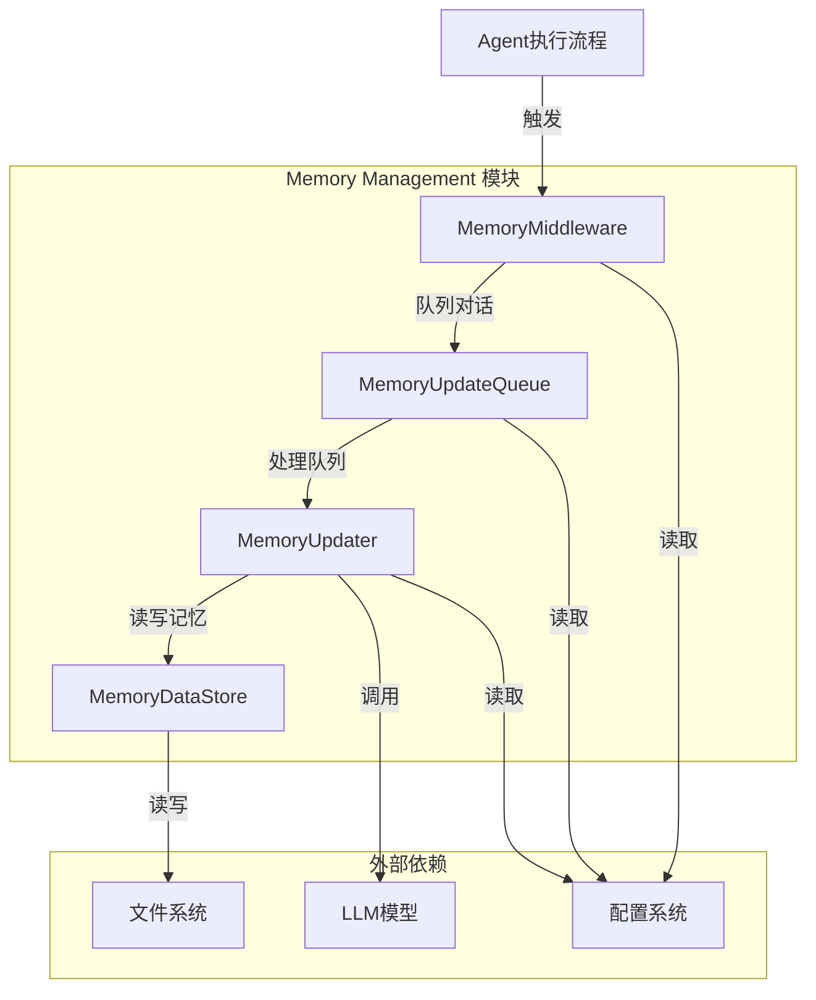
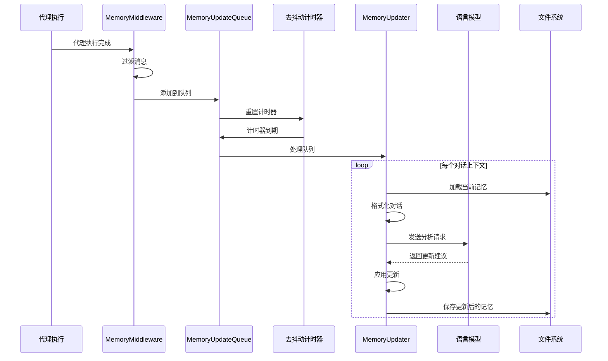

# Memory Management 模块文档

## 1. 模块概述

Memory Management 模块负责智能代理系统的长期记忆管理功能，通过对话内容的分析、提炼和存储，为代理提供上下文感知和个性化交互能力。该模块采用异步、批处理的方式工作，通过去抖动（debounce）机制优化性能，确保记忆更新既及时又高效。

### 核心功能

- **对话内容分析与记忆提取**：利用语言模型从对话中提取有价值的信息
- **记忆结构管理**：维护用户、工作、个人和历史上下文的分层记忆结构
- **事实库管理**：存储和管理高置信度的事实信息
- **异步批处理**：通过去抖动队列机制优化更新频率
- **缓存与持久化**：支持内存缓存和文件持久化

### 设计理念

该模块的设计遵循以下原则：
1. **非侵入性**：通过中间件模式集成，不影响核心代理逻辑
2. **异步处理**：记忆更新在后台进行，避免阻塞主交互流程
3. **智能过滤**：只保留有意义的对话内容进行记忆分析
4. **可配置性**：提供丰富的配置选项满足不同场景需求

## 2. 架构与组件关系

Memory Management 模块由四个核心组件组成，它们协同工作形成完整的记忆管理流程。



### 组件职责划分

1. **MemoryMiddleware**：作为代理执行流程的中间件，负责在代理执行完成后捕获对话内容
2. **MemoryUpdateQueue**：实现去抖动队列，管理记忆更新请求的批处理
3. **MemoryUpdater**：核心记忆更新逻辑，使用语言模型分析对话并更新记忆结构
4. **MemoryDataStore**：负责记忆数据的缓存、加载和持久化（通过 updater.py 中的函数实现）

## 3. 核心组件详解

### 3.1 MemoryUpdateQueue

`MemoryUpdateQueue` 是一个带有去抖动机制的内存更新队列，用于收集对话上下文并在可配置的延迟后批量处理。

#### 主要功能

- 收集多个对话的更新请求
- 通过去抖动机制合并短时间内的多个请求
- 确保同一线程的最新消息总是被处理
- 提供线程安全的操作

#### 关键方法

```python
def add(self, thread_id: str, messages: list[Any]) -> None:
    """将对话添加到更新队列"""
```

**参数**:
- `thread_id`: 线程标识符
- `messages`: 对话消息列表

**工作流程**:
1. 检查记忆功能是否启用
2. 创建 `ConversationContext` 对象
3. 使用线程锁安全地更新队列
4. 如果队列中已有相同线程的更新，替换为最新版本
5. 重置去抖动计时器

```python
def _process_queue(self) -> None:
    """处理所有队列中的对话上下文"""
```

该方法在去抖动计时器到期时自动调用，执行以下操作：
1. 获取队列锁，检查处理状态
2. 复制待处理的上下文并清空队列
3. 为每个上下文调用 `MemoryUpdater` 进行处理
4. 在多个更新之间添加小延迟以避免速率限制
5. 最终释放处理状态

```python
def flush(self) -> None:
    """强制立即处理队列（用于测试或优雅关闭）"""
```

```python
def clear(self) -> None:
    """清空队列而不处理（用于测试）"""
```

#### 线程安全设计

`MemoryUpdateQueue` 使用 `threading.Lock` 确保所有队列操作的线程安全性，包括：
- 添加新的对话上下文
- 处理队列
- 清空队列
- 检查状态

同时，计时器线程被设置为守护线程，确保程序可以正常退出而不需要等待计时器。

### 3.2 ConversationContext

`ConversationContext` 是一个简单的数据类，用于封装待处理的对话上下文信息。

```python
@dataclass
class ConversationContext:
    thread_id: str
    messages: list[Any]
    timestamp: datetime = field(default_factory=datetime.utcnow)
```

**字段说明**:
- `thread_id`: 对话线程的唯一标识符
- `messages`: 对话消息列表
- `timestamp`: 上下文创建时间戳（默认为当前UTC时间）

### 3.3 MemoryUpdater

`MemoryUpdater` 是记忆更新的核心组件，负责使用语言模型基于对话上下文更新记忆数据。

#### 主要功能

- 加载当前记忆数据
- 格式化对话内容用于提示
- 调用语言模型分析对话并生成记忆更新
- 应用更新到记忆结构
- 保存更新后的记忆数据

#### 关键方法

```python
def update_memory(self, messages: list[Any], thread_id: str | None = None) -> bool:
    """基于对话消息更新记忆"""
```

**参数**:
- `messages`: 对话消息列表
- `thread_id`: 可选的线程ID，用于跟踪来源

**返回值**:
- `bool`: 更新是否成功

**工作流程**:
1. 检查记忆功能是否启用
2. 获取当前记忆数据
3. 格式化对话内容
4. 构建提示并调用语言模型
5. 解析模型响应
6. 应用更新到记忆结构
7. 保存更新后的记忆

```python
def _apply_updates(
    self,
    current_memory: dict[str, Any],
    update_data: dict[str, Any],
    thread_id: str | None = None,
) -> dict[str, Any]:
    """应用LLM生成的更新到记忆"""
```

该方法负责将语言模型生成的更新应用到当前记忆结构，包括：
1. 更新用户上下文部分（工作、个人、关注焦点）
2. 更新历史上下文部分（最近月份、早期上下文、长期背景）
3. 移除指定的事实
4. 添加新的高置信度事实
5. 强制实施最大事实数量限制

#### 记忆数据结构

记忆数据采用以下分层结构：

```json
{
  "version": "1.0",
  "lastUpdated": "2023-01-01T00:00:00Z",
  "user": {
    "workContext": {"summary": "", "updatedAt": ""},
    "personalContext": {"summary": "", "updatedAt": ""},
    "topOfMind": {"summary": "", "updatedAt": ""}
  },
  "history": {
    "recentMonths": {"summary": "", "updatedAt": ""},
    "earlierContext": {"summary": "", "updatedAt": ""},
    "longTermBackground": {"summary": "", "updatedAt": ""}
  },
  "facts": [
    {
      "id": "fact_abc123def",
      "content": "事实内容",
      "category": "context",
      "confidence": 0.85,
      "createdAt": "2023-01-01T00:00:00Z",
      "source": "thread_123"
    }
  ]
}
```

### 3.4 MemoryMiddleware

`MemoryMiddleware` 是集成到代理执行流程中的中间件，负责在代理执行完成后将对话内容排队进行记忆更新。

#### 主要功能

- 在代理执行完成后捕获对话状态
- 过滤消息，只保留用户输入和最终助理响应
- 将过滤后的对话添加到记忆更新队列

#### 关键方法

```python
def after_agent(self, state: MemoryMiddlewareState, runtime: Runtime) -> dict | None:
    """代理完成后排练对话进行记忆更新"""
```

**工作流程**:
1. 检查记忆功能是否启用
2. 从运行时上下文中获取线程ID
3. 从状态中获取消息列表
4. 过滤消息，只保留用户输入和最终助理响应
5. 检查是否有意义的对话内容（至少需要一条用户消息和一条助理响应）
6. 将过滤后的对话添加到记忆更新队列

#### 消息过滤逻辑

`_filter_messages_for_memory` 函数实现了智能消息过滤，保留：
- 所有人类消息（用户输入）
- 没有工具调用的AI消息（最终助理响应）

过滤掉：
- 工具消息（中间工具调用结果）
- 带有工具调用的AI消息（中间步骤）

### 3.5 记忆数据管理函数

除了上述类组件外，模块还包含一系列用于记忆数据管理的函数：

#### 数据获取与缓存

```python
def get_memory_data() -> dict[str, Any]:
    """获取当前记忆数据（带文件修改时间检查的缓存）"""
```

该函数实现了智能缓存机制：
- 维护全局内存缓存
- 检查文件修改时间以自动失效缓存
- 确保始终返回最新数据

```python
def reload_memory_data() -> dict[str, Any]:
    """从文件重新加载记忆数据，强制缓存失效"""
```

#### 文件操作

```python
def _load_memory_from_file() -> dict[str, Any]:
    """从文件加载记忆数据"""
```

```python
def _save_memory_to_file(memory_data: dict[str, Any]) -> bool:
    """保存记忆数据到文件并更新缓存"""
```

保存操作采用原子写入策略：
1. 先写入临时文件
2. 然后重命名为实际文件
3. 这样可以避免在写入过程中程序崩溃导致数据损坏

## 4. 配置与使用

### 4.1 配置选项

Memory Management 模块通过 `MemoryConfig` 类进行配置，主要配置项包括：

| 配置项 | 类型 | 默认值 | 描述 |
|--------|------|--------|------|
| `enabled` | bool | True | 是否启用记忆机制 |
| `storage_path` | str | "" | 记忆数据存储路径（空值使用默认路径） |
| `debounce_seconds` | int | 30 | 处理队列更新前的等待秒数（去抖动） |
| `model_name` | str \| None | None | 用于记忆更新的模型名称（None使用默认模型） |
| `max_facts` | int | 100 | 存储的最大事实数量 |
| `fact_confidence_threshold` | float | 0.7 | 存储事实的最小置信度阈值 |
| `injection_enabled` | bool | True | 是否将记忆注入系统提示 |
| `max_injection_tokens` | int | 2000 | 记忆注入使用的最大令牌数 |

### 4.2 基本使用

#### 集成到代理流程

MemoryMiddleware 设计为与 LangChain 代理系统无缝集成：

```python
from src.agents.middlewares.memory_middleware import MemoryMiddleware

# 创建代理时添加中间件
agent = create_agent(
    middlewares=[MemoryMiddleware()],
    # 其他代理配置...
)
```

#### 直接使用记忆更新

如果需要直接触发记忆更新而不通过中间件：

```python
from src.agents.memory.updater import update_memory_from_conversation

# 直接从对话更新记忆
success = update_memory_from_conversation(
    messages=conversation_messages,
    thread_id="thread_123"
)
```

#### 手动管理队列

```python
from src.agents.memory.queue import get_memory_queue

# 获取队列实例
queue = get_memory_queue()

# 添加对话到队列
queue.add(thread_id="thread_123", messages=messages)

# 强制立即处理队列
queue.flush()

# 检查队列状态
print(f"待处理更新数: {queue.pending_count}")
print(f"是否正在处理: {queue.is_processing}")
```

## 5. 工作流程与数据流

### 5.1 完整记忆更新流程

下图展示了从代理执行到记忆更新完成的完整流程：



### 5.2 详细步骤说明

1. **代理执行完成**：代理完成对用户请求的处理，生成响应
2. **中间件捕获**：MemoryMiddleware 的 `after_agent` 方法被调用
3. **消息过滤**：只保留用户输入和最终助理响应，过滤掉中间工具调用
4. **队列添加**：将过滤后的对话添加到 MemoryUpdateQueue
5. **去抖动计时**：设置或重置计时器，等待更多可能的更新
6. **队列处理**：计时器到期后，处理所有队列中的对话
7. **记忆加载**：从文件或缓存加载当前记忆数据
8. **LLM 分析**：调用语言模型分析对话，生成记忆更新建议
9. **更新应用**：将 LLM 生成的更新应用到记忆结构
10. **记忆保存**：将更新后的记忆保存到文件，并更新缓存

## 6. 高级功能与扩展

### 6.1 自定义消息过滤

可以通过继承 MemoryMiddleware 并重写相关方法来自定义消息过滤逻辑：

```python
from src.agents.middlewares.memory_middleware import MemoryMiddleware

class CustomMemoryMiddleware(MemoryMiddleware):
    def _filter_messages_for_memory(self, messages):
        # 自定义过滤逻辑
        filtered = []
        for msg in messages:
            # 你的自定义过滤条件
            if should_include(msg):
                filtered.append(msg)
        return filtered
```

### 6.2 自定义记忆更新模型

可以通过指定自定义模型名称来使用不同的语言模型进行记忆更新：

```python
from src.agents.memory.updater import MemoryUpdater

# 使用特定模型创建更新器
updater = MemoryUpdater(model_name="gpt-4-turbo")
success = updater.update_memory(messages, thread_id)
```

### 6.3 手动触发与队列管理

对于需要更精细控制的场景，可以手动管理记忆更新队列：

```python
from src.agents.memory.queue import get_memory_queue, reset_memory_queue

# 正常使用
queue = get_memory_queue()
queue.add(thread_id, messages)

# 在应用关闭时
def on_shutdown():
    queue = get_memory_queue()
    queue.flush()  # 处理所有待处理更新
    reset_memory_queue()  # 重置队列
```

## 7. 注意事项与最佳实践

### 7.1 性能考虑

1. **去抖动时间设置**：
   - 默认 30 秒适合大多数场景
   - 高交互场景可考虑增加到 60 秒以减少 LLM 调用
   - 需要更及时更新的场景可减少到 15 秒，但会增加成本

2. **批处理优化**：
   - 队列在处理多个更新时会在每个更新之间添加 0.5 秒延迟
   - 这有助于避免可能的速率限制，但也会延长总处理时间

### 7.2 错误处理与恢复

1. **LLM 响应解析失败**：
   - 当 LLM 返回的 JSON 无法解析时，更新会失败但不会影响系统运行
   - 失败的更新不会重试，但下一次对话会触发新的更新尝试

2. **文件写入失败**：
   - 保存操作使用原子写入，避免部分写入导致的数据损坏
   - 失败时会打印错误信息，但保持内存中的缓存不变

3. **并发安全**：
   - 所有队列操作都使用线程锁保护
   - 但如果同时运行多个进程，每个进程会有自己的队列实例

### 7.3 部署建议

1. **存储路径配置**：
   - 生产环境建议使用绝对路径
   - 确保应用有写入权限
   - 考虑定期备份记忆文件

2. **模型选择**：
   - 记忆更新对模型推理能力要求较高
   - 建议使用能力较强的模型（如 GPT-4 系列）
   - 可通过配置为记忆更新使用与主代理不同的模型

3. **监控与日志**：
   - 模块会打印基本的操作日志
   - 建议在生产环境中集成更完善的日志系统
   - 可监控队列大小和处理时间作为系统健康指标

## 8. 与其他模块的关系

Memory Management 模块与系统中的其他几个关键模块有密切关系：

- **[thread_state](thread_state.md)**：提供线程状态管理，MemoryMiddleware 依赖其状态结构
- **[agent_execution_middlewares](agent_execution_middlewares.md)**：MemoryMiddleware 是中间件系统的一部分
- **[application_and_feature_configuration](application_and_feature_configuration.md)**：提供 MemoryConfig 配置
- **[model_and_external_clients](model_and_external_clients.md)**：提供语言模型客户端用于记忆分析

## 9. 示例场景

### 场景1：用户偏好记忆

假设用户在多次对话中提到他们喜欢简洁的回复，Memory Management 模块会：

1. 通过 MemoryMiddleware 捕获这些对话
2. 将对话添加到更新队列
3. 队列处理时调用 LLM 分析
4. LLM 识别出用户偏好并生成更新
5. 将这一事实添加到记忆中
6. 后续对话可根据这一记忆调整回复风格

### 场景2：项目上下文记忆

用户正在与代理合作开发一个项目，Memory Management 模块会：

1. 捕获关于项目的讨论
2. 更新 workContext 部分，保存项目摘要
3. 提取关键技术决策作为事实存储
4. 当用户几天后继续对话时，代理可以回顾这些信息
5. 避免重复询问已经讨论过的问题

## 总结

Memory Management 模块为智能代理系统提供了强大的长期记忆能力，通过分层记忆结构、异步批处理和智能过滤等机制，在保证性能的同时，极大地增强了代理的上下文感知和个性化交互能力。通过合理配置和使用，该模块可以显著提升用户体验和代理的实用价值。
