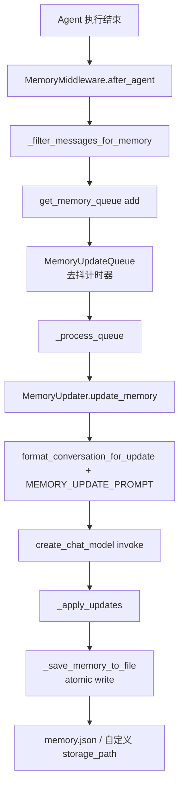
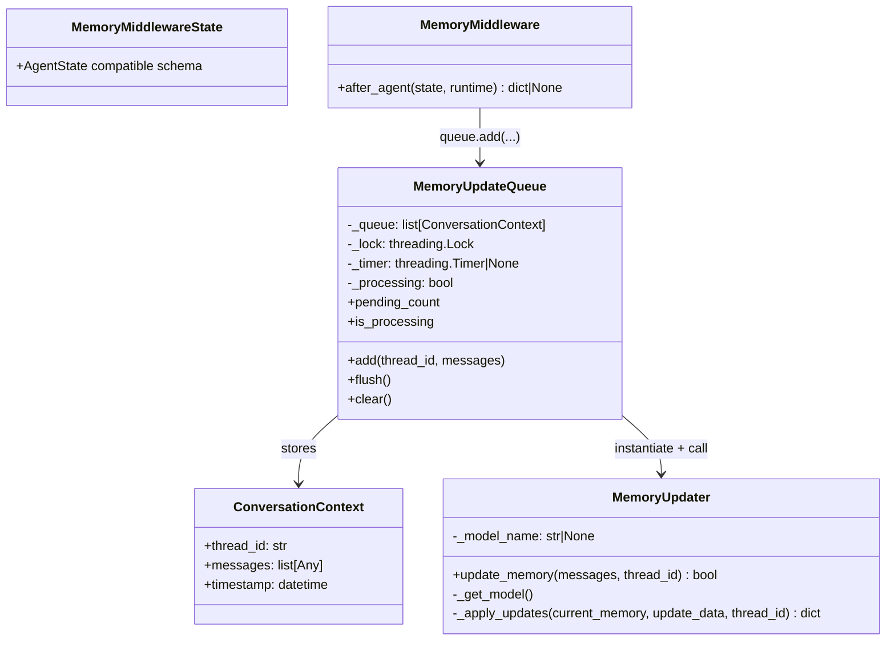
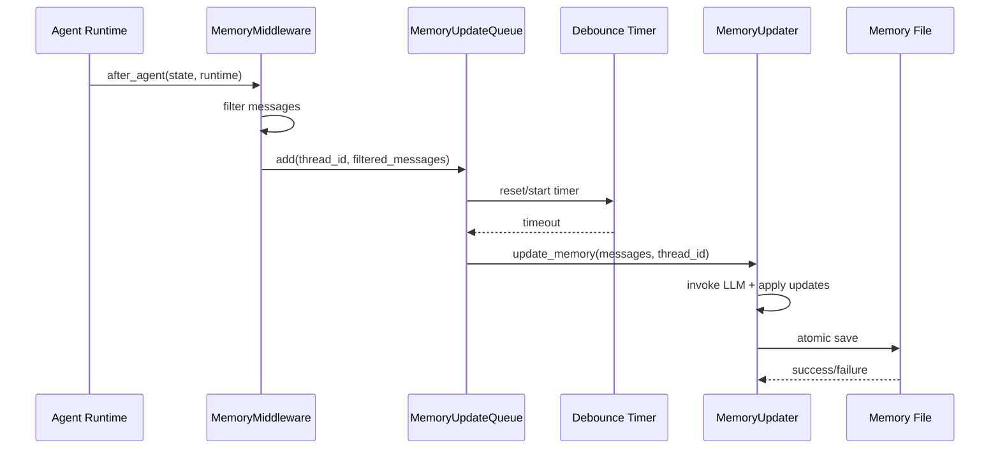
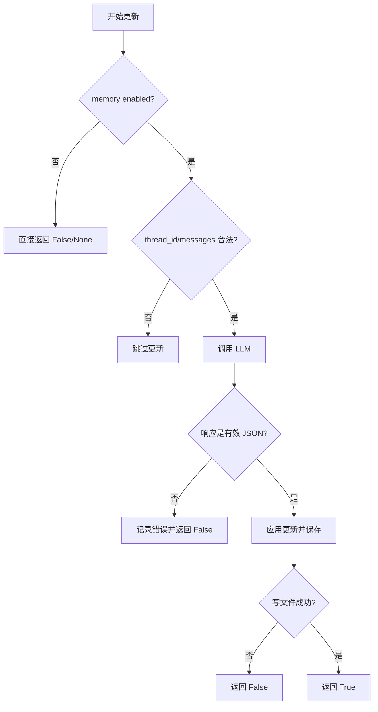

# memory_pipeline 模块文档

> 本文档已根据 `memory_pipeline` 当前核心实现（`queue.py`、`updater.py`、`memory_middleware.py`）重新校对，涵盖架构、时序、配置、扩展点与边界行为。

## 1. 模块定位与设计动机

`memory_pipeline` 是代理系统中“对话后记忆更新”这一条异步链路的核心模块。它不负责生成回复本身，而是在一次 agent 执行结束后，提取可沉淀的对话信息，经过去抖动队列批处理，再调用 LLM 将信息写入长期记忆存储。其目标是在不阻塞主交互路径的前提下，让系统逐步形成稳定、可复用的用户画像与历史上下文。

这个模块存在的核心原因有两个。第一，实时请求路径需要低延迟，而记忆总结通常涉及额外模型调用与 I/O，不适合在主路径同步执行。第二，用户可能在短时间内频繁交互，如果每条消息都立即触发记忆更新，会造成重复计算、成本上升与速率限制风险。为此，模块采用“中间件触发 + 去抖队列 + 后台更新”的设计，把多个近时间窗口的更新压缩为一次更高价值的写入。

从系统分层上看，`memory_pipeline` 处于 `agent_memory_and_thread_context` 的 memory 子域，依赖配置系统（`application_and_feature_configuration.md`）和模型工厂（`model_and_external_clients.md`），并通过 middleware 机制嵌入 agent 执行流水线（见 `agent_execution_middlewares.md`）。

---

## 2. 核心架构总览



这条链路强调“最终一致性”而非“强一致实时写入”。即，某次对话完成后，记忆并不会马上可见，而是在 debounce 窗口结束后由后台线程处理。对交互体验而言，这意味着响应速度更快；对记忆质量而言，这意味着可聚合更多上下文，减少碎片化更新。

---

## 3. 组件与关系详解

### 3.1 组件交互图



`MemoryMiddleware` 是入口；`MemoryUpdateQueue` 是调度与并发控制核心；`MemoryUpdater` 是业务逻辑核心；`ConversationContext` 是排队数据载体。这个解耦使得后续扩展（例如替换存储后端、替换总结策略）可局部演进，而不必重写整条链路。

---

## 4. 核心组件逐项说明

## 4.1 `ConversationContext`

`ConversationContext` 是一个轻量 dataclass，用于把一次待处理记忆更新打包成结构化对象。

- `thread_id: str`：会话线程标识，用于去重（同线程仅保留最新待处理项）和事实来源标注。
- `messages: list[Any]`：过滤后的消息列表。
- `timestamp: datetime`：入队时间，默认 `datetime.utcnow()`。

虽然结构简单，但它承担了“消息快照”语义：当对象被推入队列后，即使后续 state 继续变化，这个上下文仍是本次更新处理的数据基础。

## 4.2 `MemoryUpdateQueue`

`MemoryUpdateQueue` 实现了线程安全的去抖队列。它的职责不是理解业务内容，而是控制“何时处理、处理哪些上下文、如何避免并发冲突”。

### `add(thread_id: str, messages: list[Any]) -> None`

此方法由 middleware 调用，执行以下关键动作：

1. 读取 `get_memory_config()`，若 `enabled=False` 直接返回。
2. 构造 `ConversationContext`。
3. 在锁内将同 `thread_id` 的旧上下文移除，只保留最新一条。
4. 触发 `_reset_timer()`，将处理延后到 debounce 窗口结束。

副作用是：
- 修改内存队列内容；
- 可能取消并重建计时器；
- 输出日志 `print(...)`。

### `_reset_timer() -> None`

该方法会取消现有 timer（若存在），并按 `config.debounce_seconds` 创建新 timer。timer 回调为 `_process_queue`，且设置 `daemon=True`，避免阻止进程退出。

这意味着频繁入队会不断“推迟”处理时间，直到输入趋于平静。

### `_process_queue() -> None`

真正的后台处理入口，流程如下：

1. 在锁内检查 `_processing`。若当前已有处理任务，则重新设置 timer 后返回，避免重入。
2. 若队列为空则返回。
3. 将队列拷贝到局部变量并清空原队列，设置 `_processing=True`。
4. 逐个上下文调用 `MemoryUpdater.update_memory(...)`。
5. 多上下文场景下，每次处理后 `sleep(0.5)`，降低速率限制风险。
6. finally 块中恢复 `_processing=False`。

关键点是“先摘队列再处理”：可以缩短锁持有时间，减少阻塞；代价是处理期间新入队数据会等下一轮。

### `flush() -> None`

用于测试或优雅停机。它先取消 timer，再立即调用 `_process_queue()`。如果你希望在应用退出前尽可能落盘记忆，应显式调用它。

### `clear() -> None`

清空待处理项且不执行更新，主要用于测试隔离。

### `pending_count` 与 `is_processing`

两个只读属性，在线程锁保护下返回当前队列长度和处理状态，适合健康检查或测试断言。

### 单例函数

- `get_memory_queue() -> MemoryUpdateQueue`：全局懒加载单例。
- `reset_memory_queue() -> None`：测试用重置，包含清理已有实例。

该设计简化了多处中间件调用，但也意味着它是进程内单例，不跨进程共享。

## 4.3 `MemoryUpdater`

`MemoryUpdater` 负责“从消息到结构化记忆”的核心业务流程。

### 构造函数 `__init__(model_name: str | None = None)`

允许按实例覆盖模型名。若不传，则回退到 `MemoryConfig.model_name`，再由 `create_chat_model` 决定默认模型。

### `_get_model()`

调用 `create_chat_model(name=model_name, thinking_enabled=False)` 创建模型实例。`thinking_enabled=False` 表明此类任务偏结构化抽取，避免额外思维开销。

### `update_memory(messages: list[Any], thread_id: str | None = None) -> bool`

这是外部最重要的方法，返回是否成功落盘。

主要步骤：

1. 配置与输入校验：`enabled` 必须为真，`messages` 不可空。
2. 读取当前记忆：`get_memory_data()`（带 cache + mtime 校验）。
3. 格式化对话：`format_conversation_for_update(messages)`，仅输出 User/Assistant 文本；超长消息会截断。
4. 构造 `MEMORY_UPDATE_PROMPT`，把当前记忆 JSON 与对话文本注入。
5. 调用 LLM：`model.invoke(prompt)`。
6. 解析响应：支持剥离 markdown 代码块；再 `json.loads(...)`。
7. 应用更新：`_apply_updates(...)`。
8. 保存文件：`_save_memory_to_file(...)`（原子写）。

异常处理策略：
- JSON 解析失败返回 `False` 并打印日志；
- 其他异常统一捕获返回 `False`。

这使上层队列不会因单次失败中断整批处理。

### `_apply_updates(current_memory, update_data, thread_id) -> dict`

此方法实现更新合并策略：

1. 对 `user` 的 `workContext`/`personalContext`/`topOfMind`，仅当 `shouldUpdate=True` 且 `summary` 非空才覆盖。
2. 对 `history` 的 `recentMonths`/`earlierContext`/`longTermBackground` 执行同样规则。
3. 根据 `factsToRemove` 删除旧事实。
4. 遍历 `newFacts`，按 `fact_confidence_threshold` 过滤，生成带 `id/content/category/confidence/createdAt/source` 的事实条目。
5. 若事实总量超过 `max_facts`，按 `confidence` 降序截断。

这个策略偏“幂等近似”：重复内容可能产生新 fact id，因此不是严格幂等；但通过置信度阈值和上限截断控制规模。

## 4.4 Prompt 契约与 LLM 输出约束（`prompt.py`）

`MemoryUpdater` 的行为高度依赖 `MEMORY_UPDATE_PROMPT` 所定义的输出契约。该 prompt 要求模型返回严格 JSON，结构包含 `user`、`history`、`newFacts`、`factsToRemove` 四个顶层字段，并通过 `shouldUpdate` 明确标识哪些摘要段落需要覆写。这个设计将“是否更新”从应用层硬编码迁移到了模型决策层：应用只负责执行规则，模型负责判断信息增量。

`format_conversation_for_update(messages)` 在这里承担输入归一化职责。它会按消息类型输出 `User:` 与 `Assistant:` 前缀；若消息内容是多模态 list，会仅拼接含 `text` 的片段；单条消息超过 1000 字符会被截断。这个函数与 middleware 的过滤策略形成双重约束：前者做格式归一化，后者做语义筛选，从而降低工具中间态污染记忆总结的概率。

下面是该契约对应的最小合法输出示例（便于自定义 prompt 时做回归验证）：

```json
{
  "user": {
    "workContext": {"summary": "", "shouldUpdate": false},
    "personalContext": {"summary": "", "shouldUpdate": false},
    "topOfMind": {"summary": "", "shouldUpdate": false}
  },
  "history": {
    "recentMonths": {"summary": "", "shouldUpdate": false},
    "earlierContext": {"summary": "", "shouldUpdate": false},
    "longTermBackground": {"summary": "", "shouldUpdate": false}
  },
  "newFacts": [],
  "factsToRemove": []
}
```

如果你计划重写 prompt，请保持字段名不变，或同步修改 `_apply_updates` 的读取逻辑。否则常见结果是“模型看似成功返回，但应用层没有任何更新被应用”。

## 4.5 模块级数据读写函数（`updater.py`）

虽然不属于 class，但这些函数定义了存储行为和缓存语义，是理解模块稳定性的关键。

### `_get_memory_file_path() -> Path`

解析存储路径：
- 若 `MemoryConfig.storage_path` 非空：绝对路径直接使用；相对路径基于 `Paths.base_dir` 解析。
- 否则使用 `get_paths().memory_file` 默认路径。

### `get_memory_data()` 与 `reload_memory_data()`

- `get_memory_data()`：带缓存读取，比较文件 mtime 决定是否失效。
- `reload_memory_data()`：强制重载并刷新缓存状态。

### `_load_memory_from_file()`

文件不存在或 JSON 损坏时，返回 `_create_empty_memory()`。这确保更新流程可继续，但会掩盖部分数据损坏风险（仅日志提示）。

### `_save_memory_to_file(memory_data) -> bool`

通过 `.tmp` 临时文件写入后 `replace()`，减少部分写入导致的文件损坏概率。写入成功后同步更新内存缓存与 mtime。

### `update_memory_from_conversation(...)`

便捷函数，本质是 `MemoryUpdater().update_memory(...)` 的函数式封装。

## 4.6 `MemoryMiddlewareState` 与 `MemoryMiddleware`

`MemoryMiddlewareState` 继承 `AgentState`，保持与 thread state schema 兼容。实际字段依赖上游状态（通常包含 `messages`）。

`MemoryMiddleware` 在 `after_agent(...)` 钩子执行：

1. 检查 `memory.enabled`。
2. 从 `runtime.context` 读取 `thread_id`，缺失则跳过。
3. 从 `state` 读取 `messages`，为空则跳过。
4. 调用 `_filter_messages_for_memory(messages)`，保留 human + 无 tool_calls 的 ai。
5. 至少需要一条用户消息和一条助理最终回复，否则跳过。
6. 入队 `get_memory_queue().add(...)`。

该中间件不修改 state，返回 `None`。

---

## 5. 关键流程与时序



在这个时序中，最重要的行为边界是“middleware 阶段只做轻量入队，不做重任务”。因此 memory pipeline 不会显著拉长 agent 的响应时间。

---

## 6. 配置项与运行行为

`memory_pipeline` 主要读取 `MemoryConfig`（详见 `application_and_feature_configuration.md`）。关键配置包括：

- `enabled`：总开关，关闭后 middleware 与 queue 均短路。
- `debounce_seconds`：去抖窗口（1~300）。越大越省调用，越小越实时。
- `model_name`：用于记忆更新的模型名，可为空使用默认。
- `storage_path`：记忆文件路径，支持相对/绝对路径。
- `fact_confidence_threshold`：事实收录阈值（0~1）。
- `max_facts`：事实最大保留数（10~500）。
- `injection_enabled`、`max_injection_tokens`：主要作用于记忆注入阶段（非本文 pipeline 主流程，但与同一 memory 数据结构关联）。

配置是动态读取的（每次调用 `get_memory_config()`），因此运行期变更会影响后续行为。

一个常见误区是将 `debounce_seconds` 设得非常小（例如 1~2 秒）并期望“几乎实时”记忆。虽然这在功能上可行，但会显著提高模型调用频率，并增加返回非 JSON 的概率暴露频次。实践中建议根据交互密度分层：高频聊天场景可取 20~60 秒，低频专家系统可取 5~15 秒。

下面给出一个更贴近生产环境的配置片段（字段定义见 [`application_and_feature_configuration.md`](application_and_feature_configuration.md)）：

```yaml
memory:
  enabled: true
  storage_path: "memory.json"           # 相对 Paths.base_dir 解析
  debounce_seconds: 30
  model_name: "gpt-4o-mini"
  max_facts: 120
  fact_confidence_threshold: 0.75
  injection_enabled: true
  max_injection_tokens: 2000
```

---

## 7. 实际使用方式

### 7.1 在 agent middleware 链中启用

```python
from src.agents.middlewares.memory_middleware import MemoryMiddleware

middlewares = [
    # ... other middlewares
    MemoryMiddleware(),
]
```

要确保运行时上下文包含 `thread_id`，否则记忆更新会被跳过。

### 7.2 手动触发更新（调试/批处理）

```python
from src.agents.memory.updater import MemoryUpdater

updater = MemoryUpdater(model_name="gpt-4o-mini")
ok = updater.update_memory(messages=filtered_messages, thread_id="thread_42")
print("updated:", ok)
```

### 7.3 停机前 flush

```python
from src.agents.memory.queue import get_memory_queue

queue = get_memory_queue()
queue.flush()  # 尽量处理剩余待更新项
```

---

## 8. 可扩展点与二次开发建议

若你要扩展 `memory_pipeline`，优先从以下稳定边界切入。

首先，消息过滤策略可按业务调整。当前 `_filter_messages_for_memory` 丢弃 tool messages 与带 tool_calls 的 ai 中间消息。如果你的工具结果本身包含高价值用户偏好，可以在过滤阶段选择性保留摘要字段。

其次，更新合并策略在 `_apply_updates`。你可以加入事实去重（基于内容 hash）、按类别限额（例如 preference 最多 20 条）或时间衰减（老旧低置信度事实自动淘汰）。这些改动通常不会影响 queue 与 middleware。

再次，存储后端目前是本地 JSON 文件。如果需要多实例部署，可将 `_load/_save` 抽象到数据库或对象存储，同时保留原子语义与并发控制；否则多进程写同一文件会出现覆盖风险。

最后，模型与 prompt 可替换。`MEMORY_UPDATE_PROMPT` 定义了结构化输出契约（JSON 形状）。若更换 prompt，请保持字段兼容，避免 `_apply_updates` 因 schema 偏差失效。

---

## 9. 边界条件、错误场景与已知限制



需要重点注意以下问题：

1. **进程内线程安全 ≠ 跨进程安全**：`MemoryUpdateQueue` 和缓存变量只保证单进程内行为；多 worker 共享同一文件时仍可能互相覆盖。
2. **LLM 输出不稳定**：即使 prompt 要求 JSON，仍可能返回非 JSON 或半结构化文本，导致本轮更新失败。
3. **事实去重不足**：当前新增事实使用随机 id，重复内容可能累积；最终由 `max_facts` 截断，不能保证语义去重。
4. **消息截断信息损失**：`format_conversation_for_update` 会截断超长消息到 1000 字符，可能遗漏后半段关键信息。
5. **日志通道较原始**：当前使用 `print`，在生产环境建议接入统一 logging/tracing，便于观测失败率与耗时。
6. **最终一致性延迟**：由于 debounce，记忆不会立即更新；依赖“刚说完就要用到新记忆”的流程需考虑补偿策略。

---

## 10. 与其他模块的关系（避免重复说明）

`memory_pipeline` 只覆盖“记忆更新”链路，不包含 thread state 全量 schema、不包含 API 合同层，也不包含前端展示。相关内容请参考：

- 与 middleware 编排相关：[`agent_execution_middlewares.md`](agent_execution_middlewares.md)
- 与配置定义相关：[`application_and_feature_configuration.md`](application_and_feature_configuration.md)
- 与更大范围记忆/线程上下文总览相关：[`agent_memory_and_thread_context.md`](agent_memory_and_thread_context.md)
- 与模型工厂和客户端相关：[`model_and_external_clients.md`](model_and_external_clients.md)
- 与对外 memory API 结构相关：[`gateway_api_contracts.md`](gateway_api_contracts.md)

通过以上文档组合阅读，开发者可以分别掌握“内部处理机制、配置入口、对外契约与跨模块集成点”，从而更安全地修改或扩展 memory pipeline。
