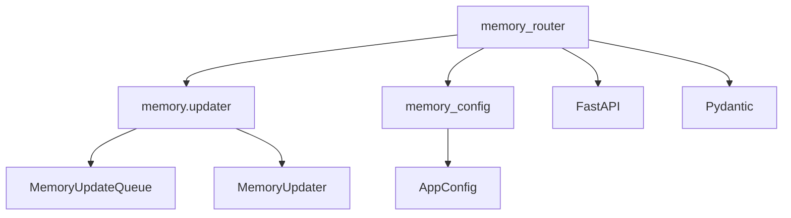

# memory_router 模块文档

## 概述

memory_router 模块是一个 FastAPI 路由模块，提供了用于检索和管理全局记忆数据的 REST API 端点。该模块作为系统记忆功能的网关接口，允许外部客户端获取当前记忆状态、重新加载记忆数据以及查看记忆系统配置。

### 设计目的

memory_router 模块的设计目的是为系统的记忆管理功能提供一个标准化的 HTTP 接口。通过这个模块，前端应用或其他服务可以：

1. 查看当前系统中存储的用户上下文、历史记录和事实信息
2. 在记忆文件被外部修改后重新加载记忆数据
3. 查看记忆系统的配置参数
4. 同时获取配置和数据的综合状态信息

该模块是 gateway_api_contracts 模块树的一部分，与其他网关路由（如 mcp_router、models_router 等）一起构成了系统的 API 层。

## 核心组件详解

### 数据模型

#### ContextSection

`ContextSection` 是一个基础的数据模型，用于表示带有摘要和更新时间戳的上下文部分。

```python
class ContextSection(BaseModel):
    """Model for context sections (user and history)."""

    summary: str = Field(default="", description="Summary content")
    updatedAt: str = Field(default="", description="Last update timestamp")
```

**参数说明**：
- `summary`：上下文的摘要内容，默认为空字符串
- `updatedAt`：最后更新的时间戳，默认为空字符串

这个模型被用作其他更复杂上下文模型的构建块。

#### UserContext

`UserContext` 模型表示用户相关的上下文信息，分为三个主要部分：

```python
class UserContext(BaseModel):
    """Model for user context."""

    workContext: ContextSection = Field(default_factory=ContextSection)
    personalContext: ContextSection = Field(default_factory=ContextSection)
    topOfMind: ContextSection = Field(default_factory=ContextSection)
```

**参数说明**：
- `workContext`：用户的工作上下文，包含与工作相关的信息摘要
- `personalContext`：用户的个人上下文，包含个人偏好和特点
- `topOfMind`：用户当前最关注的内容，即"脑海中的首要事项"

每个字段都是一个 `ContextSection` 对象，提供了相应的摘要和更新时间。

#### HistoryContext

`HistoryContext` 模型表示历史相关的上下文信息，按时间范围分为三个部分：

```python
class HistoryContext(BaseModel):
    """Model for history context."""

    recentMonths: ContextSection = Field(default_factory=ContextSection)
    earlierContext: ContextSection = Field(default_factory=ContextSection)
    longTermBackground: ContextSection = Field(default_factory=ContextSection)
```

**参数说明**：
- `recentMonths`：最近几个月的历史上下文摘要
- `earlierContext`：更早时期的历史上下文
- `longTermBackground`：长期背景信息

这种时间分段的设计允许系统以不同的粒度存储和呈现历史信息。

#### Fact

`Fact` 模型表示系统记忆中的单个事实条目：

```python
class Fact(BaseModel):
    """Model for a memory fact."""

    id: str = Field(..., description="Unique identifier for the fact")
    content: str = Field(..., description="Fact content")
    category: str = Field(default="context", description="Fact category")
    confidence: float = Field(default=0.5, description="Confidence score (0-1)")
    createdAt: str = Field(default="", description="Creation timestamp")
    source: str = Field(default="unknown", description="Source thread ID")
```

**参数说明**：
- `id`：事实的唯一标识符，必填字段
- `content`：事实的具体内容，必填字段
- `category`：事实的类别，默认为 "context"
- `confidence`：置信度分数，范围 0-1，默认为 0.5
- `createdAt`：创建时间戳，默认为空字符串
- `source`：来源线程 ID，默认为 "unknown"

事实是系统记忆的基本单元，可以包含用户偏好、重要事件或其他相关信息。

#### MemoryResponse

`MemoryResponse` 是获取记忆数据的主要响应模型：

```python
class MemoryResponse(BaseModel):
    """Response model for memory data."""

    version: str = Field(default="1.0", description="Memory schema version")
    lastUpdated: str = Field(default="", description="Last update timestamp")
    user: UserContext = Field(default_factory=UserContext)
    history: HistoryContext = Field(default_factory=HistoryContext)
    facts: list[Fact] = Field(default_factory=list)
```

**参数说明**：
- `version`：记忆数据模式的版本，默认为 "1.0"
- `lastUpdated`：记忆数据的最后更新时间戳
- `user`：用户上下文对象
- `history`：历史上下文对象
- `facts`：事实列表

这个模型封装了系统中存储的所有记忆相关信息。

#### MemoryConfigResponse

`MemoryConfigResponse` 模型用于返回记忆系统的配置信息：

```python
class MemoryConfigResponse(BaseModel):
    """Response model for memory configuration."""

    enabled: bool = Field(..., description="Whether memory is enabled")
    storage_path: str = Field(..., description="Path to memory storage file")
    debounce_seconds: int = Field(..., description="Debounce time for memory updates")
    max_facts: int = Field(..., description="Maximum number of facts to store")
    fact_confidence_threshold: float = Field(..., description="Minimum confidence threshold for facts")
    injection_enabled: bool = Field(..., description="Whether memory injection is enabled")
    max_injection_tokens: int = Field(..., description="Maximum tokens for memory injection")
```

**参数说明**：
- `enabled`：记忆功能是否启用
- `storage_path`：记忆存储文件的路径
- `debounce_seconds`：记忆更新的防抖时间（秒）
- `max_facts`：可存储的最大事实数量
- `fact_confidence_threshold`：事实的最小置信度阈值
- `injection_enabled`：是否启用记忆注入
- `max_injection_tokens`：记忆注入的最大 token 数

这些配置项控制着记忆系统的行为和性能特征。

#### MemoryStatusResponse

`MemoryStatusResponse` 模型提供了记忆系统的综合状态，包括配置和数据：

```python
class MemoryStatusResponse(BaseModel):
    """Response model for memory status."""

    config: MemoryConfigResponse
    data: MemoryResponse
```

**参数说明**：
- `config`：记忆系统配置
- `data`：当前记忆数据

这个模型允许客户端通过单个请求获取完整的记忆系统状态。

### API 端点

#### GET /api/memory

获取当前的全局记忆数据，包括用户上下文、历史记录和事实。

```python
@router.get(
    "/memory",
    response_model=MemoryResponse,
    summary="Get Memory Data",
    description="Retrieve the current global memory data including user context, history, and facts.",
)
async def get_memory() -> MemoryResponse:
    memory_data = get_memory_data()
    return MemoryResponse(**memory_data)
```

**功能说明**：
- 从记忆系统中检索当前的全局记忆数据
- 调用 `get_memory_data()` 函数获取原始记忆数据
- 将数据转换为 `MemoryResponse` 模型格式返回

**返回值**：
- 返回一个 `MemoryResponse` 对象，包含完整的记忆数据

**示例响应**：
```json
{
    "version": "1.0",
    "lastUpdated": "2024-01-15T10:30:00Z",
    "user": {
        "workContext": {"summary": "Working on DeerFlow project", "updatedAt": "..."},
        "personalContext": {"summary": "Prefers concise responses", "updatedAt": "..."},
        "topOfMind": {"summary": "Building memory API", "updatedAt": "..."}
    },
    "history": {
        "recentMonths": {"summary": "Recent development activities", "updatedAt": "..."},
        "earlierContext": {"summary": "", "updatedAt": ""},
        "longTermBackground": {"summary": "", "updatedAt": ""}
    },
    "facts": [
        {
            "id": "fact_abc123",
            "content": "User prefers TypeScript over JavaScript",
            "category": "preference",
            "confidence": 0.9,
            "createdAt": "2024-01-15T10:30:00Z",
            "source": "thread_xyz"
        }
    ]
}
```

#### POST /api/memory/reload

从存储文件重新加载记忆数据，刷新内存缓存。

```python
@router.post(
    "/memory/reload",
    response_model=MemoryResponse,
    summary="Reload Memory Data",
    description="Reload memory data from the storage file, refreshing the in-memory cache.",
)
async def reload_memory() -> MemoryResponse:
    memory_data = reload_memory_data()
    return MemoryResponse(**memory_data)
```

**功能说明**：
- 强制从存储文件重新加载记忆数据
- 调用 `reload_memory_data()` 函数执行重新加载操作
- 适用于记忆文件被外部修改的情况

**返回值**：
- 返回重新加载后的 `MemoryResponse` 对象

#### GET /api/memory/config

获取记忆系统的当前配置。

```python
@router.get(
    "/memory/config",
    response_model=MemoryConfigResponse,
    summary="Get Memory Configuration",
    description="Retrieve the current memory system configuration.",
)
async def get_memory_config_endpoint() -> MemoryConfigResponse:
    config = get_memory_config()
    return MemoryConfigResponse(
        enabled=config.enabled,
        storage_path=config.storage_path,
        debounce_seconds=config.debounce_seconds,
        max_facts=config.max_facts,
        fact_confidence_threshold=config.fact_confidence_threshold,
        injection_enabled=config.injection_enabled,
        max_injection_tokens=config.max_injection_tokens,
    )
```

**功能说明**：
- 调用 `get_memory_config()` 获取记忆系统配置
- 将配置转换为 `MemoryConfigResponse` 模型格式返回

**返回值**：
- 返回一个 `MemoryConfigResponse` 对象，包含所有记忆配置项

**示例响应**：
```json
{
    "enabled": true,
    "storage_path": ".deer-flow/memory.json",
    "debounce_seconds": 30,
    "max_facts": 100,
    "fact_confidence_threshold": 0.7,
    "injection_enabled": true,
    "max_injection_tokens": 2000
}
```

#### GET /api/memory/status

在单个请求中同时获取记忆配置和当前数据。

```python
@router.get(
    "/memory/status",
    response_model=MemoryStatusResponse,
    summary="Get Memory Status",
    description="Retrieve both memory configuration and current data in a single request.",
)
async def get_memory_status() -> MemoryStatusResponse:
    config = get_memory_config()
    memory_data = get_memory_data()

    return MemoryStatusResponse(
        config=MemoryConfigResponse(
            enabled=config.enabled,
            storage_path=config.storage_path,
            debounce_seconds=config.debounce_seconds,
            max_facts=config.max_facts,
            fact_confidence_threshold=config.fact_confidence_threshold,
            injection_enabled=config.injection_enabled,
            max_injection_tokens=config.max_injection_tokens,
        ),
        data=MemoryResponse(**memory_data),
    )
```

**功能说明**：
- 同时获取记忆配置和数据
- 组合成 `MemoryStatusResponse` 对象返回
- 提供记忆系统的完整状态快照

**返回值**：
- 返回一个 `MemoryStatusResponse` 对象，包含配置和数据

## 架构与依赖关系

### 模块架构

memory_router 模块位于系统的 API 网关层，作为外部客户端与内部记忆管理系统之间的接口。其架构可以分为以下几个层次：

1. **API 层**：FastAPI 路由定义和端点处理函数
2. **数据模型层**：Pydantic 模型定义请求和响应格式
3. **服务调用层**：调用内部记忆管理服务获取和处理数据

### 依赖关系

memory_router 模块主要依赖以下模块：

1. **agent_memory_and_thread_context**：特别是 `backend.src.agents.memory.updater` 模块，提供 `get_memory_data` 和 `reload_memory_data` 函数
2. **application_and_feature_configuration**：特别是 `backend.src.config.memory_config` 模块，提供 `get_memory_config` 函数

下图展示了 memory_router 模块与其他模块的依赖关系：



**组件交互流程**：

1. 当 API 端点被调用时，memory_router 首先导入必要的函数
2. 对于数据获取请求，调用 `get_memory_data()` 或 `reload_memory_data()`
3. 对于配置请求，调用 `get_memory_config()`
4. 将获取的原始数据转换为相应的 Pydantic 模型
5. 返回格式化的响应

## 使用指南

### 基本使用

memory_router 模块是 FastAPI 应用的一部分，使用时需要将其路由注册到主应用中：

```python
from fastapi import FastAPI
from src.gateway.routers.memory import router as memory_router

app = FastAPI()
app.include_router(memory_router)
```

### API 调用示例

以下是使用 Python requests 库调用 memory_router API 的示例：

```python
import requests

# 获取记忆数据
response = requests.get("http://localhost:8000/api/memory")
memory_data = response.json()
print("Memory data:", memory_data)

# 重新加载记忆数据
response = requests.post("http://localhost:8000/api/memory/reload")
reloaded_data = response.json()
print("Reloaded memory data:", reloaded_data)

# 获取记忆配置
response = requests.get("http://localhost:8000/api/memory/config")
config = response.json()
print("Memory config:", config)

# 获取记忆状态
response = requests.get("http://localhost:8000/api/memory/status")
status = response.json()
print("Memory status:", status)
```

## 注意事项与限制

### 边缘情况

1. **空记忆数据**：当系统中没有存储任何记忆数据时，API 将返回包含默认空值的响应对象，而不是错误。

2. **外部文件修改**：如果记忆存储文件被外部程序修改，需要调用 `/api/memory/reload` 端点来刷新内存中的缓存。

3. **配置与数据不一致**：在某些情况下，配置的 `max_facts` 可能小于实际存储的事实数量，此时系统通常会保留所有事实，但可能不会添加新事实。

### 错误条件

1. **记忆文件访问错误**：如果记忆存储文件无法读取或写入，`get_memory_data()` 和 `reload_memory_data()` 函数可能会抛出异常。

2. **配置加载失败**：如果记忆配置无法正确加载，`get_memory_config()` 可能会返回默认配置或抛出异常。

### 已知限制

1. **只读接口**：当前 memory_router 只提供读取和重新加载记忆的接口，不提供通过 API 修改记忆数据的功能。

2. **无认证授权**：当前实现中没有包含认证或授权机制，在生产环境中使用时需要添加适当的安全措施。

3. **错误处理有限**：API 端点的错误处理相对简单，可能需要根据具体需求增强错误响应和处理逻辑。

## 相关模块参考

- [agent_memory_and_thread_context](agent_memory_and_thread_context.md)：了解记忆系统的内部实现和管理逻辑
- [application_and_feature_configuration](application_and_feature_configuration.md)：了解记忆配置的详细结构和加载方式
- [gateway_api_contracts](gateway_api_contracts.md)：了解其他网关路由模块和整体 API 架构
