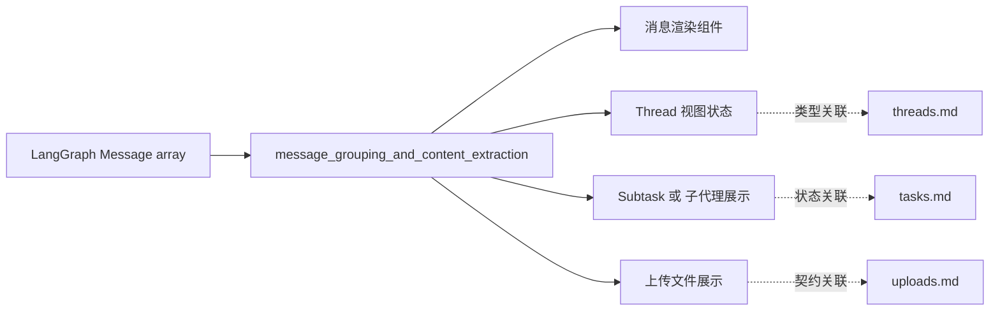
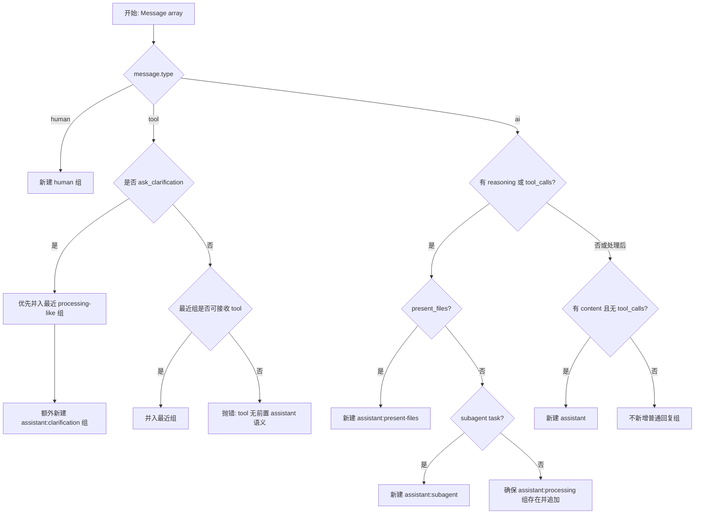
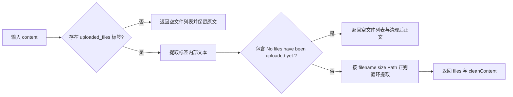
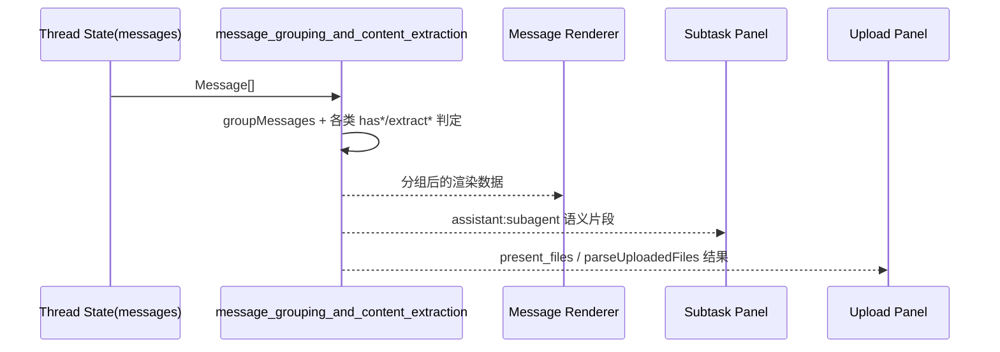

# message_grouping_and_content_extraction 模块文档

## 模块简介

`message_grouping_and_content_extraction` 模块（对应 `frontend/src/core/messages/utils.ts`）是前端消息域中的“结构化与提取”核心。它的职责不是直接渲染 UI，而是把来自 `@langchain/langgraph-sdk` 的原始 `Message[]` 转换为更稳定、更可渲染的“消息分组语义”，同时提供一组内容提取与标记解析函数，帮助上层组件处理文本、图片、tool call 结果、推理内容（reasoning_content）以及上传文件元信息。

这个模块存在的根本原因是：原始消息流在时序上是线性的、在语义上却是混合的。一个用户看到的“单次助手响应”在底层可能包含：推理片段、多个 tool_calls、tool 回包、最终文本、澄清请求、子代理调用等。如果不先做语义分组，UI 层会被迫重复实现大量脆弱的判定逻辑，导致渲染不一致和难以维护。`utils.ts` 通过统一分组规则把这些复杂性收敛在核心层。

---

## 在系统中的位置与依赖关系

该模块属于 `frontend_core_domain_types_and_state` 的 `messages` 子域。它直接依赖 LangGraph SDK 的 `Message` / `AIMessage` 类型，并为线程状态展示、任务/子代理状态展示、上传文件展示提供基础数据转换能力。



上图说明：该模块是“原始协议消息”与“前端可消费语义”之间的中间层。它不管理线程生命周期（见 [threads.md](threads.md)），不定义上传 API（见 [uploads.md](uploads.md)），也不执行子代理（见 [tasks.md](tasks.md)），但为这些模块提供统一的消息解释规则。

---

## 核心数据模型

### 1) `GenericMessageGroup<T>`

`GenericMessageGroup<T = string>` 是所有消息分组的基类接口，包含三个字段：

- `type`: 分组类型（字面量字符串）
- `id`: 分组 id（通常取消息 id，可能为 `undefined`）
- `messages`: 分组内消息数组

它的设计让上层可以通过判别联合（discriminated union）按类型分支渲染，同时保持统一的数据容器结构。

### 2) 特化分组类型

模块定义了六种分组类型：

- `HumanMessageGroup` (`"human"`)
- `AssistantProcessingGroup` (`"assistant:processing"`)
- `AssistantMessageGroup` (`"assistant"`)
- `AssistantPresentFilesGroup` (`"assistant:present-files"`)
- `AssistantClarificationGroup` (`"assistant:clarification"`)
- `AssistantSubagentGroup` (`"assistant:subagent"`)

这些类型共同组成内部联合类型 `MessageGroup`，用于 `groupMessages` 的输入判定与 mapper 回调。

### 3) 上传文件解析类型

- `UploadedFile`: `{ filename, size, path }`
- `ParsedUploadedFiles`: `{ files: UploadedFile[]; cleanContent: string }`

这组类型针对消息文本里内嵌的 `<uploaded_files>...</uploaded_files>` 标签，提供结构化结果，降低 UI 对正则解析的耦合。

---

## 关键函数详解

## `groupMessages<T>(messages, mapper): T[]`

`groupMessages` 是模块最核心函数。它遍历消息序列，按类型和语义条件生成消息组，再把每个组传给 `mapper`，最终返回映射后的结果数组（会过滤 `null` / `undefined` 映射结果）。

### 行为流程



### 关键判定规则

1. **Human 消息独立成组**。每条 human 都是独立 `human` 组。
2. **Tool 消息必须有语义上下文**。除澄清消息的特殊路径外，tool 消息只允许追加到最近的“非 human/非 assistant/非 clarification”组；否则抛错。
3. **AI 推理或工具调用优先进入处理态语义**：
   - 包含 `present_files` 工具调用 → `assistant:present-files`
   - 包含 `task` 工具调用 → `assistant:subagent`
   - 其他 reasoning/tool_calls → `assistant:processing`
4. **AI 最终文本（有内容且无 tool_calls）进入 `assistant` 组**。因此同一条 AI 消息可能先参与 processing 语义，再在满足条件时额外产出一个普通助手文本组（取决于消息内容结构）。

### 参数与返回值

```ts
groupMessages<T>(
  messages: Message[],
  mapper: (group: MessageGroup) => T,
): T[]
```

- `messages`: 原始消息序列（顺序敏感）
- `mapper`: 分组映射函数，可返回任意类型 `T`
- 返回值：`T[]`，自动跳过 mapper 返回的 `null/undefined`

### 副作用与异常

- **无外部 I/O 副作用**，但存在逻辑异常抛出：
  - `Tool message must be matched with a previous assistant message with tool calls`
  - `Assistant message with reasoning or tool calls must be preceded by a processing group`

这意味着调用方应保证输入消息序列满足协议时序，或在 UI 层做错误兜底。

---

## 内容提取与判定函数

### `extractTextFromMessage(message)`

提取纯文本：
- `content` 为字符串 → `trim()` 后返回
- `content` 为数组 → 仅拼接 `type === "text"` 的片段
- 其他情况返回空字符串

适用于“只关心文本，不关心图片/富媒体”的场景（如 tool result 快速摘要）。

### `extractContentFromMessage(message)`

提取“可展示内容”，比 `extractTextFromMessage` 更完整：
- 文本片段保留原文
- `image_url` 转换为 Markdown 图片：``
- 未识别片段类型返回空

这使 UI 可以复用统一渲染链路（比如 Markdown renderer）。

### `extractReasoningContentFromMessage(message)` / `removeReasoningContentFromMessage(message)`

- 提取路径：`message.additional_kwargs.reasoning_content`
- 删除函数会原地 `delete` 该字段

注意 `removeReasoningContentFromMessage` **会修改原对象**。如果消息对象来自全局状态，建议先拷贝后调用，避免不可预期的状态污染。

### `extractURLFromImageURLContent(content)`

兼容两种图片 URL 形态：
- 字符串 URL
- `{ url: string }` 对象

### 判定函数族

- `hasContent(message)`: 是否有可用 content
- `hasReasoning(message)`: AI 消息是否带 reasoning_content
- `hasToolCalls(message)`: AI 消息是否有 tool_calls
- `hasPresentFiles(message)`: tool_calls 中是否存在 `present_files`
- `isClarificationToolMessage(message)`: 是否为 `tool + ask_clarification`
- `hasSubagent(message: AIMessage)`: tool_calls 中是否存在 `task`

这些函数用于把复杂条件拆成可复用语义原子，便于扩展新分组策略。

### `extractPresentFilesFromMessage(message)`

从 `present_files` 工具调用里提取 `args.filepaths`（数组）并汇总为 `string[]`。如果消息类型或结构不匹配，返回空数组。

### `findToolCallResult(toolCallId, messages)`

在消息列表中按 `tool_call_id` 查找对应 `tool` 消息，提取其文本内容并返回首个命中结果。未命中返回 `undefined`。

---

## 上传文件标签解析：`parseUploadedFiles(content)`

该函数从字符串内容中识别 `<uploaded_files>...</uploaded_files>` 区块，解析文件列表并输出净化后的正文。



解析模式要求类似：

```text
- report.pdf (2.5 MB)
  Path: /workspace/report.pdf
```

如果格式偏离该模式（如缺少 `Path:`、多行折行异常），可能导致部分文件解析失败，但函数本身不会抛错。

---

## 典型使用方式

### 1) 在消息列表渲染前做分组

```ts
import { groupMessages } from "@/core/messages/utils";

const blocks = groupMessages(messages, (group) => {
  switch (group.type) {
    case "human":
      return { kind: "human", payload: group.messages };
    case "assistant:processing":
      return { kind: "processing", payload: group.messages };
    case "assistant:present-files":
      return { kind: "files", payload: group.messages };
    case "assistant:subagent":
      return { kind: "subagent", payload: group.messages };
    case "assistant:clarification":
      return { kind: "clarification", payload: group.messages };
    case "assistant":
      return { kind: "assistant", payload: group.messages };
  }
});
```

### 2) 提取工具结果并做关联展示

```ts
import { findToolCallResult } from "@/core/messages/utils";

const result = findToolCallResult(toolCall.id, messages);
if (result) {
  console.log("Tool output:", result);
}
```

### 3) 解析消息中的上传文件信息

```ts
import { parseUploadedFiles } from "@/core/messages/utils";

const { files, cleanContent } = parseUploadedFiles(rawContent);
// files 用于文件列表 UI，cleanContent 用于正文渲染
```

---

## 组件交互与数据流说明



这里的关键点是：模块把同一份 `Message[]` 通过不同函数“投影”为不同视图需求的数据结构，避免每个面板重复解析。

---

## 扩展指南

新增消息语义（例如 `assistant:plan`）时，建议遵循以下策略：

1. 在分组类型中新增字面量接口，并并入 `MessageGroup` 联合。
2. 增加明确、可复用的谓词函数（类似 `hasSubagent`）。
3. 在 `groupMessages` 的 AI 分支中插入判定，注意与现有优先级关系（`present-files` / `subagent` / `processing` / `assistant`）。
4. 为新类型补充 mapper 渲染分支与错误处理。

模块当前没有独立配置项；“配置”主要体现在调用方传入的 `mapper` 以及上游消息结构规范。

---

## 边界条件、错误与已知限制

### 边界条件

- 输入 `messages` 为空时，`groupMessages` 返回空数组。
- `extract*` 函数普遍对不匹配结构返回空值（`""`、`[]`、`null`、`undefined`），属于宽容失败策略。

### 错误条件

- 工具消息没有合法前置分组时会抛错。
- 若 processing 语义链断裂，也会抛错。

### 已知限制

- `parseUploadedFiles` 使用正则解析固定格式文本，不适合复杂嵌套或变体格式。
- `removeReasoningContentFromMessage` 为原地修改，不适合不可变状态流直接调用。
- `hasContent` 对数组内容只检查 `length`，不会验证数组元素是否都为空文本。
- `extractContentFromMessage` 仅显式处理 `text` 和 `image_url`，其他类型会被忽略。

---

## 与其他模块的关系（避免重复阅读）

- 若你关心线程状态结构及 `messages` 在线程中的承载方式，请阅读 [threads.md](threads.md)。
- 若你关心子代理任务状态（如 `Subtask`）如何在 UI 呈现，请阅读 [tasks.md](tasks.md)。
- 若你关心上传文件 API 契约与文件元数据，请阅读 [uploads.md](uploads.md)。
- 若你希望了解整个前端核心域的总览，请阅读 [frontend_core_domain_types_and_state.md](frontend_core_domain_types_and_state.md)。

以上文档负责“状态与契约”；本模块文档负责“消息语义解释与内容提取”。