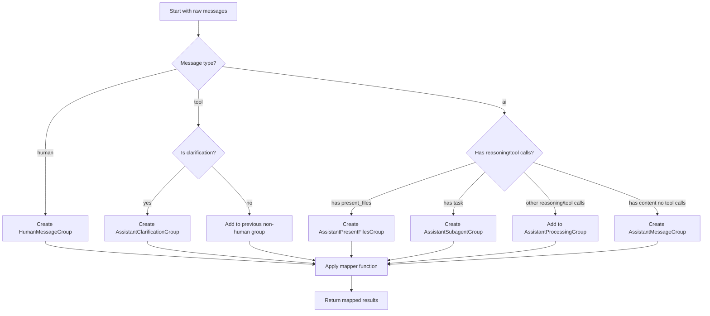

# Messages Module Documentation

## 1. Overview

The `messages` module is a core frontend utility that provides structured handling and processing of conversational messages in the agent system. It is designed to organize raw LangChain messages into logical groups, extract and parse content, and handle specialized message types like file uploads, tool calls, and reasoning content. This module serves as a foundational component for rendering and interacting with conversation threads in the user interface.

## 2. Architecture & Core Components

### 2.1 Message Group Types

The module defines a set of interfaces that extend a generic base interface to represent different types of message groups in a conversation:

```typescript
interface GenericMessageGroup<T = string> {
  type: T;
  id: string | undefined;
  messages: Message[];
}

interface HumanMessageGroup extends GenericMessageGroup<"human"> {}
interface AssistantProcessingGroup extends GenericMessageGroup<"assistant:processing"> {}
interface AssistantMessageGroup extends GenericMessageGroup<"assistant"> {}
interface AssistantPresentFilesGroup extends GenericMessageGroup<"assistant:present-files"> {}
interface AssistantClarificationGroup extends GenericMessageGroup<"assistant:clarification"> {}
interface AssistantSubagentGroup extends GenericMessageGroup<"assistant:subagent"> {}

type MessageGroup = HumanMessageGroup | AssistantProcessingGroup | AssistantMessageGroup | 
                     AssistantPresentFilesGroup | AssistantClarificationGroup | AssistantSubagentGroup;
```

These interfaces create a type-safe way to categorize messages into logical groups, each serving a specific purpose in the conversation flow. The `GenericMessageGroup` provides a common structure with:
- `type`: A string literal identifying the group type
- `id`: An optional identifier for the group
- `messages`: An array of `Message` objects belonging to the group

### 2.2 Upload File Types

The module also defines types for handling file uploads embedded in message content:

```typescript
interface UploadedFile {
  filename: string;
  size: string;
  path: string;
}

interface ParsedUploadedFiles {
  files: UploadedFile[];
  cleanContent: string;
}
```

`UploadedFile` represents a single uploaded file with its metadata, while `ParsedUploadedFiles` contains both the extracted files and the original message content with the upload tags removed.

## 3. Functionality & Usage

### 3.1 Message Grouping

The core function of the module is `groupMessages`, which organizes an array of raw `Message` objects into logical `MessageGroup` instances:

```typescript
export function groupMessages<T>(
  messages: Message[],
  mapper: (group: MessageGroup) => T,
): T[] {
  // Implementation groups messages by type and applies mapper
}
```

#### How it works:

1. **Human Messages**: Each human message becomes its own `HumanMessageGroup`.
2. **Tool Messages**: 
   - Clarification tool messages create `AssistantClarificationGroup`.
   - Other tool messages are added to the previous non-human, non-assistant group.
3. **AI Messages**:
   - Messages with reasoning or tool calls are added to `AssistantProcessingGroup`.
   - Messages with `present_files` tool calls become `AssistantPresentFilesGroup`.
   - Messages with `task` tool calls become `AssistantSubagentGroup`.
   - Messages with content (but no tool calls) become `AssistantMessageGroup`.

#### Example usage:

```typescript
import { groupMessages } from 'frontend/src/core/messages/utils';

const rawMessages = [...]; // Array of LangChain Message objects

const renderedComponents = groupMessages(rawMessages, (group) => {
  switch (group.type) {
    case 'human':
      return <HumanMessageComponent messages={group.messages} />;
    case 'assistant':
      return <AssistantMessageComponent messages={group.messages} />;
    case 'assistant:processing':
      return <ProcessingComponent messages={group.messages} />;
    // Handle other group types...
  }
});
```

### 3.2 Content Extraction Functions

The module provides several functions to extract different types of content from messages:

- `extractTextFromMessage(message: Message)`: Extracts plain text content from a message.
- `extractContentFromMessage(message: Message)`: Extracts content, converting image URLs to markdown image syntax.
- `extractReasoningContentFromMessage(message: Message)`: Extracts reasoning content from AI messages.
- `removeReasoningContentFromMessage(message: Message)`: Removes reasoning content from AI messages.
- `extractURLFromImageURLContent(content)`: Extracts a URL from an image URL content object.

### 3.3 Message Property Check Functions

These helper functions check for specific properties in messages:

- `hasContent(message: Message)`: Checks if a message has content.
- `hasReasoning(message: Message)`: Checks if an AI message has reasoning content.
- `hasToolCalls(message: Message)`: Checks if an AI message has tool calls.
- `hasPresentFiles(message: Message)`: Checks if an AI message has a `present_files` tool call.
- `isClarificationToolMessage(message: Message)`: Checks if a tool message is a clarification request.
- `hasSubagent(message: AIMessage)`: Checks if an AI message has a `task` tool call (subagent).

### 3.4 Specialized Extraction Functions

- `extractPresentFilesFromMessage(message: Message)`: Extracts file paths from a `present_files` tool call.
- `findToolCallResult(toolCallId: string, messages: Message[])`: Finds the result of a specific tool call in an array of messages.

### 3.5 Uploaded Files Parsing

The `parseUploadedFiles` function extracts file information from message content that contains an `<uploaded_files>` tag:

```typescript
export function parseUploadedFiles(content: string): ParsedUploadedFiles {
  // Implementation parses uploaded files from content
}
```

#### How it works:

1. It searches for the `<uploaded_files>` tag in the message content.
2. If found, it extracts the content inside the tag.
3. It parses file information using a regex pattern that matches the format:
   ```
   - filename (size)
     Path: /path/to/file
   ```
4. It returns an object containing the parsed files and the original content with the upload tag removed.

#### Example usage:

```typescript
import { parseUploadedFiles } from 'frontend/src/core/messages/utils';

const messageContent = `
  Here are the files I uploaded:
  <uploaded_files>
  - document.pdf (2.5 MB)
    Path: /uploads/document.pdf
  - image.png (1.2 MB)
    Path: /uploads/image.png
  </uploaded_files>
  Please review them.
`;

const { files, cleanContent } = parseUploadedFiles(messageContent);
console.log(files); // Array of UploadedFile objects
console.log(cleanContent); // "Here are the files I uploaded:\n  Please review them."
```

## 4. Diagrams

### Message Grouping Flow



This diagram illustrates the decision-making process for grouping messages into different types of message groups. The flow starts with raw messages and routes them through a series of checks to determine the appropriate group type before applying the mapper function.

## 5. Integration & Workflow

The `messages` module is typically used in the following workflow:

1. **Receive Raw Messages**: The application receives raw LangChain `Message` objects from the backend or state management.
2. **Group Messages**: The `groupMessages` function is called to organize these messages into logical groups, with a mapper function that converts each group into a UI component.
3. **Render UI**: The resulting components are rendered in the conversation interface.
4. **Extract Content**: As needed, content extraction functions are used to display message content, reasoning, or tool results.
5. **Parse Uploads**: If a message contains uploaded files, `parseUploadedFiles` is used to extract file information and clean content.

This module integrates closely with the [threads module](frontend_core_domain_types_and_state.md) for managing conversation state and the [tasks module](frontend_core_domain_types_and_state.md) for handling subtask relationships.

## 6. Edge Cases & Error Conditions

- **Tool message without preceding assistant message**: The `groupMessages` function will throw an error if a tool message is encountered without a preceding appropriate assistant message.
- **Empty messages array**: `groupMessages` will return an empty array if provided with an empty messages array.
- **Malformed uploaded files tag**: If the `<uploaded_files>` tag is present but malformed, `parseUploadedFiles` may not correctly extract all files or may return an empty files array.
- **Messages with mixed content types**: Messages with array content (containing both text and images) are handled, but other content types may be ignored in extraction functions.

## 7. Extensibility

The module is designed to be extensible:

- New message group types can be added by extending the `GenericMessageGroup` interface and updating the `MessageGroup` union type.
- The `groupMessages` function can be adapted to new message types by adding additional conditions in its implementation.
- Custom extraction functions can be created by following the pattern of existing functions like `extractTextFromMessage` and `extractContentFromMessage`.

When extending the module, ensure that all new group types and functions are properly typed and documented to maintain type safety and developer clarity.
