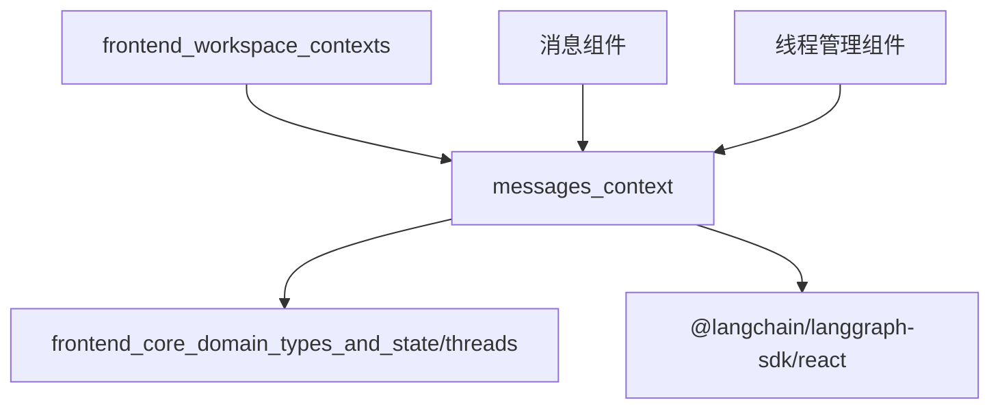

# messages_context 模块文档

## 1. 模块概述

`messages_context` 模块是前端工作区消息组件的核心上下文管理系统，负责提供线程（Thread）相关的上下文数据和操作。该模块通过 React Context API 实现线程状态的全局共享，使整个消息组件树能够访问和操作当前线程的数据。

### 设计目的

该模块的主要设计目的是解决以下问题：
- 为消息组件树提供统一的线程数据访问入口
- 简化线程状态在组件间的传递，避免 props drilling
- 提供类型安全的线程上下文访问方式
- 确保线程状态的一致性和可预测性

## 2. 核心组件详解

### ThreadContextType

`ThreadContextType` 是定义线程上下文结构的 TypeScript 接口，它描述了线程上下文应包含的所有数据。

```typescript
export interface ThreadContextType {
  threadId: string;
  thread: UseStream<AgentThreadState>;
}
```

#### 接口属性说明

- **threadId**: `string` 类型，表示当前线程的唯一标识符。这个 ID 用于在后端和前端之间标识和追踪特定的对话线程。

- **thread**: `UseStream<AgentThreadState>` 类型，这是来自 `@langchain/langgraph-sdk/react` 的流状态对象，包含了线程的完整状态信息。`AgentThreadState` 定义了线程的具体数据结构，包括消息历史、执行状态等。

### ThreadContext

`ThreadContext` 是通过 React 的 `createContext` 函数创建的上下文对象，用于在组件树中传递线程相关的数据。

```typescript
export const ThreadContext = createContext<ThreadContextType | undefined>(
  undefined,
);
```

#### 实现细节

- 上下文的默认值设置为 `undefined`，这意味着如果组件在没有适当的 `ThreadContext.Provider` 包裹的情况下使用该上下文，将会得到 `undefined`。
- 这种设计允许 `useThread` hook 在检测到上下文未提供时抛出明确的错误，帮助开发者及时发现问题。

### useThread

`useThread` 是一个自定义 React Hook，提供了安全访问 `ThreadContext` 的方式。

```typescript
export function useThread() {
  const context = useContext(ThreadContext);
  if (context === undefined) {
    throw new Error("useThread must be used within a ThreadContext");
  }
  return context;
}
```

#### 工作原理

1. 使用 React 的 `useContext` Hook 获取 `ThreadContext` 的当前值。
2. 检查获取到的上下文是否为 `undefined`，如果是，说明组件没有在 `ThreadContext.Provider` 内部使用。
3. 如果上下文有效，则返回该上下文，提供类型安全的访问。

#### 使用场景

任何需要访问线程数据或操作的组件都应该使用这个 Hook，例如：
- 消息列表组件，用于显示线程中的消息
- 消息输入组件，用于发送新消息到当前线程
- 线程状态显示组件，用于显示线程的执行状态

## 3. 架构关系

### 模块依赖关系

`messages_context` 模块依赖于以下核心模块和类型：

1. **React Context API** - 提供上下文创建和消费的基础功能
2. **@langchain/langgraph-sdk/react** - 提供 `UseStream` 类型，用于处理线程状态流
3. **frontend_core_domain_types_and_state/threads** - 提供 `AgentThreadState` 类型，定义线程状态结构

### 与其他模块的关系



这个模块作为 `frontend_workspace_contexts` 的子模块，为整个工作区的消息组件提供上下文支持，同时也被线程管理组件和各种消息相关组件所使用。

## 4. 使用指南

### 基本使用

#### 1. 提供上下文

首先，需要在组件树的适当位置使用 `ThreadContext.Provider` 来提供上下文：

```tsx
import { ThreadContext } from "@/components/workspace/messages/context";
import type { AgentThreadState } from "@/core/threads";
import { useStream } from "@langchain/langgraph-sdk/react";

function ThreadProvider({ children }: { children: React.ReactNode }) {
  const threadId = "example-thread-id";
  const thread = useStream<AgentThreadState>({
    url: "/api/thread",
    threadId,
  });

  return (
    <ThreadContext.Provider value={{ threadId, thread }}>
      {children}
    </ThreadContext.Provider>
  );
}
```

#### 2. 消费上下文

在需要访问线程数据的组件中使用 `useThread` Hook：

```tsx
import { useThread } from "@/components/workspace/messages/context";

function MessageList() {
  const { threadId, thread } = useThread();
  
  // 使用线程数据
  const messages = thread.messages || [];
  
  return (
    <div>
      <h2>Thread: {threadId}</h2>
      {messages.map((message, index) => (
        <div key={index}>{message.content}</div>
      ))}
    </div>
  );
}
```

### 高级用法

#### 结合其他上下文

`messages_context` 可以与其他上下文结合使用，例如工件上下文（Artifacts Context）：

```tsx
import { useThread } from "@/components/workspace/messages/context";
import { useArtifacts } from "@/components/workspace/artifacts/context";

function IntegratedWorkspace() {
  const { thread } = useThread();
  const { artifacts } = useArtifacts();
  
  // 结合线程和工件数据进行操作
  return (
    <div>
      {/* 渲染线程消息和相关工件 */}
    </div>
  );
}
```

## 5. 注意事项与限制

### 错误处理

1. **上下文未提供错误**：如果在 `ThreadContext.Provider` 外部使用 `useThread`，会抛出错误 "useThread must be used within a ThreadContext"。确保所有使用该 Hook 的组件都被适当的 Provider 包裹。

2. **线程状态初始化**：`thread` 对象可能在初始渲染时没有完整的数据，组件应该处理这种情况，例如显示加载状态。

### 性能考虑

1. **上下文更新**：当线程状态更新时，所有使用 `useThread` 的组件都会重新渲染。对于性能敏感的组件，可以考虑使用 React.memo 或选择器模式来优化。

2. **避免过度消费**：只在真正需要线程数据的组件中使用 `useThread`，避免在不需要线程数据的组件中引入不必要的依赖。

### 类型安全

1. **TypeScript 支持**：该模块完全使用 TypeScript 编写，提供了完整的类型定义。确保在使用时遵循类型约束，避免类型错误。

2. **线程状态类型**：`AgentThreadState` 类型定义了线程状态的结构，确保在使用线程数据时具有类型安全保障。

## 6. 相关模块参考

- [frontend_core_domain_types_and_state/threads](frontend_core_domain_types_and_state.md) - 提供 `AgentThreadState` 类型定义
- [frontend_workspace_contexts/artifacts_context](frontend_workspace_contexts.md) - 工作区工件上下文，常与线程上下文配合使用
- [agent_memory_and_thread_context](agent_memory_and_thread_context.md) - 后端线程状态管理，与前端线程上下文对应

通过正确使用 `messages_context` 模块，开发者可以构建出结构清晰、状态一致的消息交互界面，为用户提供流畅的对话体验。
