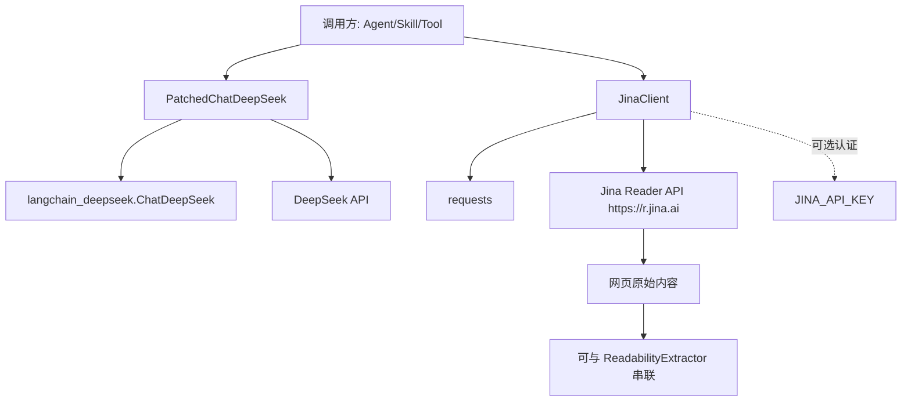
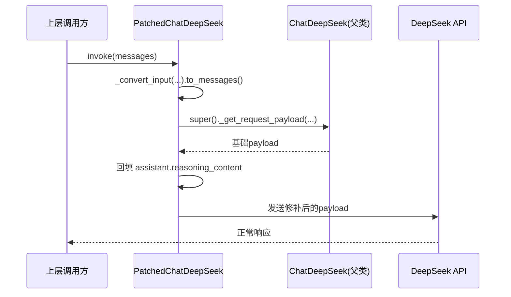
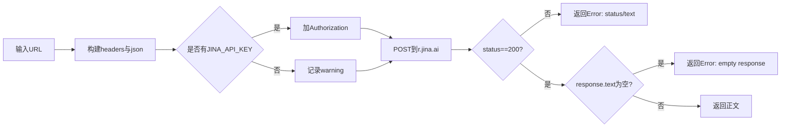

# model_and_external_clients 模块文档

## 1. 模块简介

`model_and_external_clients` 是后端中“模型适配 + 外部内容服务接入”的薄集成层，当前包含两个核心组件：`PatchedChatDeepSeek` 与 `JinaClient`。它存在的核心原因，不是为了做通用编排，而是针对两个在实际生产里非常具体、且高频踩坑的问题提供稳定实现：第一，DeepSeek 推理模型在多轮会话时 `reasoning_content` 丢失导致请求失败；第二，对 Jina Reader 的调用在认证、返回校验和异常处理上缺乏统一入口。

从系统视角看，这个模块位于“能力提供层”，下游会被 Agent 执行链路、技能运行时或网页提取工具间接调用。与 [application_and_feature_configuration](application_and_feature_configuration.md) 配合时，它接收模型和运行参数；与 [backend_operational_utilities](backend_operational_utilities.md)（尤其可读性提取链路）协同时，它可以形成“抓取原始页面 -> 内容抽取 -> 供模型消费”的完整路径。

## 2. 设计动机与问题定义

原始 `ChatDeepSeek` 在 thinking/reasoning 模式下，会把推理信息放入 `AIMessage.additional_kwargs`，但后续请求 payload 未带上该字段。对于要求“历史 assistant 消息均必须包含 `reasoning_content`”的 API，这会在第二轮及以后触发协议错误。`PatchedChatDeepSeek` 的设计目标是**最小侵入修补**：保留父类行为，仅在 payload 生成后做字段回填。

`JinaClient` 的动机则是把“外部 HTTP 调用的脆弱点”集中处理。相比让每个调用点自己拼请求头、处理状态码和异常，该模块提供了统一入口，降低调用方复杂度，并让错误日志具备一致格式。

## 3. 架构概览

该架构体现了两条独立能力线：模型调用稳定性修补与外部抓取能力封装。两者都遵循“接口保持简单、内部容错增强”的策略。由于它们没有共享状态，也没有互相依赖，维护上可独立演进。

## 4. 子模块与核心职责

### 4.1 `patched_deepseek` 子模块

该子模块聚焦于对 DeepSeek 多轮推理对话的协议兼容。`PatchedChatDeepSeek` 通过重写 `_get_request_payload`，在父类生成 payload 后，把原始 `AIMessage.additional_kwargs["reasoning_content"]` 注入到对应 assistant 消息。其实现包含主路径（按索引位次匹配）和兜底路径（按 assistant 计数匹配），避免消息长度不一致时完全失效。

详细设计、流程图与示例见：[patched_deepseek.md](patched_deepseek.md)。

### 4.2 `jina_client` 子模块

该子模块提供网页抓取客户端 `JinaClient`，核心方法 `crawl(url, return_format="html", timeout=10)` 使用 POST 调用 `https://r.jina.ai/`。它会注入 `X-Return-Format` 和 `X-Timeout` 头，并在存在 `JINA_API_KEY` 时附带 Bearer Token；若未配置密钥，会记录 warning 而非中断。

它对三类失败做统一处理：非 200、空响应体、请求异常；并统一返回 `"Error: ..."` 字符串，便于上层快速分支处理。

详细参数语义、限制和扩展建议见：[jina_client.md](jina_client.md)。

## 5. 关键交互流程

### 5.1 DeepSeek 多轮推理请求修补流程

这条流程的重点是：补丁只发生在“发送前最后一步”，既不改变上层消息对象，也不破坏父类其他参数处理逻辑。

### 5.2 Jina 抓取调用流程

## 6. 使用与配置指南

在配置层通常通过 [application_and_feature_configuration](application_and_feature_configuration.md) 的 `ModelConfig` 管理模型元信息（例如 `supports_thinking`）。当模型具备 thinking 能力时，建议在实际实例化处优先选择 `PatchedChatDeepSeek` 以避免多轮协议错误。

`JinaClient` 的唯一必需输入是 URL；推荐在部署环境配置 `JINA_API_KEY`，否则在中高并发场景更容易碰到速率限制。若上层需要结构化文章结果，可把 `crawl` 的返回交给 [backend_operational_utilities](backend_operational_utilities.md) 中可读性提取组件继续处理。

## 7. 扩展建议

对模型侧扩展，建议继续沿用“继承 + 局部 override”模式，避免分叉上游 SDK 的大量逻辑。对外部客户端扩展，可在 `JinaClient` 上增加重试、指数退避、可观测埋点（耗时/状态分布）以及统一错误对象（替代字符串）来提升可维护性。

## 8. 风险、边界与注意事项

`PatchedChatDeepSeek` 的匹配策略依赖“消息顺序大体一致”。若未来上游在 payload 生成时引入复杂重排，当前位置匹配/计数匹配都可能出现语义错配，需要回归测试。另一个注意点是该补丁仅处理 `reasoning_content`，并不保证其他 `additional_kwargs` 字段自动透传。

`JinaClient` 当前采用“返回字符串承载错误”的约定，简单但类型不安全；调用方若遗漏 `startswith("Error:")` 检查，可能把错误串当正文继续处理。它也未内置重试与断路器，网络抖动时上层需要自行兜底。

## 9. 与其他文档的关系

- 本模块总览：`model_and_external_clients.md`（当前文档）
- DeepSeek 修补细节： [patched_deepseek.md](patched_deepseek.md)
- Jina 客户端细节： [jina_client.md](jina_client.md)
- 配置来源： [application_and_feature_configuration.md](application_and_feature_configuration.md)
- 内容提取协作链路： [backend_operational_utilities.md](backend_operational_utilities.md)
- 模型 API 契约参考： [gateway_api_contracts.md](gateway_api_contracts.md)
