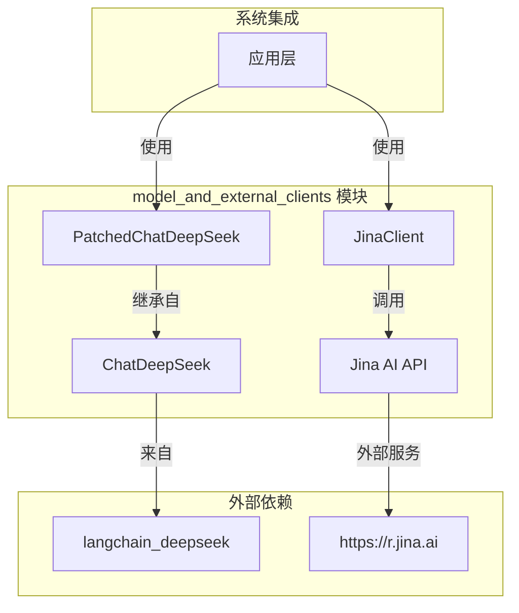

# model_and_external_clients 模块文档

## 1. 模块概述

`model_and_external_clients` 模块是系统与外部模型和服务进行交互的核心组件，提供了与大型语言模型（LLM）和第三方服务的集成能力。该模块解决了两个关键问题：一是确保模型推理内容在多轮对话中的正确保存和传递，二是提供与外部服务的标准化接口。

### 1.1 设计理念

该模块的设计遵循以下原则：
- **兼容性优先**：通过修补现有模型类来解决兼容性问题，而不是完全重写
- **服务抽象**：提供统一的客户端接口，封装外部服务的复杂性
- **错误处理**：内置完善的错误处理和日志记录机制
- **可扩展性**：支持轻松添加新的模型和服务集成

### 1.2 核心功能

- 提供与 DeepSeek 模型的增强集成，确保推理内容在多轮对话中的正确传递
- 提供与 Jina AI 服务的客户端接口，支持网页内容爬取和处理
- 标准化外部服务调用的错误处理和日志记录

## 2. 架构概述

`model_and_external_clients` 模块采用简洁的架构设计，由两个主要组件组成：



### 2.1 组件关系说明

1. **PatchedChatDeepSeek**：继承自 `langchain_deepseek.ChatDeepSeek`，重写了请求负载构建逻辑，确保推理内容的正确传递
2. **JinaClient**：独立的客户端类，封装了与 Jina AI 服务的所有交互细节

这两个组件虽然功能独立，但都服务于同一个目标：为系统提供可靠的外部模型和服务集成能力。

## 3. 子模块功能

### 3.1 模型集成组件（patched_deepseek）

模型集成组件主要由 `PatchedChatDeepSeek` 类组成，它解决了 DeepSeek 模型在多轮对话中推理内容传递的问题。当使用启用思考/推理模式的模型时，API 期望在所有多轮对话的助手消息中都存在 `reasoning_content` 字段。原始的 `ChatDeepSeek` 实现将 `reasoning_content` 存储在 `additional_kwargs` 中，但在进行后续 API 调用时没有包含它，这会导致错误。

该组件通过重写 `_get_request_payload` 方法，确保从 `additional_kwargs` 中提取的 `reasoning_content` 被正确地包含在请求负载中。这种修补方法的优势在于它保持了与原始类的完全兼容性，同时解决了特定的功能问题。

有关详细信息，请参阅 [patched_deepseek](patched_deepseek.md) 模块文档。

### 3.2 外部服务客户端（jina_client）

外部服务客户端由 `JinaClient` 类组成，提供了与 Jina AI 网页爬取服务的集成。该客户端支持多种返回格式（如 HTML），并提供超时控制功能。它会自动处理 API 密钥认证，并在没有提供密钥时记录警告信息。

`JinaClient` 实现了完善的错误处理机制，包括 API 状态码检查、空响应验证和网络异常捕获。所有错误都会被记录到日志中，并且会返回格式化的错误消息，确保调用方能够适当地处理失败情况。

有关详细信息，请参阅 [jina_client](jina_client.md) 模块文档。

## 4. 与其他模块的关系

`model_and_external_clients` 模块是系统的基础设施组件，为多个上层模块提供服务：

- **agent_memory_and_thread_context**：可能使用 `PatchedChatDeepSeek` 进行对话生成和记忆更新
- **agent_execution_middlewares**：可能在中间件处理流程中使用模型集成组件
- **subagents_and_skills_runtime**：子代理执行器可能需要调用外部模型和服务

关于这些模块如何使用 `model_and_external_clients` 的详细信息，请参考各自的模块文档。

## 5. 使用指南

### 5.1 PatchedChatDeepSeek 使用

`PatchedChatDeepSeek` 提供了与原始 `ChatDeepSeek` 完全兼容的接口，但增加了对多轮对话中推理内容的正确处理。

基本使用示例：

```python
from backend.src.models.patched_deepseek import PatchedChatDeepSeek

# 创建模型实例
model = PatchedChatDeepSeek(
    model="deepseek-reasoner",
    temperature=0.7,
    api_key="your-api-key"
)

# 发送消息（推理内容会自动处理）
response = model.invoke("解释一下量子计算的基本原理")
print(response.content)
```

更多详细示例和配置选项请参阅 [patched_deepseek](patched_deepseek.md) 模块文档。

### 5.2 JinaClient 使用

`JinaClient` 提供了简单易用的接口来调用 Jina AI 的网页爬取服务。

基本使用示例：

```python
from backend.src.community.jina_ai.jina_client import JinaClient

# 创建客户端实例
client = JinaClient()

# 爬取网页内容
html_content = client.crawl(
    url="https://example.com",
    return_format="html",
    timeout=10
)

print(html_content)
```

更多详细示例和配置选项请参阅 [jina_client](jina_client.md) 模块文档。

## 6. 配置和扩展

### 6.1 环境变量

- `JINA_API_KEY`：Jina AI 服务的 API 密钥，用于提高请求速率限制

### 6.2 扩展指南

要添加新的模型集成或外部服务客户端，可以遵循以下模式：

1. **新模型集成**：继承现有模型类，重写需要修改的方法
2. **新服务客户端**：创建独立的客户端类，封装服务交互细节
3. **错误处理**：确保所有组件都有完善的错误处理和日志记录

## 7. 注意事项和限制

### 7.1 PatchedChatDeepSeek 注意事项

- 该修补仅影响 DeepSeek 模型的使用，不影响其他模型
- 在多轮对话中，确保所有历史消息都通过相同的修补类处理
- 当上游 `langchain_deepseek` 库更新时，可能需要重新验证修补的兼容性

### 7.2 JinaClient 注意事项

- 没有提供 API 密钥时，请求速率会受到限制
- 网络超时设置应根据目标网站的响应时间进行调整
- 爬取的内容应遵守目标网站的 robots.txt 规定和使用条款

### 7.3 通用限制

- 所有外部服务调用都可能受到网络状况和服务可用性的影响
- 建议在生产环境中实现适当的重试机制和断路器模式
