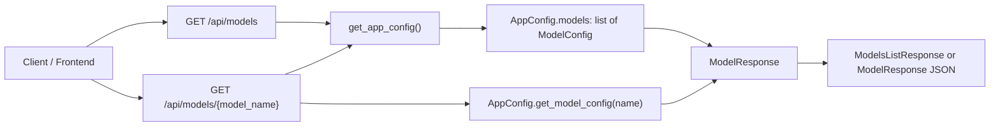
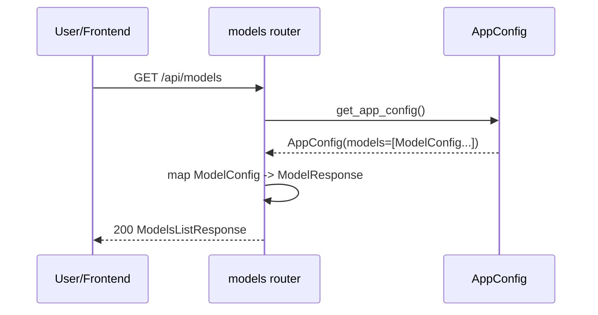
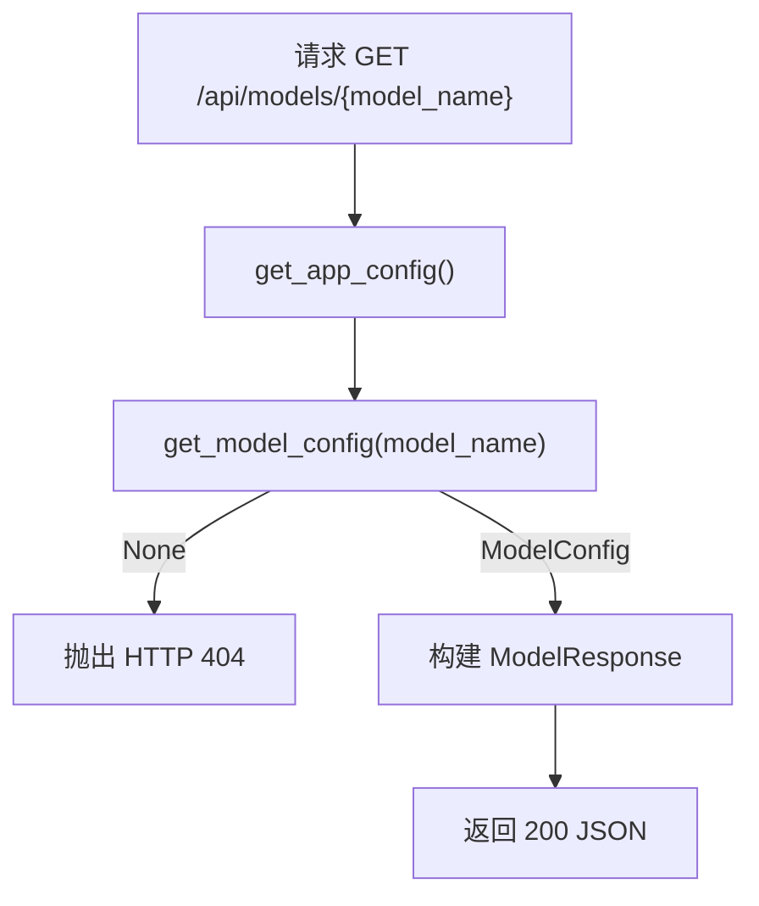

# model_catalog_contracts 模块文档

## 1. 模块简介与设计动机

`model_catalog_contracts` 是网关层（Gateway）中专门负责“模型目录读取契约”的子模块，核心目标是向前端或外部客户端稳定暴露**可用模型的元数据**，同时避免泄露底层运行配置中的敏感信息。它对应的核心组件是 `ModelResponse` 与 `ModelsListResponse`，并由 `GET /api/models` 与 `GET /api/models/{model_name}` 两个只读端点提供服务。

这个模块存在的根本原因，是把“内部配置结构”与“外部 API 契约”解耦。系统内部使用 `AppConfig` / `ModelConfig` 管理完整模型配置（包括 provider class path、凭据相关字段、额外参数等），而网关返回给客户端的仅是可展示、可选择、可判断能力的字段。这样做可以降低前端耦合度，也减少意外暴露敏感配置的风险。

从职责边界看，`model_catalog_contracts` 不负责模型推理调用、不负责动态修改模型配置，也不负责鉴权策略；它只负责“可用模型目录的读取与格式化输出”，因此是一个典型的只读 Contract 模块。

## 2. 在系统中的位置

`model_catalog_contracts` 隶属于 [gateway_api_contracts.md](gateway_api_contracts.md) 的模型管理部分，依赖应用配置模块中的 `AppConfig` 和 `ModelConfig` 提供源数据。建议先阅读 [application_and_feature_configuration.md](application_and_feature_configuration.md) 了解配置加载、环境变量解析和 `get_model_config()` 的完整语义。



这张图体现了一个关键原则：网关层只消费配置对象并做“投影映射（projection）”，即把 `ModelConfig` 的一部分字段映射到 API 响应模型，避免把内部结构原样透出。

## 3. 核心契约组件详解

## 3.1 `ModelResponse`

`ModelResponse` 是单模型响应对象，继承自 `pydantic.BaseModel`，用于定义对外暴露的最小必要模型元数据。

```python
class ModelResponse(BaseModel):
    name: str
    display_name: str | None
    description: str | None
    supports_thinking: bool = False
```

字段语义如下：

- `name`：模型唯一标识，通常用于程序逻辑中的模型选择键；它应该与配置中的 `ModelConfig.name` 一致。
- `display_name`：给 UI 展示的人类可读名称，可为空。
- `description`：模型说明文本，可为空。
- `supports_thinking`：模型是否支持 thinking mode，默认为 `false`。

该模型的设计重点在于“稳定性优先”与“安全最小化输出”：它不包含 `use`、`model`、provider 参数、密钥等内部字段。

## 3.2 `ModelsListResponse`

`ModelsListResponse` 是模型列表容器，包含一个 `models: list[ModelResponse]` 字段。这个包装层的价值在于保持响应结构稳定，便于后续在不破坏兼容性的前提下添加同级字段（例如分页信息或服务端时间戳）。

```python
class ModelsListResponse(BaseModel):
    models: list[ModelResponse]
```

## 4. 路由行为与内部工作机制

虽然本模块核心组件是两个响应模型，但其行为需要结合同文件中的两个路由函数理解。

## 4.1 `GET /api/models`（`list_models`）

该接口读取 `get_app_config()` 返回的应用配置，遍历 `config.models` 并逐条构建 `ModelResponse`，最后包装为 `ModelsListResponse` 返回。



实现特征：

1. 返回顺序与配置中的 `models` 顺序一致（当前实现未显式排序）。
2. 所有条目都按同一投影规则输出，避免字段不一致。
3. 如果配置中没有模型，理论上会返回空数组 `{"models": []}`，而不是异常。

## 4.2 `GET /api/models/{model_name}`（`get_model`）

该接口调用 `config.get_model_config(model_name)` 做精确匹配查找。若未找到，抛出 `HTTPException(status_code=404)`；找到则映射为 `ModelResponse` 返回。



这使前端可以非常明确地区分“请求成功但列表为空”和“请求了不存在的模型”两种状态。

## 5. 与配置模块的数据映射关系

该模块本质上把 `ModelConfig` 投影成更窄的 `ModelResponse`。典型映射如下：

- `ModelConfig.name -> ModelResponse.name`
- `ModelConfig.display_name -> ModelResponse.display_name`
- `ModelConfig.description -> ModelResponse.description`
- `ModelConfig.supports_thinking -> ModelResponse.supports_thinking`

未映射字段（例如 `use`、`model`、`supports_vision`、`when_thinking_enabled` 以及各种 provider 扩展字段）不会出现在响应中。这是有意识的契约裁剪，不是遗漏。

## 6. 使用方式与集成示例

前端通常先调用列表接口渲染模型选择器，再根据 `name` 保存用户选择。

```typescript
// 拉取模型目录
const res = await fetch('/api/models');
const data: { models: Array<{
  name: string;
  display_name: string | null;
  description: string | null;
  supports_thinking: boolean;
}> } = await res.json();

// 选择某个模型后，按 name 传递给会话或设置逻辑
const selectedModelName = data.models[0]?.name;
```

查询单模型详情时：

```bash
curl http://localhost:8001/api/models/gpt-4
```

404 示例：

```json
{
  "detail": "Model 'unknown-model' not found"
}
```

## 7. 边界条件、错误与常见坑

首先要注意，该模块依赖配置已正确加载。如果应用启动时配置文件缺失、环境变量未解析成功，问题通常会在更早阶段暴露，而不是由该模块单独兜底。

其次，`get_model_config` 的匹配是基于 `name` 的精确匹配，大小写或拼写不一致会直接导致 404。调用方应避免把 `display_name` 当作查询键。

另一个容易忽略的点是跨端类型对齐。当前前端某些类型定义可能包含 `id` 字段，而此模块返回的是 `name`（未单独提供 `id`）。若前端组件强依赖 `id`，应在适配层做映射（例如 `id = name`），而不是要求后端破坏既有契约。

最后，`supports_thinking` 默认值为 `false`。如果配置中未显式给出该字段，API 仍会稳定返回 `false`，这有助于前端做能力开关判断，但也意味着“缺失配置”与“明确不支持”在语义上会被折叠为同一表现。

## 8. 扩展与演进建议

当你需要向前端暴露新的模型能力（例如 `supports_vision`）时，建议按以下顺序演进：先在配置模型 `ModelConfig` 中确认字段语义与默认值，再在 `ModelResponse` 添加字段并更新两个端点映射逻辑，最后同步前端类型与 UI 行为。这样可以避免出现“后端字段存在但列表接口和详情接口不一致”的问题。

如果希望保持向后兼容，新增字段应提供默认值或可空定义，避免旧客户端解析失败。

一个推荐的扩展示例：

```python
class ModelResponse(BaseModel):
    name: str
    display_name: str | None = None
    description: str | None = None
    supports_thinking: bool = False
    supports_vision: bool = False
```

并在 `list_models` / `get_model` 中补充 `supports_vision=model.supports_vision`。

## 9. 测试与运维关注点

在测试层面，至少应覆盖以下场景：空模型列表、单模型返回、未知模型 404、字段默认值行为（尤其 `supports_thinking`）。在运维层面，若出现“接口正常但模型列表为空”，应优先检查配置文件内容与加载路径，而不是网关路由本身。

## 10. 相关文档

- 网关整体契约层： [gateway_api_contracts.md](gateway_api_contracts.md)
- 应用配置与模型配置来源： [application_and_feature_configuration.md](application_and_feature_configuration.md)
- 网关配置启动参数： [gateway_config_bootstrap.md](gateway_config_bootstrap.md)

以上文档建议联合阅读：`model_catalog_contracts` 负责“对外契约形态”，而配置模块负责“数据来源与加载策略”，两者共同构成完整的模型目录能力。
