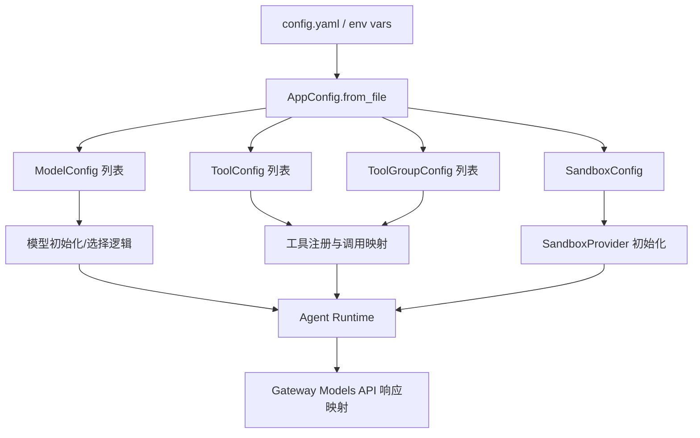
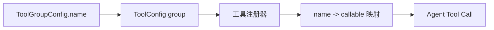
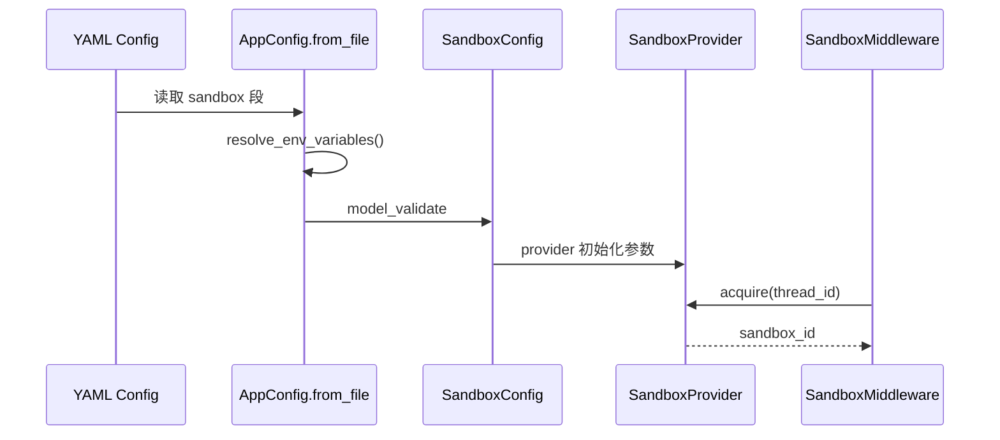
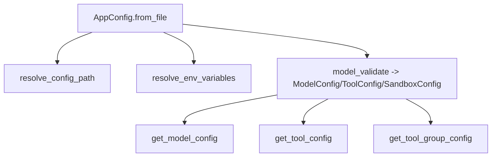

# model_tool_sandbox_basics 模块文档

## 模块概述：它解决了什么问题，为什么必须存在

`model_tool_sandbox_basics` 是整个应用配置体系中最“基础但关键”的一层。这个模块集中定义三类配置契约：模型（`ModelConfig`）、工具与工具分组（`ToolConfig` / `ToolGroupConfig`）、以及沙箱执行环境（`SandboxConfig` / `VolumeMountConfig`）。它的核心价值并不是执行业务逻辑，而是把“运行时能力”变成可声明、可校验、可扩展的数据结构。

在一个支持多模型、多工具、可切换沙箱后端的 Agent 系统中，如果这些能力信息散落在代码中，会出现三个常见问题：第一，环境迁移时改动范围大，风险高；第二，不同团队（后端、平台、运维）缺乏统一契约；第三，新能力接入常常需要改核心代码。这个模块通过 Pydantic 模型把能力配置收敛到统一结构中，并通过 `extra="allow"` 留出后向兼容和供应商扩展空间，从而实现“主干稳定、边缘可扩展”的设计目标。

从系统分层角度看，本模块位于 [application_and_feature_configuration.md](application_and_feature_configuration.md) 的基础配置子域中：上游接 `config.yaml` 和环境变量解析，下游分别被模型实例化流程、工具注册流程和沙箱 Provider 初始化流程消费。它是典型的 configuration contract layer（配置契约层）。

---

## 在整体系统中的位置与依赖关系



这个图强调两点。第一，本模块本身不执行模型推理、工具调用或容器管理，它只定义这些能力的结构化描述。第二，`AppConfig` 会把配置文件内容解析为这些模型对象，再由运行时子系统消费。比如 `ModelConfig` 最终会影响 `/models` 接口返回的可选模型信息（见 `ModelResponse` / `ModelsListResponse`），`SandboxConfig` 会驱动 `SandboxProvider` 的后端行为（本地或容器化）。

相关扩展阅读建议：

- 配置装载与环境变量解析： [app_config_orchestration.md](app_config_orchestration.md)
- 沙箱抽象与中间件绑定： [sandbox_abstractions.md](sandbox_abstractions.md)、[agent_sandbox_binding.md](agent_sandbox_binding.md)、[sandbox_core_runtime.md](sandbox_core_runtime.md)
- 社区 AIO 沙箱实现： [sandbox_aio_community_backend.md](sandbox_aio_community_backend.md)

---

## 核心组件一：`ModelConfig`

`ModelConfig` 描述“一个可用模型”的配置契约。它不是模型客户端实例，而是实例化参数与能力声明。系统会根据 `name` 定位模型，根据 `use` 动态加载 provider 类，根据 `model` 指定供应商模型名，并结合能力标志（thinking/vision）决定上层功能是否可用。

```python
class ModelConfig(BaseModel):
    name: str
    display_name: str | None
    description: str | None
    use: str
    model: str
    supports_thinking: bool = False
    when_thinking_enabled: dict | None = None
    supports_vision: bool = False
    model_config = ConfigDict(extra="allow")
```

`ModelConfig` 的字段语义可以理解为“身份信息 + 绑定信息 + 能力信息 + 扩展信息”。`name` 必须全局唯一，供 `AppConfig.get_model_config(name)` 检索；`display_name` 和 `description` 主要服务 UI 和接口响应；`use` 指向具体 provider 类（例如 `langchain_openai.ChatOpenAI`）；`model` 是传给 provider 的真实模型代号。`supports_thinking` 与 `when_thinking_enabled` 形成一个协作对：前者声明能力，后者给出启用后需要额外注入的参数。`supports_vision` 则是图像输入链路的开关依据。

### 运行时影响与内部机制

虽然这是一个纯数据模型，但它直接影响系统行为：

- 模型能力公开：Gateway 层通常只暴露模型元信息与能力标志，例如 `supports_thinking`。
- 功能开关判断：当请求包含图像或需要 reasoning 时，上层会先检查能力字段。
- 参数透传：`extra="allow"` 允许你附加供应商特定参数（如 `temperature`、`base_url`、`api_key`、`timeout`），后续实例化流程可按需消费。

### 使用示例

```yaml
models:
  - name: deepseek_chat
    display_name: DeepSeek Chat
    description: General chat model
    use: langchain_deepseek.ChatDeepSeek
    model: deepseek-chat
    supports_thinking: true
    when_thinking_enabled:
      reasoning_effort: medium
    supports_vision: false
    temperature: 0.2
    timeout: 60
```

---

## 核心组件二：`ToolGroupConfig` 与 `ToolConfig`

工具配置由两个层级组成。`ToolGroupConfig` 负责定义逻辑分组，`ToolConfig` 负责定义具体工具及其 provider 绑定。这个设计让“组织结构”与“执行实现”分离，便于后续按组做权限、展示、启停策略。

```python
class ToolGroupConfig(BaseModel):
    name: str
    model_config = ConfigDict(extra="allow")

class ToolConfig(BaseModel):
    name: str
    group: str
    use: str
    model_config = ConfigDict(extra="allow")
```

`ToolGroupConfig` 极简，只约束唯一组名。`ToolConfig` 的 `group` 必须引用某个组名，`use` 指向实际工具对象的符号路径（例如 `src.sandbox.tools:bash_tool`）。与模型配置类似，`extra="allow"` 让工具拥有可扩展参数，不需要频繁修改核心 schema。

### 工具注册/调用关系图



这条链路中最容易忽略的问题是：Pydantic 模型本身不会自动校验“`ToolConfig.group` 是否存在于 `tool_groups` 列表”。因此配置可能“可加载但不可用”，错误在工具注册或调用阶段才暴露。这属于典型的延迟失败（late failure）。

### 使用示例

```yaml
tool_groups:
  - name: filesystem
    display_name: File System
  - name: web

tools:
  - name: bash
    group: filesystem
    use: src.sandbox.tools:bash_tool
    timeout: 120
  - name: web_search
    group: web
    use: src.tools.search:web_search_tool
    retry: 2
```

---

## 核心组件三：`VolumeMountConfig` 与 `SandboxConfig`

`SandboxConfig` 定义工具执行环境的 provider 与运行参数；`VolumeMountConfig` 则是其文件系统挂载的子配置。它们共同决定“工具在什么环境执行、可访问哪些路径、以怎样的容器/进程策略运行”。

```python
class VolumeMountConfig(BaseModel):
    host_path: str
    container_path: str
    read_only: bool = False

class SandboxConfig(BaseModel):
    use: str
    image: str | None = None
    port: int | None = None
    base_url: str | None = None
    auto_start: bool | None = None
    container_prefix: str | None = None
    idle_timeout: int | None = None
    mounts: list[VolumeMountConfig] = []
    environment: dict[str, str] = {}
    model_config = ConfigDict(extra="allow")
```

### 字段设计与运行语义

`use` 是最关键字段，用于绑定具体 `SandboxProvider` 实现。对于本地 provider（如 `LocalSandboxProvider`），并非所有字段都会生效；对于容器 provider（例如 AIO backend），`image`、`port`、`idle_timeout`、`mounts`、`environment` 则通常会直接影响容器生命周期与资源行为。也就是说，`SandboxConfig` 是“统一契约”，但字段解释由 provider 具体实现决定。

`environment` 的值如果以 `$` 开头，通常会在 `AppConfig.resolve_env_variables` 阶段被替换为宿主环境变量值；若变量不存在，会抛出 `ValueError`。这一点很重要：配置错误会在加载阶段提前失败，而不是等到容器启动才报错。

### 沙箱配置到运行时的流程



这个过程说明：`SandboxConfig` 负责“描述”，`SandboxProvider` 负责“创建/获取/释放”，`SandboxMiddleware` 负责“把沙箱绑定到 Agent 线程上下文”。如果你在本模块调整字段，要同步确认 provider 是否真的消费这些字段。

### 使用示例

```yaml
sandbox:
  use: backend.src.community.aio_sandbox.aio_sandbox_provider:AioSandboxProvider
  image: enterprise-public-cn-beijing.cr.volces.com/vefaas-public/all-in-one-sandbox:latest
  auto_start: true
  container_prefix: deer-flow-sandbox
  idle_timeout: 600
  mounts:
    - host_path: /opt/workspace
      container_path: /mnt/user-data/workspace
      read_only: false
    - host_path: /opt/reference
      container_path: /mnt/reference
      read_only: true
  environment:
    OPENAI_API_KEY: $OPENAI_API_KEY
    TZ: Asia/Shanghai
```

---

## 与 `AppConfig` 的协作：加载、查询与约束边界

`model_tool_sandbox_basics` 中的所有模型都由 `AppConfig` 聚合。`AppConfig.from_file()` 负责读取 YAML、解析环境变量、加载扩展配置并执行 `model_validate`。随后可通过以下查询方法在运行时按名称检索：`get_model_config(name)`、`get_tool_config(name)`、`get_tool_group_config(name)`。



需要注意的是，这些 `get_*` 方法在未找到目标时返回 `None`，不会抛异常。调用方必须自己处理空值，否则会在更后面的业务阶段出现空引用问题。

---

## 配置与 API 暴露的关系

模型配置会部分映射到 Gateway API（例如 `/models`）的响应模型。典型映射是 `ModelConfig.name/display_name/description/supports_thinking` -> `ModelResponse`。这意味着如果你只在 `ModelConfig` 中新增了扩展字段，它不会自动出现在外部 API，除非你同步扩展 Gateway 响应 schema。

这一点体现了“内部配置契约”和“外部 API 契约”是两层独立边界：前者可更灵活，后者应更稳定。

---

## 典型错误、边界条件与运维注意事项

这个模块最大的工程特征是“强结构 + 弱语义约束”：结构校验很强（类型、必填项），但跨对象引用与动态导入可用性往往在下游才校验。请重点关注以下场景：

- `use` 路径拼写错误：配置加载成功，但动态导入失败。
- `ToolConfig.group` 引用不存在：常在工具注册或前端展示时才出错。
- 环境变量缺失：`$VAR` 解析阶段直接抛错并阻止启动。
- `mounts.host_path` 不存在或权限不足：通常在 provider 创建沙箱时失败。
- `idle_timeout=0`：语义通常是禁用自动回收，长时间运行会增加资源占用。
- `extra="allow"` 带来的拼写陷阱：例如 `temprature` 不会报错，但也不会生效。

建议在 CI/CD 增加配置预检脚本，至少覆盖三类检查：可导入性（`use`）、引用完整性（tool-group 映射）、环境完整性（关键 env var 存在）。

---

## 扩展与二次开发建议

如果你要接入新模型或新工具，优先利用 `extra="allow"` 扩展字段并在实例化层消费，而不是先改 schema。这种方式变更成本低、回滚容易，适合快速试验。只有当某些扩展字段变成稳定公共契约时，才建议把它们提升为显式字段。

如果你的场景更强调合规和配置治理，可以把部分模型改为 `extra="forbid"`，并建立严格的配置模板与 lint 规则。这样能减少“静默无效配置”，但会牺牲一定灵活性。

---

## 最小可用配置模板（建议起点）

```yaml
models:
  - name: default
    use: langchain_openai.ChatOpenAI
    model: gpt-4o-mini
    supports_thinking: false
    supports_vision: true

sandbox:
  use: backend.src.sandbox.local.local_sandbox_provider:LocalSandboxProvider

tool_groups:
  - name: default

tools:
  - name: bash
    group: default
    use: src.sandbox.tools:bash_tool
```

这份模板适合作为本地开发起点。后续你可以逐步增加模型能力标志、沙箱挂载与环境变量、工具扩展参数。

---

## 进一步阅读

- [app_config_orchestration.md](app_config_orchestration.md)：配置文件解析、环境变量替换、全局配置装载。
- [sandbox_core_runtime.md](sandbox_core_runtime.md)：沙箱生命周期与运行时绑定。
- [sandbox_aio_community_backend.md](sandbox_aio_community_backend.md)：容器化沙箱后端细节与状态持久化。
- [agent_execution_middlewares.md](agent_execution_middlewares.md)：工具调用与线程上下文中间件机制。
- [gateway_api_contracts.md](gateway_api_contracts.md)：外部 API schema 与配置对外暴露边界。
