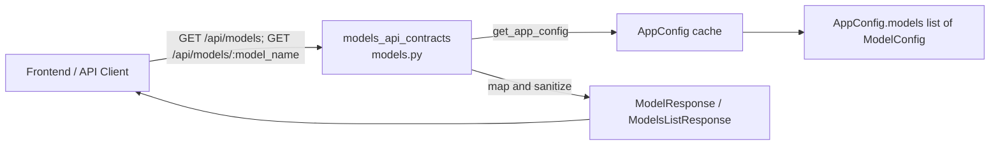
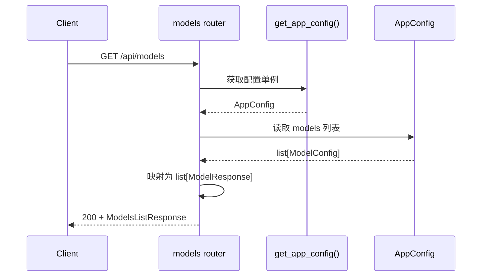
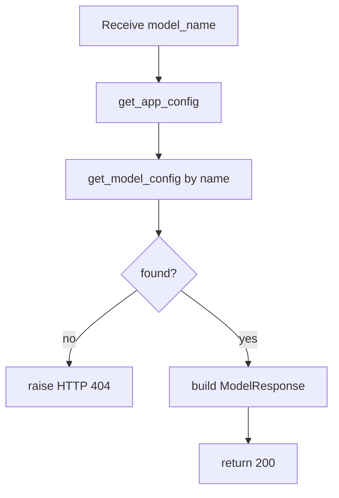

# models_api_contracts 模块文档

## 模块简介

`models_api_contracts` 模块定义了网关层中“模型信息查询”相关的 API 契约。它的职责并不是执行模型推理，也不负责模型生命周期管理，而是向前端和其他调用方暴露一组**稳定、可读、去敏感**的模型元数据接口。该模块目前由 `backend/src/gateway/routers/models.py` 提供，核心契约类型是 `ModelResponse` 与 `ModelsListResponse`。

从系统设计角度看，这个模块存在的原因是“配置模型”和“公开模型信息”之间需要一个明确边界。底层 `AppConfig` / `ModelConfig` 包含大量运行时与实现细节（如 provider class path、推理参数、可能包含密钥引用等），而前端只需要展示与选择模型所必需的字段。`models_api_contracts` 通过显式响应模型，把对外数据面收敛为一个小而稳定的字段集合，降低前后端耦合，并减少误暴露敏感信息的风险。

---

## 在整体系统中的位置

`models_api_contracts` 是 `gateway_api_contracts` 的一个子模块，依赖 `application_and_feature_configuration` 中的应用配置加载能力（`get_app_config()`、`AppConfig`、`ModelConfig`）。它向上服务于前端模型选择 UI 与线程初始化流程，向下读取配置并做只读投影。



上图体现了该模块“轻逻辑 + 强契约”的特征：它不引入复杂业务流程，而是把配置层对象稳定映射成 API 返回体。若你希望了解网关层的整体路由组合与运行入口，建议参考 [gateway_api_contracts.md](./gateway_api_contracts.md)；若要理解 `AppConfig` 与 `ModelConfig` 的完整字段语义，建议参考 [application_and_feature_configuration.md](./application_and_feature_configuration.md)。

---

## 核心组件详解

## `ModelResponse`

`ModelResponse` 是单模型信息的响应契约，继承自 `pydantic.BaseModel`，用于 `/api/models/{model_name}` 的响应元素，也作为列表接口中每个元素的类型。

```python
class ModelResponse(BaseModel):
    name: str
    display_name: str | None
    description: str | None
    supports_thinking: bool = False
```

该类型的设计重点是“前端可消费语义”：

- `name` 是模型的稳定标识符，用于程序化选择与路由参数传递。
- `display_name` 是展示名，允许为空，避免强制配置层为每个模型都写 UI 文案。
- `description` 是补充说明，也允许为空。
- `supports_thinking` 明确了能力开关，默认 `False`，使未配置或旧配置也能安全降级。

这个响应模型有一个重要副作用：它主动**裁剪**了 `ModelConfig` 中不该对外的字段（例如 `use`、`model`、`when_thinking_enabled`、潜在 provider 细节），从而形成对外最小必要信息集。

## `ModelsListResponse`

`ModelsListResponse` 是模型列表接口的顶层响应结构：

```python
class ModelsListResponse(BaseModel):
    models: list[ModelResponse]
```

它看似简单，但提供了两个实际价值。第一，统一响应 envelope，便于前端缓存、版本演进与未来扩展（例如未来可添加分页信息或 server metadata，而不破坏现有消费者）。第二，通过 `list[ModelResponse]` 强制列表元素结构一致，避免接口“有时返回精简字段、有时返回完整字段”的不稳定行为。

---

## 路由行为与内部流程

尽管核心组件是两个响应类型，模块的实际行为由两个路由函数驱动：`list_models()` 和 `get_model(model_name)`。

### `GET /api/models`：列出所有可用模型

该端点调用 `get_app_config()` 读取全局配置对象，遍历 `config.models`（即 `list[ModelConfig]`），逐项映射为 `ModelResponse`，最终返回 `ModelsListResponse`。



该过程是纯读取、无持久化写入、无副作用（除首次加载配置时的缓存初始化）。时间复杂度与模型数量线性相关，通常可接受。

### `GET /api/models/{model_name}`：查询单个模型详情

该端点同样先取 `AppConfig`，然后调用 `config.get_model_config(model_name)`。如果返回 `None`，抛出 `HTTPException(404)`；否则映射为 `ModelResponse` 返回。



这里的查询语义是精确匹配 `name`，通常大小写敏感（取决于配置中名称本身）。它不做模糊匹配，也不做别名映射。

---

## 与配置模块的契约边界

`models_api_contracts` 的数据源来自：

- `get_app_config()`：返回缓存的 `AppConfig` 单例，首次调用可能触发从 `config.yaml` 加载。
- `AppConfig.models`：模型配置列表。
- `AppConfig.get_model_config(name)`：按名称返回单个 `ModelConfig | None`。

这意味着本模块的正确性高度依赖配置加载成功与配置内容完整性。可以理解为“API 层做投影，不做修复”：如果配置为空，列表接口就返回空列表；如果名称不存在，详情接口返回 404；如果展示字段缺失，按 `None` 或默认值返回，而不是在 API 层补齐复杂业务规则。

---

## API 契约示例

### 列表接口

请求：

```http
GET /api/models
```

响应（200）：

```json
{
  "models": [
    {
      "name": "gpt-4",
      "display_name": "GPT-4",
      "description": "OpenAI GPT-4 model",
      "supports_thinking": false
    },
    {
      "name": "claude-3-opus",
      "display_name": "Claude 3 Opus",
      "description": "Anthropic Claude 3 Opus model",
      "supports_thinking": true
    }
  ]
}
```

### 详情接口

请求：

```http
GET /api/models/gpt-4
```

响应（200）：

```json
{
  "name": "gpt-4",
  "display_name": "GPT-4",
  "description": "OpenAI GPT-4 model",
  "supports_thinking": false
}
```

不存在模型时（404）：

```json
{
  "detail": "Model 'unknown-model' not found"
}
```

---

## 使用与扩展建议

在调用侧（尤其前端）应将 `name` 视为主键；`display_name` 和 `description` 用于 UI 展示，需容忍为空。`supports_thinking` 可直接驱动“思考模式”开关可见性，但不应替代后端真实能力校验。

如果你要扩展该模块（例如新增 `supports_vision` 返回），推荐遵循以下演进方式：先在 `ModelResponse` 增加可选字段或提供安全默认值，再在映射逻辑中从 `ModelConfig` 注入对应值。这样可以保持向后兼容，避免破坏旧客户端。

一个典型扩展示例：

```python
class ModelResponse(BaseModel):
    name: str
    display_name: str | None = None
    description: str | None = None
    supports_thinking: bool = False
    supports_vision: bool = False  # 新增字段，默认值保证兼容
```

然后在 `list_models()` / `get_model()` 的映射中补充：

```python
supports_vision=model.supports_vision
```

---

## 行为约束、边界情况与注意事项

该模块最常见的“异常”并非来自业务逻辑，而是来自配置状态。若配置文件中没有任何模型，`GET /api/models` 会返回空列表，这不是错误码场景；但对产品体验而言通常意味着部署配置不完整。另一个常见情况是模型名拼写错误，此时详情接口返回 404，这是预期行为。

还需要注意，`get_app_config()` 使用单例缓存。若运行期外部修改了 `config.yaml`，本模块不会自动感知，除非系统显式触发配置重载。这可能导致“文件已改但接口未变”的现象。排查时应先确认配置缓存策略，而不是直接怀疑路由代码。

在安全层面，本模块通过显式 DTO（`ModelResponse`）避免泄露 provider 实现细节，是一种白名单输出策略。但这并不等于完整授权控制：当前路由未体现鉴权逻辑，若部署环境需要限制模型元数据可见性，应在网关统一中间件或上层访问控制中补齐。

最后，404 错误信息中会回显请求的 `model_name`。这对调试友好，但若你在高安全环境中需要减少回显信息，可考虑改为更泛化的错误文本。

---

## 测试建议（维护者视角）

建议至少覆盖以下测试场景：

- 正常场景：配置含多个模型，列表接口返回顺序与字段完整性正确。
- 兼容场景：`display_name` / `description` 缺失时返回 `null`，`supports_thinking` 缺失时回落默认 `false`。
- 异常场景：请求不存在模型名，返回 404 与预期错误体。
- 配置空场景：`models=[]` 时列表接口返回空数组而非错误。
- 去敏感验证：响应体不应含 `use`、`model` 等内部字段。

---

## 相关文档

- 网关总体契约与路由组织：[`gateway_api_contracts.md`](./gateway_api_contracts.md)
- 应用配置、模型配置与加载机制：[`application_and_feature_configuration.md`](./application_and_feature_configuration.md)
- 前端模型类型（消费侧视角）：[`models.md`](./models.md)
