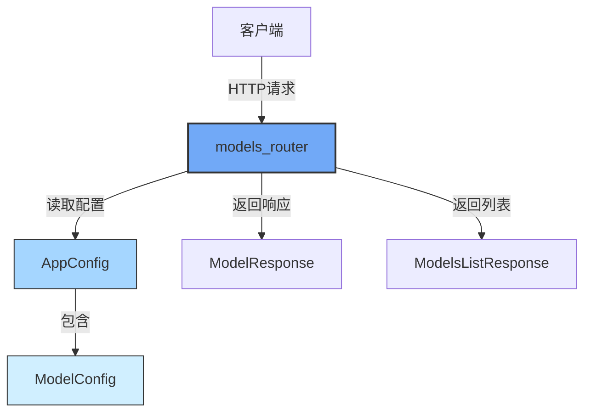

# models_router 模块文档

## 概述

`models_router` 模块是 DeerFlow 应用程序网关 API 的核心组件之一，负责提供 AI 模型配置信息的访问接口。该模块通过 RESTful API 端点暴露系统中配置的所有可用 AI 模型及其详细信息，使得前端应用和其他客户端能够动态获取模型列表和单个模型的元数据。

### 设计目的

该模块的主要设计目的是：
1. 提供统一的模型信息查询接口，解耦前端与底层模型配置
2. 安全地暴露模型元数据，同时隐藏敏感配置信息（如 API 密钥）
3. 支持前端应用动态展示可用模型列表及其特性
4. 为模型选择和切换功能提供数据支持

## 核心组件

### ModelResponse

`ModelResponse` 是一个 Pydantic 模型，用于标准化单个 AI 模型的响应数据结构。它定义了向客户端返回的模型信息格式，确保数据一致性和类型安全。

#### 字段说明

| 字段名 | 类型 | 描述 | 默认值 |
|-------|------|------|--------|
| `name` | `str` | 模型的唯一标识符，用于系统内部引用模型 | 必填 |
| `display_name` | `str \| None` | 模型的人类可读名称，适用于前端展示 | `None` |
| `description` | `str \| None` | 模型的详细描述信息 | `None` |
| `supports_thinking` | `bool` | 指示模型是否支持思考模式的标志 | `False` |

### ModelsListResponse

`ModelsListResponse` 是一个包含多个 `ModelResponse` 对象的容器模型，用于返回完整的模型列表。

#### 字段说明

| 字段名 | 类型 | 描述 |
|-------|------|------|
| `models` | `list[ModelResponse]` | 包含所有可用模型信息的列表 |

## API 端点

### 列出所有模型

**端点：** `GET /api/models`

该端点检索并返回系统中配置的所有可用 AI 模型的列表。它从应用配置中读取模型信息，并将其转换为适合前端展示的格式，同时确保敏感信息（如 API 密钥）不会被暴露。

#### 响应

成功响应返回一个 `ModelsListResponse` 对象，包含所有配置模型的信息。

**示例响应：**
```json
{
  "models": [
    {
      "name": "gpt-4",
      "display_name": "GPT-4",
      "description": "OpenAI GPT-4 model",
      "supports_thinking": false
    },
    {
      "name": "claude-3-opus",
      "display_name": "Claude 3 Opus",
      "description": "Anthropic Claude 3 Opus model",
      "supports_thinking": true
    }
  ]
}
```

#### 实现细节

该端点通过以下步骤工作：
1. 调用 `get_app_config()` 获取当前应用配置
2. 遍历配置中的所有模型
3. 为每个模型创建 `ModelResponse` 对象，仅包含必要的元数据
4. 将所有模型响应封装在 `ModelsListResponse` 中返回

### 获取模型详情

**端点：** `GET /api/models/{model_name}`

该端点根据模型名称检索特定模型的详细信息。如果找不到请求的模型，将返回 404 错误。

#### 请求参数

| 参数名 | 类型 | 位置 | 描述 |
|-------|------|------|------|
| `model_name` | `str` | 路径 | 要检索的模型的唯一名称 |

#### 响应

成功响应返回一个 `ModelResponse` 对象，包含请求模型的详细信息。

**示例响应：**
```json
{
  "name": "gpt-4",
  "display_name": "GPT-4",
  "description": "OpenAI GPT-4 model",
  "supports_thinking": false
}
```

#### 错误响应

如果找不到请求的模型，将返回以下错误：

```json
{
  "detail": "Model 'unknown-model' not found"
}
```

#### 实现细节

该端点通过以下步骤工作：
1. 调用 `get_app_config()` 获取当前应用配置
2. 使用 `config.get_model_config(model_name)` 查找特定模型
3. 如果未找到模型，抛出 404 HTTP 异常
4. 如果找到模型，创建并返回 `ModelResponse` 对象

## 模块架构与依赖关系

`models_router` 模块在系统架构中位于网关层，作为前端与后端配置系统之间的桥梁。

### 架构图



### 依赖关系

该模块主要依赖以下组件：

- **FastAPI**: 提供 API 路由和请求处理功能
- **Pydantic**: 用于数据验证和序列化
- **AppConfig**: 应用配置系统，提供模型配置访问
- **ModelConfig**: 单个模型的配置定义

详细的配置系统信息请参考 [application_and_feature_configuration 模块文档](application_and_feature_configuration.md)。

## 使用指南

### 客户端集成示例

#### JavaScript/TypeScript 示例

```typescript
// 获取所有模型
async function fetchAllModels() {
  const response = await fetch('/api/models');
  const data = await response.json();
  return data.models;
}

// 获取特定模型
async function fetchModel(modelName: string) {
  const response = await fetch(`/api/models/${modelName}`);
  if (!response.ok) {
    if (response.status === 404) {
      throw new Error('Model not found');
    }
    throw new Error('Failed to fetch model');
  }
  return response.json();
}

// 使用示例
fetchAllModels().then(models => {
  console.log('Available models:', models);
  // 在 UI 中渲染模型列表
});

fetchModel('gpt-4').then(model => {
  console.log('Model details:', model);
  // 使用模型信息
});
```

#### Python 示例

```python
import requests

# 获取所有模型
def list_models():
    response = requests.get("http://localhost:8000/api/models")
    response.raise_for_status()
    return response.json()["models"]

# 获取特定模型
def get_model(model_name):
    response = requests.get(f"http://localhost:8000/api/models/{model_name}")
    if response.status_code == 404:
        raise ValueError(f"Model '{model_name}' not found")
    response.raise_for_status()
    return response.json()

# 使用示例
try:
    models = list_models()
    print(f"Available models: {[m['name'] for m in models]}")
    
    gpt4 = get_model("gpt-4")
    print(f"GPT-4 details: {gpt4}")
except Exception as e:
    print(f"Error: {e}")
```

## 配置与扩展

### 模型配置

`models_router` 模块本身不需要额外配置，它直接从应用配置中读取模型信息。模型配置通过 `config.yaml` 文件或环境变量进行管理。

示例模型配置：
```yaml
models:
  - name: gpt-4
    display_name: GPT-4
    description: OpenAI GPT-4 model
    use: langchain_openai.ChatOpenAI
    model: gpt-4
    api_key: $OPENAI_API_KEY
    supports_thinking: false
    supports_vision: false
  - name: claude-3-opus
    display_name: Claude 3 Opus
    description: Anthropic Claude 3 Opus model
    use: langchain_anthropic.ChatAnthropic
    model: claude-3-opus-20240229
    api_key: $ANTHROPIC_API_KEY
    supports_thinking: true
    supports_vision: true
```

更多配置详情请参考 [application_and_feature_configuration 模块文档](application_and_feature_configuration.md)。

### 扩展响应模型

如果需要在模型响应中包含额外信息，可以通过以下方式扩展：

1. 首先在 `ModelConfig` 中添加新字段（如果需要从配置中读取）
2. 在 `ModelResponse` 中添加相应字段
3. 更新 `list_models` 和 `get_model` 函数，以包含新字段

示例扩展：
```python
class ModelResponse(BaseModel):
    """Response model for model information."""
    # 现有字段...
    supports_vision: bool = Field(default=False, description="Whether model supports vision/image inputs")
    max_tokens: int | None = Field(None, description="Maximum token limit for the model")

# 在端点函数中添加新字段
ModelResponse(
    # 现有字段...
    supports_vision=model.supports_vision,
    max_tokens=model.max_tokens if hasattr(model, 'max_tokens') else None,
)
```

## 注意事项与限制

### 安全注意事项

1. **敏感信息保护**：该模块设计为只暴露模型元数据，不会暴露 API 密钥或其他敏感配置。在扩展此模块时，应确保继续遵循这一原则。

2. **模型名称唯一性**：模型名称作为唯一标识符，在配置中必须保持唯一。重复的模型名称可能导致不可预测的行为。

### 错误处理

1. **模型不存在**：当请求的模型不存在时，端点会返回 404 错误。客户端应妥善处理此错误情况。

2. **配置加载失败**：如果应用配置无法加载，整个 API 可能会失败。这种情况通常在启动时发生，而不是在运行时。

### 使用限制

1. **只读接口**：这些端点只提供模型信息的读取功能，不支持模型配置的动态修改。

2. **依赖配置系统**：该模块完全依赖应用配置系统。如果配置系统出现问题，模型信息将无法正确获取。

## 相关模块

- [application_and_feature_configuration](application_and_feature_configuration.md)：提供应用配置系统，包括模型配置
- [gateway_api_contracts](gateway_api_contracts.md)：包含其他网关 API 契约和路由器

以上就是 `models_router` 模块的完整文档，该模块通过提供标准化的 API 接口，使得客户端能够轻松获取系统中可用的 AI 模型信息，为构建灵活的 AI 应用提供了基础支持。
