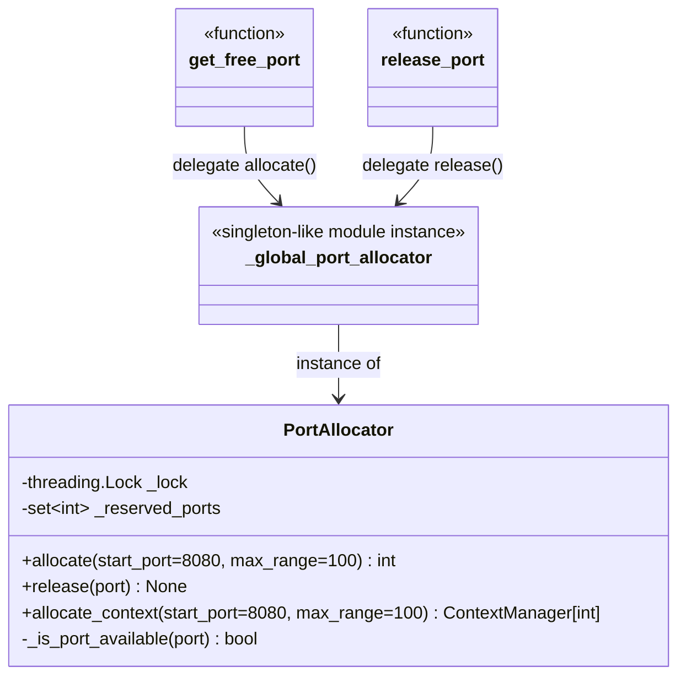
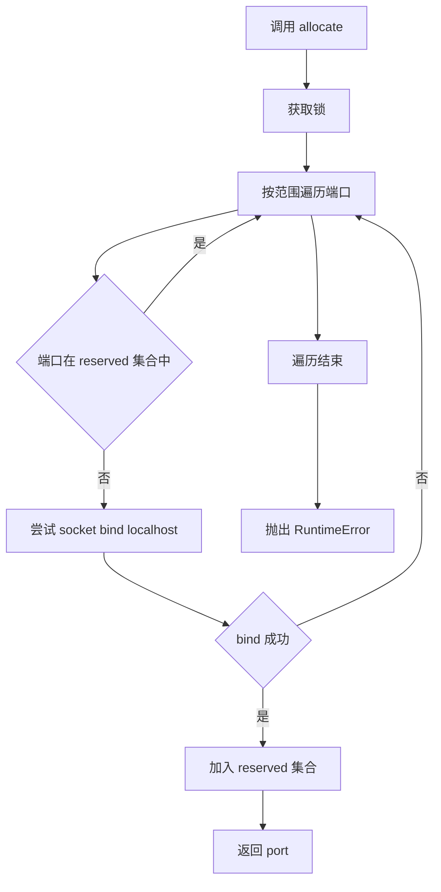
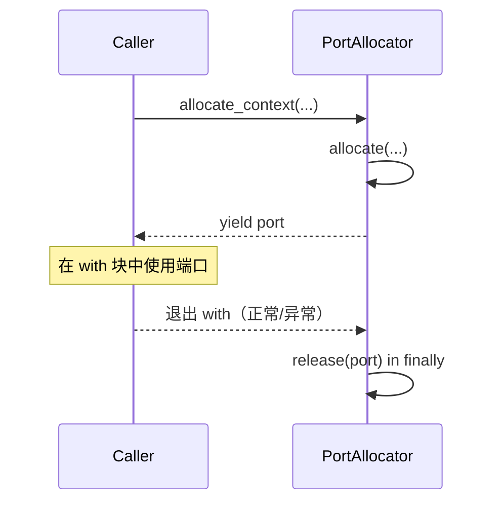
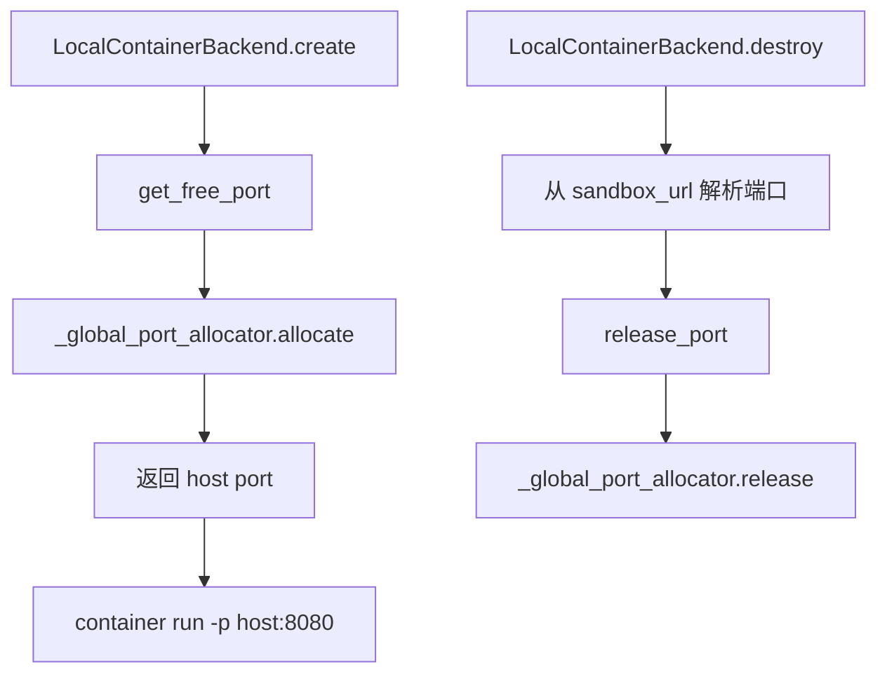

# network_utilities 模块文档

## 1. 模块简介与存在价值

`network_utilities` 是 `backend/src/utils/network.py` 中提供的轻量级网络资源协调模块，核心目标是在**并发场景下安全地分配本地端口**，避免同一进程内多个线程“抢到同一个端口”而导致后续绑定失败。该模块当前只有一个核心类型 `PortAllocator`，但它承担的是后端运行时里的基础设施职责：为动态启动的本地服务（尤其是 sandbox/container 相关运行时）提供可复用、线程安全、语义清晰的端口分配能力。

它存在的根本原因是：仅靠“扫描端口是否可用”在并发环境中不可靠。如果没有统一预留机制，两个线程可能在几乎同一时刻都检测到某端口空闲，然后都尝试使用，导致冲突。`PortAllocator` 通过“锁 + 进程内预留集合”的组合，保证在同一个 Python 进程里分配动作是原子的，显著降低冲突概率，并提供显式释放与上下文自动释放两种生命周期管理方式。

从系统定位看，该模块属于 [backend_operational_utilities.md](backend_operational_utilities.md) 的子模块，并被 sandbox 社区后端中的 `LocalContainerBackend` 直接消费，用于容器端口映射（见 [sandbox_aio_community_backend.md](sandbox_aio_community_backend.md) 与 [sandbox_core_runtime.md](sandbox_core_runtime.md)）。这意味着它虽然代码简短，却处在“基础工具层”，稳定性和行为一致性对上层运行时非常关键。

---

## 2. 核心组件与职责分解

模块包含一个类、一个全局实例和两个门面函数，形成“可实例化 + 全局便捷访问”的双轨 API。



上图展示了一个很实用的设计取舍：`PortAllocator` 本身是可独立创建的对象，适合组件内隔离使用；同时模块级 `_global_port_allocator` 让调用方不必管理实例，即可在应用范围内共享“同一份预留状态”。这两种形态并存，使模块既能服务简单场景（直接函数调用），也能服务复杂场景（显式注入 allocator 以便测试和隔离）。

---

## 3. 内部工作机制（并发与可用性判定）

### 3.1 分配路径



`allocate` 的关键点是：它在同一个锁保护区内完成“搜索 + 预留写入”，所以同一实例上的并发调用不会重复返回同一端口。可用性判断由 `_is_port_available` 执行，先检查进程内预留集合，再通过 `socket.bind(('localhost', port))` 做系统级验证；这比只看集合更稳健，因为它能识别端口是否已被其他进程占用。

### 3.2 释放路径


`release` 使用 `discard` 而不是 `remove`，因此重复释放或释放未知端口不会抛异常，这使调用方在 `finally` 块中执行释放更安全、幂等性更好。

### 3.3 上下文管理器路径



`allocate_context` 的价值在于将资源回收逻辑内建到 `finally`，避免“异常导致端口遗留预留”的常见问题。对于需要启动临时服务的代码，这是推荐模式。

---

## 4. API 详解

## 4.1 `PortAllocator`

### `__init__(self)`

构造函数初始化两个内部状态：`_lock`（`threading.Lock`）用于临界区保护，`_reserved_ports`（`set[int]`）用于记录本实例已经分配但尚未释放的端口。该集合是“进程内逻辑预留”，并不等于 OS 层面实际监听状态。

### `_is_port_available(self, port: int) -> bool`

这是内部方法，不建议外部直接依赖。它先判断 `port` 是否在 `_reserved_ports` 中，如果已预留直接返回 `False`；否则创建 TCP socket 并尝试 `bind(('localhost', port))`。绑定成功即视为可用，失败（`OSError`）视为不可用。

参数为目标端口号，返回布尔值。副作用是短暂创建并关闭 socket，无长期网络状态残留。

### `allocate(self, start_port: int = 8080, max_range: int = 100) -> int`

这是主入口方法。在锁保护下从 `start_port` 起最多检查 `max_range` 个端口，找到可用端口后立即写入 `_reserved_ports` 并返回。如果范围内无可用端口，抛出 `RuntimeError`。

参数语义如下：`start_port` 控制扫描起点，`max_range` 控制扫描窗口长度（实际遍历区间为 `range(start_port, start_port + max_range)`，即右侧开区间）。返回值是分配到的端口号。副作用是修改内部预留集合。

### `release(self, port: int) -> None`

在锁保护下调用 `discard` 移除预留端口。参数为端口号，无返回值。副作用是解除该实例的逻辑预留，不会主动关闭你在外部创建的监听 socket（因为模块并不持有该 socket）。

### `allocate_context(self, start_port: int = 8080, max_range: int = 100)`

这是 `contextmanager` 形式的便捷封装。进入上下文时调用 `allocate`，退出时无条件 `release`。它 `yield` 一个端口号，适合与 `with` 配合使用，尤其适合临时测试服务、容器启动前端口预留等短生命周期任务。

## 4.2 全局函数

### `get_free_port(start_port: int = 8080, max_range: int = 100) -> int`

该函数委托模块级 `_global_port_allocator.allocate(...)`。适合不想显式传递对象实例的代码路径。由于所有调用共享同一全局 allocator，在单进程内可避免不同模块各自分配导致的重复端口。

### `release_port(port: int) -> None`

该函数委托 `_global_port_allocator.release(port)`，用于释放通过 `get_free_port` 或其他全局路径获取的端口。

---

## 5. 与系统其他模块的关系

`network_utilities` 的直接使用方之一是 `backend.src.community.aio_sandbox.local_backend.LocalContainerBackend`：在创建容器时调用 `get_free_port` 获取 host port，并在容器销毁时调用 `release_port` 归还。也就是说，它是 sandbox 运行时端口编排的底层基础件。



这条链路解释了为什么该模块必须线程安全：容器可能被并发创建，且端口冲突会直接导致容器启动失败。更多 sandbox 生命周期与 provider 语义请参考 [sandbox_core_runtime.md](sandbox_core_runtime.md) 与 [sandbox_aio_community_backend.md](sandbox_aio_community_backend.md)。配置层面（如 base port、镜像、挂载）请参考 [application_and_feature_configuration.md](application_and_feature_configuration.md) 中 `SandboxConfig` 相关章节。

---

## 6. 使用模式与实践示例

### 6.1 推荐：上下文管理器

```python
from backend.src.utils.network import PortAllocator

allocator = PortAllocator()

with allocator.allocate_context(start_port=9000, max_range=200) as port:
    # 这里启动临时服务
    # app.run(port=port)
    print(f"allocated: {port}")
# 自动 release
```

这种方式能自动处理异常路径，避免遗忘释放。

### 6.2 全局便捷函数（跨模块共享）

```python
from backend.src.utils.network import get_free_port, release_port

port = get_free_port(start_port=10000, max_range=500)
try:
    # 启动容器/服务并绑定该端口
    pass
finally:
    release_port(port)
```

当你希望整个进程共享同一预留表时，这种方式比“每处 new 一个 PortAllocator”更安全。

### 6.3 与容器启动逻辑配合（简化示意）

```python
port = get_free_port(start_port=8080)
try:
    container_id = start_container(port_mapping=f"{port}:8080")
except Exception:
    release_port(port)
    raise
```

这个模式与 `LocalContainerBackend.create` 的实现思路一致：失败即回滚端口预留。

---

## 7. 行为约束、边界条件与已知限制

该模块能解决“单进程内并发重复分配”的核心问题，但并不等于全局无冲突。以下约束需要开发者明确理解。

- 第一，`PortAllocator` 的互斥范围仅限**同一实例**。若进程内存在多个实例，它们的 `_reserved_ports` 彼此不可见，仍可能分配到同一端口。
- 第二，即便使用全局实例，也只覆盖**当前 Python 进程**。其他进程并不知道你的预留集合，因此仍可能抢占端口。
- 第三，存在经典 TOCTOU 窗口：`allocate` 检查端口可用后并未保持 socket 占用，调用方真正 `bind` 前，外部进程可能抢占该端口。
- 第四，可用性检查绑定地址是 `'localhost'` + `AF_INET` + `SOCK_STREAM`。这意味着它验证的是 IPv4/TCP 本地回环场景，不等价于所有监听策略（如 `0.0.0.0`、IPv6、UDP）。
- 第五，模块不做端口值合法性校验（如负数、超 65535），非法值会在 `bind` 阶段失败并表现为“不可用”或触发异常路径。
- 第六，`RuntimeError` 的范围提示字符串是 `{start_port}-{start_port + max_range}`，而实际遍历上界不含该末端值，排障时要注意这是“显示语义”与“遍历语义”之间的细微差异。

---

## 8. 错误处理与排障建议

当出现 `RuntimeError: No available port found...` 时，通常不是单一原因。你应先确认分配范围是否过小，再确认调用路径是否在异常分支漏掉 `release`，最后确认是否有外部进程占满该端口段。

若你遇到“分配成功但后续 bind 失败”，优先考虑 TOCTOU 问题与多进程竞争问题。可行缓解策略包括：缩短“分配到绑定”的时间间隔、扩大搜索范围、尽量集中到单一分配器、或者在更上层采用“直接 bind(0) 后读取真实端口”的机制（如果业务允许）。

如果你在容器场景中发现端口持续耗尽，要检查容器销毁路径是否可靠执行了 `release_port`；尤其在异常和超时分支中，务必保证回滚逻辑存在。

---

## 9. 扩展与演进建议

若未来需要增强该模块，可考虑以下方向：

- 增加“保留 socket”模式：分配时返回已绑定 socket，彻底消除 TOCTOU（代价是 API 更复杂）。
- 增加协议/地址族参数：支持 UDP、IPv6 或自定义 bind host。
- 增加跨进程协调：通过文件锁、端口注册服务或共享存储实现进程间一致预留。
- 增加观测性：暴露当前 reserved 数量、分配耗时、失败率等指标，方便生产排障。

这些演进需要与 sandbox/provider 的生命周期策略协同设计，可先阅读 [sandbox_core_runtime.md](sandbox_core_runtime.md) 与 [sandbox_aio_community_backend.md](sandbox_aio_community_backend.md) 中关于资源回收的说明。

---

## 10. 总结

`network_utilities` 是一个代码量小但系统价值高的基础模块。`PortAllocator` 通过线程锁与预留集合实现了进程内端口分配原子化，`allocate_context` 提供了更安全的资源生命周期管理，而全局函数为跨模块共享提供了低门槛入口。只要开发者清楚其作用边界（实例内/进程内保证，而非全局绝对保证），并遵循“分配后尽快绑定、异常必释放”的实践，它就能在 sandbox 与临时服务场景中稳定发挥作用。