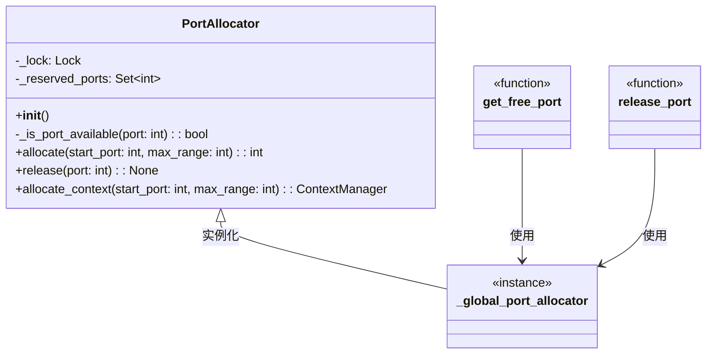

# network_utilities 模块文档

## 1. 概述

`network_utilities` 模块是后端操作工具库中的一个核心组件，专注于提供线程安全的网络资源管理功能。该模块的主要设计目标是解决并发环境下端口分配冲突的问题，确保多个组件或线程能够安全地获取和释放网络端口资源。

### 核心功能与设计理念

本模块的核心功能围绕端口分配展开，采用了线程安全的设计模式，通过锁机制和端口状态跟踪来防止并发冲突。设计理念强调简单性和可靠性，提供了直观的 API 接口，同时支持手动管理和自动资源管理两种使用模式，以适应不同的应用场景。

### 模块定位

`network_utilities` 模块属于 `backend_operational_utilities` 模块组的一部分，为整个后端系统提供基础的网络资源管理能力。它可以被系统中任何需要动态分配端口的组件使用，例如沙箱环境、临时服务器或其他网络服务。

## 2. 组件架构

### 核心组件关系图



### 架构说明

`network_utilities` 模块采用了简洁而有效的架构设计，主要包含以下几个核心部分：

1. **PortAllocator 类**：这是模块的核心类，负责实现线程安全的端口分配逻辑。它内部维护了一个已分配端口的集合和一个线程锁，确保端口分配和释放操作的原子性。

2. **全局分配器实例**：模块创建了一个全局的 `PortAllocator` 实例，用于在整个应用程序范围内共享端口分配功能。

3. **便捷函数**：提供了 `get_free_port` 和 `release_port` 两个便捷函数，封装了对全局分配器实例的访问，简化了常见使用场景的代码。

这种设计既允许用户创建独立的 `PortAllocator` 实例以满足特定需求，又提供了全局共享的便捷方式，兼顾了灵活性和易用性。

## 3. 核心功能

### 线程安全的端口分配

`network_utilities` 模块的核心功能是提供线程安全的端口分配机制。这一功能通过 `PortAllocator` 类实现，它能够确保在多线程环境中，每个分配的端口都是唯一的，不会发生冲突。

端口分配的工作流程如下：

1. 当请求分配端口时，系统会从指定的起始端口开始检查
2. 对于每个端口，会进行两项检查：
   - 该端口是否已被当前分配器预留
   - 该端口是否在系统级别可用（通过尝试绑定来验证）
3. 找到可用端口后，将其标记为预留并返回
4. 如果在指定范围内未找到可用端口，则抛出异常

这种双重检查机制确保了分配的端口既不会与当前分配器已分配的端口冲突，也不会与系统中其他进程使用的端口冲突。

### 资源管理模式

模块支持两种端口资源管理模式：

1. **手动管理模式**：用户显式调用 `allocate` 方法获取端口，使用完毕后调用 `release` 方法释放端口。这种模式提供了最大的灵活性，但需要用户负责正确管理资源生命周期。

2. **上下文管理器模式**：通过 `allocate_context` 方法提供的上下文管理器，自动处理端口的分配和释放。这种模式更安全，因为它确保即使在发生异常的情况下，端口也会被正确释放，是推荐使用的方式。

### 全局端口分配

为了方便在整个应用程序中共享端口分配功能，模块提供了全局分配器实例和相应的便捷函数。这种设计使得不同组件可以协同工作，避免端口冲突，而无需显式传递分配器实例。

## 4. 核心 API 文档

### PortAllocator 类

#### 概述

`PortAllocator` 是一个线程安全的端口分配器类，用于在并发环境中防止端口冲突。

#### 构造函数

```python
def __init__(self)
```

初始化一个新的端口分配器实例，创建内部锁和空的已预留端口集合。

#### 方法

##### _is_port_available

```python
def _is_port_available(self, port: int) -> bool
```

检查指定端口是否可用。

**参数**:
- `port`: 要检查的端口号

**返回值**:
- 如果端口可用则返回 `True`，否则返回 `False`

**说明**:
这是一个内部方法，首先检查端口是否已被当前分配器预留，然后尝试在该端口上绑定套接字以验证其系统级可用性。

##### allocate

```python
def allocate(self, start_port: int = 8080, max_range: int = 100) -> int
```

以线程安全的方式分配一个可用端口。

**参数**:
- `start_port`: 开始搜索的端口号，默认为 8080
- `max_range`: 最大搜索端口数量，默认为 100

**返回值**:
- 可用的端口号

**异常**:
- `RuntimeError`: 如果在指定范围内找不到可用端口

**说明**:
该方法是线程安全的，会找到可用端口并将其标记为预留，直到调用 `release()` 方法释放。

##### release

```python
def release(self, port: int) -> None
```

释放先前分配的端口。

**参数**:
- `port`: 要释放的端口号

**说明**:
该方法是线程安全的，将从已预留端口集合中移除指定端口。

##### allocate_context

```python
@contextmanager
def allocate_context(self, start_port: int = 8080, max_range: int = 100)
```

用于端口分配的上下文管理器，自动处理端口释放。

**参数**:
- `start_port`: 开始搜索的端口号，默认为 8080
- `max_range`: 最大搜索端口数量，默认为 100

** yields **:
- 可用的端口号

**说明**:
该上下文管理器在进入上下文时分配端口，在退出上下文时自动释放端口，即使发生异常也能确保端口被释放。

### 全局函数

#### get_free_port

```python
def get_free_port(start_port: int = 8080, max_range: int = 100) -> int
```

以线程安全的方式获取一个空闲端口。

**参数**:
- `start_port`: 开始搜索的端口号，默认为 8080
- `max_range`: 最大搜索端口数量，默认为 100

**返回值**:
- 可用的端口号

**异常**:
- `RuntimeError`: 如果在指定范围内找不到可用端口

**说明**:
该函数使用全局端口分配器确保并发调用不会返回相同的端口。端口会被标记为预留，直到调用 `release_port()` 释放。

#### release_port

```python
def release_port(port: int) -> None
```

释放先前分配的端口。

**参数**:
- `port`: 要释放的端口号

**说明**:
该函数使用全局端口分配器释放指定端口。

## 5. 使用指南与示例

### 基本使用模式

#### 手动分配与释放

```python
from backend.src.utils.network import PortAllocator

# 创建分配器实例
allocator = PortAllocator()

# 分配端口
port = allocator.allocate(start_port=9000)
try:
    # 使用端口进行操作，例如启动服务
    print(f"使用端口: {port}")
    # 这里可以是你的网络服务代码
finally:
    # 确保端口被释放
    allocator.release(port)
```

#### 使用上下文管理器（推荐）

```python
from backend.src.utils.network import PortAllocator

# 创建分配器实例
allocator = PortAllocator()

# 使用上下文管理器自动管理端口
with allocator.allocate_context(start_port=9000) as port:
    # 使用端口进行操作
    print(f"使用端口: {port}")
    # 这里可以是你的网络服务代码
# 退出上下文后，端口自动释放
```

### 使用全局分配器

```python
from backend.src.utils.network import get_free_port, release_port

# 获取端口
port = get_free_port(start_port=9000)
try:
    # 使用端口
    print(f"使用全局分配器获取的端口: {port}")
finally:
    # 释放端口
    release_port(port)
```

### 并发环境中的使用

```python
import threading
from backend.src.utils.network import PortAllocator

def worker(allocator, thread_id):
    """线程工作函数"""
    with allocator.allocate_context(start_port=8000) as port:
        print(f"线程 {thread_id} 获取到端口: {port}")
        # 模拟使用端口的操作
        import time
        time.sleep(1)
        print(f"线程 {thread_id} 释放端口: {port}")

# 创建分配器
allocator = PortAllocator()

# 创建并启动多个线程
threads = []
for i in range(5):
    t = threading.Thread(target=worker, args=(allocator, i))
    threads.append(t)
    t.start()

# 等待所有线程完成
for t in threads:
    t.join()
```

## 6. 配置与部署

### 配置选项

`network_utilities` 模块设计为轻量级组件，无需复杂的配置。主要可调整的参数包括：

1. **起始端口 (start_port)**: 默认为 8080，可根据应用环境和需求调整
2. **端口搜索范围 (max_range)**: 默认为 100，可根据预期并发需求调整

### 部署注意事项

1. **端口范围选择**: 选择合适的起始端口和搜索范围，避免与系统常用服务端口冲突
2. **权限问题**: 在某些系统上，低端口号（通常 < 1024）需要特殊权限，建议选择高位端口
3. **防火墙设置**: 确保分配的端口在防火墙规则中是允许的，特别是在生产环境中
4. **全局与局部实例**: 根据应用需求选择使用全局分配器或创建独立实例，对于需要隔离端口空间的组件，建议使用独立实例

## 7. 监控与维护

### 常见问题排查

1. **端口耗尽问题**:
   - 症状: 抛出 `RuntimeError: No available port found in range...`
   - 原因: 可能是端口未正确释放，或并发请求过多
   - 解决: 检查是否所有分配的端口都被释放，考虑增大搜索范围

2. **端口冲突**:
   - 症状: 即使使用分配器，仍出现端口绑定错误
   - 原因: 可能是其他进程在分配器检查和实际使用之间占用了端口，或使用了多个分配器实例
   - 解决: 尽量缩短检查和使用之间的时间窗口，在应用中尽量使用单一分配器实例

3. **死锁风险**:
   - 症状: 应用程序在调用分配器方法时挂起
   - 原因: 虽然分配器内部使用锁来保证线程安全，但如果在持有端口时调用可能会获取其他锁的代码，可能导致死锁
   - 解决: 避免在持有端口时调用可能获取其他锁的代码，确保锁的获取顺序一致

### 最佳实践建议

1. **优先使用上下文管理器**: 这是最安全的方式，可以确保端口总是被释放
2. **合理设置端口范围**: 根据应用的实际并发需求设置合适的起始端口和搜索范围
3. **集中管理**: 在大型应用中，考虑使用依赖注入或服务定位模式集中管理端口分配器实例
4. **监控端口使用**: 在生产环境中，考虑添加监控逻辑，跟踪端口分配和释放情况，及时发现资源泄漏

## 8. 总结

`network_utilities` 模块提供了一个简单而强大的解决方案，用于解决并发环境下的端口分配问题。其核心组件 `PortAllocator` 类通过线程安全的设计，确保了端口分配的可靠性和一致性。

该模块的主要优势包括：

1. **线程安全**: 使用锁机制确保并发环境下的安全操作
2. **双重验证**: 既检查内部预留状态，又验证系统级端口可用性
3. **灵活使用**: 支持手动管理和上下文管理器两种使用模式
4. **简单易用**: API 设计简洁直观，同时提供全局便捷函数

无论是在沙箱环境、临时服务还是其他需要动态端口分配的场景中，`network_utilities` 模块都能提供可靠的支持，帮助开发者避免常见的网络资源管理问题。
