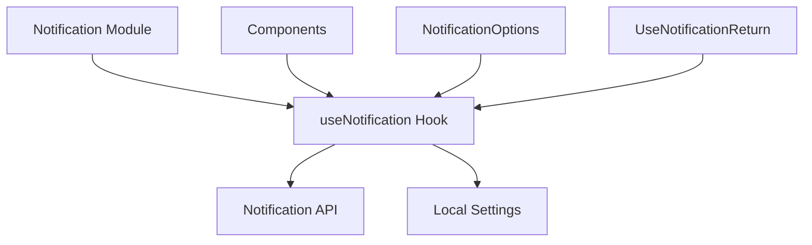

# Notification Module Documentation

## 1. 模块概述

通知模块是一个前端核心功能模块，提供了统一的浏览器通知管理功能。它封装了 Web Notification API 的复杂性，为应用提供了简单易用的通知展示、权限管理和配置集成能力。该模块的主要设计目的是让开发者能够轻松地在应用中集成桌面通知功能，同时处理了浏览器兼容性、用户设置、权限管理和通知频率控制等常见问题。

## 2. 核心组件详解

### 2.1 NotificationOptions 接口

`NotificationOptions` 接口定义了通知显示时的可选配置项，完全兼容原生 Web Notification API 的配置参数。

**主要属性：**
- `body?: string` - 通知的主体内容文本
- `icon?: string` - 通知显示的图标 URL
- `badge?: string` - 通知徽章的图像 URL
- `tag?: string` - 通知的唯一标识符，用于替换相同标签的现有通知
- `data?: unknown` - 与通知关联的任意数据
- `requireInteraction?: boolean` - 指示通知是否需要用户交互才能自动关闭
- `silent?: boolean` - 指示通知是否应该静默显示（无声音或振动）

### 2.2 UseNotificationReturn 接口

`UseNotificationReturn` 接口定义了 `useNotification` 钩子返回的对象结构，提供了通知功能的完整控制接口。

**主要属性：**
- `permission: NotificationPermission` - 当前通知权限状态，可能的值为 "default"、"granted" 或 "denied"
- `isSupported: boolean` - 指示当前浏览器是否支持 Notification API
- `requestPermission: () => Promise<NotificationPermission>` - 请求用户通知权限的异步函数
- `showNotification: (title: string, options?: NotificationOptions) => void` - 显示通知的函数

### 2.3 useNotification 钩子

`useNotification` 是该模块的核心钩子函数，封装了所有通知相关的逻辑和状态管理。

**工作原理：**
该钩子使用 React 的状态和副作用钩子来管理通知功能的生命周期。它首先在组件挂载时检测浏览器对 Notification API 的支持情况，并获取当前的权限状态。然后，它提供了请求权限和显示通知的函数，这些函数会根据当前状态和用户设置进行适当的检查和处理。

**关键实现细节：**
- 使用 `useState` 管理权限状态和支持状态
- 使用 `useRef` 跟踪最后一次通知的时间，以实现通知频率限制
- 集成了本地设置检查，只有在用户启用通知功能时才会显示通知
- 实现了 1 秒的通知间隔限制，防止通知过于频繁
- 添加了通知点击和错误事件的默认处理

## 3. 架构与依赖关系

通知模块的架构相对简单，主要依赖于浏览器的 Notification API 和应用的本地设置系统。



**依赖说明：**
- 依赖 `../settings` 模块中的 `useLocalSettings` 钩子来获取用户的通知设置
- 依赖浏览器原生的 `Notification` API 来实现实际的通知功能
- 作为前端核心模块，它被其他组件和功能模块使用，而不依赖于其他业务模块

## 4. 使用指南

### 4.1 基本使用

在组件中使用通知功能的基本步骤如下：

```typescript
import { useNotification } from 'frontend/src/core/notification/hooks';

function MyComponent() {
  const { permission, isSupported, requestPermission, showNotification } = useNotification();

  const handleEnableNotifications = async () => {
    const result = await requestPermission();
    if (result === 'granted') {
      showNotification('通知已启用', {
        body: '您现在将收到重要更新的通知',
        icon: '/path/to/icon.png'
      });
    }
  };

  return (
    <div>
      {!isSupported && <p>您的浏览器不支持通知功能</p>}
      {permission !== 'granted' && (
        <button onClick={handleEnableNotifications}>启用通知</button>
      )}
    </div>
  );
}
```

### 4.2 发送通知

发送通知时，可以提供标题和可选配置：

```typescript
showNotification('新消息', {
  body: '您有一条新的消息',
  icon: '/icons/message.png',
  tag: 'new-message',
  requireInteraction: true
});
```

### 4.3 配置说明

通知模块与应用的本地设置系统集成，用户可以在设置中启用或禁用通知功能。该设置通过 `useLocalSettings` 钩子获取，只有当 `settings.notification.enabled` 为 `true` 时，通知才会被显示。

## 5. 注意事项与限制

1. **浏览器兼容性**：该模块依赖于 Web Notification API，不是所有浏览器都支持。在不支持的浏览器中，`isSupported` 将返回 `false`，此时应提供替代的通知方式。

2. **权限要求**：通知功能需要用户明确授权。在请求权限时，最好是在用户执行了某个相关操作后再请求，而不是在页面加载时立即请求。

3. **频率限制**：模块内置了 1 秒的通知间隔限制，防止通知过于频繁打扰用户。这是通过 `lastNotificationTime` 引用来实现的。

4. **用户设置**：即使用户已授权通知权限，也需要检查应用内的通知设置是否启用。模块会自动处理这一点，但开发者应该意识到这一行为。

5. **通知关闭**：当用户点击通知时，默认行为是将窗口聚焦并关闭通知。如果需要自定义行为，可以在调用 `showNotification` 后添加自己的事件监听器。

6. **移动端限制**：在移动端浏览器中，通知功能的支持和行为可能有所不同，需要进行额外的测试和适配。

## 6. 相关模块

- [frontend_core_domain_types_and_state](frontend_core_domain_types_and_state.md) - 包含通知模块使用的设置相关类型
