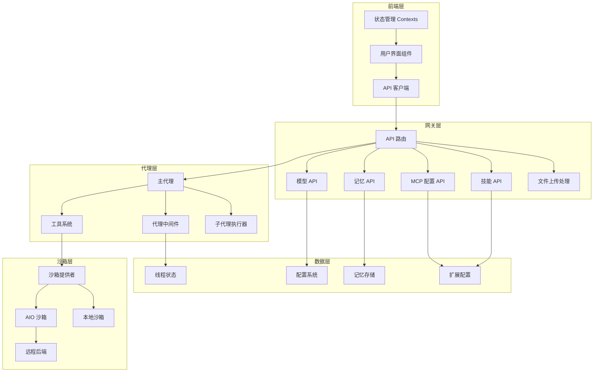

# DeerFlow 系统文档

## 概述

DeerFlow 是一个功能强大的 AI 协作平台，提供了灵活的智能代理框架、沙箱执行环境和丰富的交互界面。该系统旨在让用户能够自然地与 AI 协作，执行复杂的任务，同时保持安全性和可扩展性。

### 主要特性

- **多代理协作**：支持主代理与子代理协同工作，分解和处理复杂任务
- **安全沙箱环境**：提供本地和远程容器化沙箱，确保代码执行的安全性
- **技能系统**：可扩展的技能框架，允许添加自定义功能
- **记忆系统**：持久化用户上下文和事实记忆，支持长期交互
- **丰富的前端组件**：美观的 UI 组件库，包括动画效果、交互元素等
- **MCP 集成**：支持 Model Context Protocol，扩展 AI 的工具能力

## 系统架构

DeerFlow 采用前后端分离的架构，包含以下核心层次：

### 核心模块说明

1. **前端层**：提供用户交互界面，包含美观的 UI 组件和状态管理
2. **网关层**：处理 API 请求，包括文件上传、技能管理、记忆系统等
3. **代理层**：核心智能代理逻辑，包括主代理、子代理执行器和各种中间件
4. **沙箱层**：提供安全的代码执行环境，支持本地和远程部署
5. **数据层**：管理配置、记忆、线程状态等数据持久化

## 前端模块

### 核心组件

前端模块包含多个精心设计的 UI 组件，提供出色的用户体验：

- **动画效果组件**：闪烁网格、数字跳动、极光文本、聚光灯卡片等
- **交互组件**：终端模拟、魔法便当盒、提示输入等
- **上下文管理**：工件上下文、线程上下文、子任务上下文等
- **API 客户端**：技能、上传、MCP 等模块的 API 调用封装

详细文档请参考 [frontend.md](frontend.md)

## 后端模块

### 代理系统

代理系统是 DeerFlow 的核心，提供智能对话和任务执行能力：

- **主代理**：处理用户交互，协调工具调用
- **子代理执行器**：支持任务分解和并行执行
- **中间件系统**：标题生成、澄清请求、记忆管理、上传处理等

详细文档请参考 [agents.md](agents.md)

### 沙箱系统

沙箱系统提供安全的代码执行环境：

- **抽象接口**：统一的 Sandbox 基类和 SandboxProvider 接口
- **本地实现**：基于本地文件系统的沙箱
- **AIO 沙箱**：基于容器的高级沙箱，支持本地和远程后端
- **状态管理**：跨进程的沙箱状态持久化

详细文档请参考 [sandbox.md](sandbox.md)

### 配置系统

DeerFlow 提供灵活的配置管理：

- **应用配置**：模型、工具、沙箱等核心配置
- **扩展配置**：MCP 服务器和技能状态配置
- **记忆配置**：记忆系统的参数设置
- **追踪配置**：LangSmith 追踪配置

详细文档请参考 [config.md](config.md)

### 网关 API

网关层提供 RESTful API 接口：

- **文件上传**：处理用户文件上传和转换
- **技能管理**：技能的安装、启用/禁用
- **MCP 配置**：Model Context Protocol 服务器配置
- **记忆管理**：记忆数据的读取和重载
- **模型列表**：可用 AI 模型的信息

详细文档请参考 [gateway.md](gateway.md)

## 技能系统

技能系统允许扩展 DeerFlow 的功能：

- **技能加载器**：从文件系统加载和管理技能
- **技能类型**：公共技能和自定义技能分类
- **技能安装**：支持从 .skill 文件安装新技能

详细文档请参考 [skills.md](skills.md)

## 记忆系统

记忆系统提供长期上下文管理：

- **记忆更新器**：使用 LLM 更新记忆内容
- **记忆队列**：带防抖机制的记忆更新队列
- **记忆结构**：用户上下文、历史背景和事实存储

详细文档请参考 [memory.md](memory.md)

## 快速开始

### 环境要求

- Python 3.10+
- Node.js 18+
- Docker（可选，用于容器化沙箱）

### 安装步骤

1. 克隆仓库
2. 安装后端依赖：`cd backend && pip install -e .`
3. 安装前端依赖：`cd frontend && npm install`
4. 配置环境变量和配置文件
5. 启动后端：`cd backend && python -m src.gateway.main`
6. 启动前端：`cd frontend && npm run dev`

详细的安装和配置指南请参考 [quickstart.md](quickstart.md)

## 配置指南

DeerFlow 使用 YAML 配置文件管理系统设置。主要配置项包括：

- **模型配置**：定义可用的 AI 模型
- **沙箱配置**：设置沙箱环境参数
- **工具配置**：启用和配置工具
- **技能配置**：设置技能目录路径
- **扩展配置**：配置 MCP 服务器和技能状态

详细的配置说明请参考 [configuration.md](configuration.md)

## API 参考

DeerFlow 提供完整的 RESTful API，包括：

- `/api/threads/{thread_id}/uploads` - 文件上传
- `/api/skills` - 技能管理
- `/api/memory` - 记忆系统
- `/api/models` - 模型列表
- `/api/mcp/config` - MCP 配置

详细的 API 文档请参考 [api-reference.md](api-reference.md)

## 扩展开发

DeerFlow 设计为高度可扩展的系统，您可以：

- **开发自定义技能**：创建 .skill 文件包扩展功能
- **添加自定义工具**：集成新的工具到代理系统
- **配置 MCP 服务器**：连接外部 MCP 服务器
- **自定义 UI 组件**：扩展前端界面

扩展开发指南请参考 [extensions.md](extensions.md)

## 故障排除

常见问题和解决方案：

- **沙箱启动失败**：检查 Docker/容器运行时状态
- **记忆更新错误**：验证 memory.json 文件权限
- **技能加载失败**：检查 SKILL.md 格式和目录结构
- **前端连接问题**：验证 CORS 配置和后端地址

更多故障排除信息请参考 [troubleshooting.md](troubleshooting.md)

## 贡献指南

我们欢迎社区贡献！请参考 [contributing.md](contributing.md) 了解如何参与项目开发。

## 许可证

DeerFlow 采用 MIT 许可证开源。
