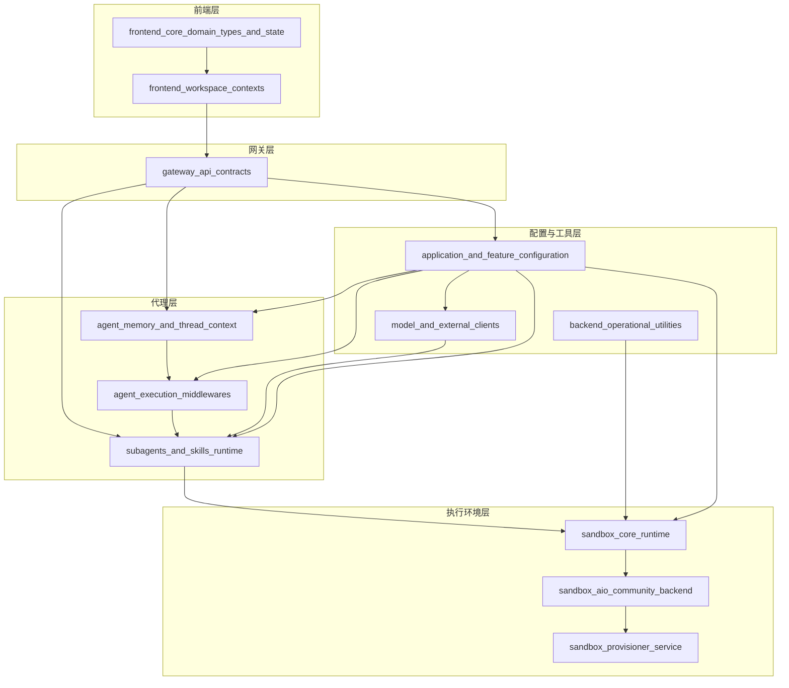

# deer-flow 仓库概览

deer-flow 是一个功能完整的 AI 代理协作平台，提供了一套端到端的 AI 助手解决方案，支持多代理协作、记忆管理、技能系统、安全沙箱执行以及丰富的用户交互界面。

## 主要功能/亮点

- **多代理系统**：支持主代理与子代理的层级结构，实现任务分解与专业化处理
- **智能记忆系统**：持久化存储用户上下文、历史交互和事实，提供连贯的对话体验
- **技能管理**：可安装、启用和管理自定义技能，扩展代理能力
- **安全沙箱执行**：提供隔离的代码执行环境，支持本地和 Kubernetes 部署
- **MCP 协议集成**：支持 Model Context Protocol，可连接外部服务和工具
- **丰富的前端界面**：提供直观的工作区、对话、工件和任务管理 UI
- **可配置性强**：模块化设计，支持灵活的配置和扩展

## 典型应用场景

- **AI 辅助编程**：通过沙箱环境执行代码，支持多种开发任务
- **智能文档处理**：利用技能系统处理 PDF、PPT、Excel 等文档
- **多步骤任务自动化**：通过子代理系统分解和执行复杂任务
- **个性化 AI 助手**：利用记忆系统提供个性化的交互体验
- **开发环境即服务**：通过 Kubernetes 动态提供隔离的开发环境

---

## 仓库架构与主流程



deer-flow 采用清晰的分层架构，从前端界面到后端执行环境形成完整的处理链路：

1. **前端层**：提供核心类型定义、状态管理和工作区上下文，构建用户交互界面
2. **网关层**：定义 REST API 契约，处理前端请求并协调后端服务
3. **代理层**：核心业务逻辑层，包含代理记忆、执行中间件和子代理/技能运行时
4. **执行环境层**：提供安全的代码执行环境，支持本地和 Kubernetes 部署
5. **配置与工具层**：提供统一配置管理、外部客户端连接和后端实用工具

主要数据流：用户交互通过前端组件发起，经 API 网关传递给代理层处理，代理系统可能使用记忆系统增强上下文，通过子代理分解任务，最终在沙箱环境中执行代码或操作，结果沿原路径返回给用户。

---

## 核心模块

### 1. agent_memory_and_thread_context

**路径**：`backend/src/agents`

提供代理记忆持久化和线程状态管理功能，使代理能够跨会话保持用户交互记忆、偏好和上下文信息，同时管理单个会话的执行状态。

- **记忆更新队列**：使用防抖机制异步处理记忆更新
- **记忆更新器**：利用 LLM 进行记忆摘要和更新
- **线程状态管理**：定义完整的会话线程状态结构
- **中间件集成**：通过中间件无缝集成到代理执行流程

参考：[agent_memory_and_thread_context 文档](#agent_memory_and_thread_context)

### 2. agent_execution_middlewares

**路径**：`backend/src/agents/middlewares`

提供一组中间件组件，用于增强和扩展代理执行功能，在代理执行流程的各个点拦截和修改执行流。

- **澄清中间件**：处理澄清请求，中断执行以向用户提问
- **悬挂工具调用中间件**：修复消息历史中的悬挂工具调用
- **子代理限制中间件**：强制执行最大并发子代理调用限制
- **线程数据中间件**：管理线程特定的数据目录
- **标题中间件**：自动生成会话线程标题
- **上传中间件**：注入上传文件信息到代理上下文
- **查看图像中间件**：在 view_image 工具完成时注入图像详情

参考：[agent_execution_middlewares 文档](#agent_execution_middlewares)

### 3. sandbox_core_runtime

**路径**：`backend/src/sandbox`

提供安全的隔离环境用于在代理系统中执行代码和命令，设计用于将不可信代码执行与主应用程序环境分离，同时提供必要的文件系统操作和命令执行功能。

- **标准接口**：`Sandbox` 和 `SandboxProvider` 抽象定义核心操作
- **中间件集成**：`SandboxMiddleware` 与代理执行流程集成
- **本地实现**：`LocalSandbox` 提供开发友好的本地执行环境
- **生命周期管理**：处理沙箱环境的获取、重用和清理

参考：[sandbox_core_runtime 文档](#sandbox_core_runtime)

### 4. sandbox_aio_community_backend

**路径**：`backend/src/community/aio_sandbox`

提供灵活、可扩展的沙箱环境管理系统，支持本地容器和远程 Kubernetes 两种部署模式，用于安全地执行代码和操作。

- **多后端支持**：本地 Docker/Apple Container 和远程 Kubernetes
- **跨进程状态共享**：通过状态存储实现沙箱信息共享
- **线程安全**：提供多进程和多线程安全的沙箱访问
- **自动空闲超时清理**：管理资源生命周期
- **目录挂载支持**：支持线程特定目录和技能目录挂载

参考：[sandbox_aio_community_backend 文档](#sandbox_aio_community_backend)

### 5. application_and_feature_configuration

**路径**：`backend/src/config`

是 DeerFlow 应用的核心配置管理系统，负责统一管理和加载应用的各种配置，包括模型配置、沙箱环境、工具、技能、内存管理、对话摘要、标题生成以及扩展功能等。

- **统一配置管理**：集中管理分散的配置，提供一致的配置加载和访问接口
- **环境变量支持**：允许在配置中引用环境变量，提高配置的灵活性和安全性
- **单例模式**：使用全局单例管理配置，确保配置的一致性和高效访问
- **热重载支持**：支持配置的动态重新加载，无需重启应用
- **路径管理**：提供统一的路径配置和解析机制，确保跨平台兼容性

参考：[application_and_feature_configuration 文档](#application_and_feature_configuration)

### 6. gateway_api_contracts

**路径**：`backend/src/gateway`

是系统的 API 网关契约层，负责定义和实现所有与前端交互的 REST API 接口，提供了一套标准化的数据模型、请求响应格式和 API 路由。

- **配置层**：由 `GatewayConfig` 负责，管理网关服务的主机、端口和 CORS 配置等基础设置
- **路由层**：包含各个功能模块的 API 路由定义，处理 HTTP 请求并返回响应
- **数据模型层**：定义所有 API 请求和响应的数据结构，使用 Pydantic 进行数据验证

功能模块包括 MCP 配置、记忆管理、模型管理、技能管理和文件上传等。

参考：[gateway_api_contracts 文档](#gateway_api_contracts)

### 7. subagents_and_skills_runtime

**路径**：`backend/src/subagents`

提供了创建和管理专门 AI 代理（子代理）的强大框架，以及组织和利用系统中技能的系统，使父代理能够将任务委托给子代理处理。

- **子代理配置**：`SubagentConfig` 定义子代理行为，包括名称、描述、系统提示、工具访问等
- **子代理执行引擎**：`SubagentExecutor` 处理子代理的实际执行
- **执行状态和结果**：`SubagentStatus` 枚举和 `SubagentResult` 数据类跟踪和传达执行状态
- **后台任务管理**：使用线程池异步运行子代理，并提供跟踪和检索结果的机制
- **技能管理**：`Skill` 数据类表示技能及其元数据和文件路径

参考：[subagents_and_skills_runtime 文档](#subagents_and_skills_runtime)

### 8. frontend_core_domain_types_and_state

**路径**：`frontend/src/core`

是前端应用的基础层，提供 TypeScript 类型定义、React 上下文、实用函数和状态管理原语，为用户界面提供动力。

- **国际化（i18n）**：为整个应用提供国际化支持
- **消息处理**：组织和处理对话消息
- **线程和任务管理**：定义会话线程和子任务的结构
- **技能和模型**：管理技能和语言模型信息
- **设置和通知**：处理用户设置和浏览器通知

参考：[frontend_core_domain_types_and_state 文档](#frontend_core_domain_types_and_state)

### 9. frontend_workspace_contexts

**路径**：`frontend/src/components/workspace`

是前端应用中负责管理工作区上下文的核心模块，提供了 React Context 机制来共享和管理工作区相关的状态，主要包含工件（artifacts）上下文和线程（thread）上下文。

- **工件管理**：提供工件列表的维护、选择和展示控制
- **线程状态共享**：提供线程 ID 和线程流状态的上下文访问
- **状态同步**：确保相关组件间的状态一致性
- **错误处理**：提供上下文使用的安全检查机制

参考：[frontend_workspace_contexts 文档](#frontend_workspace_contexts)

---

## 技术栈与依赖

| 类别 | 技术/依赖 | 用途 | 来源模块 |
|------|-----------|------|---------|
| **核心语言** | Python | 后端主要开发语言 | 所有后端模块 |
| | TypeScript | 前端主要开发语言 | 所有前端模块 |
| **Web 框架** | FastAPI | 后端 API 框架 | gateway_api_contracts |
| | React | 前端 UI 框架 | 所有前端模块 |
| **AI/LLM** | LangChain | 代理框架 | agent_memory_and_thread_context, subagents_and_skills_runtime |
| | OpenAI API | LLM 接口 | model_and_external_clients |
| | DeepSeek | 支持的 LLM 模型 | model_and_external_clients |
| **容器/编排** | Docker | 容器运行时 | sandbox_aio_community_backend, sandbox_provisioner_service |
| | Kubernetes | 容器编排 | sandbox_aio_community_backend, sandbox_provisioner_service |
| **数据验证** | Pydantic | 数据验证和设置管理 | 所有后端模块 |
| **外部服务** | Jina AI | 网页内容提取 | model_and_external_clients |
| **状态管理** | React Context | 前端状态管理 | frontend_workspace_contexts |

---

## 关键模块与典型用例

### 子代理执行

**功能说明**：子代理系统允许主代理将特定任务委托给专门的子代理处理，每个子代理可以有自己的系统提示、工具集和配置。

**配置与依赖**：
* 配置文件：`config.yaml` 中的 `subagents` 部分
* 依赖：`subagents_and_skills_runtime` 模块

**示例代码**：

```python
from src.subagents.config import SubagentConfig
from src.subagents.executor import SubagentExecutor

# 创建子代理配置
config = SubagentConfig(
    name="code_reviewer",
    description="Useful for reviewing code and providing feedback",
    system_prompt="You are a code reviewer. Analyze the given code carefully.",
    tools=["read_file", "write_file", "execute_command"],
    model="inherit",
    timeout_seconds=600
)

# 初始化执行器
executor = SubagentExecutor(
    config=config,
    tools=available_tools,
    parent_model=parent_model_name,
    sandbox_state=sandbox_state,
    thread_data=thread_data,
    thread_id=thread_id
)

# 执行任务
result = executor.execute("Review the code in /workspace/main.py")
```

### 记忆系统使用

**功能说明**：记忆系统允许代理保持用户交互的长期记忆，包括用户偏好、上下文信息和历史记录。

**配置与依赖**：
* 配置：`MemoryConfig` 类
* 依赖：`agent_memory_and_thread_context` 模块

**示例代码**：

```python
from src.config.memory_config import get_memory_config
from src.agents.memory.queue import get_memory_queue

# 启用和配置记忆系统
config = get_memory_config()
config.enabled = True
config.debounce_seconds = 30
config.model_name = "gpt-4"

# 使用记忆队列
queue = get_memory_queue()
queue.add(
    thread_id="thread_123",
    messages=conversation_messages
)
```

### 沙箱环境创建

**功能说明**：动态创建隔离的沙箱环境用于安全执行代码，支持本地和 Kubernetes 部署。

**配置与依赖**：
* 配置：`SandboxConfig` 类
* 依赖：`sandbox_core_runtime` 或 `sandbox_aio_community_backend` 模块

**示例代码**：

```python
from src.sandbox import get_sandbox_provider

# 获取沙箱提供者实例
provider = get_sandbox_provider()

# 获取沙箱
sandbox_id = provider.acquire(thread_id="my-thread-id")

# 获取沙箱实例
sandbox = provider.get(sandbox_id)

# 执行命令
output = sandbox.execute_command("ls -la")

# 读取文件
content = sandbox.read_file("/path/to/file.txt")
```

---

## 配置、部署与开发

deer-flow 支持多种部署模式，从单机器开发环境到 Kubernetes 集群生产环境：

### 配置文件

主要配置通过 `config.yaml` 文件管理，支持以下关键配置区域：
- 模型配置（`models`）
- 沙箱配置（`sandbox`）
- 工具配置（`tools`）
- 技能配置（`skills`）
- 记忆配置（`memory`）
- 标题生成配置（`title`）
- 子代理配置（`subagents`）

敏感信息（如 API 密钥）可以通过环境变量注入，使用 `$VAR_NAME` 语法。

### 开发环境部署

1. 确保安装了 Docker（用于沙箱环境）
2. 克隆仓库并安装依赖
3. 配置 `config.yaml`
4. 启动后端和前端服务

### Kubernetes 部署

对于生产环境，建议使用 Kubernetes 部署，利用 `sandbox_provisioner_service` 模块动态管理沙箱 Pod：

1. 配置 Kubernetes 访问（kubeconfig）
2. 部署 provisioner 服务
3. 配置后端使用远程沙箱提供者
4. 部署主应用服务

---

## 监控与维护

### 日志管理

系统各模块都集成了日志功能，建议配置适当的日志级别和输出方式。关键操作（如沙箱创建/销毁、记忆更新、子代理执行）都会记录详细日志。

### 常见问题排查

| 问题 | 可能原因 | 解决方案 |
|------|---------|---------|
| 沙箱创建失败 | Docker/Kubernetes 不可用 | 检查容器运行时状态和配置 |
| 记忆不更新 | 记忆系统未启用或队列未处理 | 检查 MemoryConfig.enabled 和队列刷新 |
| API 错误 | 配置不正确或依赖缺失 | 验证 config.yaml 和环境变量 |
| 前端状态不同步 | Context Provider 未正确包裹 | 检查前端组件树中的 Provider 放置 |

---

## 总结与亮点回顾

deer-flow 是一个功能全面、架构清晰的 AI 代理平台，其主要优势包括：

1. **模块化设计**：每个组件都有明确的职责和接口，便于维护和扩展
2. **安全执行环境**：多层沙箱实现，从开发友好的本地环境到生产级 Kubernetes 部署
3. **智能记忆系统**：提供连贯的个性化交互体验
4. **灵活的代理系统**：支持主从代理架构，实现复杂任务分解
5. **技能扩展机制**：通过技能系统和 MCP 协议无限扩展能力
6. **丰富的前端体验**：提供直观、功能完整的用户界面
7. **生产就绪**：包含监控、配置管理、错误处理等企业级特性

deer-flow 为构建 AI 助手应用提供了完整的解决方案，既可以作为学习代理系统设计的参考，也可以直接用于生产环境部署。