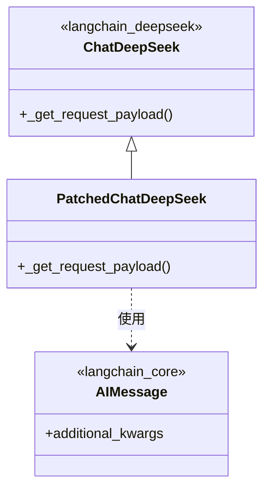
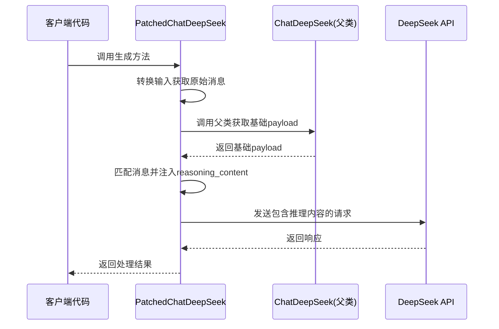

# Patched DeepSeek 模块文档

## 1. 模块概述

Patched DeepSeek 模块提供了一个修复版的 `ChatDeepSeek` 类，专门用于解决在多轮对话中保留 `reasoning_content` 的问题。该模块是对原始 `langchain_deepseek.ChatDeepSeek` 类的扩展，确保了在使用具有思维/推理能力的模型时，所有助手消息都能正确传递推理内容，从而避免 API 错误。

### 设计背景与目的

原始的 `ChatDeepSeek` 实现虽然将 `reasoning_content` 存储在 `additional_kwargs` 中，但在进行后续 API 调用时并未将其包含在请求负载中。这导致在启用思维模式时，由于 API 要求所有助手消息都必须包含 `reasoning_content`，从而引发错误。本模块通过重写请求 payload 生成方法，解决了这一关键问题。

## 2. 核心组件详解

### PatchedChatDeepSeek 类

`PatchedChatDeepSeek` 是本模块的核心类，继承自原始的 `ChatDeepSeek` 类，并重写了 `_get_request_payload` 方法以确保推理内容的正确传递。

#### 主要功能

- **推理内容保留**：在多轮对话中，确保所有助手消息的 `reasoning_content` 都被正确包含在 API 请求中
- **向后兼容**：保持与原始 `ChatDeepSeek` 类的完全兼容，不影响其他功能
- **双重匹配策略**：实现了两种消息匹配机制，确保在不同场景下都能正确恢复推理内容

#### 方法详解

##### `_get_request_payload` 方法

**签名**：
```python
def _get_request_payload(
    self,
    input_: LanguageModelInput,
    *,
    stop: list[str] | None = None,
    **kwargs: Any,
) -> dict
```

**功能**：
该方法重写了父类的实现，负责生成包含 `reasoning_content` 的请求 payload。它首先获取原始输入消息，然后调用父类方法获取基础 payload，最后将推理内容注入到相应的助手消息中。

**参数**：
- `input_`：语言模型的输入，可以是多种格式
- `stop`：可选的停止标记列表
- `**kwargs`：其他传递给父类方法的关键字参数

**返回值**：
包含完整请求数据的字典，其中助手消息已添加了 `reasoning_content` 字段（如果适用）。

**实现逻辑**：
1. 首先将输入转换为消息列表，获取原始消息
2. 调用父类方法获取基础 payload
3. 尝试通过位置匹配将原始消息与 payload 消息对应
4. 如果位置匹配不可行，则回退到通过计数助手消息进行匹配
5. 对于每个助手消息，从原始消息的 `additional_kwargs` 中提取 `reasoning_content` 并注入到 payload 中

## 3. 架构与工作原理

### 组件架构



### 数据流程图



### 工作原理说明

1. **输入处理**：当调用 `PatchedChatDeepSeek` 进行文本生成时，首先将输入转换为标准消息格式
2. **基础 payload 生成**：调用父类方法生成标准的请求 payload
3. **消息匹配**：采用两种策略匹配原始消息与 payload 中的消息：
   - 首选策略：按位置一一对应匹配
   - 备选策略：通过计数助手消息进行匹配
4. **推理内容注入**：对于每个助手消息，检查原始消息中是否存在 `reasoning_content`，如果存在则将其添加到 payload 中
5. **API 调用**：将包含完整推理内容的 payload 发送到 DeepSeek API

## 4. 使用指南

### 基本使用

`PatchedChatDeepSeek` 的使用方式与原始 `ChatDeepSeek` 完全相同，只需替换导入即可：

```python
from backend.src.models.patched_deepseek import PatchedChatDeepSeek

# 创建实例
llm = PatchedChatDeepSeek(
    model="deepseek-reasoner",
    temperature=0.7,
    # 其他参数与原始ChatDeepSeek相同
)

# 使用方式与普通ChatDeepSeek一致
response = llm.invoke("请解释量子计算的基本原理")
print(response.content)
```

### 多轮对话示例

在多轮对话场景中，这个修复版本的优势尤为明显：

```python
from langchain_core.messages import HumanMessage, AIMessage
from backend.src.models.patched_deepseek import PatchedChatDeepSeek

llm = PatchedChatDeepSeek(model="deepseek-reasoner")

# 第一轮对话
messages = [HumanMessage(content="什么是机器学习？")]
response1 = llm.invoke(messages)
messages.append(response1)

# 第二轮对话 - 此时reasoning_content会被正确保留
messages.append(HumanMessage(content="它与传统编程有何不同？"))
response2 = llm.invoke(messages)  # 这里不会因为缺少reasoning_content而报错
```

### 配置选项

由于 `PatchedChatDeepSeek` 继承自 `ChatDeepSeek`，所有原始配置选项都可用：

- `model`：模型名称
- `temperature`：温度参数
- `max_tokens`：最大生成令牌数
- `api_key`：API 密钥
- `base_url`：API 基础 URL
- 其他标准参数

## 5. 注意事项与限制

### 边缘情况

1. **消息顺序不一致**：如果父类处理后的消息顺序与原始消息顺序不一致，位置匹配可能失败，此时会自动切换到计数匹配策略
2. **非连续助手消息**：在复杂对话流程中，如果助手消息不是连续出现，计数匹配策略仍然有效
3. **缺少推理内容的消息**：对于不包含 `reasoning_content` 的消息，不会进行任何修改，保持原样

### 错误条件

- 如果原始消息列表与 payload 消息列表长度差异过大，可能导致匹配不准确
- 当 `reasoning_content` 格式不符合 API 预期时，可能仍会返回错误（此为 API 层面问题，非本模块能解决）

### 性能考虑

- 该实现增加了轻微的处理开销，主要用于消息匹配和推理内容注入
- 在大多数实际应用场景中，这种性能影响可以忽略不计

### 兼容性

- 完全向后兼容原始 `ChatDeepSeek` 类
- 适用于所有支持 `reasoning_content` 的 DeepSeek 模型
- 与 LangChain 生态系统完全集成

## 6. 相关模块

- [model_and_external_clients](model_and_external_clients.md) - 包含本模块的父模块，提供模型和外部客户端的整体框架
- 其他相关 LangChain 组件文档可参考 LangChain 官方文档

## 7. 总结

Patched DeepSeek 模块通过一个简单但关键的修复，解决了在多轮对话中保持推理内容连续性的问题。它的设计既保证了功能完整性，又保持了与原始实现的兼容性，是使用 DeepSeek 推理模型时不可或缺的组件。通过双重匹配策略，它确保了在各种对话场景下都能正确工作，为开发者提供了可靠的解决方案。
